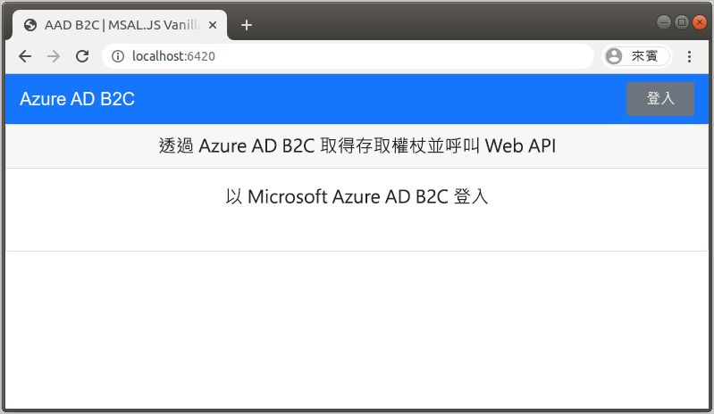
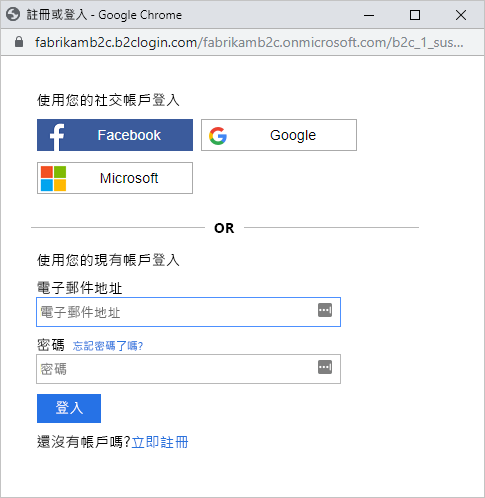
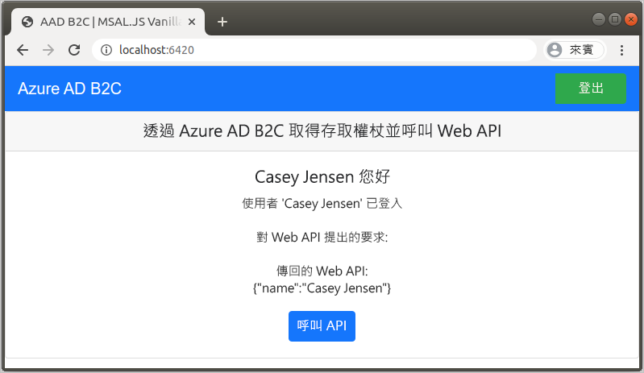

# <a name="quickstart-set-up-sign-in-for-a-single-page-app-using-azure-active-directory-b2c"></a>快速入門：設定使用 Azure Active Directory B2C 的單頁應用程式登入

Azure Active Directory B2C (Azure AD B2C) 提供雲端身分識別管理，使您的應用程式、企業和客戶受到保護。 Azure AD B2C 可讓您的應用程式使用開放式標準通訊協定，向社交帳戶和企業帳戶進行驗證。 在本快速入門中，您會使用單頁應用程式透過社交識別提供者登入，並呼叫受 Azure AD B2C 保護的 Web API。

[!INCLUDE [quickstarts-free-trial-note](../../includes/quickstarts-free-trial-note.md)]

## <a name="prerequisites"></a>Prerequisites

- [Visual Studio Code](https://code.visualstudio.com/)
- [Node.js](https://nodejs.org/en/download/)
- Facebook、Google 或 Microsoft 的社交帳戶
- GitHub 中的程式碼範例：[ms-identity-b2c-javascript-spa](https://github.com/Azure-Samples/ms-identity-b2c-javascript-spa)

    您可以[下載 zip 封存](https://github.com/Azure-Samples/ms-identity-b2c-javascript-spa/archive/main.zip)或複製存放庫：

    ```console
    git clone https://github.com/Azure-Samples/ms-identity-b2c-javascript-spa.git
    ```

## <a name="run-the-application"></a>執行應用程式

1. 從 Node.js 命令提示字元執行下列命令，以啟動伺服器：

    ```console
    npm install && npm update
    npm start
    ```

    由 server.js  啟動的伺服器會顯示其接聽的連接埠：

    ```console
    Listening on port 6420...
    ```

1. 瀏覽至應用程式的 URL。 例如： `http://localhost:6420` 。

    

## <a name="sign-in-using-your-account"></a>使用您的帳戶登入

1. 選取 [登入]  來開始使用者旅程圖。
1. Azure AD B2C 會針對範例 Web 應用程式，呈現 "Fabrikam" 虛構公司的登入頁面。 若要使用社交識別提供者註冊，選取您要使用的識別提供者按鈕。

    

    您可使用您的社交帳戶認證進行驗證 (登入)，以及授權應用程式讀取您的社交帳戶資訊。 透過授與存取權，應用程式可以從社交帳戶擷取設定檔資訊，例如您的名稱與縣/市。

1. 完成識別提供者的登入程序。

## <a name="access-a-protected-api-resource"></a>存取受保護的 API 資源

選取 [呼叫 API]  ，讓您的顯示名稱從 Web API 以 JSON 物件傳回。



範例單頁應用程式會在對受保護 Web API 資源的要求中包含存取權杖。

## <a name="clean-up-resources"></a>清除資源

如果您想要嘗試其他 Azure AD B2C 快速入門或教學課程，可以使用 Azure AD B2C 租用戶。 不再需要時，您可以[刪除您的 Azure AD B2C 租用戶](faq.md#how-do-i-delete-my-azure-ad-b2c-tenant)。

## <a name="next-steps"></a>後續步驟

在本快速入門中，您已使用範例單一頁面應用程式：

- 透過社交識別提供者登入
- 建立 Azure AD B2C 使用者帳戶 (在登入時自動建立)
- 呼叫受 Azure AD B2C 保護的 Web API

開始建立您自己的 Azure AD B2C 租用戶。

> [!div class="nextstepaction"]
> [在 Azure 入口網站中建立 Azure Active Directory B2C 租用戶](tutorial-create-tenant.md)
