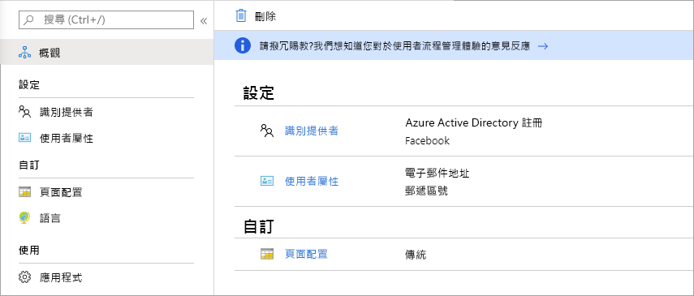

# 什麼是 Azure Active Directory B2B 中的來賓使用者存取權？

Azure Active Directory (Azure AD) 企業對企業 (B2B) 共同作業，可讓您與來賓使用者和來自其他組織的外部夥伴安全地共用公司的應用程式與服務，同時持續控制貴公司的資料。 即使沒有 Azure AD 或 IT 部門，也可以安全地與外部合作夥伴 (無論大型或小型) 合作。 透過簡單的邀請和兌換程序，夥伴可以使用自己的認證來存取您的公司資源。 開發人員可以使用 Azure AD 企業對企業 API 來自訂邀請程序，或撰寫自助式註冊入口網站等應用程式。

觀看影片以了解如何透過邀請來賓使用者使用自己的身分識別登入您的公司應用程式與服務，安全地與他們共同作業。

下列影片提供實用的概觀。

>[!VIDEO https://www.youtube.com/embed/AhwrweCBdsc]

   > [!IMPORTANT]
   > **自 2021 年 3 月 31 日起**，Microsoft 將不再支援兌換邀請，而是建立適用於 B2B 共同作業案例的非受控 Azure AD 帳戶和租用戶。 在準備過程中，我們鼓勵客戶選擇使用[電子郵件一次性密碼驗證](one-time-passcode.md)。 我們歡迎您提供此公開預覽功能的意見反應，而且期待能建立更多共同作業的方式。

## 使用他們的身分識別與任何夥伴共同作業

使用 Azure AD B2B，夥伴可使用自己的身分識別管理解決方案，因此您的組織不會產生外部系統管理額外負荷。

- 夥伴使用他們自己的身分識別與認證；Azure AD 不是必需的。
- 您不需要管理外部帳戶或密碼。
- 您不需要同步處理帳戶或管理帳戶的生命週期。  

![顯示 [新增成員] 頁面的螢幕擷取畫面](media/what-is-b2b/add-member.png)

## 使用簡單的邀請與兌換程序邀請來賓使用者

來賓使用者使用自己的公司、學校或社交身分識別登入您的應用程式與服務。 如果來賓使用者沒有 Microsoft 帳戶或 Azure AD 帳戶，系統就會在他們兌換其邀請時為他們建立一個帳戶。 

- 使用來賓使用者選擇的電子郵件身分識別邀請他們。
- 傳送應用程式的直接連結，或向來賓使用者本身的存取面板傳送邀請。
- 來賓使用者只需幾個簡單的兌換步驟即可登入。

![顯示 [檢閱權限] 頁面的螢幕擷取畫面](media/what-is-b2b/consentscreen.png)

## 使用原則來安全地共用您的應用程式與服務

您可以使用授權原則保護您的公司內容。 可以強制執行條件式存取原則，例如多重要素驗證：

- 在租用戶層級。
- 在應用程式層級。
- 針對特定來賓使用者來保護公司應用程式與資料。

![顯示 [條件式存取] 選項的螢幕擷取畫面](media/what-is-b2b/tutorial-mfa-policy-2.png)

## 輕鬆地在 Azure AD 入口網站中新增來賓使用者

系統管理員可以在 Azure 入口網站中輕鬆地將來賓使用者新增到您的組織。

- 在 Azure AD 中建立新的來賓使用者，類似於加入新使用者的方式。
- 來賓使用者會立即收到可自訂的邀請，讓他們登入存取面板。
- 目錄中的來賓使用者可以指派至應用程式或群組。  

![顯示 [新增來賓使用者] 進入頁面的螢幕擷取畫面](media/what-is-b2b/add-a-b2b-user-to-azure-portal.png)

## 讓應用程式與群組擁有者管理自己的來賓使用者

您可以將來賓使用者管理委派給應用程式擁有者，讓他們可以將來賓使用者直接新增到他們想要共用的任何應用程式，無論它是否為 Microsoft 應用程式。

- 系統管理員可設定自助式應用程式與群組管理。
- 非系統管理員必須使用其[存取面板](https://myapps.microsoft.com)將來賓使用者新增到應用程式或群組。

## 自訂 B2B 來賓使用者的上線體驗

讓您的外部合作夥伴以針對您組織需求量身打造的方式上線使用

- 使用 [Azure AD 權利管理](https://docs.microsoft.com/azure/active-directory/governance/entitlement-management-overview)來設定原則，以[管理外部使用者的存取權](https://docs.microsoft.com/azure/active-directory/governance/entitlement-management-external-users#how-access-works-for-external-users)。
- 使用 [B2B 共同作業邀請 API](https://developer.microsoft.com/graph/docs/api-reference/v1.0/resources/invitation) 來自訂您的上線體驗。

## 與識別提供者整合

Azure AD 支援 Facebook、Microsoft 帳戶、Google 或企業識別提供者之類的外部識別提供者。 您可以設定與識別提供者的同盟，以便外部使用者使用其現有社交或企業帳戶進行登入，而不只是為您的應用程式建立新的帳戶。 深入了解外部身分識別的識別提供者。

![顯示 [識別提供者] 頁面的螢幕擷取畫面](media/what-is-b2b/identity-providers.png)

## 建立自助式註冊使用者流程 (預覽)

透過自助式註冊使用者流程，您可以為想要存取您應用程式的外部使用者建立註冊體驗。 在註冊流程中，您可以為不同的社交或企業識別提供者提供選項，並收集使用者的相關資訊。 了解自助式註冊及如何進行設定。

## 後續步驟

- [Azure AD B2B 共同作業授權指導方針](licensing-guidance.md)
- [在入口網站中新增 B2B 共同作業來賓使用者](add-users-administrator.md)
- [了解邀請兌換程序](redemption-experience.md)
- 一如往常，如有任何意見反應、討論及建議，請透過我們的 [Microsoft 技術社群 (英文)](https://techcommunity.microsoft.com/t5/Azure-Active-Directory-B2B/bd-p/AzureAD_B2b)，與產品小組聯繫。
