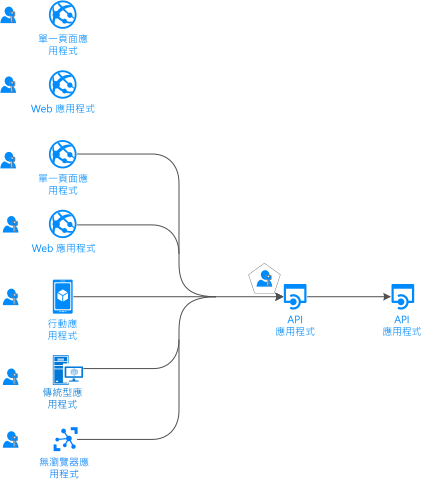
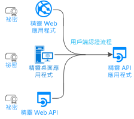
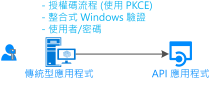
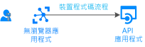

# 驗證流程和應用程式情節

Microsoft 身分識別平台 (v2.0) 端點支援各種新式應用程式架構的驗證。 所有架構都是以業界標準通訊協定 [OAuth 2.0 和 OpenID Connect](active-directory-v2-protocols.md) 為基礎。  使用[Microsoft 識別平台身份驗證庫](reference-v2-libraries.md),應用程式對標識進行身份驗證並獲取令牌以訪問受保護的 API。

本文介紹了身份驗證流及其在以下用途的應用程式方案:

- [應用程式案例與支援的驗證流程](#scenarios-and-supported-authentication-flows)。
- [應用程式案例與支援的平台和語言](#scenarios-and-supported-platforms-and-languages)。

## 應用程式類別

可以從多種類型的應用程式取得權杖,包括:

- Web 應用程式
- 行動應用程式
- 傳統型應用程式
- Web API

也可以從在沒有瀏覽器或在 IoT 上運行的設備上運行的應用獲取權杖。

應用程式的分類如下列清單所示：

- [受保護資源與用戶端應用程式](#protected-resources-vs-client-applications):某些方案是關於保護資源(如 Web 應用或 Web API)。 其他案例則是關於取得安全性權杖來呼叫受保護的 Web API。
- [使用者或無使用者](#with-users-or-without-users):某些方案涉及登錄使用者,但其他方案(如守護進程方案)不涉及使用者。
- [單頁、公共用戶端和機密用戶端應用程式](#single-page-public-client-and-confidential-client-applications):這些類型的是三大類應用程式。 每種都會搭配不同的程式庫和物件使用。
- [登錄訪問群體](v2-supported-account-types.md#certain-authentication-flows-dont-support-all-the-account-types):可用的身份驗證流因登錄訪問群體而異。 有些流程僅適用於公司或學校帳戶。 而有些則同時適用於公司或學校帳戶以及個人 Microsoft 帳戶。 允許的對象取決於驗證流程。
- [支援的 OAuth 2.0 流](#scenarios-and-supported-authentication-flows):身份驗證流用於實現請求權杖的應用程式方案。 應用程式案例與驗證流程之間不會有一對一的對應。
- [支援的平臺](#scenarios-and-supported-platforms-and-languages):並非所有應用程式方案都可用於每個平臺。

### 受保護的資源與用戶端應用程式

驗證情節牽涉到兩個活動：

- **獲取受保護 Web API 的安全權杖**:我們建議您使用[Microsoft 支援的用戶端庫](reference-v2-libraries.md#microsoft-supported-client-libraries)來取得權杖,特別是 Microsoft 身份驗證庫 (MSAL) 系列。
- **保護 Web API 或 Web 應用**:保護 Web API 或 Web 應用資源的一個挑戰是驗證安全權杖。 在某些平台上，Microsoft 提供會[中介軟體程式庫](reference-v2-libraries.md#microsoft-supported-server-middleware-libraries)。

### 有使用者或沒有使用者

大部分的驗證案例都會代表登入的使用者取得權杖。

不過，也有一些精靈應用程式案例，其中應用程式會代表其本身 (不含使用者) 取得權杖。

### 單頁、公用用戶端和機密用戶端應用程式

您可以從多種應用程式類型取得安全性權杖。 這些應用程式通常分成三種類別：

- **單頁應用程式**:也稱為 SPA,這些應用程式是從瀏覽器中運行的 JavaScript 或 TypeScript 應用獲取權杖的 Web 應用程式。 許多新式應用程式都有一個單頁應用程式前端，主要是以 JavaScript 撰寫。 此應用程式通常使用 Angular、React 或 Vue 之類的架構。 MSAL.js 是唯一支援單頁應用程式的 Microsoft 驗證程式庫。

- **公開用戶端應用程式**:這些應用程式始終登入使用者:
  - 代表已登入使用者呼叫 Web API 的傳統型應用程式
  - 行動應用程式
  - 在沒有瀏覽器的裝置上執行的應用程式，例如在 iOT 上執行的應用程式

  這些應用程式是以 MSAL [PublicClientApplication](/dotnet/api/microsoft.identity.client.publicclientapplication) 類別表示。 有關詳細資訊,請參閱[公共用戶端和機密客戶端應用程式](msal-client-applications.md)。

- **機密用戶端應用程式**:
  - 呼叫 Web API 的 Web 應用程式
  - 呼叫 Web API 的 Web API
  - 精靈應用程式 (即使以 Linux 精靈或 Windows 服務之類的主控台服務形式實作也是如此)

  這些類型的應用程式會使用 [ConfidentialClientApplication](/dotnet/api/microsoft.identity.client.confidentialclientapplication) 類別。 有關詳細資訊,請參閱[公共用戶端和機密客戶端應用程式](msal-client-applications.md)。

## 應用程式案例

Microsoft 識別平台終結點支援針對不同應用體系結構的身份驗證:

- 單一頁面應用程式
- Web 應用程式
- Web API
- 行動應用程式
- 原生應用程式
- 精靈應用程式
- 伺服器端應用程式

應用程式會使用不同驗證流程來登入使用者，並取得權杖以呼叫受保護的 API。

### 單頁應用程式

許多現代 Web 應用程式都是作為用戶端單頁應用程式構建的。 這些應用程式使用 JAVAScript 或單頁應用程式框架(如 Angular、Vue.js 和 React.js)。 這些應用程式會在網頁瀏覽器中執行。

它們的身份驗證特性不同於傳統的伺服器端 Web 應用。 使用 Microsoft 身分識別平台，單頁應用程式即可登入使用者，並取得權杖來存取後端服務或 Web API。

如需詳細資訊，請參閱[單頁應用程式](scenario-spa-overview.md)。

### 正在登入使用者的 Web 應用程式

若要保護正在登入使用者的 Web 應用程式：

- 如果您在 .NET 中開發，您可使用 ASP.NET 或 ASP.NET Core 搭配 ASP.NET Open ID Connect 中介軟體使用。 保護資源牽涉到驗證安全性權杖，這是由[適用於 .NET 的 IdentityModel 擴充功能](https://github.com/AzureAD/azure-activedirectory-identitymodel-extensions-for-dotnet/wiki)程式庫 (而非 MSAL 程式庫) 所完成。

- 如果您以 .Node.js 進行開發，您會使用 Passport.js。

如需詳細資訊，請參閱[登入使用者的 Web 應用程式](scenario-web-app-sign-user-overview.md)。

### 登入使用者並代表使用者呼叫 Web API 的 Web 應用程式

若要代表使用者從 Web 應用程式呼叫 Web API，請使用 MSAL **ConfidentialClientApplication** 類別。 您可使用授權碼流程，將取得的權杖儲存在權杖快取中。 如有需要，MSAL 會重新整理權杖，而控制器會以無訊息方式從快取中取得權杖。

如需詳細資訊，請參閱[呼叫 Web API 的 Web 應用程式](scenario-web-app-call-api-overview.md)。

### 代表登入的使用者呼叫 Web API 的傳統型應用程式

若要讓傳統型應用程式呼叫可登入使用者的 Web API，請使用 MSAL **PublicClientApplication** 類別的互動式權杖取得方法。 您可以使用這些互動式方法來控制登入 UI 體驗。 MSAL 會在此互動中使用網頁瀏覽器。

在加入 Windows 網域或 Azure Active Directory (Azure AD) 的電腦上，Windows 裝載應用程式還有另一種可能性。 這些應用程式可透過使用[整合式 Windows 驗證](https://aka.ms/msal-net-iwa)，以無訊息方式取得權杖。

在沒有瀏覽器的裝置上執行的應用程式，仍然可以代表使用者呼叫 API。 若要進行驗證，使用者必須登入具有網頁瀏覽器的其他裝置。 這個專案要求您使用[裝置碼串流](https://aka.ms/msal-net-device-code-flow)。

雖然我們不建議您使用它，但是在公用用戶端應用程式中可以使用[使用者名稱/密碼流程](https://aka.ms/msal-net-up)。 在某些案例 (例如 DevOps) 中，仍然需要此流程。

但是使用此流會限制您的應用程式。 例如,應用程式無法登錄需要使用多重身份驗證或條件訪問的使用者。 您的應用程式也不會受益於單一登入。

以使用者名稱/密碼流程進行驗證違反了新式驗證的原則，僅供舊版的理由之用。

在桌面應用中,如果希望權杖快取保留,請自訂[權杖快取序列化](https://aka.ms/msal-net-token-cache-serialization)。 通過實現[雙令牌緩存序列化](https://aka.ms/msal-net-dual-cache-serialization),可以使用向後相容和向前相容的權杖緩存。 這些權杖支援前幾代身份驗證庫。 特定程式庫包括適用於 .NET 的 Azure AD 驗證程式庫 (ADAL.NET) 第 3 版和第 4 版。

如需詳細資訊，請參閱[呼叫 Web API 的傳統型應用程式](scenario-desktop-overview.md)。

### 代表互動式使用者呼叫 Web API 的行動應用程式

類似於傳統型應用程式，行動應用程式會呼叫 MSAL **PublicClientApplication** 類別的互動式權杖取得方法，以取得用於呼叫 Web API 的權杖。

MSAL iOS 和 MSAL Android 預設會使用系統網頁瀏覽器。 不過，您也可以指示它們使用內嵌的網頁檢視。 有一些具體功能取決於移動平臺:通用 Windows 平臺 (UWP)、iOS 或 Android。

某些案例 (像是涉及與裝置識別碼或裝置註冊相關之條件式存取的案例) 會要求您在裝置上安裝訊息代理程式。 訊息代理程式的範例包括 Android 上的 Microsoft 公司入口網站以及 Android 與 iOS 上的 Microsoft Authenticator。 MSAL 現在可以與經紀人進行交互。 有關詳細資訊,請參閱[利用安卓和 iOS 上的經紀商](https://github.com/AzureAD/azure-activedirectory-library-for-dotnet/wiki/leveraging-brokers-on-Android-and-iOS)。

如需詳細資訊，請參閱[呼叫 Web API 的行動裝置應用程式](scenario-mobile-overview.md)。

> [!NOTE]
> 在 Xamarin 上使用 MSAL.iOS、MSAL.Android 或 MSAL.NET 的行動應用程式，可以套用應用程式保護原則。 比方說，這些原則可能讓使用者無法複製受保護的文字。 此行動應用程式是由 Intune 管理，並由 intune 辨識為受控應用程式。 有關詳細資訊,請參閱微軟[Intune 應用 SDK 概述](https://docs.microsoft.com/intune/app-sdk)。
>
> [Intune 應用程式 SDK](https://docs.microsoft.com/intune/app-sdk-get-started) 獨立於 MSAL 程式庫之外，而且會自行與 AAD 互動。

### 受保護的 Web API

您可以使用 Microsoft 識別平台終結點來保護 Web 服務,如應用的 RESTful Web API。 使用存取權碼呼叫受保護的 Web API。 令牌保護 API 的數據並驗證傳入的請求。 Web API 的呼叫者會在 HTTP 要求的授權標頭尾部附加存取權杖。

如果要保護ASP.NET或 ASP.NET酷睿 Web API,則需要驗證訪問權杖。 在此驗證中，您會使用 ASP.NET JWT 中介軟體。 驗證是由[適用於 .NET 的 IdentityModel 擴充功能](https://github.com/AzureAD/azure-activedirectory-identitymodel-extensions-for-dotnet/wiki)程式庫 (而不是 MSAL.NET) 完成。

如需詳細資訊，請參閱[受保護的 Web API](scenario-protected-web-api-overview.md)。

### 代表使用者呼叫另一個 Web API 的 Web API

ASP.NET或ASP.NET核心保護的 Web API 代表使用者調用另一個 Web API,你的應用需要為下游 Web API 獲取權杖。 要取得權杖,您的套用機**密客戶端應用程式**類別的[「取得權杖」方法](https://aka.ms/msal-net-on-behalf-of)。 此類調用也稱為*服務到服務*呼叫。 呼叫其他 Web API 的 Web API 需要提供自訂快取序列化。

  

如需詳細資訊，請參閱[呼叫 Web API 的 Web API](scenario-web-api-call-api-overview.md)。

### 以精靈的名稱呼叫 Web API 的精靈應用程式

應用程式如果具有長時間執行的程序，或其運作方式不需要使用者互動，就也需要一個存取受保護的 Web API 的方法。 此類應用可以使用應用的標識進行身份驗證和獲取權杖。 應用程式會使用用戶端秘密或憑證來證明其身分識別。

您可以使用 MSAL **ConfidentialClientApplication** 類別的[用戶端認證](https://aka.ms/msal-net-client-credentials)取得方法撰寫此類精靈應用程式，以取得呼叫應用程式的權杖。 這些方法要求呼叫應用程式已向 Azure AD 註冊秘密。 然後應用程式會與所呼叫的精靈共用此秘密。 這類秘密的範例包括應用程式密碼、憑證判斷提示或用戶端判斷提示。

如需詳細資訊，請參閱[呼叫 Web API 的精靈應用程式](scenario-daemon-overview.md)。

## 情節與支援的驗證流程

涉及獲取權杖的方案也會映射到OAuth 2.0身份驗證流。 有關詳細資訊,請參閱[Microsoft 識別平臺上的 OAuth 2.0 和 OpenID 連線協定](active-directory-v2-protocols.md)。

<table>
 <thead>
  <tr><th>狀況</th> <th>詳細案例逐步解說</th> <th>OAuth 2.0 流程和授與</th> <th>適用對象</th></tr>
 </thead>
 <tbody>
  <tr>
   <td></td>
   <td><a href="scenario-spa-overview.md">單一頁面應用程式</a></td>
   <td><a href="v2-oauth2-implicit-grant-flow.md">隱含</a></td>
   <td>公司或學校帳戶、個人帳戶和 Microsoft Azure Active Directory B2C (Azure AD B2C)</td>
 </tr>

  <tr>
   <td></td>
   <td><a href="scenario-web-app-sign-user-overview.md">登入使用者的 Web 應用程式</a></td>
   <td><a href="v2-oauth2-auth-code-flow.md">授權代碼</a></td>
   <td>公司或學校帳戶、個人帳戶和 Azure AD B2C</td>
 </tr>

  <tr>
   <td></td>
   <td><a href="scenario-web-app-call-api-overview.md">呼叫 Web API 的 Web 應用程式</a></td>
   <td><a href="v2-oauth2-auth-code-flow.md">授權代碼</a></td>
   <td>公司或學校帳戶、個人帳戶和 Azure AD B2C</td>
 </tr>

  <tr>
   <td rowspan="3"></td>
   <td rowspan="4"><a href="scenario-desktop-overview.md">呼叫 Web API 的傳統型應用程式</a></td>
   <td>互動式 (使用<a href="v2-oauth2-auth-code-flow.md">授權碼</a>搭配 PKCE)</td>
   <td>公司或學校帳戶、個人帳戶和 Azure AD B2C</td>
 </tr>

  <tr>
   <td>整合式 Windows 驗證</td>
   <td>工作或學校帳戶</td>
 </tr>

  <tr>
   <td><a href="v2-oauth-ropc.md">資源擁有者密碼</a></td>
   <td>公司或學校帳戶及 Azure AD B2C</td>
 </tr>

  <tr>
   <td></td>
   <td><a href="v2-oauth2-device-code.md">裝置代碼</a></td>
   <td>工作或學校帳戶</td>
 </tr>

 <tr>
   <td rowspan="2"></td>
   <td rowspan="2"><a href="scenario-mobile-overview.md">呼叫 Web API 的行動應用程式</a></td>
   <td>互動式 (使用<a href="v2-oauth2-auth-code-flow.md">授權碼</a>搭配 PKCE)</td>
   <td>公司或學校帳戶、個人帳戶和 Azure AD B2C</td>
 </tr>

  <tr>
   <td><a href="v2-oauth-ropc.md">資源擁有者密碼</a></td>
   <td>公司或學校帳戶及 Azure AD B2C</td>
 </tr>

  <tr>
   <td></td>
   <td><a href="scenario-daemon-overview.md">呼叫 Web API 的精靈應用程式</a></td>
   <td><a href="v2-oauth2-client-creds-grant-flow.md">用戶端認證</a></td>
   <td>僅限應用程式的權限 (不含使用者且只能在 Azure AD 組織中使用)</td>
 </tr>

  <tr>
   <td></td>
   <td><a href="scenario-web-api-call-api-overview.md">呼叫 Web API 的 Web API</a></td>
   <td><a href="v2-oauth2-on-behalf-of-flow.md">代表</a></td>
   <td>公司或學校帳戶與個人帳戶</td>
 </tr>

 </tbody>
</table>

## 情節與支援的平台與語言

Microsoft 驗證程式庫支援多個平台：

- JavaScript
- .NET Framework
- .NET Core
- Windows 10/UWP
- Xamarin.iOS
- Xamarin.Android
- 原生 iOS
- macOS
- 原生 Android
- Java
- Python

您也可以使用各種語言來建置應用程式。

> [!NOTE]
> 某些應用程式類型並非在每個平臺上都可用。

在下表的 Windows 欄中，每次提及 .NET Core 時，也可能是 .NET Framework。 省略後者可避免表格雜亂。

|狀況  | Windows | Linux | Mac | iOS | Android
|--|--|--|--|--|--|--|
| [單一頁面應用程式](scenario-spa-overview.md)   |  MSAL.js |  MSAL.js |  MSAL.js |  MSAL.js |  MSAL.js
| [登入使用者的 Web 應用程式](scenario-web-app-sign-user-overview.md)   |  ASP.NET Core |  ASP.NET Core |  ASP.NET Core
| [呼叫 Web API 的 Web 應用程式](scenario-web-app-call-api-overview.md)     |  ASP.NET Core + MSAL.NET   MSAL Java  Flask + MSAL Python|  ASP.NET Core + MSAL.NET  MSAL Java  Flask + MSAL Python|  ASP.NET Core + MSAL.NET  MSAL Java   Flask + MSAL Python
| [呼叫 Web API 的傳統型應用程式](scenario-desktop-overview.md)    呼叫 Web](scenario-desktop-overview.md)](media/scenarios/device-code-flow-app.svg) | MSAL.NET  MSAL Java   MSAL Python| MSAL.NET  MSAL Java  MSAL Python| MSAL.NET  MSAL Java  MSAL Python    MSAL.objc |
| [呼叫 Web API 的行動應用程式](scenario-mobile-overview.md)    |  MSAL.NET  MSAL.NET | | |  MSAL.objc |  MSAL.Android
| [精靈應用程式](scenario-daemon-overview.md)    | MSAL.NET  MSAL Java  MSAL Python|  MSAL.NET  MSAL Java  MSAL Python| MSAL.NET  MSAL Java  MSAL Python
| [呼叫 Web API 的 Web API](scenario-web-api-call-api-overview.md)     |  ASP.NET Core + MSAL.NET  MSAL Java  MSAL Python|  ASP.NET Core + MSAL.NET  MSAL Java  MSAL Python|  ASP.NET Core + MSAL.NET  MSAL Java  MSAL Python

有關詳細資訊,請參閱[Microsoft 支援的作業系統 /語言庫](reference-v2-libraries.md#microsoft-supported-libraries-by-os--language)。

## 後續步驟

* 瞭解有關[身份驗證基礎知識](authentication-scenarios.md)和 Microsoft[標識平台訪問權杖](access-tokens.md)的更多資訊。
* 瞭解有關[保護對 IoT 應用的訪問](/azure/architecture/example-scenario/iot-aad/iot-aad)的更多資訊。
