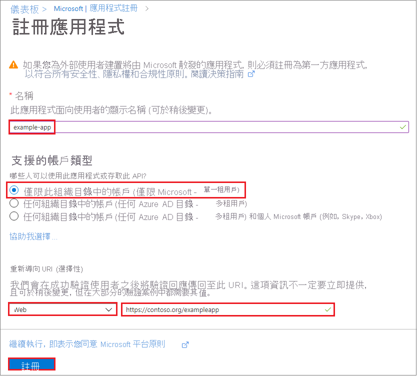

# <a name="how-to-use-the-portal-to-create-an-azure-ad-application-and-service-principal-that-can-access-resources"></a>操作說明：使用入口網站來建立可存取資源的 Azure AD 應用程式和服務主體

本文說明如何建立新的 Azure Active Directory (Azure AD 可與角色型存取控制搭配使用的) 應用程式和服務主體。 當您擁有需要存取或修改資源的應用程式、託管服務或自動化工具時，您可以建立應用程式的身分識別。 此身分識別就是所謂的服務主體。 資源的存取權受限於指派給服務主體的角色，讓您控制可存取哪些資源，以及在哪個層級進行存取。 基於安全理由，我們建議您一律搭配自動化工具使用服務主體，而不是讓服務主體透過使用者身分識別來登入。

本文說明如何使用入口網站，在 Azure 入口網站中建立服務主體。 其中著重在說明單一租用戶應用程式，此應用程式的目的是只在一個組織內執行。 您通常會將單一租用戶應用程式用在組織內執行的企業營運系統應用程式。  您也可以 [使用 Azure PowerShell 來建立服務主體](howto-authenticate-service-principal-powershell.md)。

> [!IMPORTANT]
> 若不要建立服務主體，可考慮使用 Azure 資源的受控識別作為應用程式識別碼。 如果您的程式碼在支援受控識別的服務上執行，並存取支援 Azure AD authentication 的資源，則受控識別會是更好的選擇。 若要深入了解 Azure 資源的受控識別，包含目前哪些服務支援該功能，請參閱[什麼是適用於 Azure 資源的受控識別？](../managed-identities-azure-resources/overview.md)。

## <a name="app-registration-app-objects-and-service-principals"></a>應用程式註冊、應用程式物件和服務主體
沒有任何方法可以使用 Azure 入口網站直接建立服務主體。  當您透過 Azure 入口網站註冊應用程式時，會自動在您的主目錄或租使用者中建立應用程式物件和服務主體。  如需應用程式註冊、應用程式物件和服務主體之間關聯性的詳細資訊，請參閱 [Azure Active Directory 中的應用程式和服務主體物件](app-objects-and-service-principals.md)。

## <a name="permissions-required-for-registering-an-app"></a>註冊應用程式所需的許可權

您必須擁有足夠的許可權，才能向 Azure AD 租使用者註冊應用程式，並將您的 Azure 訂用帳戶中的角色指派給應用程式。

### <a name="check-azure-ad-permissions"></a>檢查 Azure AD 權限

1. 選取 **Azure Active Directory**。
1. 記下您的角色。 如果您具有 [使用者] 角色，則必須確定非系統管理員可以註冊應用程式。

   

1. 在左窗格中，選取 [ **使用者設定**]。
1. 檢查 [應用程式註冊] 設定。 此值只能由系統管理員設定。 若設定為 [是]，則 Azure AD 租用戶中的任何使用者都可以註冊應用程式。

如果應用程式註冊設定設為 [否]，則只有具備系統管理員角色的使用者才能註冊這些類型的應用程式。 若要了解 Azure AD 中可用的系統管理員角色及賦予每個角色的特定權限，請參閱[可用的角色](../roles/permissions-reference.md#available-roles)和[角色權限](../roles/permissions-reference.md#role-permissions)。 如果您的帳戶已獲指派使用者角色，但應用程式註冊設定僅限於系統管理員使用者，請要求系統管理員為您指派其中一個系統管理員角色，以建立和管理應用程式註冊的所有層面，或讓使用者可以註冊應用程式。

### <a name="check-azure-subscription-permissions"></a>檢查 Azure 訂用帳戶權限

在您的 Azure 訂用帳戶中，您的帳戶必須具有 `Microsoft.Authorization/*/Write` 可將角色指派給 AD 應用程式的存取權。 此動作是[擁有者](../../role-based-access-control/built-in-roles.md#owner)角色或[使用者存取系統管理員](../../role-based-access-control/built-in-roles.md#user-access-administrator)角色來授與。 如果您的帳戶被指派「 **參與者** 」角色，則您沒有足夠的許可權。 當您嘗試將角色指派給服務主體時，您將會收到錯誤。

若要檢查訂用帳戶權限：

1. 搜尋並選取訂用 **帳戶，或選取****首頁** 上的 **訂閱**。

   

1. 選取您要在其中建立服務主體的訂用帳戶。

   

   如果您未看見所尋找的訂用帳戶，請選取 [全域訂閱篩選]。 確定您想要的訂用帳戶已針對入口網站選取。

1. 選取 [我的權限]。 然後，選取 [按一下這裡以詳細檢視此訂用帳戶的完整存取權]。

   

1. 選取 [**角色指派**] 中的 [ **view** ] 以查看您指派的角色，並判斷您是否有足夠的許可權可將角色指派給 AD 應用程式。 如果沒有，請洽詢訂用帳戶管理員，將您新增至「使用者存取系統管理員」角色。 在下圖中，使用者已獲指派擁有者角色，這表示該使用者具有足夠的許可權。

   

## <a name="register-an-application-with-azure-ad-and-create-a-service-principal"></a>使用 Azure AD 註冊應用程式並建立服務主體

讓我們直接跳到建立身分識別。 如果您遇到問題，請檢查[必要的權限](#permissions-required-for-registering-an-app)，以確定您的帳戶可以建立身分識別。

1. 透過<a href="https://portal.azure.com/" target="_blank">Azure 入口網站 <span class="docon docon-navigate-external x-hidden-focus"></span> </a>登入您的 Azure 帳戶。
1. 選取 **Azure Active Directory**。
1. 選取 **應用程式註冊**。
1. 選取 [新增註冊]。
1. 為應用程式命名。 選取支援的帳戶類型，以決定可以使用此應用程式的人員。 在 [重新 **導向 URI**] 下，針對您要建立的應用程式類型選取 [ **Web** ]。 輸入傳送存取權杖的目標 URI。 您無法建立[原生應用程式](../manage-apps/application-proxy-configure-native-client-application.md)的認證。 您無法將該類型使用於自動化應用程式。 設定值之後，選取 [註冊]。

   

您已建立 Azure AD 應用程式和服務主體。

## <a name="assign-a-role-to-the-application"></a>將角色指派給應用程式

若要存取訂用帳戶中的資源，您必須將角色指派給應用程式。 決定哪個角色可提供應用程式的適當權限。 若要瞭解可用的角色，請參閱 [Azure 內建角色](../../role-based-access-control/built-in-roles.md)。

您可以針對訂用帳戶、資源群組或資源的層級設定範圍。 較低的範圍層級會繼承較高層級的權限。 例如，將應用程式新增至資源群組的「 *讀取* 者」角色，表示它可以讀取資源群組及其包含的任何資源。

1. 在 [Azure 入口網站中，選取您要指派應用程式的範圍層級。 例如，若要在訂用帳戶範圍指派角色，請搜尋並選取訂用帳戶，**或在****首頁****上選取訂** 用帳戶。

   

1. 選取指派應用程式時作為對象的特定訂用帳戶。

   

   如果您未看見所尋找的訂用帳戶，請選取 [全域訂閱篩選]。 確定您想要的訂用帳戶已針對入口網站選取。

1. 選取 [存取控制 (IAM)]。
1. 選取 [新增角色指派]。
1. 選取您想要將應用程式指派給哪個角色。 例如，若要允許應用程式執行 **重新開機**、 **啟動** 和 **停止** 實例等動作，請選取 [ **參與者** ] 角色。  依預設，請閱讀 [可用角色](../../role-based-access-control/built-in-roles.md) 的詳細資訊，Azure AD 的應用程式不會顯示在可用的選項中。 若要尋找您的應用程式，請搜尋名稱並加以選取。

   

1. 選取 [儲存] 以完成角色指派。 您會在使用者清單中看到您的應用程式，並具有該範圍的角色。

您的服務主體已設定。 您可以開始使用它來執行指令碼或應用程式。 若要管理您的服務主體 (許可權、使用者同意許可權、查看哪些使用者已同意、評論許可權、查看登入資訊，以及其他) ，請前往 **企業應用程式**。

下節說明如何取得以程式設計方式登入時所需的值。

## <a name="get-tenant-and-app-id-values-for-signing-in"></a>取得用來登入的租使用者和應用程式識別碼值

以程式設計方式登入時，您需要將租使用者識別碼與您的驗證要求和應用程式識別碼一起傳遞。  您也需要憑證或驗證金鑰 (下一節) 所述。 若要取得這些值，請使用下列步驟︰

1. 選取 **Azure Active Directory**。
1. 在 Azure AD 中，從 [應用程式註冊] 選取您的應用程式。
1. 複製 (租使用者) 識別碼的目錄，並將它儲存在您的應用程式程式碼中。

    

    您也可以在 [預設目錄] 總覽頁面中找到 (租使用者) 識別碼的目錄。

1. 複製 [應用程式識別碼] 並儲存在您的應用程式碼中。

   

## <a name="authentication-two-options"></a>驗證：兩個選項

有兩種類型的驗證可用於服務主體：密碼型驗證 (應用程式密碼) 和憑證型驗證。 *我們建議使用憑證*，但您也可以建立應用程式秘密。

### <a name="option-1-upload-a-certificate"></a>選項1：上傳憑證

您可以使用現有的憑證（如果有的話）。  （選擇性）您可以建立自我簽署憑證以供 *測試之* 用。 若要建立自我簽署憑證，請開啟 PowerShell，並使用下列參數執行 [new-selfsignedcertificate](/powershell/module/pkiclient/new-selfsignedcertificate) ，以在您電腦上的使用者憑證存放區中建立憑證：

```powershell
$cert=New-SelfSignedCertificate -Subject "CN=DaemonConsoleCert" -CertStoreLocation "Cert:\CurrentUser\My"  -KeyExportPolicy Exportable -KeySpec Signature
```

使用可從 Windows 主控台存取的 [ [管理使用者憑證](/dotnet/framework/wcf/feature-details/how-to-view-certificates-with-the-mmc-snap-in) ] MMC 嵌入式管理單元，將此憑證匯出至檔案。

1. 從 [**開始**] 功能表選取 [**執行**]，然後輸入 **certmgr.msc。**

   目前使用者的憑證管理員工具隨即出現。

1. 若要查看您的憑證，請在左窗格的 [ **憑證-目前的使用者** ] 底下，展開 [ **個人** ] 目錄。
1. 以滑鼠右鍵按一下您建立的憑證，選取 [ **所有工作->匯出**]。
1. 遵循「憑證匯出嚮導」。  請勿匯出私密金鑰，並匯出至。.CER 檔案。

若要上傳憑證：

1. 選取 **Azure Active Directory**。
1. 在 Azure AD 中，從 [應用程式註冊] 選取您的應用程式。
1. 選取 [憑證和秘密]  。
1. 選取 [ **上傳憑證** ]，然後選取憑證 (現有憑證或您匯出) 的自我簽署憑證。

    ![選取 [上傳憑證]，然後選取您想要新增的憑證](./media/howto-create-service-principal-portal/upload-cert.png)

1. 選取 [新增]  。

在應用程式註冊入口網站中向應用程式註冊憑證之後，您必須啟用用戶端應用程式程式碼，才能使用該憑證。

### <a name="option-2-create-a-new-application-secret"></a>選項2：建立新的應用程式密碼

如果您選擇不使用憑證，您可以建立新的應用程式密碼。

1. 選取 **Azure Active Directory**。
1. 在 Azure AD 中，從 [應用程式註冊] 選取您的應用程式。
1. 選取 [憑證和秘密]  。
1. 選取 [用戶端秘密] -> [新增用戶端密碼]  。
1. 提供秘密的描述及持續時間。 完成時，選取 [新增]  。

   儲存用戶端秘密之後，就會顯示用戶端秘密的值。 複製此值，因為您稍後將無法取得金鑰。 您會提供金鑰值和應用程式識別碼，以應用程式的形式登入。 將金鑰值儲存在應用程式可擷取的地方。

   

## <a name="configure-access-policies-on-resources"></a>設定資源的存取原則
請記住，您可能需要在應用程式需要存取的資源上設定額外的許可權。 例如，您也必須 [更新金鑰保存庫的存取原則](../../key-vault/general/secure-your-key-vault.md#data-plane-and-access-policies) ，讓您的應用程式能夠存取金鑰、秘密或憑證。

1. 在 <a href="https://portal.azure.com/" target="_blank"> <span class="docon docon-navigate-external x-hidden-focus"></span> Azure 入口網站</a>中，流覽至您的金鑰保存庫，然後選取 [**存取原則**]。
1. 選取 [ **新增存取原則**]，然後選取您想要授與應用程式的金鑰、秘密和憑證許可權。  選取您先前建立的服務主體。
1. 選取 [ **新增** ] 以新增存取原則，然後 **儲存** 以認可您的變更。
    

## <a name="next-steps"></a>後續步驟
* 瞭解如何 [使用 Azure PowerShell 來建立服務主體](howto-authenticate-service-principal-powershell.md)。
* 若要瞭解如何指定安全性原則，請參閱 [azure 角色型存取控制 (AZURE RBAC) ](../../role-based-access-control/role-assignments-portal.md)。
* 如需可授與或拒絕使用者的可用動作清單，請參閱 [Azure Resource Manager 資源提供者作業](../../role-based-access-control/resource-provider-operations.md)。
* 如需使用 **Microsoft Graph** 來處理應用程式註冊的詳細資訊，請參閱 [應用程式](/graph/api/resources/application) API 參考。
