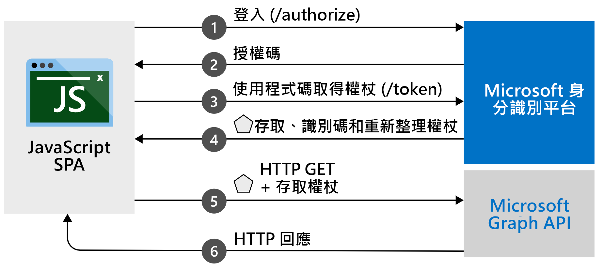

# <a name="quickstart-sign-in-and-get-an-access-token-in-a-react-spa-using-the-auth-code-flow"></a>快速入門：使用驗證碼流程在回應 SPA 中登入和取得存取權杖

在本快速入門中，您將下載並執行程式碼範例，以示範 JavaScript 如何回應單一頁面應用程式 (SPA) 可以使用授權碼流程來登入使用者並呼叫 Microsoft Graph。 此程式碼範例會示範如何取得存取權杖來呼叫 Microsoft Graph API 或任何 Web API。 

如需圖例，請參閱[此範例的運作方式](#how-the-sample-works)。

本快速入門會使用 MSAL 回應授權碼流程。 如需搭配使用 MSAL.js 與隱含流程的類似快速入門，請參閱 [快速入門：在 JavaScript 單一頁面應用程式中登入使用者](./quickstart-v2-javascript.md)。

## <a name="prerequisites"></a>必要條件

* Azure 訂用帳戶 - [免費建立 Azure 訂用帳戶](https://azure.microsoft.com/free/?WT.mc_id=A261C142F)
* [Node.js](https://nodejs.org/en/download/)
* [Visual Studio Code](https://code.visualstudio.com/download) 或其他程式碼編輯器

> [!div renderon="docs"]
> ## <a name="register-and-download-your-quickstart-application"></a>註冊並下載快速入門應用程式
> 若要啟動您的快速入門應用程式，請使用下列其中一個選項。
>
>
> ### <a name="option-1-express-register-and-auto-configure-your-app-and-then-download-your-code-sample"></a>選項 1 (快速)：註冊和自動設定您的應用程式，然後下載程式碼範例
>
> 1. 移至 <a href="https://portal.azure.com/#blade/Microsoft_AAD_RegisteredApps/ApplicationsListBlade/quickStartType/JavascriptSpaQuickstartPage/sourceType/docs" target="_blank">Azure 入口網站 - 應用程式註冊<span class="docon docon-navigate-external x-hidden-focus"></span></a>快速入門體驗。
> 1. 輸入應用程式的名稱。
> 1. 在 [支援的帳戶類型] 底下，選取 [任何組織目錄中的帳戶及個人的 Microsoft 帳戶]。
> 1. 選取 [註冊]。
> 1. 移至快速入門窗格，然後依照指示下載並自動設定新的應用程式。
>
> ### <a name="option-2-manual-register-and-manually-configure-your-application-and-code-sample"></a>選項 2 (手動)：註冊並手動設定您的應用程式和程式碼範例
>
> #### <a name="step-1-register-your-application"></a>步驟 1:註冊您的應用程式
>
> 1. 登入 <a href="https://portal.azure.com/" target="_blank">Azure 入口網站<span class="docon docon-navigate-external x-hidden-focus"></span></a>。
> 1. 如果您有多個租用的存取權，請使用頂端功能表中的 **目錄 + 訂用帳戶** 篩選條件 :::image type="icon" source="./media/common/portal-directory-subscription-filter.png" border="false"::: 來選取要在其中註冊應用程式的租用戶。
> 1. 搜尋並選取 [Azure Active Directory]  。
> 1. 在 **管理** 下選取 [應用程式註冊] > [新增註冊]。
> 1. [註冊應用程式] 頁面出現時，輸入您應用程式的名稱。
> 1. 在 [支援的帳戶類型] 底下，選取 [任何組織目錄中的帳戶及個人的 Microsoft 帳戶]。
> 1. 選取 [註冊]。 在應用程式 [概觀] 頁面上，記下 [應用程式 (用戶端) 識別碼] 值以供稍後使用。
> 1. 在 [管理] 底下，選取 [驗證]。
> 1. 在 [平台設定] 下，選取 [新增平台]。 在開啟的窗格中，選取 [單頁應用程式]。
> 1. 將 [重新 **導向 uri** ] 值設定為 `http://localhost:3000/` 。 這是預設的埠 NodeJS 將在您的本機電腦上接聽。 在成功驗證使用者之後，我們會將驗證回應傳回給這個 URI。 
> 1. 選取 [ **設定** ] 以套用變更。
> 1. 在 [ **平臺** 設定] 下，展開 [ **單一頁面應用程式**]。
> 1. 確認在 **[授與類型**] 下  導向 URI 符合使用 PKCE 授權碼流程的資格。

> [!div class="sxs-lookup" renderon="portal"]
> #### <a name="step-1-configure-your-application-in-the-azure-portal"></a>步驟 1:在 Azure 入口網站中設定您的應用程式
> 若要讓此快速入門中的程式碼範例正常運作，您必須將 `redirectUri` 新增為 `http://localhost:3000/`。
> > [!div renderon="portal" id="makechanges" class="nextstepaction"]
> > [為我進行這些變更]()
>
> > [!div id="appconfigured" class="alert alert-info"]
> >  您的應用程式已設定了這些屬性。

#### <a name="step-2-download-the-project"></a>步驟 2:下載專案

> [!div renderon="docs"]
> 若要使用 Node.js 搭配網頁伺服器來執行專案，請[下載核心專案檔](https://github.com/Azure-Samples/ms-identity-javascript-react-spa/archive/main.zip)。

> [!div renderon="portal" class="sxs-lookup"]
> 使用 Node.js 以網頁伺服器執行專案

> [!div renderon="portal" class="sxs-lookup" id="autoupdate" class="nextstepaction"]
> [下載程式碼範例](https://github.com/Azure-Samples/ms-identity-javascript-react-spa/archive/main.zip)

> [!div renderon="docs"]
> #### <a name="step-3-configure-your-javascript-app"></a>步驟 3：設定您的 JavaScript 應用程式
>
> 在 *src* 資料夾中，開啟 *authConfig.js* 檔，並更新 `clientID` 物件中的、 `authority` 和 `redirectUri` 值 `msalConfig` 。
>
> ```javascript
> /**
> * Configuration object to be passed to MSAL instance on creation. 
> * For a full list of MSAL.js configuration parameters, visit:
> * https://github.com/AzureAD/microsoft-authentication-library-for-js/blob/dev/lib/msal-browser/docs/configuration.md 
> */
> export const msalConfig = {
>    auth: {
>        clientId: "Enter_the_Application_Id_Here",
>        authority: "Enter_the_Cloud_Instance_Id_HereEnter_the_Tenant_Info_Here",
>        redirectUri: "Enter_the_Redirect_Uri_Here"
>    },
>    cache: {
>        cacheLocation: "sessionStorage", // This configures where your cache will be stored
>        storeAuthStateInCookie: false, // Set this to "true" if you are having issues on IE11 or Edge
>    },
> ```

> [!div renderon="portal" class="sxs-lookup"]
> > [!NOTE]
> > `Enter_the_Supported_Account_Info_Here`

> [!div renderon="docs"]
>
> 修改 `msalConfig` 區段中的值，如下所述：
>
> - `Enter_the_Application_Id_Here` 是您註冊的應用程式所具備的 **應用程式 (用戶端) 識別碼**。
> - `Enter_the_Cloud_Instance_Id_Here` 是 Azure 雲端的執行個體。 針對主要或全域 Azure 雲端，請輸入 `https://login.microsoftonline.com/`。 針對 **國家** 雲端 (例如中國)，請參閱 [國家雲端](authentication-national-cloud.md)。
> - `Enter_the_Tenant_info_here` 會設定為下列其中一項：
>   - 如果您的應用程式支援 [此組織目錄中的帳戶]，請將此值取代為 [租用戶識別碼] 或 [租用戶名稱]。 例如： `contoso.microsoft.com` 。
>   - 如果您的應用程式支援 [任何組織目錄中的帳戶]，請將此值取代為 `organizations`。
>   - 如果您的應用程式支援 [任何組織目錄中的帳戶及個人的 Microsoft 帳戶]，請將此值取代為 `common`。 **針對本快速入門**，請使用 `common`。
>   - 若要將支援範圍限制為 [僅限個人 Microsoft 帳戶]，請將此值取代為 `consumers`。
> - `Enter_the_Redirect_Uri_Here` 為 `http://localhost:3000/`。
>
> 如果您使用主要 (全域) Azure 雲端，則 *authConfig.js* 中的 `authority` 值應該類似下列文字：
>
> ```javascript
> authority: "https://login.microsoftonline.com/common",
> ```
>
> > [!TIP]
> > 若要尋找 [應用程式 (用戶端) 識別碼]、[目錄 (租用戶) 識別碼] 和 [支援的帳戶類型] 的值，請在 Azure 入口網站中移至應用程式註冊的 [概觀] 頁面。

> [!div class="sxs-lookup" renderon="portal"]
> #### <a name="step-3-your-app-is-configured-and-ready-to-run"></a>步驟 3：您的應用程式已設定並準備好執行
> 我們已使用您的應用程式屬性值來設定您的專案。

> [!div renderon="docs"]
>
> 在相同的檔案中向下移動，並更新 `graphMeEndpoint` 。 
> - 將字串取代 `Enter_the_Graph_Endpoint_Herev1.0/me` 為 `https://graph.microsoft.com/v1.0/me`
> - `Enter_the_Graph_Endpoint_Herev1.0/me` 是要對其進行 API 呼叫的端點。 針對主要 (全域) Microsoft Graph API 服務，請輸入 `https://graph.microsoft.com/` (包含尾端的正斜線)。 如需詳細資訊，請參閱[文件](https://docs.microsoft.com/graph/deployments)。
>
>
>
> ```javascript
>   // Add here the endpoints for MS Graph API services you would like to use.
>    export const graphConfig = {
>        graphMeEndpoint: "Enter_the_Graph_Endpoint_Herev1.0/me"
>    };
> ```
>
>
#### <a name="step-4-run-the-project"></a>步驟 4：執行專案

使用 Node.js 以網頁伺服器執行專案：

1. 若要啟動伺服器，請從專案目錄執行下列命令：
    ```console
    npm install
    npm start
    ```
1. 瀏覽至 `http://localhost:3000/`。

1. 選取 [登入] 啟動登入程序，然後呼叫 Microsoft Graph API。

    第一次登入時，系統會提示您同意允許應用程式存取您的設定檔，並將您登入。 成功登入後，請按一下 **要求設定檔資訊** ，在頁面上顯示您的設定檔資訊。

## <a name="more-information"></a>詳細資訊

### <a name="how-the-sample-works"></a>此範例的運作方式



### <a name="msaljs"></a>msal.js

MSAL.js 程式庫會登入使用者，並要求用來存取受 Microsoft 身分識別平臺保護之 API 的權杖。

如果您已安裝 Node.js，則可以利用 Node.js 套件管理員 (npm) 下載最新版本：

```console
npm install @azure/msal-browser @azure/msal-react
```

## <a name="next-steps"></a>後續步驟

如需使用香草 JavaScript 建立驗證碼流程應用程式的詳細逐步指南，請參閱下列教學課程：

> [!div class="nextstepaction"]
> [登入和呼叫 MS Graph 的教學課程](./tutorial-v2-javascript-auth-code.md)
