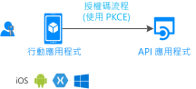

# 專案:呼叫 Web API 的行動應用程式

瞭解如何建構調用 Web API 的行動應用。

## Prerequisites

[!INCLUDE [Prerequisites](../../../includes/active-directory-develop-scenarios-prerequisites.md)]

## 開始使用

創建第一個移動應用程式並嘗試快速入門。

> [!div class="nextstepaction"]
> [快速入門:取得權杖並從 Android 應用呼叫 Microsoft 圖形 API](./quickstart-v2-android.md)
>
> [快速入門:取得權杖並從 iOS 應用呼叫 Microsoft 圖形 API](./quickstart-v2-ios.md)
>
> [快速入門:取得權杖,並從 Xamarin iOS 和 Android 應用程式呼叫 Microsoft 圖形 API](https://github.com/Azure-Samples/active-directory-xamarin-native-v2)

## 概觀

個人化、無縫的用戶體驗對於移動應用至關重要。  Microsoft 身份平臺使行動開發人員能夠為 iOS 和 Android 使用者創建該體驗。 您的應用程式可以登錄 Azure 活動目錄 (Azure AD) 使用者、個人 Microsoft 帳戶使用者和 Azure AD B2C 使用者。 它還可以獲取權杖來代表他們調用 Web API。 為了實現這些流,我們將使用 Microsoft 身份驗證庫 (MSAL)。 MSAL 實作標準[OAuth2.0 授權代碼串流](v2-oauth2-auth-code-flow.md)。

移動應用的注意事項:

- **使用者體驗是關鍵**:允許使用者在請求登錄之前查看應用的價值。 僅請求所需的許可權。
- **支援所有使用者配置**:許多行動業務使用者必須遵守條件存取策略和設備合規性策略。 請務必支援這些關鍵方案。
- **實現單一登錄 (SSO):** 透過使用 MSAL 和 Microsoft 識別平臺,您可以透過裝置的瀏覽器或 Microsoft 身份驗證器(Android 上的 Intune 公司門戶)啟用單一登錄。
- **實現共享設備模式**:使應用程式能夠在共用設備方案中使用,例如醫院、製造、零售和財務。 [閱讀有關支援共享裝置模式的資訊](msal-shared-devices.md)。

## 詳細資料

在 Microsoft 識別平台上建置行動應用程式時,請記住以下注意事項:

- 根據平臺的不同,使用者首次登錄時可能需要一些使用者交互。 例如,iOS 要求應用在首次通過 Microsoft 身份驗證器(Android 上的 Intune 公司門戶)首次使用 SSO 時顯示使用者交互。
- 在 iOS 和 Android 上,MSAL 可能使用外部瀏覽器登錄使用者。 外部瀏覽器可能顯示在應用頂部。
- 切勿在移動應用程式中使用機密。 在這些應用程式中,所有使用者都可以訪問機密。

## 後續步驟

> [!div class="nextstepaction"]
> [應用註冊](scenario-mobile-app-registration.md)
