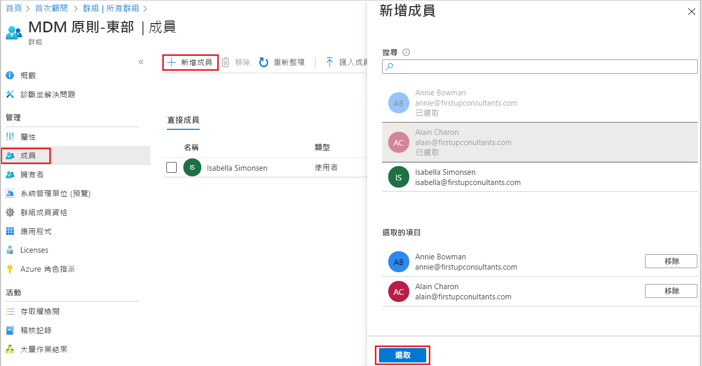

# 使用 Azure Active Directory 建立基本群組並新增成員
您可以使用 Azure Active Directory (Azure AD) 入口網站建立基本群組。 基於此文章的目的，一個基本的群組會由資源擁有者 (系統管理員) 新增到單一資源，並包含需要存取該資源的特定成員 (員工)。 如需更複雜的案例，包括動態成員資格和規則建立，請參閱[Azure Active Directory 使用者管理文件](../users-groups-roles/index.yml)。

## 群組與成員資格類型
有數個群組與成員資格類型。 下列資訊說明每個群組與成員資格類型，以及其使用方式，以協助您決定建立群組時要使用的選項。

### 群組類型：
- **安全性**。 用來管理成員和電腦對使用者群組所共用之資源的存取權。 例如，您可以針對特定安全性原則建立安全性群組。 透過這麼做，您可以將一組權限同時授與所有成員，而不必個別為每個成員新增權限。 安全性群組可以將使用者、裝置、群組和服務主體作為其成員和使用者，將服務主體作為其擁有者。 如需管理資源存取權的詳細資訊，請參閱[使用 Azure Active Directory 群組來管理資源的存取權](active-directory-manage-groups.md)。
- **Microsoft 365**。 透過將共用信箱、行事曆、檔案、SharePoint 網站等的存取權授與成員，來提供共同作業的機會。 此選項也可讓您將群組的存取權授與組織外的人員。 Microsoft 365 群組只能有使用者作為其成員。 使用者和服務主體都可以是 Microsoft 365 群組的擁有者。 如需 Microsoft 365 群組的詳細資訊，請參閱 [瞭解 Microsoft 365 群組](https://support.office.com/article/learn-about-office-365-groups-b565caa1-5c40-40ef-9915-60fdb2d97fa2)。

### 成員資格類型：
- **已指派**： 讓您將特定使用者新增為此群組的成員並具有唯一權限。 基於此文章的目的，我們會使用此選項。
- **動態使用者**： 讓您使用動態成員資格規則來自動新增及移除成員。 如果成員的屬性出現變化，系統會查看您針對目錄所設定的動態群組規則，以判斷該成員是否仍符合規則需求 (並新增該成員)，或已不再符合規則需求 (並移除該成員)。
- **動態裝置**： 讓您使用動態群組規則來自動新增及移除裝置。 如果裝置的屬性出現變化，系統會查看您針對目錄所設定的動態群組規則，以判斷該裝置是否仍符合規則需求 (並新增該裝置)，或已不再符合規則需求 (並移除該裝置)。

    > [!IMPORTANT]
    > 您可以針對裝置或使用者建立動態群組，但不能同時建立。 您也無法根據裝置擁有者的屬性來建立裝置群組。 裝置成員資格規則只能參考裝置屬性。 如需針對使用者與裝置建立動態群組的詳細資訊，請參閱[建立動態群組並檢查狀態](../users-groups-roles/groups-create-rule.md)

## 建立基本群組並新增成員
您可以同時建立基本群組並新增成員。 若要建立基本群組並新增成員，請使用下列程序：

1. 使用目錄的全域系統管理員帳戶登入 [Azure 入口網站](https://portal.azure.com)。

1. 搜尋並選取 [Azure Active Directory]****。

1. 在 [Active Directory]**** 上，選取 [群組]****，然後選取 [新增群組]****。

    ![顯示 [群組] 的 Azure AD 頁面](media/active-directory-groups-create-azure-portal/group-full-screen.png)

1. [新群組]**** 窗格隨即出現，而且您必須填寫必要資訊。

    ![已填入範例資訊的 [新增群組] 頁面](media/active-directory-groups-create-azure-portal/new-group-blade.png)

1. 選取預先定義的 [群組類型]****。 如需群組類型的詳細資訊，請參閱[群組與成員資格類型](#group-types)。

1. 建立並新增 [群組名稱]****。 選擇您將記住且對群組而言合理的名稱。 系統會執行檢查，以判斷名稱是否已用於其他群組。 如果名稱已在使用中，為了避免重複命名，系統會要求您變更群組名稱。

1. 新增群組的**群組電子郵件地址**，或保留自動填入的電子郵件地址。

1. **群組描述。** 為群組新增選擇性的描述。

1. 選取預先定義的 [成員資格類型 (必要)]****。 如需有關成員資格類型的詳細資訊，請參閱[群組與成員資格類型](#membership-types)。

1. 選取 [建立]****。 您的群組已建立，並已可以新增成員。

1. 選取 [群組]**** 頁面中的 [成員]**** 區域，然後從 [選取成員]**** 頁面開始搜尋要新增至群組的成員。

    

1. 完成新增成員之後，請選擇 [選取]****。

    [群組概觀]**** 頁面會更新，以顯示已新增至群組的成員數目。

    ![醒目提示成員數目的 [群組概觀] 頁面](media/active-directory-groups-create-azure-portal/group-overview-blade-number-highlight.png)

## 開啟或關閉歡迎電子郵件

建立任何新的 Microsoft 365 群組時，無論是使用動態或靜態成員資格，歡迎通知都會傳送給新增至群組的所有使用者。 當使用者或裝置的任何屬性變更時，就會處理組織中的所有動態群組規則，以因應潛在的成員資格變更。 新增的使用者隨後也會收到歡迎通知。 您可以在 [Exchange PowerShell](/powershell/module/exchange/users-and-groups/Set-UnifiedGroup?view=exchange-ps) 中關閉此行為。 

## 後續步驟

- [使用群組管理對 SaaS 應用程式的存取](../users-groups-roles/groups-saasapps.md)
- [使用 PowerShell 命令管理群組](../users-groups-roles/groups-settings-v2-cmdlets.md)