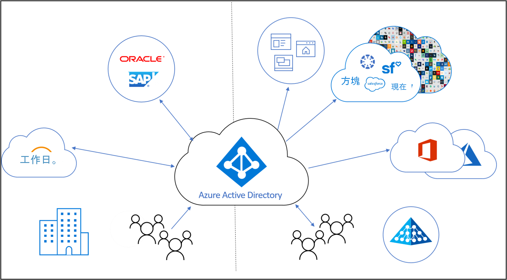

# 什麼是身分識別生命週期管理？

Identity Governance 可協助組織取得以下兩者之間的平衡：生產力 - 人員可以存取資源所需的速度，例如他們何時加入我的組織？ 與安全性 - 其存取權應如何隨著時間變更？例如，由於該人員的雇用狀態有所變更嗎？

**身分識別生命週期管理** 是 Identity Governance 的基礎，而大規模有效控管必須使應用程式的身分識別生命週期管理基礎結構現代化。 身分識別生命週期管理的目的，在於自動化和管理整個數位身分識別生命週期程序。 

## 什麼是數位身分識別？

數位身分識別是一或多個運算資源 (例如作業系統或應用程式) 所使用實體的相關資訊。 這些實體可能代表人員、組織、應用程式或裝置。  身分識別通常是由與其相關聯的屬性來描述，例如名稱、識別碼，以及用於存取管理的屬性 (例如角色)。  這些屬性可協助系統做出決定，例如誰可以存取哪些內容，以及誰可以使用特定系統。  

## 管理數位身份識別的生命週期

管理數位身分識別是一項複雜的工作，尤其當其透過數位表示法來與相互關聯真實物件 (例如人員及其以組織員工身分與該組織的關聯性) 有關時。    在小型組織中，讓需要身分識別的個人保留數位表示法可以是手動程序 - 當有人受雇或約聘人員抵達時，IT 專家可以在目錄中為其建立帳戶，並為他們指派所需的存取權。  不過，在中型和大型組織中，自動化可以讓組織更有效率地進行調整，並且使身分識別保持正確。

在組織中建立身分識別生命週期管理的一般程序會遵循下列步驟：

1. 判斷是否已經有記錄系統：組織視為權威的資料來源。  例如，組織可能有 HR 系統 Workday，而該系統有權提供目前的員工清單，以及其一些屬性，例如員工的姓名或部門。  或電子郵件系統 (例如 Exchange Online) 可能對員工的電子郵件地址具有權威性。

2. 將這些記錄系統與應用程式所使用的一或多個目錄和資料庫連結，並解決目錄與記錄系統之間的任何不一致。 例如，目錄可能有已淘汰的資料，例如已不再需要的前員工帳戶。 

3. 判斷在沒有記錄系統的情況中，可以使用哪些程序來提供權威資訊。  例如，如果有數位身分識別而沒有訪客，但組織沒有任何資料庫可供訪客使用，則可能需要尋找替代方式來判斷何時不再需要訪客的數位身分識別。

4. 設定來自記錄系統或其他程序的變更會複寫到需要更新的每個目錄或資料庫。

## 代表員工和其他具有組織關聯性之個人的身分識別生命週期管理

針對員工或其他具有組織關聯性的個人 (例如約聘人員或學生) 規劃身分識別生命週期管理時，許多組織都會建立「加入、調動及離開」程序的模型。  這些警告是：
    
   - 加入 - 當個人進入需要存取權的範圍時，這些應用程式需要身分識別，所以如果尚未有新的數位身分識別，則可能需要加以建立
   - 調動 - 當個人在界限之間調動時，則需要對其數位身分識別新增或移除額外的存取授權
   - 離開 - 當個人離開需要存取權的範圍時，可能需要移除存取權，而用於稽核或鑑識目的以外的應用程式後續可能不再需要身分識別

比方說，如果新員工加入貴組織，而他之前從未隸屬於貴組織，則該員工需要新的數位身分識別 (在 Azure AD 中以使用者帳戶表示)。  建立此帳戶會落在「加入者」程序，如果有可指出新員工何時開始工作的記錄系統 (例如 Workday)，該程序即可自動化。  之後，如果貴組織有員工從銷售部門調動到行銷部門，其就會落在「調動者」程序。  這會需要移除其在銷售組織中擁有但不再需要的存取權，並在他們現在需要的行銷組織中授與其權利。

## 來賓的身分識別生命週期管理

來賓和其他使用者也需要進行類似的程序。  Azure AD 權利管理利用 Azure AD 企業對企業 (B2B) 來提供與組織外部人員 (需要存取貴組織的資源) 共同作業所需的生命週期控制項。 在 Azure AD B2B 中，外部使用者會向其主目錄進行驗證，但在您的目錄中有表示法。 目錄中的表示法可讓使用者獲指派您資源的存取權。  權利管理可讓組織外部的個人要求存取權，並視需要為其建立數位身分識別。 當使用者失去存取權時，就會自動移除這些數位身分識別。  

## Azure AD 如何將身分識別生命週期管理自動化？

Azure AD 目前提供下列功能：

* 在 Azure AD 和 Active Directory 中，可以使用 [HR 驅動佈建](what-is-hr-driven-provisioning.md)自動建立和更新代表員工的使用者
* 使用[目錄間佈建](what-is-inter-directory-provisioning.md)即可在 Azure AD 中自動建立和維護 Active Directory 中已經存在的使用者
* 使用[動態群組](../external-identities/use-dynamic-groups.md#what-are-dynamic-groups)，可以根據使用者的屬性將其自動指派給群組，而且可以在要求時，使用[權利管理](entitlement-management-scenarios.md)和 [Privileged Identity Management](../privileged-identity-management/pim-configure.md) 將其指派給群組、Teams、Azure AD 角色、Azure 資源角色和 SharePoint Online 網站
* 使用[應用程式佈建](what-is-app-provisioning.md)即可將使用者的更新自動傳送至更多應用程式

## 後續步驟 

- [什麼是佈建？](what-is-provisioning.md)
- [在 Azure AD 權利管理中管理外部使用者的存取權](/azure/active-directory/governance/entitlement-management-external-users.md)
- [什麼是 HR 驅動佈建？](what-is-hr-driven-provisioning.md)
- [什麼是應用程式佈建？](what-is-app-provisioning.md)
- [什麼是目錄間的佈建？](what-is-inter-directory-provisioning.md)
