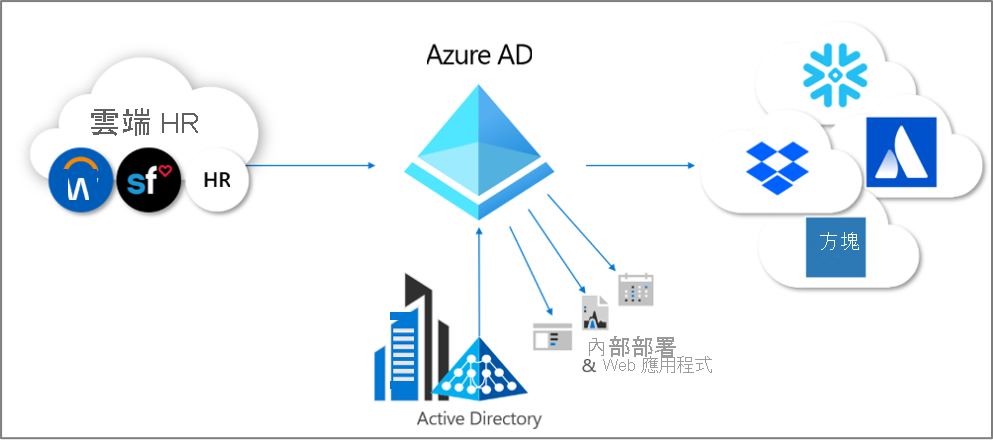
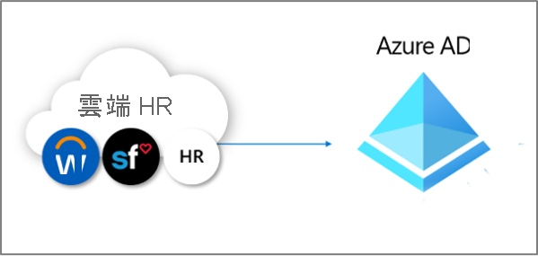
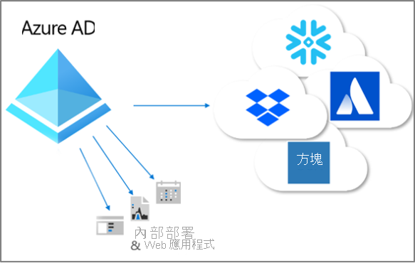

# 什麼是佈建？

佈建和取消佈建是確保數位身分識別在多個系統上保持一致的程序。  這些程序通常會當作[身分識別生命週期管理](what-is-identity-lifecycle-management.md)的一部分來運用。

**佈建** 是根據特定條件在目標系統中建立身分識別的程序。  **取消佈建** 是在不再符合條件時，從目標系統移除身分識別的程序。 **同步處理** 是讓已佈建的物件保持最新狀態的程序，以便使來源物件與目標物件相似。

例如，當新員工加入貴組織時，該員工就會進入 HR 系統中。  屆時，**從** HR **到** Azure Active Directory (Azure AD) 的佈建可以在 Azure AD 中建立對應的使用者帳戶。 查詢 Azure AD 的應用程式可以查看該名新員工的帳戶。  如果有未使用 Azure AD 的應用程式，則 **從** Azure AD 佈建 **到** 這些應用程式的資料庫，可確保使用者能夠存取使用者需要存取的所有應用程式。  此程序可讓使用者展開工作，並在一開始就能存取所需的應用程式和系統。  同樣地，當其屬性 (例如其部門或雇用狀態) 在 HR 系統中變更時，將這些更新從 HR 系統同步處理到 Azure AD 以及其他應用程式和目標資料庫，可確保一致性。

Azure AD 目前提供三個自動化佈建區域。  包括：  

- 透過 **[HR 驅動佈建](#hr-driven-provisioning)** ，從外部非目錄權威記錄系統佈建到 Azure AD  
- 透過 **[應用程式提供](#app-provisioning)** ，從 Azure AD 佈建至應用程式  
- 透過 **[目錄間佈建](#inter-directory-provisioning)** ，在 Azure AD 與 Active Directory 網域服務之間佈建 

## HR 驅動的佈建

從 HR 佈建到 Azure AD 牽涉到建立物件，通常是代表每個員工的使用者身分識別，但是在某些情況下，則是根據 HR 系統中的資訊，代表部門或其他結構的其他物件。  

最常見的案例是，當新的員工加入您的公司時，就會進入 HR 系統中。  一旦發生這種情況，系統會自動將其佈建為 Azure AD 中的新使用者，而不是每個新進員工都需要系統管理介入。  一般而言，從 HR 執行的佈建可能涵蓋下列案例。

- **雇用新員工** - 將新員工新增至 HR 系統時，系統會在 Active Directory、Azure AD 和 (選擇性) Azure AD 支援的其他應用程式中自動建立使用者帳戶，並將電子郵件地址寫回至 HR 系統。
- **員工屬性和個人檔案更新** - 在 HR 系統中更新員工記錄時 (例如姓名、職稱或經理)，系統會在 Active Directory、Azure AD 和 (選擇性) Azure AD 支援的其他應用程式中自動更新其使用者帳戶。
- **員工終止** - 在 HR 中終止員工時，其使用者帳戶會自動遭到封鎖，而無法在 Active Directory、Azure AD 和其他應用程式中登入或遭到移除。
- **員工重新雇用** - 在雲端 HR 中重新雇用員工時，可以自動重新啟用或重新佈建其舊帳戶 (視您的喜好設定而定)。

有三個部署選項可用於以 Azure AD 進行的 HR 驅動佈建：

1. 適用於具有 Workday 或 SuccessFactors 單一訂用帳戶，且不使用 Active Directory 的組織
1. 適用於具有 Workday 或 SuccessFactors 單一訂用帳戶，且同時具有 Active Directory 和 Azure AD 的組織
1. 適用於具有多個 HR 系統，或一個內部部署 HR 系統 (例如 SAP、Oracle eBusiness 或 PeopleSoft) 的組織

如需詳細資訊，請參閱[什麼是 HR 驅動佈建？](what-is-hr-driven-provisioning.md)

## 應用程式佈建

在 Azure AD 中， **[應用程式佈建](../app-provisioning/user-provisioning.md)** 一詞是指在使用者需要存取的應用程式中，自動建立使用者身分識別的複本，適用於擁有自己的資料存放區 (與 Azure AD 或 Active Directory 不同) 的應用程式。 除了建立使用者身分識別以外，自動佈建還包括隨著使用者的狀態或角色變更，在這些應用程式中維護和移除使用者身分識別。 常見的案例包括將 Azure AD 使用者佈建到 [Dropbox](../saas-apps/dropboxforbusiness-provisioning-tutorial.md)、[Salesforce](../saas-apps/salesforce-provisioning-tutorial.md)、[ServiceNow](../saas-apps/servicenow-provisioning-tutorial.md) 等應用程式，因為每個應用程式都有與 Azure AD 不同的自有使用者存放庫。

如需詳細資訊，請參閱[什麼是應用程式佈建？](what-is-app-provisioning.md)

## 目錄間佈建

許多組織都依賴 Active Directory 和 Azure AD，而且可能有已連線到 Active Directory 的應用程式，例如內部部署檔案伺服器。

許多組織過去已在內部部署環境中部署 HR 驅動佈建，因此其在 Active Directory 中可能已經有所有員工的使用者身分識別。   目錄間佈建的最常見案例是已在 Active Directory 中的使用者佈建到 Azure AD 時。  此佈建通常由 Azure AD Connect 同步或 Azure AD Connect 雲端佈建完成。 

此外，組織也可能想要從 Azure AD 佈建到內部部署系統。  例如，組織可能已將來賓帶入 Azure AD 目錄，但這些來賓需要透過應用程式 Proxy 存取內部部署 Windows 整合式驗證 (WIA) 型 Web 應用程式。  這需要在 Azure AD 中為這些使用者佈建內部部署 AD 帳戶。

如需詳細資訊，請參閱[什麼是目錄間佈建？](what-is-inter-directory-provisioning.md)

 
## 後續步驟 
- [什麼是身分識別生命週期管理？](what-is-identity-lifecycle-management.md)
- [什麼是 HR 驅動佈建？](what-is-hr-driven-provisioning.md)
- [什麼是應用程式佈建？](what-is-app-provisioning.md)
- [什麼是目錄間的佈建？](what-is-inter-directory-provisioning.md)