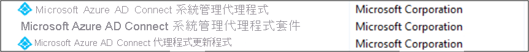

# <a name="what-is-the-azure-ad-connect-admin-agent"></a>什麼是 Azure AD Connect 管理代理程式？ 
Azure AD Connect 管理代理程式是 Azure Active Directory Connect 的新元件，可以安裝在 Azure Active Directory Connect 伺服器上。 其用途是從您的 Active Directory 環境收集特定資料，以協助 Microsoft 支援工程師在您提出支援案例時，針對問題進行疑難排解。 

>[!NOTE]
>管理代理程式不會在預設中安裝和啟用。  您必須安裝代理程式，才能收集用於協助支援案例的資料。

安裝時，Azure AD Connect 管理代理程式會等候來自 Azure Active Directory 的資料特定要求、從同步環境取得要求的資料，並將其傳送至 Azure Active Directory，也就是將資料呈現給 Microsoft 支援工程師的地方。 

Azure AD Connect 管理代理程式從您環境中擷取的資訊並不會以任何方式儲存，其只會向 Microsoft 支援工程師顯示，協助他們調查您提出的 Azure Active Directory Connect 相關支援案例並進行疑難排解。Azure AD Connect 管理代理程式不會預設安裝在 Azure AD Connect 伺服器上。 

## <a name="install-the-azure-ad-connect-administration-agent-on-the-azure-ad-connect-server"></a>在 Azure AD Connect 伺服器上安裝 Azure AD Connect 管理代理程式 

必要條件：
1.    伺服器上已安裝 Azure AD Connect
2.    伺服器上已安裝 Azure AD Connect Health


Azure AD Connect 管理代理程式二進位檔會放在 AAD Connect 伺服器中。 若要安裝代理程式，請執行下列步驟：

1.    在管理員模式中開啟 PowerShell
2.    瀏覽至應用程式所在的目錄 cd "C:\Program Files\Microsoft Azure Active Directory Connect\Tools"
3.    執行 ConfigureAdminAgent.ps1

出現提示時，請輸入您的 Azure AD 全域管理員認證。 這應該與安裝 Azure AD Connect 時輸入認證相同。

安裝代理程式之後，您會在伺服器控制台中的 [新增/移除程式] 清單中看到下列兩個新程式： 



## <a name="what-data-in-my-sync-service-is-shown-to-the-microsoft-service-engineer"></a>我的同步服務會向 Microsoft 服務工程師顯示哪些資料？ 
當您提出支援案例時，Microsoft 支援工程師即可查看指定使用者的相關資料、Active Directory 中的相關資料、Azure Active Directory Connect 伺服器中的 Active Directory 連接器空間、Azure Active Directory Connect 伺服器中的 Azure Active Directory 連接器空間，以及 Azure Active Directory Connect 伺服器中的 Metaverse。 

Microsoft 支援工程師無法變更您系統中的任何資料，而且看不到任何密碼。 

## <a name="what-if-i-dont-want-the-microsoft-support-engineer-to-access-my-data"></a>如果我不想讓 Microsoft 支援工程師存取我的資料，該怎麼做？ 
安裝代理程式後，如果您不想讓 Microsoft 服務工程師存取您的資料以提供支援，您可以修改服務設定檔案來停用此功能，如下所述： 

1. 在記事本中開啟 **C:\Program Files\Microsoft Azure AD Connect Administration Agent\AzureADConnectAdministrationAgentService.exe.config**。
2. 停用 **UserDataEnabled** 設定，如下所示。 如果有 **UserDataEnabled** 設定，而且設定為 true，則將其設定為 false。 如果沒有該設定，則新增設定，如下所示。    

    ```xml
    <appSettings>
      <add key="TraceFilename" value="ADAdministrationAgent.log" />
      <add key="UserDataEnabled" value="false" />
    </appSettings>
    ```

3. 儲存組態檔。
4. 重新啟動 Azure AD Connect 管理代理程式服務，如下所示


## <a name="next-steps"></a>後續步驟
深入了解 [整合內部部署身分識別與 Azure Active Directory](whatis-hybrid-identity.md)。
