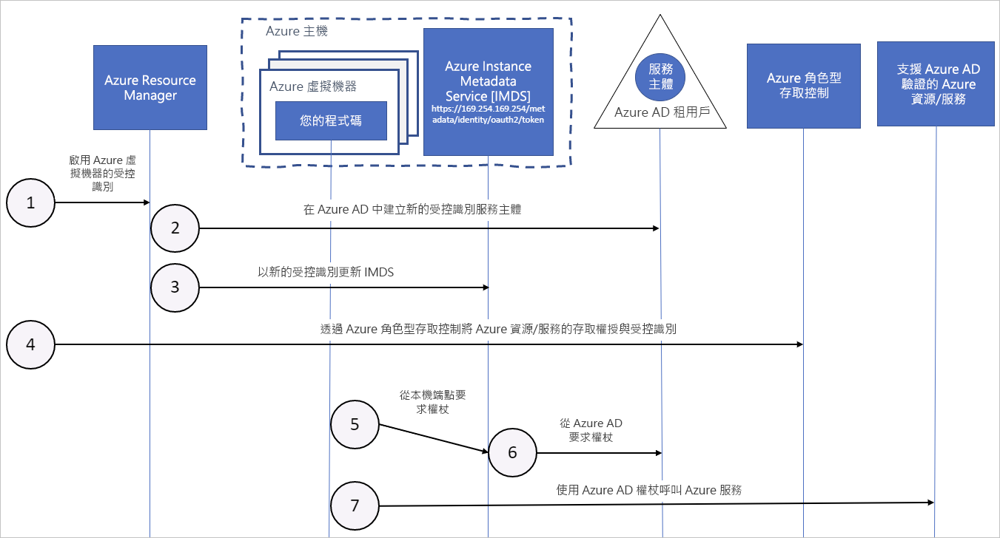

# Azure 資源受控識別如何與 Azure 虛擬機器搭配運作

Azure 資源受控識別會在 Azure Active Directory 中為 Azure 服務提供自動受控識別。 您可以使用此身分識別來向任何支援 Azure AD 驗證的服務進行驗證，不需要任何您程式碼中的認證。

在本文中，您將了解受控識別如何與 Azure 虛擬機器 (VM) 搭配使用。

## 運作方式

就內部而言，受控識別是特殊類型的服務主體，只能用於 Azure 資源。 刪除受控識別後，對應的服務主體也會自動移除。
此外，當建立使用者指派或系統指派的身分識別時，受控識別資源提供者 (MSRP) 會在內部發出該身分識別的憑證。 

您的程式碼可以使用受控識別來要求存取權杖，以存取支援 Azure AD 驗證的服務。 Azure 會負責更新服務個體使用的認證。 

下圖顯示受控服務識別與 Azure 虛擬機器一起運作的方式。

|  屬性    | 系統指派的受控識別 | 使用者指派的受控識別 |
|------|----------------------------------|--------------------------------|
| 建立 |  建立為 Azure 資源的一部分 (例如 Azure 虛擬機器或 Azure App Service)。 | 建立為獨立的 Azure 資源。 |
| 生命週期 | 與用來建立受控識別的 Azure 資源共用生命週期。   當父代資源刪除時，受控識別也會一併刪除。 | 獨立的生命週期。   必須明確刪除。 |
| 由所有 Azure 資源共用 | 無法共用。   它只能與單一 Azure 資源相關聯。 | 可以共用。   使用者指派的同一個受控識別可與多個 Azure 資源相關聯。 |
| 一般使用案例 | 包含在單一 Azure 資源內的工作負載。   您需要獨立身分識別的工作負載。   例如，在單一虛擬機器上執行的應用程式 | 在多個資源上執行、且可共用單一身分識別的工作負載。   在佈建流程中需要預先授權以保護資源的工作負載。   資源回收頻率高、但權限應保持一致的工作負載。   例如，有多個虛擬機器需要存取相同資源的工作負載 |

## 系統指派的受控識別

1. Azure Resource Manager 收到要求，請求在 VM 上啟用系統指派的受控識別。

2. Azure Resource Manager 會在 Azure AD 中建立服務主體，代表 VM 的身分識別。 服務主體會建立在此訂用帳戶信任的 Azure AD 租用戶中。

3. Azure Resource Manager 會以服務主體用戶端識別碼和憑證來更新 Azure Instance Metadata Service 身分識別端點，進而在 VM 上設定身分識別。

4. 在 VM 具有身分識別後，使用服務主體資訊對 VM 授與 Azure 資源的存取權。 若要呼叫 Azure Resource Manager，請使用 Azure 角色型存取控制 (Azure RBAC) 將適當的角色指派給 VM 服務主體。 若要呼叫 Key Vault，請將 Key Vault 中特定祕密或金鑰的存取權授與您的程式碼。

5. 您在 VM 上執行的程式碼可向能從 VM 內存取的 Azure Instance Metadata Service 端點要求權杖：`http://169.254.169.254/metadata/identity/oauth2/token`
    - resource 參數指定將權杖傳送至哪個服務。 若要向 Azure Resource Manager 進行驗證，請使用 `resource=https://management.azure.com/`。
    - API 版本參數會使用 api-version=2018-02-01 或更高版本來指定 IMDS 版本。

6. 使用步驟 3 所設定的用戶端識別碼和憑證，呼叫 Azure AD 以要求步驟 5 所指定的存取權杖。 Azure AD 會傳回 JSON Web 權杖 (JWT) 存取權杖。

7. 您的程式碼會在呼叫上傳送存取權杖給支援 Azure AD 驗證的服務。

## 使用者指派的受控識別

1. Azure Resource Manager 收到要求，請求建立使用者指派的受控識別。

2. Azure Resource Manager 會在 Azure AD 中建立服務主體，以代表使用者指派的受控識別。 服務主體會建立在此訂用帳戶信任的 Azure AD 租用戶中。

3. Azure Resource Manager 會收到以下要求：在 VM 上設定使用者指派的受控識別，並以使用者指派的受控識別服務主體用戶端識別碼和憑證來更新 Azure Instance Metadata Service 身分識別端點。

4. 建立使用者指派的受控識別後，使用服務主體資訊，以授權此身分識別來存取 Azure 資源。 若要呼叫 Azure Resource Manager，請使用 Azure RBAC 將適當的角色指派給使用者指派身分識別的服務主體。 若要呼叫 Key Vault，請將 Key Vault 中特定祕密或金鑰的存取權授與您的程式碼。

   > [!Note]
   > 您也可以在步驟 3 之前執行這個步驟。

5. 您在 VM 上執行的程式碼可向能從 VM 內存取的 Azure Instance Metadata Service 身分識別端點要求權杖：`http://169.254.169.254/metadata/identity/oauth2/token`
    - resource 參數指定將權杖傳送至哪個服務。 若要向 Azure Resource Manager 進行驗證，請使用 `resource=https://management.azure.com/`。
    - 用戶端識別碼參數會指定為其要求權杖的身分識別。 當單一 VM 上有多個使用者指派的身分識別時，需要此值才能釐清。
    - API 版本參數可指定 Azure 執行個體中繼資料服務版本。 使用 `api-version=2018-02-01` 或更高版本。

6. 使用步驟 3 所設定的用戶端識別碼和憑證，呼叫 Azure AD 以要求步驟 5 所指定的存取權杖。 Azure AD 會傳回 JSON Web 權杖 (JWT) 存取權杖。
7. 您的程式碼會在呼叫上傳送存取權杖給支援 Azure AD 驗證的服務。

## 後續步驟

透過下列快速入門，開始使用適用於 Azure 資源的受控識別功能：

* [使用 Windows VM 系統指派的受控識別來存取 Resource Manager](tutorial-windows-vm-access-arm.md)
* [使用 Linux VM 系統指派的受控識別來存取 Resource Manager](tutorial-linux-vm-access-arm.md)
