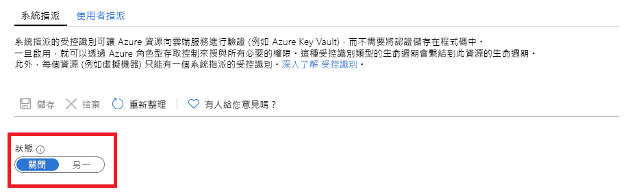

# 什麼是適用於 Azure 資源的受控識別？

[!INCLUDE [preview-notice](../../../includes/active-directory-msi-preview-notice.md)]

身為雲端開發人員，您可能會尋找最簡單且最安全的方法，以在您的程式碼中存取 Azure 資源。 

適用於 Azure 資源的受控識別可協助您滿足這項需求，因為受控識別可：

- **消除**您程式碼中認證的需求。
- 自動**輪替**認證。
- 將您涉入管理身分識別的程度**降至**最低。

## 運作方式 

所有支援受控識別的 Azure 資源都可以取得權杖以交換資料，而不需在程式碼中具有認證。 此程序由下列步驟組成：

 
1.  **啟用** – 為資源建立受控識別。
2.  **授與存取權** – 允許透過 Azure RBAC 存取資源。
3.  **存取**– 執行允許的動作。
4.  **停用** – 刪除受控識別。 

## 受控識別類型

受控身分識別有兩種：

- 系統指派的受控識別

- 使用者指派的受控識別

對於獨立的 Azure 資源，您可啟用**系統指派**的受控識別。 系統指派的受控識別可從身分識別管理的觀點，提供最方便的支援。 只要按一下，即可為您的資源啟用身分識別的自動化生命週期管理。   

   

雖然系統指派的受控識別可為獨立資源提供最方便的解決方案，但如果您需要為相同的工作管理一組 Azure 資源，則會有不同的情況。 在此案例中，您最好手動建立身分識別，並將此主要身分識別指派給您需要分組的所有 Azure 資源。 此指派稱為**使用者指派**的受控識別。 
  

## 支援的服務

您可以使用 Azure 資源適用的受控識別，向支援 Azure AD 驗證的服務進行驗證。 有關哪些 Azure 服務支援適用於 Azure 資源的受控識別功能，請參閱[這些服務支援適用於 Azure 資源的受控識別](services-support-msi.md)。

## 後續步驟

透過下列快速入門，開始使用適用於 Azure 資源的受控識別功能：

* [使用 Windows VM 系統指派的受控識別來存取 Resource Manager](tutorial-windows-vm-access-arm.md)
* [使用 Linux VM 系統指派的受控識別來存取 Resource Manager](tutorial-linux-vm-access-arm.md)
