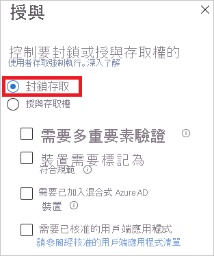
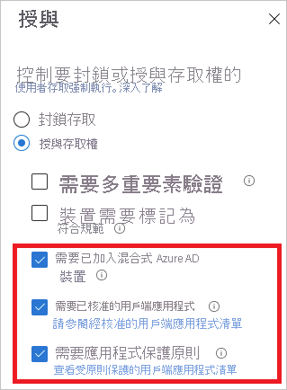
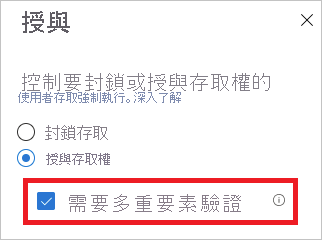
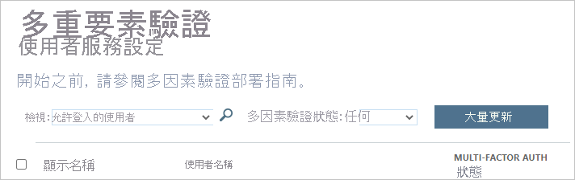

# Azure AD 中的登入診斷是什麼？

Azure AD 提供彈性的安全性模型來控制使用者可透過受控資源執行的動作。 這些資源的存取權不只是透過您的 **身分** 來控制，也會透過您存取資源的 **方式** 來控制。 一般來說，彈性會隨著您擁有的設定選項數目而有某種程度的複雜度。 複雜度可能會增加發生錯誤的風險。

身為 IT 系統管理員，您需要的解決方案必須能提供您系統中活動的正確深入解析層級，以便在問題發生時能輕鬆地診斷及解決問題。 Azure AD 的登入診斷就是這類解決方案的範例。 您可以使用診斷來分析登入期間發生的情況，以及解決問題所應採取的動作，而無須 Microsoft 支援服務的介入。

本文概述解決方案的用途及使用方式。

## 需求

登入診斷適用於所有版本的 Azure AD。  您必須是 Azure AD 中的全域管理員才能使用。

## 運作方式

在 Azure AD 中，登入嘗試的回應會與您的 **身分** 和您存取租用戶的 **方式** 繫結。 例如，身為管理員，當您從公司網路登入時，您通常可以設定租用戶的所有層面。 不過，當您以相同帳戶從不受信任的網路登入時，則可能會遭到封鎖。
 
由於該系統在回應登入嘗試上有更大的彈性，因此您最後可能要對登入進行疑難排解。登入診斷是一項功能，其用途為：

- 分析來自登入的資料。 

- 顯示發生了什麼事，以及提供解決問題的建議。 

Azure AD 的登入診斷是為了啟用登入錯誤的自我診斷而設計。 若要完成診斷程序，您需要：

 
1. **定義** 您關心的登入事件範圍

2. **選取** 檢閱登入

3. **檢閱** 診斷結果

4. **採取** 動作

 
### 定義範圍

此步驟的目標是定義您想要調查的登入範圍。 您的範圍可依據使用者或識別碼 (correlationId、requestId) 和時間範圍。 若要進一步縮小範圍，您也可以指定應用程式名稱。 Azure AD 會使用範圍資訊來為您找出正確的事件。  

### 選取登入  

根據您的搜尋準則，Azure AD 會擷取所有相符的登入，並將其顯示在驗證摘要的清單檢視中。 

 
您可以自訂此檢視中顯示的資料行。

### 檢閱診斷 

針對選取的登入事件，Azure AD 會提供您診斷結果。 

 
結果會從評量開始。 評量會以幾個句子說明發生了什麼事。 此說明可協助您了解系統的行為。 

在下一個步驟中，您會取得相關條件式存取原則的摘要，這些都是已套用至所選登入的原則。 為解決您的問題，此部分會由建議的補救步驟完成。 由於有時候仍是需要額外協助才能解決問題，因此建議的步驟可能是開啟支援票證。 

### 採取動作 
此時，您應該擁有修正問題所需的資訊。

## 案例

本節提供涵蓋的診斷案例概觀。 以下是實作的案例： 
 
- 遭到條件式存取封鎖

- 條件式存取失敗

- 條件式存取中的 MFA

- 其他需求中的 MFA

- 需要 MFA 證明

- 需要 MFA 證明，但使用者登入嘗試不是來自安全位置

- 成功登入

### 遭到條件式存取封鎖

此案例是以條件式存取原則所封鎖的登入為基礎。

此案例的診斷區段會顯示使用者登入和所套用原則的詳細資料。

### 條件式存取失敗

此案例通常是因為未滿足條件式存取原則的需求而導致登入失敗。 常見範例包括：

- 需要已加入混合式 Azure AD 的裝置

- 需要已核准的用戶端應用程式

- 需要應用程式保護原則   

此案例的診斷區段會顯示使用者登入和所套用原則的詳細資料。

### 條件式存取中的 MFA

此案例的基礎是要求使用多重要素驗證集來登入的條件式存取原則。

此案例的診斷區段會顯示使用者登入和所套用原則的詳細資料。

### 其他需求中的 MFA

此案例是以條件式存取原則未強制執行的多重要素驗證需求為基礎。 例如，以每個使用者為基礎的多重要素驗證。

此診斷案例的目的是要提供更多關於下列項目的詳細資料：

- 多重要素驗證中斷的來源。 
- 用戶端互動的結果。

此外，本節也會為您提供關於使用者登入嘗試的所有詳細資料。 

### 需要 MFA 證明

此案例的基礎是因要求設定多重要素驗證而中斷的登入。 此設定也稱為「證明」。

發生多重要素驗證證明的情況是，當使用者被要求使用多重要素驗證，但卻尚未進行設定，或管理員已設定使用者來設定此驗證。

此診斷案例的目的是讓您深入了解多重要素驗證中斷是為了設定該驗證，並提供讓使用者完成證明的建議。

### 風險性登入所需的 MFA 證明

此案例來自因要求對風險性登入設定多重要素驗證而中斷的登入。 

此診斷案例的目的是讓您深入了解多重要素驗證中斷是為了設定該驗證，並提供讓使用者完成證明的建議，但必須從沒有風險性的網路位置進行此動作。 例如，如果公司網路已定義為具名位置，請嘗試從公司網路進行證明。

### 成功登入

此案例是以未因為「條件式存取」或「多重要素驗證」中斷的登入為基礎。

此診斷案例的目的是讓您深入了解當條件式存取原則或預期套用的原則存在時，或已設定的多重要素驗證預期會中斷使用者登入時，使用者在登入時提供了什麼。

## 後續步驟

* [Azure Active Directory 報告是什麼？](overview-reports.md)
* [什麼是 Azure Active Directory 監視？](overview-monitoring.md)
