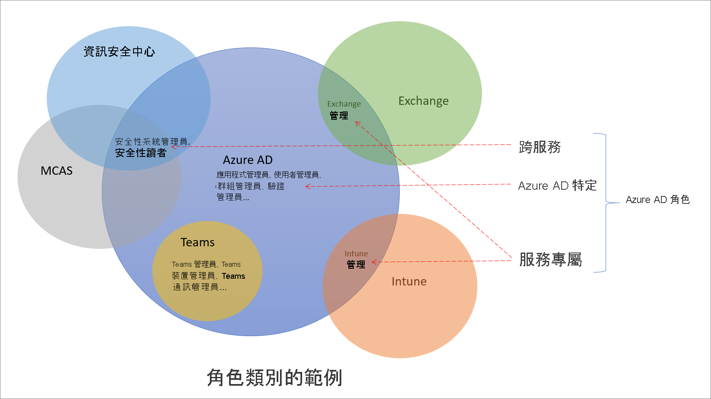

# 了解 Azure Active Directory 中的角色

大約有 60 個 Azure Active Directory (Azure AD) 內建角色，這些角色具有固定的角色權限。 為了補充內建角色，Azure AD 也支援自訂角色。 使用自訂角色來選取您想要的角色權限。 例如，您可以建立一個角色來管理特定的 Azure AD 資源，例如應用程式或服務主體。

本文說明這些 Azure AD 角色，以及如何使用。

## Azure AD 角色與其他 Microsoft 365 角色有何不同

Microsoft 365 中有許多不同的服務，例如 Azure AD 和 Intune。 其中一些服務有自己的角色型存取控制系統，特別是：

- Azure AD
- Exchange
- Intune
- 資訊安全中心
- 合規性中心
- Microsoft Cloud App Security
- 商務

其他服務 (例如 Teams、SharePoint 和受控桌面) 不會有個別的角色型存取控制系統。 這些服務會使用 Azure AD 角色來進行系統管理存取。 Azure 有自己的角色型存取控制系統，適用於 Azure 資源 (例如虛擬機器)，而此系統與 Azure AD 角色不同。

當我們提到不同的角色型存取控制系統時， 表示角色定義和角色指派會儲存在不同的資料存放區。 同樣地，存取檢查的原則決策點也不同。 如需詳細資訊，請參閱 [Azure AD 中 Microsoft 365 服務的角色](m365-workload-docs.md)和[傳統訂用帳戶管理員角色、Azure 角色和 Azure AD 角色](../../role-based-access-control/rbac-and-directory-admin-roles.md)。

## 為何某些 Azure AD 角色適用於其他服務

Microsoft 365 有許多以角色型存取控制系統，可為著時間獨立開發，每個系統都有自己的服務入口網站。 為了方便您從 Azure AD 入口網站管理跨 Microsoft 365 的身分識別，我們新增了一些服務特定的內建角色，而每個角色都會授與 Microsoft 365 服務的系統管理存取權。 這項新增內容的範例是 Azure AD 中的 Exchange 管理員角色。 此角色等同於 Exchange 角色型存取控制系統中的 [組織管理角色群組](/exchange/organization-management-exchange-2013-help)，而且可以管理 Exchange 的所有層面。 同樣地，我們也新增了 Intune 管理員角色、Teams 管理員、SharePoint 管理員等等。 伺服器特定角色是下一節中 Azure AD 內建角色的一個類別。

## Azure AD 角色的類別

Azure AD 內建角色可以使用的位置不同，可分成下列三個廣泛的類別。

- **Azure AD 特定的角色**：這些角色只會授與管理 Azure AD 內資源的權限。 例如，使用者管理員、應用程式管理員、群組管理員全都會授與管理 Azure AD 中資源的權限。
- **服務特定的角色**：對於主要 Microsoft 365 服務 (非 Azure AD)，我們已建立可授與權限來管理服務內所有功能的服務特定角色。  例如，Exchange 管理員、Intune 管理員、SharePoint 管理員和 Teams 管理員角色可以透過其各自的服務來管理功能。 Exchange 管理員可以管理信箱，Intune 管理員可以管理裝置原則，SharePoint 管理員可以管理網站集合，Teams 管理員可以管理通話品質等等。
- **跨服務角色**：有一些角色可跨服務使用。 我們有兩個全域角色 - 全域管理員和全域讀者。 所有 Microsoft 365 服務都會接受這兩個角色。 此外，還有一些安全性相關角色，例如安全性管理員和安全性讀者，會在 Microsoft 365 內授與多個安全性服務的存取權。 例如，在 Azure AD 中使用安全性管理員角色，您可以管理 Microsoft 365 資訊安全中心、Microsoft Defender 進階威脅防護和 Microsoft Cloud App Security。 同樣地，在相容性管理員角色中，您可以在 Microsoft 365 合規性中心、Exchange 等中管理合規性相關設定。

下表協助您了解這些角色分類。 這些類別採任意命名，並非用來表示[記載的角色權限](permissions-reference.md)以外的其他任何功能。

類別 | 角色
---- | ----
Azure AD 特定的角色 | 應用程式系統管理員 應用程式開發人員 驗證系統管理員 B2C IEF 金鑰集管理員 B2C IEF 原則管理員 雲端應用程式系統管理員 雲端裝置管理員 條件式存取管理員 裝置系統管理員 目錄讀取器 目錄同步處理帳戶 目錄撰寫者 外部識別碼使用者流程管理員 外部識別碼使用者流程屬性管理員 外部識別提供者管理員 群組管理員 來賓邀請者 服務台系統管理員 混合式身分識別管理員 授權管理員 合作夥伴第 1 層支援 合作夥伴第 2 層支援 密碼管理員 特殊權限驗證管理員 特殊權限角色管理員 報告讀者 使用者帳戶管理員
跨服務角色 | 公司系統管理員 合規性管理員 相容性資料管理員 全域讀者 安全性系統管理員 安全性操作員 安全性讀取者 服務支援管理員
服務特定的角色 | Azure DevOps 管理員 Azure 資訊保護管理員 計費管理員 CRM 服務管理員 客戶 LockBox 存取核准者 電腦分析系統管理員 Exchange 服務管理員 Insights 管理員 Insights 商務領導人 Intune 服務管理員 Kaizala 管理員 Lync 服務管理員 訊息中心隱私權讀取者 訊息中心讀取者 現代化商務使用者 網路管理員 Office 應用程式管理員 Power BI 服務管理員 Power Platform 管理員 印表機管理員 印表機技術人員 搜尋管理員 搜尋編輯者 SharePoint 服務管理員 Microsoft Teams 通訊系統管理員 Microsoft Teams 通訊支援工程師 Microsoft Teams 通訊支援專家 Teams 裝置管理員 Microsoft Teams 服務管理員

## 後續步驟

- [Azure AD 角色型存取控制概觀](custom-overview.md)
- 使用 [Azure 入口網站、Azure AD PowerShell 和圖形 API](custom-create.md) 建立角色指派
- [檢視角色指派](custom-view-assignments.md)
