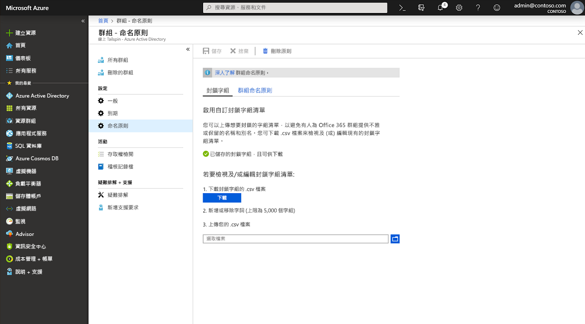

# <a name="enforce-a-naming-policy-on-office-365-groups-in-azure-active-directory"></a>在 Azure 活動目錄中的 Office 365 組強制實施命名策略

若要對使用者所建立或編輯的 Office 365 群組強制執行一致的命名慣例，請在 Azure Active Directory (Azure AD) 中為租用戶設定群組命名原則。 例如，您可以使用命名原則來傳達群組的功能、成員資格、地理區域或群組的建立者。 您也可以使用命名原則將通訊錄中的群組分類。 您可以使用原則來防止群組名稱和別名中使用特定字組。

> [!IMPORTANT]
> 對 Office 365 組使用 Azure AD 命名策略需要您擁有但不一定為屬於一個或多個 Office 365 組的每個唯一使用者分配 Azure 活動目錄高級 P1 許可證或 Azure AD 基本 EDU 許可證。

命名原則會套用至跨工作負載 (例如 Microsoft Teams、SharePoint、Exchange 或 Planner) 所建立的建立或編輯群組。 群組名稱和群組別名皆為套用對象。 如果在 Azure AD 中設置命名策略，並且具有現有的 Exchange 組命名策略，則 Azure AD 命名策略將在組織中強制執行。

配置組命名策略後，該策略將應用於最終使用者創建的新 Office 365 組。 命名策略不適用於某些目錄角色，如全域管理員或使用者管理員（請參閱下文，瞭解從組命名策略中免除的角色的完整清單）。 對於現有的 Office 365 組，策略在配置時不會立即應用。 組擁有者編輯這些組的組名稱後，將強制執行命名策略。

## <a name="naming-policy-features"></a>命名原則功能

您可以通過兩種不同的方式強制組命名策略：

- **前置詞後置詞命名原則** 您可以定義會在之後自動新增的前置詞或後置詞，以對您的群組強制執行命名慣例 (例如，在「GRP\_JAPAN\_My Group\_Engineering」這個群組名稱中，GRP\_JAPAN\_ 是前置詞，\_Engineering 是後置詞)。 

- **自訂封鎖字組** 您可以上傳一組要在使用者所建立之群組中封鎖的組織專屬字組 (例如，「CEO, Payroll, HR」)。

### <a name="prefix-suffix-naming-policy"></a>前置詞後置詞命名原則

命名慣例結構一般是「前置詞[GroupName]後置詞」。 雖然您可以定義多個前置詞和後置詞，但設定中的 [GroupName] 只能有一個。 前置詞或後置詞可以是固定字串，也可以是使用者屬性，例如 \[Department\] 就會根據建立群組的使用者來替換。 前置詞和後置詞字串合在一起所允許的字元總數是 53 個字元。 

前置詞和後置詞可以包含群組名稱和群組別名所支援的特殊字元。 前置詞或後置詞中不受群組別名支援的字元仍會套用到群組名稱，但會從群組別名中移除。 由於有此限制，群組名稱和群組別名所套用的前置詞和後置詞可能會不同。 

#### <a name="fixed-strings"></a>固定字串

您可以使用字串來方便掃描和區分全域通訊清單中與群組工作負載左側導覽連結中的群組。 某些常見的前置詞是「Grp\_Name」、「\#Name」、「\_Name」之類的關鍵字

#### <a name="user-attributes"></a>使用者屬性

您可以使用屬性來協助您和您的使用者識別群組在建立時所適用的對象是哪個部門、辦公室或地理區域。 例如，如果您將命名原則定義為 `PrefixSuffixNamingRequirement = "GRP [GroupName] [Department]"` 和 `User’s department = Engineering`，則強制執行的群組名稱可能會是「GRP My Group Engineering」。 支援的 Azure AD 屬性是 \[Department\]、\[Company\]、\[Office\]、\[StateOrProvince\]、\[CountryOrRegion\]、\[Title\]。 不支援的使用者屬性則會以固定字串視之；例如，「\[postalCode\]」。 擴充屬性和自訂屬性則不受支援。

我們對您的建議是，使用已為組織中的所有使用者填入值的屬性，而不要使用具有長值的屬性。

### <a name="custom-blocked-words"></a>自訂封鎖字組

封鎖字組清單是要在群組名稱和別名中封鎖之片語的逗號分隔清單。 系統不會執行子字串搜尋。 群組名稱必須和一或多個自訂封鎖字組完全相符，才會觸發失敗。 由於不會執行子字串搜尋，所以即便「lass」是封鎖字組，使用者仍可使用「Class」之類的一般字組。

封鎖字組清單規則：

- 封鎖字組不區分大小寫。
- 使用者在輸入封鎖字組來作為群組名稱的一部分時，會看到附上封鎖字組的錯誤訊息。
- 封鎖字組沒有字元限制。
- 封鎖字組清單中可以設定的片語上限為 5000 個。 

### <a name="roles-and-permissions"></a>角色和權限

要配置命名策略，需要其中一個命名角色：
- 全域管理員
- 組管理員
- 使用者管理員

選定的系統管理員可以不受這些原則限制 (範圍橫跨所有群組工作負載和端點)，因此可以使用封鎖字組和自己的命名慣例來建立群組。 以下是不受群組命名原則限制的系統管理員角色清單。

- 全域管理員
- 合作夥伴第 1 層支援
- 合作夥伴第 2 層支援
- 使用者管理員
- 目錄寫入器

## <a name="configure-naming-policy-in-azure-portal"></a>在 Azure 門戶中配置命名策略

1. 使用組管理員帳戶登錄到[Azure AD 管理中心](https://aad.portal.azure.com)。
1. 選取 [群組]****，然後選取 [命名原則]**** 以開啟 [命名原則] 頁面。

    ![在管理中心開啟 [命名原則] 頁面](./media/groups-naming-policy/policy.png)

### <a name="view-or-edit-the-prefix-suffix-naming-policy"></a>查看或編輯首碼尾碼命名策略

1. 在 [命名原則]**** 頁面上，選取 [群組命名原則]****。
1. 您可以選取您想要在命名原則時強制執行的屬性或字串，以個別檢視或編輯目前的前置詞或後置詞命名原則。
1. 若要從清單中移除前置詞或後置詞，請選取該前置詞或後置詞，然後選取 [刪除]****。 您同時可以刪除多個項目。
1. 通過選擇 **"保存**"，保存更改以便新策略生效。

### <a name="edit-custom-blocked-words"></a>編輯自訂阻止的單詞

1. 在 [命名原則]**** 頁面上，選取 [封鎖的字組]****。

    

1. 選取 [下載]**** 可檢視或編輯目前的自訂封鎖字組清單。
1. 選取 [檔案] 圖示可上傳新的自訂封鎖字組清單。
1. 通過選擇 **"保存**"，保存更改以便新策略生效。

## <a name="install-powershell-cmdlets"></a>安裝 PowerShell Cmdlet

請務必要將 Windows PowerShell 的任何舊版 Azure Active Directory PowerShell for Graph 模組解除安裝，並安裝 [Azure Active Directory PowerShell for Graph - 公開預覽版本 2.0.0.137](https://www.powershellgallery.com/packages/AzureADPreview/2.0.0.137)，然後才執行 PowerShell 命令。

1. 以系統管理理員身分開啟 Windows PowerShell 應用程式。
2. 將任何舊版的 AzureADPreview 解除安裝。
  
   ``` PowerShell
   Uninstall-Module AzureADPreview
   ```

3. 安裝最新版的 AzureADPreview。
  
   ``` PowerShell
   Install-Module AzureADPreview
   ```

   如果系統提示您訪問不受信任的存儲庫，請輸入**Y**。安裝新模組可能需要幾分鐘時間。

## <a name="configure-naming-policy-in-powershell"></a>在 PowerShell 中配置命名策略

1. 在電腦上開啟 Windows PowerShell 視窗。 不需較高的權限即可將它開啟。

1. 執行下列命令，以準備執行 Cmdlet。
  
   ``` PowerShell
   Import-Module AzureADPreview
   Connect-AzureAD
   ```

   在所開啟的 [登入帳戶]**** 畫面中，輸入系統管理員帳戶和密碼以連線到服務，然後選取 [登入]****。

1. 請遵循[用於進行群組設定的 Azure Active Directory Cmdlet](groups-settings-cmdlets.md) 中的步驟，建立此租用戶的群組設定。

### <a name="view-the-current-settings"></a>檢視目前的設定

1. 擷取目前的命名原則，以檢視目前的設定。
  
   ``` PowerShell
   $Setting = Get-AzureADDirectorySetting -Id (Get-AzureADDirectorySetting | where -Property DisplayName -Value "Group.Unified" -EQ).id
   ```
  
1. 顯示目前的群組設定。
  
   ``` PowerShell
   $Setting.Values
   ```
  
### <a name="set-the-naming-policy-and-custom-blocked-words"></a>設定命名原則和自訂封鎖字組

1. 在 Azure AD PowerShell 中設定群組名稱前置詞和後置詞。 設定中必須包含 [GroupName]，此功能才能正常運作。
  
   ``` PowerShell
   $Setting["PrefixSuffixNamingRequirement"] =“GRP_[GroupName]_[Department]"
   ```
  
1. 設定想要限制的自訂封鎖字組。 下列範例說明如何新增自己的自訂字組。
  
   ``` PowerShell
   $Setting["CustomBlockedWordsList"]=“Payroll,CEO,HR"
   ```
  
1. 保存新策略的設置以生效，如以下示例所示。
  
   ``` PowerShell
   Set-AzureADDirectorySetting -Id (Get-AzureADDirectorySetting | where -Property DisplayName -Value "Group.Unified" -EQ).id -DirectorySetting $Setting
   ```
  
就這麼簡單。 您已設定命名原則並新增封鎖字組。

## <a name="export-or-import-custom-blocked-words"></a>匯出或導入自訂阻止的單詞

有關詳細資訊，請參閱[有關配置組設置的 Azure 活動目錄 Cmdlet](groups-settings-cmdlets.md)一文。

以下 PowerShell 指令碼範例可匯出多個封鎖字組：

``` PowerShell
$Words = (Get-AzureADDirectorySetting).Values | Where-Object -Property Name -Value CustomBlockedWordsList -EQ 
Add-Content "c:\work\currentblockedwordslist.txt" -Value $words.value.Split(",").Replace("`"","")  
```

以下 PowerShell 指令碼範例可匯入多個封鎖字組：

``` PowerShell
$BadWords = Get-Content "C:\work\currentblockedwordslist.txt"
$BadWords = [string]::join(",", $BadWords)
$Settings = Get-AzureADDirectorySetting | Where-Object {$_.DisplayName -eq "Group.Unified"}
if ($Settings.Count -eq 0)
    {$Template = Get-AzureADDirectorySettingTemplate | Where-Object {$_.DisplayName -eq "Group.Unified"}
    $Settings = $Template.CreateDirectorySetting()
    New-AzureADDirectorySetting -DirectorySetting $Settings
    $Settings = Get-AzureADDirectorySetting | Where-Object {$_.DisplayName -eq "Group.Unified"}}
$Settings["CustomBlockedWordsList"] = $BadWords
Set-AzureADDirectorySetting -Id $Settings.Id -DirectorySetting $Settings 
```

## <a name="remove-the-naming-policy"></a>移除命名原則

### <a name="remove-the-naming-policy-using-azure-portal"></a>使用 Azure 入口網站移除命名原則

1. 在 [命名原則]**** 頁面上，選取 [刪除原則]****。
1. 確認刪除之後，命名原則就會遭到移除，包括所有前置詞後置詞命名原則以及任何自訂封鎖字組。

### <a name="remove-the-naming-policy-using-azure-ad-powershell"></a>使用 Azure AD PowerShell 刪除命名策略

1. 在 Azure AD PowerShell 中將群組名稱前置詞和後置詞設為空的。
  
   ``` PowerShell
   $Setting["PrefixSuffixNamingRequirement"] =""
   ```
  
1. 將自訂封鎖字組設為空的。
  
   ``` PowerShell
   $Setting["CustomBlockedWordsList"]=""
   ```
  
1. 儲存設定。
  
   ``` PowerShell
   Set-AzureADDirectorySetting -Id (Get-AzureADDirectorySetting | where -Property DisplayName -Value "Group.Unified" -EQ).id -DirectorySetting $Setting
   ```

## <a name="experience-across-office-365-apps"></a>跨 Office 365 應用體驗

在 Azure AD 中設定群組命名原則後，使用者若於 Office 365 應用程式建立群組，將會看見：

- 根據命名原則所形成之名稱的預覽 (含前置詞和後置詞)，且在使用者輸入群組名稱時就會立刻看見
- 使用者在輸入封鎖字組時會看到錯誤訊息，從而能夠將封鎖字組移除。

工作負載 | 法規遵循
----------- | -------------------------------
Azure Active Directory 入口網站 | 當使用者為了建立或編輯群組而輸入群組名稱時，Azure AD 入口網站和存取面板入口網站會顯示命名原則所強制使用的名稱。 當使用者輸入自訂封鎖字組時，系統會顯示附上封鎖字組的錯誤訊息，讓使用者可將其移除。
Outlook Web Access (OWA) | 當使用者輸入群組名稱或群組別名時，Outlook Web Access 會顯示命名原則所強制使用的名稱。 當使用者輸入自訂封鎖字組時，UI 中會顯示錯誤訊息以及封鎖字組，讓使用者可將其移除。
Outlook 桌面 | 在 Outlook 桌面中所建立的群組會遵守命名原則設定。 Outlook 桌面應用程式還不會顯示強制使用之群組名稱的預覽，也不會在使用者輸入群組名稱時傳回自訂封鎖字組錯誤。 不過，建立或編輯群組時會自動套用命名原則，而且使用者會在群組名稱或別名中有自訂封鎖字組時看到錯誤訊息。
Microsoft Teams | 當使用者輸入小組名稱時，Microsoft Teams 會顯示群組命名原則所強制使用的名稱。 當使用者輸入自訂封鎖字組時，系統會顯示錯誤訊息以及封鎖字組，讓使用者可將其移除。
SharePoint  |  當使用者輸入網站名稱或群組電子郵件地址時，SharePoint 會顯示命名原則所強制使用的名稱。 當使用者輸入自訂封鎖字組時，系統會顯示錯誤訊息以及封鎖字組，讓使用者可將其移除。
Microsoft Stream | 當使用者輸入群組名稱或群組電子郵件別名時，Microsoft Stream 會顯示群組命名原則所強制使用的名稱。 當使用者輸入自訂封鎖字組時，系統會顯示附上封鎖字組的錯誤訊息，讓使用者可將其移除。
Outlook iOS 和 Android 應用程式 | 在 Outlook 應用程式中所建立的群組會遵守所設定的命名原則。 Outlook 行動應用程式還不會顯示命名原則所強制使用之名稱的預覽，也不會在使用者輸入群組名稱時傳回自訂封鎖字組錯誤。 不過，在按一下建立/編輯時會自動套用命名原則，而且使用者會在群組名稱或別名中有自訂封鎖字組時看到錯誤訊息。
Groups 行動應用程式 | 在 Groups 行動應用程式中所建立的群組會遵守命名原則。 Groups 行動應用程式不會顯示命名原則的預覽，也不會在使用者輸入群組名稱時傳回自訂封鎖字組錯誤。 不過，建立或編輯群組時會自動套用命名原則，而且使用者會在群組名稱或別名中有自訂封鎖字組時看到適當的錯誤。
Planner | Planner 會遵守命名原則。 輸入計劃名稱時，Planner 會顯示命名原則預覽。 當使用者輸入自訂封鎖字組時，系統會在建立計劃時顯示錯誤訊息。
Dynamics 365 for Customer Engagement | Dynamics 365 for Customer Engagement 會遵守命名原則。 當使用者輸入群組名稱或群組電子郵件別名時，Dynamics 365 會顯示命名原則所強制使用的名稱。 當使用者輸入自訂封鎖字組時，系統會顯示附上封鎖字組的錯誤訊息，讓使用者可將其移除。
學校資料同步 (SDS) | 透過 SDS 所建立的群組會遵守命名原則，但不會自動套用命名原則。 對於需要建立群組並上傳到 SDS 的類別名稱，SDS 系統管理員必須對此名稱附加前置詞和後置詞。 否則，群組的建立或編輯會失敗。
Outlook Customer Manager (OCM) | Outlook Customer Manager 會遵守命名原則，而此原則會自動套用到 Outlook Customer Manager 中所建立的群組。 如果偵測到自訂封鎖字組，系統會封鎖 OCM 中的群組建立，並讓使用者無法使用 OCM 應用程式。
Classroom 應用程式 | 在 Classroom 應用程式中所建立的群組會遵守命名原則，但不會自動套用命名原則，而且不會在使用者輸入教室群組名稱時顯示命名原則預覽。 使用者必須輸入具有前置詞和後置詞的強制教室群組名稱。 如果沒有這麼做，教室群組的建立或編輯作業會失敗，並顯示錯誤。
Power BI | Power BI 工作區會遵守命名原則。    
Yammer | 當使用者以其 Azure Active Directory 帳戶登入 Yammer 來建立群組或編輯群組名稱時，群組名稱會符合命名原則。 這適用於 Office 365 連線群組及所有其他 Yammer 群組。<br>如果在具有命名原則之前建立 Office 365 連線群組，群組名稱不會自動遵循命名原則。 當使用者編輯群組名稱時，系統會提示他們新增前置詞和後置詞。
StaffHub  | StaffHub 小組不會遵守命名原則，但基礎 Office 365 群組會。 StaffHub 小組名稱不會套用前置詞和後置詞，也不會檢查自訂封鎖字組。 但 StaffHub 會套用前置詞和後置詞，並且會從基礎 Office 365 群組中移除封鎖字組。
Exchange PowerShell | Exchange PowerShell Cmdlet 會遵守命名原則。 使用者若未在群組名稱和群組別名 (mailNickname) 中遵守命名原則，將會收到適當的錯誤訊息以及針對自訂封鎖字組所建議的前置詞和後置詞。
Azure Active Directory PowerShell Cmdlet | Azure Active Directory PowerShell Cmdlet 會遵守命名原則。 使用者若未在群組名稱和群組別名中遵守命名慣例，將會收到適當的錯誤訊息以及針對自訂封鎖字組所建議的前置詞和後置詞。
Exchange 系統管理中心 | Exchange 系統管理中心會遵守命名原則。 使用者若未在群組名稱和群組別名中遵守命名慣例，將會收到適當的錯誤訊息以及針對自訂封鎖字組所建議的前置詞和後置詞。
Microsoft 365 系統管理中心 | Microsoft 365 管理中心符合命名策略。 當使用者建立或編輯群組名稱時，系統會自動套用命名原則，而且使用者會在輸入自訂封鎖字組時收到適當的錯誤。 Microsoft 365 管理中心尚未顯示命名策略的預覽，也不會在使用者輸入組名稱時返回自訂阻止的單詞錯誤。

## <a name="next-steps"></a>後續步驟

這些文章提供有關 Azure AD 群組的其他資訊。

- [查看現有的群組](../fundamentals/active-directory-groups-view-azure-portal.md)
- [Office 365 群組的到期原則](groups-lifecycle.md)
- [管理群組的設定](../fundamentals/active-directory-groups-settings-azure-portal.md)
- [管理群組的成員](../fundamentals/active-directory-groups-members-azure-portal.md)
- [管理群組的成員資格](../fundamentals/active-directory-groups-membership-azure-portal.md)
- [管理群組中使用者的動態規則](groups-dynamic-membership.md)
