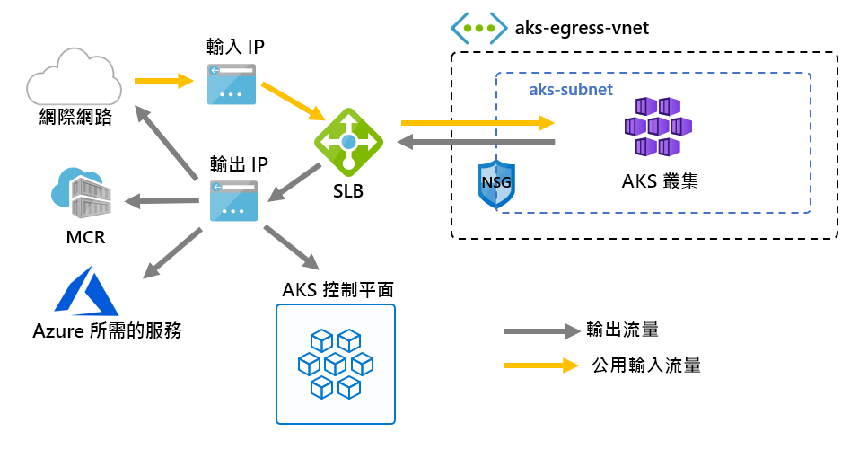

# 使用使用者定義的路由自訂叢集輸出

您可以自訂來自 AKS 叢集的輸出以符合特定案例。 根據預設，AKS 會布建要設定及用於輸出的標準 SKU Load Balancer。 不過，如果不允許公用 IP 或輸出需要額外的躍點，則預設設定可能不符合所有案例的需求。

此文章將逐步解說如何自訂叢集的輸出路由以支援自訂網路案例，例如，不允許公用 IP，以及要求叢集位於網路虛擬設備 (NVA) 的案例。

## Prerequisites
* Azure CLI 2.0.81 版或更新版本
* `2020-01-01` 或更新的 API 版本

## 限制
* OutboundType 只能在叢集建立時間定義，之後無法更新。
* 設定 `outboundType` 需要具有 `vm-set-type` `VirtualMachineScaleSets` 和 `load-balancer-sku` `Standard` 的 AKS 叢集。
* 將 `outboundType` 設定為 `UDR` 值，需要使用者定義的路由，以及適用於叢集的有效連出連線能力。
* 將 `outboundType` 設定為 `UDR` 值，表示路由傳送到負載平衡器的輸入來源 IP，可能會與叢集的連出輸出目的地位址**不相符**。

## AKS 中連出類型的概觀

您可以使用類型或的唯一來自訂 AKS 叢集 `outboundType` `loadBalancer` `userDefinedRouting` 。

> [!IMPORTANT]
> 傳出類型只會影響叢集的連出流量。 如需詳細資訊，請參閱 [設定輸入控制器](ingress-basic.md)。

> [!NOTE]
> 您可以使用自己的 [路由表][byo-route-table] 搭配 UDR 和 kubenet 網路功能。 請確定您已將身分識別 (服務主體或受控識別) 具有自訂路由表的參與者許可權。

### LoadBalancer 的連出類型

如果 `loadBalancer` 設定，AKS 會自動完成下列設定。 負載平衡器可透過 AKS 指派的公用 IP 來用於輸出。 連出類型的 `loadBalancer` 支援 `loadBalancer` 類型的 Kubernetes 服務，其會預期 AKS 資源提供者所建立之負載平衡器的輸出。

AKS 會進行下列設定。
   * 公用 IP 位址會針對叢集輸出來佈建。
   * 此公用 IP 位址會指派給負載平衡器資源。
   * 針對叢集中的代理程式節點設定負載平衡器的後端集區。

以下是預設部署於 AKS 叢集中的網路拓撲，其會使用 `loadBalancer` 的 `outboundType`。

### UserDefinedRouting 的連出類型

> [!NOTE]
> 使用連出類型是一個進階的網路案例，且需要適當的網路設定。

如果 `userDefinedRouting` 設定，AKS 就不會自動設定輸出路徑。 輸出設定必須由您完成。

您必須將 AKS 叢集部署到現有的虛擬網路中，但先前已設定的子網，因為未使用標準負載平衡器 (SLB) 架構時，您必須建立明確輸出。 因此，此架構需要明確地將輸出流量傳送至設備（例如防火牆、閘道、proxy），或允許 (NAT) 的網路位址轉譯，以指派給標準負載平衡器或設備的公用 IP 進行。

#### 使用 userDefinedRouting 建立負載平衡器

輸出類型為 UDR 的 AKS 叢集只有在部署 ' loadBalancer ' 類型的第一個 Kubernetes 服務時，才會收到標準負載平衡器 (SLB) 。 負載平衡器 *會針對輸入* 要求設定公用 IP 位址，並針對 *輸入* 要求設定後端集區。 輸入規則是由 Azure 雲端提供者所設定，但不會設定輸出的 **公用 IP 位址或輸出規則** ，因為輸出類型為 UDR 的結果。 您的 UDR 仍會是輸出流量的唯一來源。

在設定規則之前，Azure 負載平衡器 [不會產生費用](https://azure.microsoft.com/pricing/details/load-balancer/)。

## 部署具有 UDR 和 Azure 防火牆連出類型的叢集

若要使用使用者定義的路由來說明使用輸出類型的叢集應用程式，可以在其自己的子網上具有 Azure 防火牆的虛擬網路上設定叢集。 請參閱 [使用 Azure 防火牆限制輸出流量](limit-egress-traffic.md#restrict-egress-traffic-using-azure-firewall)的範例。

> [!IMPORTANT]
> UDR 的輸出類型需要路由表中 NVA (網路虛擬裝置) 的 0.0.0.0/0 和下一個躍點目的地的路由。
> 路由表已有預設的 0.0.0.0/0 至網際網路，而且沒有公用 IP 可將此路由新增至 SNAT，將不會提供輸出。 AKS 會驗證您未建立指向網際網路的 0.0.0.0/0 路由，而是改為 NVA 或閘道等等。使用輸出類型 UDR 時，除非已設定*loadbalancer*類型的服務，否則不會建立**輸入要求**的負載平衡器公用 IP 位址。 如果設定了 UDR 的輸出類型，AKS 絕對不會建立 **輸出要求** 的公用 IP 位址。

## 後續步驟

請參閱 [Azure 網路 UDR 概觀](../virtual-network/virtual-networks-udr-overview.md) \(部分機器翻譯\)。

請參閱[如何建立、變更或刪除路由表](../virtual-network/manage-route-table.md) \(部分機器翻譯\)。

<!-- LINKS - internal -->
[az-aks-get-credentials]: /cli/azure/aks?view=azure-cli-latest#az-aks-get-credentials
[byo-route-table]: configure-kubenet.md#bring-your-own-subnet-and-route-table-with-kubenet
