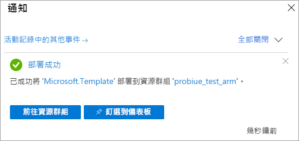

# <a name="quickstart-create-a-server---arm-template"></a>快速入門：建立伺服器 - ARM 範本

本快速入門說明如何使用 Azure Resource Manager 範本 (ARM 範本) 在 Azure 訂用帳戶中建立 Analysis Services 伺服器資源。

[!INCLUDE [About Azure Resource Manager](../../includes/resource-manager-quickstart-introduction.md)]

如果您的環境符合必要條件，而且您很熟悉 ARM 範本，請選取 [部署至 Azure] 按鈕。 範本會在 Azure 入口網站中開啟。

[](https://portal.azure.com/#create/Microsoft.Template/uri/https%3A%2F%2Fraw.githubusercontent.com%2FAzure%2Fazure-quickstart-templates%2Fmaster%2F101-analysis-services-create%2Fazuredeploy.json)

## <a name="prerequisites"></a>必要條件

* **Azure 訂用帳戶**：瀏覽 [Azure 免費試用](https://azure.microsoft.com/offers/ms-azr-0044p/)來建立帳戶。
* **Azure Active Directory**：您的訂用帳戶必須與 Azure Active Directory 租用戶相關聯。 而且，您必須使用該 Azure Active Directory 中的帳戶來登入 Azure。 若要深入了解，請參閱[驗證和使用者權限](analysis-services-manage-users.md)。

## <a name="review-the-template"></a>檢閱範本

本快速入門中使用的範本是來自 [Azure 快速入門範本](https://azure.microsoft.com/resources/templates/101-analysis-services-create/)。

:::code language="json" source="~/quickstart-templates/101-analysis-services-create/azuredeploy.json":::

具有防火牆規則的單一 [Microsoft.analysisservices/servers](/azure/templates/microsoft.analysisservices/servers) 資源會在範本中定義。

## <a name="deploy-the-template"></a>部署範本

1. 選取以下部署至 Azure 連結來登入 Azure 並開啟範本。 此範本是用來建立 Analysis Services 伺服器資源，並指定必要和選用的屬性。

   [](https://portal.azure.com/#create/Microsoft.Template/uri/https%3A%2F%2Fraw.githubusercontent.com%2FAzure%2Fazure-quickstart-templates%2Fmaster%2F101-analysis-services-create%2Fazuredeploy.json)

2. 選取或輸入下列值。

    除非另有指定，否則請使用預設值。

    * 訂用帳戶：選取 Azure 訂用帳戶。
    * **資源群組**：按一下 [建立新項目]，然後輸入新資源群組的唯一名稱。
    * **位置**：選取資源群組中建立之資源的預設位置。
    * **伺服器名稱**：輸入資源群組的名稱。 
    * **位置**：忽略 Analysis Services。 位置是在「伺服器位置」中指定。
    * **伺服器位置**：輸入 Analysis Services 伺服器的位置。 這通常與為資源群組指定的預設位置相同，但不是必填項目。 例如**美國中北部**。 如需支援的區域，請參閱[依區域的 Analysis Services 可用性](analysis-services-overview.md#availability-by-region)。
    * **SKU 名稱**：輸入要建立 Analysis Services 伺服器 SKU 名稱。 從下列項目選擇：B1、B2、D1、S0、S1、S2、S3、S4、S8v2、S9v2。 SKU 功能是否可用取決於區域。 建議使用 S0 或 D1 進行評估和測試。
    * **Capacity**：輸入查詢複本擴增執行個體的總數。 只有選取的區域支援多個執行個體的擴增。
    * **防火牆設定**：輸入要為伺服器定義的傳入防火牆規則。 如果未指定，則會停用防火牆。
    * **備份 Blob 容器 URI**：輸入具有讀取、寫入和列出權限的私人 Azure Blob 儲存體容器的 SAS URI。 只有當您要使用[備份/還原](analysis-services-backup.md)時才需要輸入。
    * **我同意上方所述的條款及條件**：選取。

3. 選取 [購買]。 成功部署伺服器之後，您會收到通知：

   

## <a name="validate-the-deployment"></a>驗證部署

使用 Azure 入口網站或 Azure PowerShell 來確認已建立資源群組和伺服器資源。

### <a name="powershell"></a>PowerShell

```azurepowershell-interactive
$resourceGroupName = Read-Host -Prompt "Enter the Resource Group name"
(Get-AzResource -ResourceType "Microsoft.AnalysisServices/servers" -ResourceGroupName $resourceGroupName).Name
 Write-Host "Press [ENTER] to continue..."
```

---

## <a name="clean-up-resources"></a>清除資源

不再需要時，請使用 Azure 入口網站、Azure CLI 或 Azure PowerShell 來刪除資源群組和伺服器資源。

# <a name="cli"></a>[CLI](#tab/CLI)

```azurecli-interactive
echo "Enter the Resource Group name:" &&
read resourceGroupName &&
az group delete --name $resourceGroupName &&
echo "Press [ENTER] to continue ..."
```

# <a name="powershell"></a>[PowerShell](#tab/PowerShell)

```azurepowershell-interactive
$resourceGroupName = Read-Host -Prompt "Enter the Resource Group name"
Remove-AzResourceGroup -Name $resourceGroupName
Write-Host "Press [ENTER] to continue..."
```

---

## <a name="next-steps"></a>後續步驟

在本快速入門中，您已使用 ARM 範本來建立新的資源群組和 Azure Analysis Services 伺服器資源。 使用範本建立伺服器資源之後，請考慮下列事項：

- [快速入門：建立伺服器 - PowerShell](analysis-services-create-powershell.md)
- [從入口網站新增範例模型](analysis-services-create-sample-model.md)
- [設定伺服器管理員和使用者角色](tutorials/analysis-services-tutorial-roles.md)
