# <a name="quickstart-create-an-aspnet-core-web-app-in-azure"></a>快速入門：在 Azure 中建立 ASP.NET Core Web 應用程式

在本快速入門中，您將了解如何建立第一個 ASP.NET Core Web 應用程式，並將其部署至 [Azure App Service](overview.md)。 

當您完成時，您會有一個 Azure 資源群組，其中包含 App Service 主控方案和已部署 Web 應用程式的 App Service。

## <a name="prerequisites"></a>Prerequisites

- 具有有效訂用帳戶的 Azure 帳戶。 [免費建立帳戶](https://azure.microsoft.com/free/dotnet/)。
- 本快速入門會將應用程式部署至 Windows 上的 App Service。 若要部署至 _Linux_ 上的 App Service，請參閱[在 Linux 上的 App Service 中建立 NET Core Web 應用程式](./containers/quickstart-dotnetcore.md)。
- 安裝包含 **ASP.NET 和 Web 開發**工作負載的 <a href="https://www.visualstudio.com/downloads/" target="_blank">Visual Studio 2019</a>。

  若您已安裝 Visual Studio 2019：

  - 選取 [說明]   > [檢查更新]  以安裝最新的 Visual Studio 更新。
  - 選取 **[工具]**  >  **[取得工具及功能]** 。


## <a name="create-an-aspnet-core-web-app"></a>建立 ASP.NET Core Web 應用程式

請遵循下列步驟在 Visual Studio 中建立 ASP.NET Core Web 應用程式：

1. 開啟 Visual Studio，然後選取 [建立新專案]  。

1. 在 [建立新專案]  中選取 [ASP.NET Core Web 應用程式]  ，並確認 **C#** 已列在該選擇的語言中，然後選取 [下一步]  。

1. 在 [設定新專案]  中，將 Web 應用程式專案命名為 myFirstAzureWebApp  ，然後選取 [建立]  。

   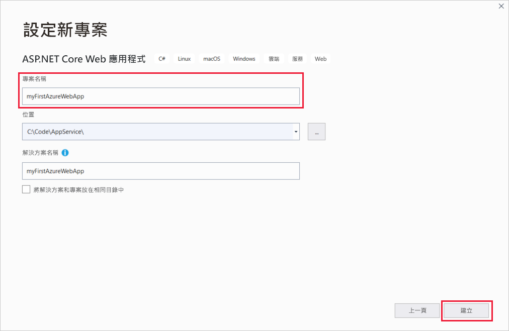

1. 您可以將任何類型的 ASP.NET Core Web 應用程式部署至 Azure，但在本快速入門中，請選擇 [Web 應用程式]  範本。 請確定 [驗證]  已設定為 [不需要驗證]  ，且未選取其他選項。 然後，選取 [Create]  \(建立\)。

   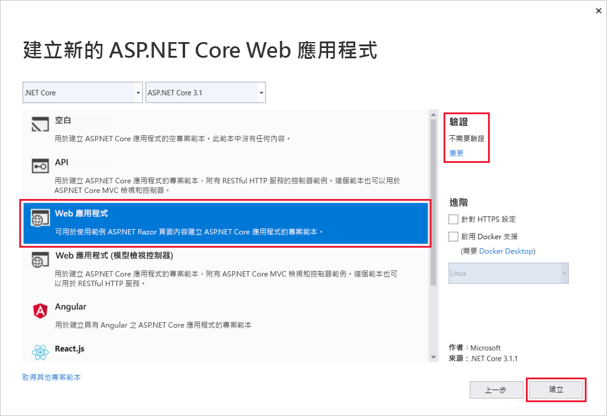 
   
1. 從 Visual Studio 功能表中，選取 **[偵錯]**  >  **[啟動但不偵錯]** 以在本機執行您的 Web 應用程式。

   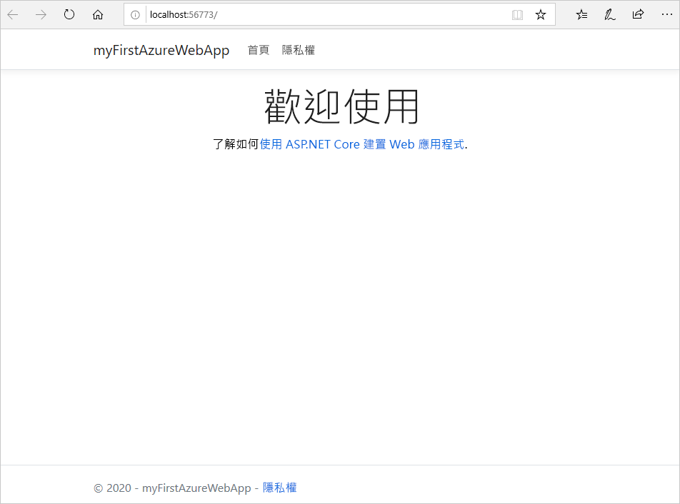

## <a name="publish-your-web-app"></a>發佈 Web 應用程式

若要發佈您的 Web 應用程式，您必須先建立並設定新的 App Service，讓您可以將應用程式發佈到其中。 

在設定 App Service 的過程中，您將建立：

- 新的[資源群組](https://docs.microsoft.com/azure/azure-resource-manager/management/overview#terminology)，以包含此服務的所有 Azure 資源。
- 新的[主控方案](https://docs.microsoft.com/azure/app-service/overview-hosting-plans)，以指定用來裝載應用程式的 Web 伺服器陣列位置、大小和功能。

請遵循下列步驟來建立您的 App Service，然後發佈您的 Web 應用程式：

1. 在 [方案總管]  中，以滑鼠右鍵按一下 **myFirstAzureWebApp** 專案，然後選取 [發佈]  。 如果您尚未從 Visual Studio 登入您的 Azure 帳戶，請選取 [新增帳戶]  或 [登入]  。 您也可以建立免費 Azure 帳戶。

1. 在 [挑選發佈目標]  對話方塊中，選擇 [App Service]  ，選取 [新建]  ，然後選取 [建立設定檔]  。

   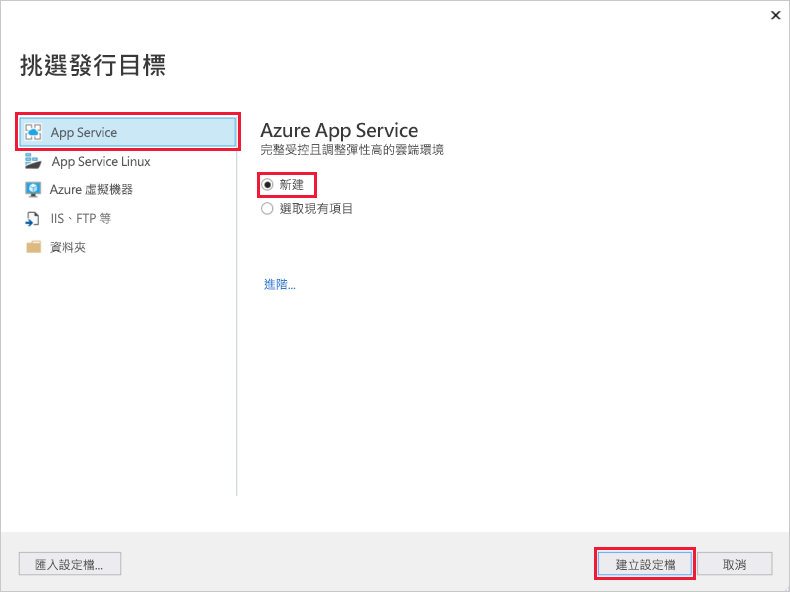

1. 在 [App Service:  新建] 對話方塊中，藉由接受預設名稱或輸入新名稱，為您的應用程式提供全域唯一的**名稱**。 有效字元為：`a-z`、`A-Z`、`0-9` 和 `-`。 此**名稱**會用來作為 Web 應用程式的 URL 前置詞，格式為 `http://<app_name>.azurewebsites.net`。

1. 針對 [訂用帳戶]  ，請接受列出的訂用帳戶，或從下拉式清單中選取一個新的訂用帳戶。

1. 在 [資源群組]  中選取 [新增]  。 在 [新增資源群組名稱]  中，輸入 myResourceGroup  ，然後選取 [確定]  。 

1. 在 [主控方案]  中選取 [新增]  。 

1. 在 [主控方案：  新建] 對話方塊中，輸入下表中指定的值：

   | 設定  | 建議的值 | 描述 |
   | -------- | --------------- | ----------- |
   | **主控方案**  | *myFirstAzureWebAppPlan* | App Service 方案的名稱。 |
   | **位置**      | 歐洲西部 | 裝載 Web 應用程式的資料中心。 |
   | **大小**          | *免費* | [定價層](https://azure.microsoft.com/pricing/details/app-service/?ref=microsoft.com&utm_source=microsoft.com&utm_medium=docs&utm_campaign=visualstudio)可決定裝載功能。 |
   
   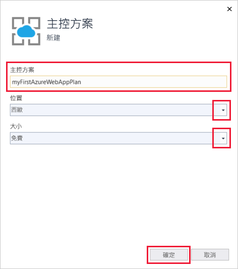

1. 將 **Application Insights** 設定為 [無]  。

1. 在 [App Service:  新建] 對話方塊中，選取 [建立]  以開始建立 Azure 資源。

   

1. 完成精靈的引導後，請選取 [發佈]  。

   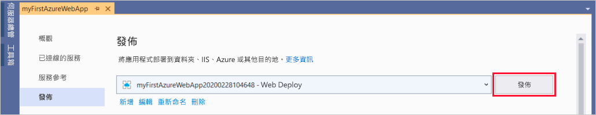

   Visual Studio 會將您的 ASP.NET Core Web 應用程式發佈至 Azure，並在預設瀏覽器中啟動應用程式。 

   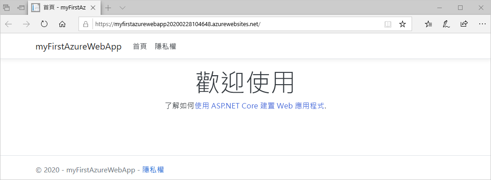

**恭喜！** ASP.NET Core Web 應用程式已在 Azure App Service 中即時執行。

## <a name="update-the-app-and-redeploy"></a>更新應用程式並重新部署

請遵循下列步驟來更新和重新部署您的 Web 應用程式：

1. 在 [方案總管]  的專案底下，開啟 [頁面]   > [Index.cshtml]  。

1. 將整個 `<div>` 標記取代為下列程式碼：

   ```html
   <div class="jumbotron">
       <h1>ASP.NET in Azure!</h1>
       <p class="lead">This is a simple app that we've built that demonstrates how to deploy a .NET app to Azure App Service.</p>
   </div>
   ```

1. 若要重新部署至 Azure，請在 [方案總管]  中，以滑鼠右鍵按一下 **myFirstAzureWebApp** 專案，然後選取 [發佈]  。

1. 在 [發佈]  摘要頁面中，選取 [發佈]  。

   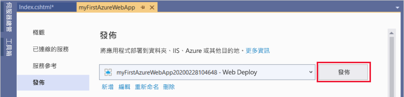

發佈完成時，Visual Studio 會啟動瀏覽器以前往 Web 應用程式的 URL。

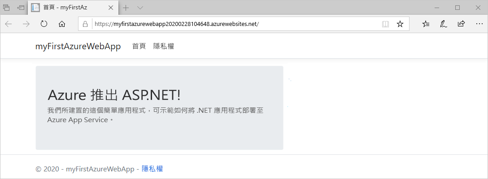

## <a name="manage-the-azure-app"></a>管理 Azure 應用程式

若要管理 Web 應用程式，請移至 [Azure 入口網站](https://portal.azure.com)，然後搜尋並選取 [應用程式服務]  。

![選取 [應用程式服務]](./media/app-service-web-get-started-dotnet/app-services.png)

在 [應用程式服務]  頁面上，選取您的 Web 應用程式名稱。

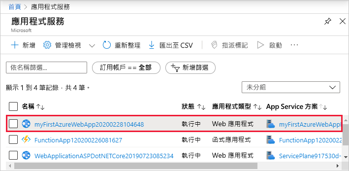

Web 應用程式的**概觀**頁面，其中包含瀏覽、停止、啟動、重新啟動和刪除等基本管理選項。 左側功能表提供的頁面可用來進一步設定您的應用程式。

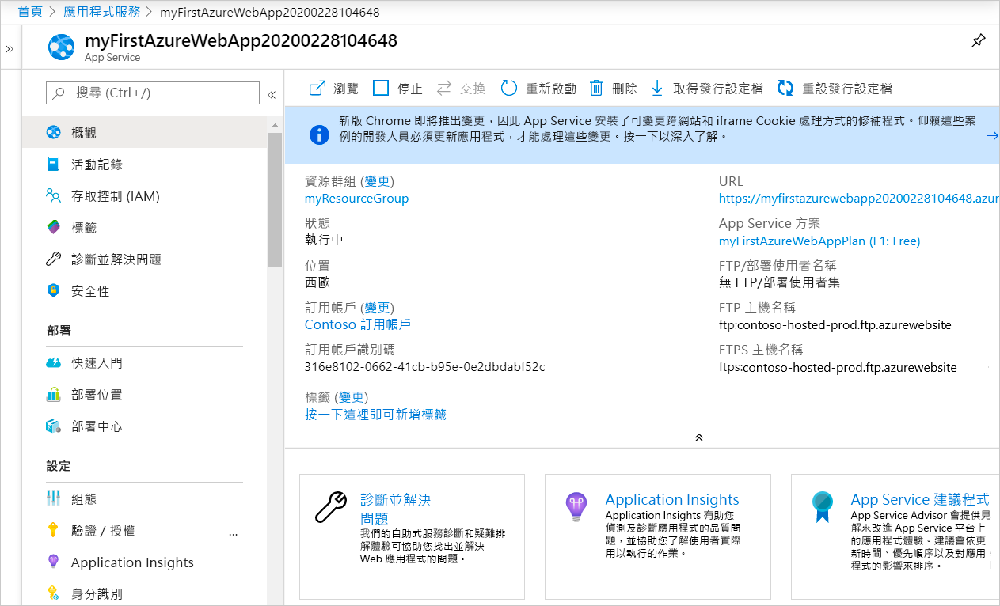

[!INCLUDE [Clean-up section](../../includes/clean-up-section-portal.md)]

## <a name="next-steps"></a>後續步驟

在本快速入門中，您已使用 Visual Studio 來建立 ASP.NET Core Web 應用程式，並將其部署至 Azure App Service。

請前往下一篇文章，了解如何建立 .NET Core 應用程式，並將其連線到 SQL Database：

> [!div class="nextstepaction"]
> [ASP.NET Core 搭配 SQL Database](app-service-web-tutorial-dotnetcore-sqldb.md)

> [!div class="nextstepaction"]
> [設定 ASP.NET Core 應用程式](configure-language-dotnetcore.md)

想要最佳化並節省您的雲端費用嗎？

> [!div class="nextstepaction"]
> [使用成本管理開始分析成本](https://docs.microsoft.com/azure/cost-management-billing/costs/quick-acm-cost-analysis?WT.mc_id=costmanagementcontent_docsacmhorizontal_-inproduct-learn)