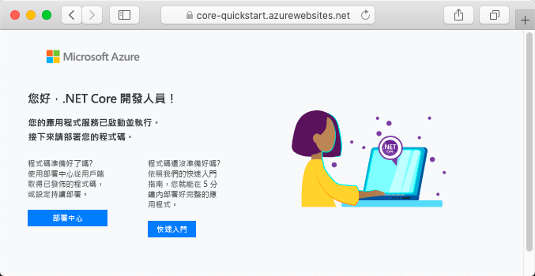

# <a name="create-an-aspnet-core-app-in-app-service-on-linux"></a>在 Linux 上的 App Service 中建立 ASP.NET Core 應用程式

> [!NOTE]
> 本文會將應用程式部署至 Linux 上的 App Service。 若要在 _Windows_ 上部署 App Service，請參閱[在 Azure 中建立 ASP.NET Core 應用程式](../app-service-web-get-started-dotnet.md)。
>

[Linux 上的 App Service](app-service-linux-intro.md) 使用 Linux 作業系統提供可高度擴充、自我修復的 Web 主機服務。 本快速入門示範如何在 Linux 上的 App Service上建立 [.NET Core](https://docs.microsoft.com/aspnet/core/) 應用程式。 您可使用 [Azure CLI](https://docs.microsoft.com/cli/azure/get-started-with-azure-cli) 建立應用程式，而且使用 Git 將 .NET Core 程式碼部署至應用程式。


您可以使用 Mac、Windows 或 Linux 機器，依照本文中的步驟操作。

[!INCLUDE [quickstarts-free-trial-note](../../../includes/quickstarts-free-trial-note.md)]

## <a name="prerequisites"></a>Prerequisites

若要完成本快速入門：

* <a href="https://git-scm.com/" target="_blank">安裝 Git</a>
* <a href="https://dotnet.microsoft.com/download/dotnet-core/3.1" target="_blank">安裝最新的 .NET Core SDK 3.1</a>

## <a name="create-the-app-locally"></a>在本機建立應用程式

在您電腦上的終端機視窗中，建立名為 `hellodotnetcore` 的目錄，並將目前的目錄變更為該目錄。

```bash
mkdir hellodotnetcore
cd hellodotnetcore
```

建立新的 .NET Core 應用程式。

```bash
dotnet new web
```

## <a name="run-the-app-locally"></a>在本機執行應用程式

在本機執行應用程式，以便您查看它在部署至 Azure 時的樣貌。 

還原 NuGet 套件，並執行應用程式。

```bash
dotnet run
```

開啟網頁瀏覽器，然後巡覽至位於 `http://localhost:5000` 的應用程式。

您會看到來自範例應用程式的 **Hello World** 訊息顯示在網頁中。


在終端機視窗中，按 **Ctrl+C** 結束 web 伺服器。 初始化 .NET Core 專案的 Git 存放庫。

```bash
git init
git add .
git commit -m "first commit"
```

[!INCLUDE [cloud-shell-try-it.md](../../../includes/cloud-shell-try-it.md)]

[!INCLUDE [Configure deployment user](../../../includes/configure-deployment-user.md)]

[!INCLUDE [Create resource group](../../../includes/app-service-web-create-resource-group-linux.md)]

[!INCLUDE [Create app service plan](../../../includes/app-service-web-create-app-service-plan-linux.md)]

## <a name="create-a-web-app"></a>建立 Web 應用程式

[!INCLUDE [Create web app](../../../includes/app-service-web-create-web-app-dotnetcore-linux-no-h.md)]

瀏覽至您剛建立的應用程式。 以您的應用程式名稱取代 _&lt;app-name>_ 。

```bash
https://<app-name>.azurewebsites.net
```

新的應用程式看起來應該像這樣：



[!INCLUDE [Push to Azure](../../../includes/app-service-web-git-push-to-azure.md)] 

<pre>
Enumerating objects: 5, done.
Counting objects: 100% (5/5), done.
Compressing objects: 100% (3/3), done.
Writing objects: 100% (3/3), 285 bytes | 95.00 KiB/s, done.
Total 3 (delta 2), reused 0 (delta 0), pack-reused 0
remote: Deploy Async
remote: Updating branch 'master'.
remote: Updating submodules.
remote: Preparing deployment for commit id 'd6b54472f7'.
remote: Repository path is /home/site/repository
remote: Running oryx build...
remote: Build orchestrated by Microsoft Oryx, https://github.com/Microsoft/Oryx
remote: You can report issues at https://github.com/Microsoft/Oryx/issues
remote:
remote: Oryx Version      : 0.2.20200114.13, Commit: 204922f30f8e8d41f5241b8c218425ef89106d1d, ReleaseTagName: 20200114.13
remote: Build Operation ID: |imoMY2y77/s=.40ca2a87_
remote: Repository Commit : d6b54472f7e8e9fd885ffafaa64522e74cf370e1
.
.
.
remote: Deployment successful.
remote: Deployment Logs : 'https://&lt;app-name&gt;.scm.azurewebsites.net/newui/jsonviewer?view_url=/api/deployments/d6b54472f7e8e9fd885ffafaa64522e74cf370e1/log'
To https://&lt;app-name&gt;.scm.azurewebsites.net:443/&lt;app-name&gt;.git
   d87e6ca..d6b5447  master -> master
</pre>

## <a name="browse-to-the-app"></a>瀏覽至應用程式

使用 web 瀏覽器瀏覽至已部署的應用程式。

```bash
http://<app_name>.azurewebsites.net
```

具有內建映像的 .NET Core 程式碼範例正在 Linux 上的 App Service 中執行。


**恭喜！** 您已將第一個 .NET Core 應用程式部署至 Linux 上的 App Service。

## <a name="update-and-redeploy-the-code"></a>更新和重新部署程式碼

在本機目錄中，開啟 _Startup.cs_ 檔案。 在方法呼叫 `context.Response.WriteAsync` 中對文字進行小幅變更：

```csharp
await context.Response.WriteAsync("Hello Azure!");
```

在 Git 中認可您的變更，然後將程式碼變更推送至 Azure。

```bash
git commit -am "updated output"
git push azure master
```

部署完成後，切換回在「瀏覽至應用程式」  步驟中開啟的瀏覽器視窗，然後按 [重新整理]。


## <a name="manage-your-new-azure-app"></a>管理新的 Azure 應用程式

移至 <a href="https://portal.azure.com" target="_blank">Azure 入口網站</a>，以管理您所建立的應用程式。

按一下左側功能表中的 [應用程式服務]  ，然後按一下 Azure 應用程式的名稱。


您會看到應用程式的 [概觀] 頁面。 您可以在這裡執行基本管理工作，像是瀏覽、停止、啟動、重新啟動及刪除。 


左側功能表提供不同的頁面來設定您的應用程式。 

[!INCLUDE [cli-samples-clean-up](../../../includes/cli-samples-clean-up.md)]

## <a name="next-steps"></a>後續步驟

> [!div class="nextstepaction"]
> [教學課程：ASP.NET Core 應用程式搭配 SQL Database](tutorial-dotnetcore-sqldb-app.md)

> [!div class="nextstepaction"]
> [設定 ASP.NET Core 應用程式](configure-language-dotnetcore.md)
