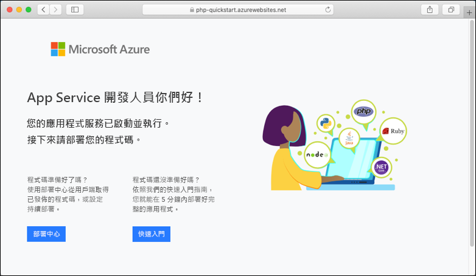

# <a name="create-a-php-app-in-app-service-on-linux"></a>在 Linux 上的 App Service 中建立 PHP 應用程式

> [!NOTE]
> 本文會將應用程式部署至 Linux 上的 App Service。 若要在 _Windows_ 上部署至 App Service，請參閱[在 Azure 中建立 PHP 應用程式](../app-service-web-get-started-php.md)。
>

[Linux 上的 App Service](app-service-linux-intro.md) 使用 Linux 作業系統提供可高度擴充、自我修復的 Web 主機服務。 本快速入門教學課程會說明如何使用 [Cloud Shell](https://docs.microsoft.com/azure/cloud-shell/overview) \(部分機器翻譯\) 將 PHP 應用程式部署至 Linux 上的 Azure App Service。


您可以使用 Mac、Windows 或 Linux 機器，依照本文中的步驟操作。

[!INCLUDE [quickstarts-free-trial-note](../../../includes/quickstarts-free-trial-note.md)]

## <a name="prerequisites"></a>Prerequisites

若要完成本快速入門：

* <a href="https://git-scm.com/" target="_blank">安裝 Git</a>
* <a href="https://php.net" target="_blank">安裝 PHP</a>

## <a name="download-the-sample"></a>下載範例

在終端機視窗中執行下列命令，將應用程式範例複製到本機電腦，並瀏覽至包含範例程式碼的目錄。

```bash
git clone https://github.com/Azure-Samples/php-docs-hello-world
cd php-docs-hello-world
```

## <a name="run-the-app-locally"></a>在本機執行應用程式

在本機執行應用程式，以便您查看它在部署至 Azure 時的樣貌。 開啟終端機視窗，並使用 `php` 命令來啟動內建的 PHP Web 伺服器。

```bash
php -S localhost:8080
```

開啟網頁瀏覽器，然後巡覽至位於 `http://localhost:8080` 的範例應用程式。

您會看到來自範例應用程式的 **Hello World!** 訊息顯示在網頁中。


在終端機視窗中，按 **Ctrl+C** 結束 web 伺服器。

[!INCLUDE [cloud-shell-try-it.md](../../../includes/cloud-shell-try-it.md)]

[!INCLUDE [Configure deployment user](../../../includes/configure-deployment-user.md)]

[!INCLUDE [Create resource group](../../../includes/app-service-web-create-resource-group-linux.md)]

[!INCLUDE [Create app service plan](../../../includes/app-service-web-create-app-service-plan-linux.md)]

## <a name="create-a-web-app"></a>建立 Web 應用程式

[!INCLUDE [Create web app](../../../includes/app-service-web-create-web-app-php-linux-no-h.md)] 

瀏覽至網站以查看您使用內建映像新建立的應用程式。 以您的應用程式名稱取代 _&lt;app name>_ 。

```bash
http://<app-name>.azurewebsites.net
```

新的應用程式看起來應該像這樣：



[!INCLUDE [Push to Azure](../../../includes/app-service-web-git-push-to-azure.md)] 

<pre>
Counting objects: 26, done.
Delta compression using up to 4 threads.
Compressing objects: 100% (23/23), done.
Writing objects: 100% (26/26), 4.95 KiB | 0 bytes/s, done.
Total 26 (delta 9), reused 0 (delta 0)
remote: Deploy Async
remote: Updating branch 'master'.
remote: Updating submodules.
remote: Preparing deployment for commit id 'df425ea6ef'.
remote: Repository path is /home/site/repository
remote: Running oryx build...
remote: Build orchestrated by Microsoft Oryx, https://github.com/Microsoft/Oryx
remote: You can report issues at https://github.com/Microsoft/Oryx/issues
remote: .
remote: .
remote: .
remote: Deployment successful.
remote: Deployment Logs : 'https://&lt;app-name&gt;.scm.azurewebsites.net/newui/jsonviewer?view_url=/api/deployments/.../log'
To https://&lt;app-name&gt;.scm.azurewebsites.net/&lt;app-name&gt;.git
 * [new branch]      master -> master
</pre>

## <a name="browse-to-the-app"></a>瀏覽至應用程式

使用 web 瀏覽器瀏覽至已部署的應用程式。

```bash
http://<app-name>.azurewebsites.net
```

具有內建映像的 PHP 程式碼範例正在 Linux 上的 App Service 中執行。


**恭喜！** 您已將第一個 PHP 應用程式部署至 Linux 上的 App Service。

## <a name="update-locally-and-redeploy-the-code"></a>在本機更新和重新部署程式碼

在本機目錄中，開啟 PHP 應用程式內的 `index.php` 檔案，並且對 `echo` 旁邊字串內的文字進行小幅變更：

```php
echo "Hello Azure!";
```

在 Git 中認可您的變更，然後將程式碼變更推送至 Azure。

```bash
git commit -am "updated output"
git push azure master
```

部署完成後，切換回在**瀏覽至應用程式**步驟中開啟的瀏覽器視窗，然後重新整理頁面。


## <a name="manage-your-new-azure-app"></a>管理新的 Azure 應用程式

移至 <a href="https://portal.azure.com" target="_blank">Azure 入口網站</a>，以管理您所建立的應用程式。

按一下左側功能表中的 [應用程式服務]  ，然後按一下 Azure 應用程式的名稱。


您會看到應用程式的 [概觀] 頁面。 您可以在這裡執行基本管理工作，像是瀏覽、停止、啟動、重新啟動及刪除。


左側功能表提供不同的頁面來設定您的應用程式。 

[!INCLUDE [cli-samples-clean-up](../../../includes/cli-samples-clean-up.md)]

## <a name="next-steps"></a>後續步驟

> [!div class="nextstepaction"]
> [教學課程：使用 MySQL 的 PHP 應用程式](tutorial-php-mysql-app.md)

> [!div class="nextstepaction"]
> [設定 PHP 應用程式](configure-language-php.md)
