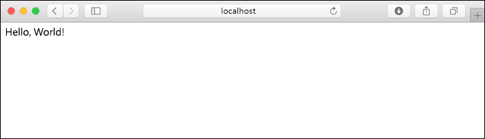

# <a name="quickstart-create-a-python-app-in-azure-app-service-on-linux"></a>快速入門：在 Linux 上的 Azure App Service 中建立 Python 應用程式

在本快速入門中，您會將 Python 應用程式部署到 [Linux 上的 App Service](app-service-linux-intro.md)，這是 Azure 可高度擴充、自我修復的 Web 裝載服務。 您會在 Mac、Linux 或 Windows 電腦上使用本機 [Azure 命令列介面 (CLI)](/cli/azure/install-azure-cli)。 您設定的 Web 應用程式會使用免費的 App Service 層，因此在本文過程中不會產生任何費用。

如果您想要透過 IDE 部署應用程式，請參閱[從 Visual Studio Code 將 Python 應用程式部署至 App Service](/azure/developer/python/tutorial-deploy-app-service-on-linux-01)。

## <a name="set-up-your-initial-environment"></a>設定初始環境

開始之前，您必須具備下列條件：

1. 具有有效訂用帳戶的 Azure 帳戶。 [免費建立帳戶](https://azure.microsoft.com/free/?ref=microsoft.com&utm_source=microsoft.com&utm_medium=docs&utm_campaign=visualstudio)。
1. 安裝 <a href="https://www.python.org/downloads/" target="_blank">Python 3.6 或更高版本</a>。
1. 安裝 <a href="/cli/azure/install-azure-cli" target="_blank">Azure CLI</a> 2.0.80 或更高版本，您可以在任何殼層中執行命令以佈建和設定 Azure 資源。

開啟終端視窗，並檢查您的 Python 版本為 3.6 或更高版本：

# <a name="bash"></a>[Bash](#tab/bash)

```bash
python3 --version
```

# <a name="powershell"></a>[PowerShell](#tab/powershell)

```cmd
py -3 --version
```

# <a name="cmd"></a>[Cmd](#tab/cmd)

```cmd
py -3 --version
```

---

檢查您的 Azure CLI 版本為 2.0.80 或更高版本：

```azurecli
az --version
```

接著，透過 CLI 登入 Azure：

```azurecli
az login
```

此命令會開啟瀏覽器來收集您的認證。 當命令完成時，即會顯示 JSON 輸出，其中包含您的訂用帳戶相關資訊。

登入之後，您可以使用 Azure CLI 執行 Azure 命令，以使用訂用帳戶中的資源。

## <a name="clone-the-sample"></a>複製範例

使用下列命令複製範例存放庫。 (如果您還沒有 GIT，請[安裝 GIT](https://git-scm.com/downloads)。)

```terminal
git clone https://github.com/Azure-Samples/python-docs-hello-world
```

然後移至該資料夾中：

```terminal
cd python-docs-hello-world
```

範例程式碼包含 *application.py* 檔案，該檔案會向 App Service 指出程式碼包含 Flask 應用程式。 如需詳細資訊，請參閱[容器的啟動程序和自訂項目](how-to-configure-python.md)。

## <a name="run-the-sample"></a>執行範例

# <a name="bash"></a>[Bash](#tab/bash)

首先建立虛擬環境並安裝必要的相依性：

```bash
python3 -m venv venv
source venv/bin/activate
pip install -r requirements.txt
```

然後將 `FLASK_APP` 環境變數設定為應用程式的輸入模組，並執行 Flask 開發伺服器：

```
export FLASK_APP=application.py
flask run
```

# <a name="powershell"></a>[PowerShell](#tab/powershell)

首先建立虛擬環境並安裝必要的相依性：

```powershell
py -3 -m venv env
env\scripts\activate
pip install -r requirements.txt
```

然後將 `FLASK_APP` 環境變數設定為應用程式的輸入模組，並執行 Flask 開發伺服器：

```powershell
Set-Item Env:FLASK_APP ".\application.py"
flask run
```

# <a name="cmd"></a>[Cmd](#tab/cmd)

首先建立虛擬環境並安裝必要的相依性：

```cmd
py -3 -m venv env
env\scripts\activate
pip install -r requirements.txt
```

然後將 `FLASK_APP` 環境變數設定為應用程式的輸入模組，並執行 Flask 開發伺服器：

```cmd
SET FLASK_APP=application.py
flask run
```

---

開啟網頁瀏覽器，然後移至位於 `http://localhost:5000/` 的範例應用程式。 應用程式會顯示 **Hello World!** 訊息。



在終端機視窗中，按 **Ctrl**+**C** 結束 Flask 開發伺服器。

## <a name="deploy-the-sample"></a>部署範例

使用 `az webapp up` 命令，將程式碼部署在本機資料夾 (python-docs-hello-world) 中：

```azurecli
az webapp up --sku F1 -n <app-name>
```

- 如果無法辨識 `az` 命令，請確定您已安裝 Azure CLI，如[設定初始環境](#set-up-your-initial-environment)中所述。
- 以 Azure 中的唯一名稱 (有效字元為 `a-z`、`0-9` 和`-`) 取代 `<app_name>`。 良好的模式是使用您的公司名稱和應用程式識別碼的組合。
- `--sku F1` 引數會在免費定價層上建立 Web 應用程式。 省略這個引數並使用進階層，如此會產生每小時成本。
- 您也可以選擇納入引數，其中 `-l <location-name>`centralus`<location_name>` 是 Azure 區域，例如 **centralus**, **eastasia**、**westeurope**、**koreasouth**、**brazilsouth**、**centralindia** 等等。 您可執行 [`az account list-locations`](/cli/azure/appservice?view=azure-cli-latest.md#az-appservice-list-locations) 命令，擷取 Azure 帳戶的允許區域清單。

此命令可能需要數分鐘才能完成。 執行時，此命令會提供有關建立資源群組、App Service 方案和裝載應用程式、設定記錄，然後執行 ZIP 部署的訊息。 接著會提供「您可以在 http://&lt;app-name&gt;.azurewebsites.net 啟動應用程式」的訊息，這是 Azure 上應用程式的 URL。


[!INCLUDE [AZ Webapp Up Note](../../../includes/app-service-web-az-webapp-up-note.md)]

## <a name="browse-to-the-app"></a>瀏覽至應用程式

使用網頁瀏覽器瀏覽至已部署的應用程式 (URL 為 `http://<app-name>.azurewebsites.net`)。

Python 範例程式碼目前使用內建映像在 App Service 中執行 Linux 容器。


**恭喜！** 您已將 Python 應用程式部署至 Linux 上的 App Service。

## <a name="redeploy-updates"></a>重新部署更新

在您偏好的程式碼編輯器中，開啟 application.py  並更新 `hello` 函式，如下所示。 這項變更會新增 `print` 陳述式，以產生您在下一節中使用的記錄輸出。 

```python
def hello():
    print("Handling request to home page.")
    return "Hello Azure!"
```

儲存您的變更並結束編輯器。 

再次使用 `az webapp up` 命令重新部署應用程式：

```azurecli
az webapp up
```

此命令會使用在 .azure/config 檔案中本機快取的值，包括應用程式名稱、資源群組和 App Service 方案。

部署完成後，切換回開啟至 `http://<app-name>.azurewebsites.net` 的瀏覽器視窗。 重新整理頁面，如此應該會顯示修改過的訊息：


> [!TIP]
> Visual Studio Code 針對 Python 和 Azure App Service 提供強大的擴充功能，以簡化將 Python Web 應用程式部署至 App Service 的程序。 如需詳細資訊，請參閱[從 Visual Studio Code 將 Python 應用程式部署至 App Service](/azure/python/tutorial-deploy-app-service-on-linux-01)。

## <a name="stream-logs"></a>串流記錄

您可以存取從應用程式及其執行所在的容器產生的主控台記錄。 記錄包含使用 `print` 陳述式產生的任何輸出。

若要串流記錄，請執行下列命令：

```azurecli
az webapp log tail
```

在瀏覽器中重新整理應用程式以產生主控台記錄，其中應包含描述應用程式 HTTP 要求的訊息。 如果沒有立即看到輸出，請在 30 秒後再試一次。

您也可以在瀏覽器中的 `https://<app-name>.scm.azurewebsites.net/api/logs/docker` 檢查記錄檔。

若要隨時停止記錄資料流，請輸入 **Ctrl**+**C**。

## <a name="manage-the-azure-app"></a>管理 Azure 應用程式

移至 <a href="https://portal.azure.com" target="_blank">Azure 入口網站</a>，以管理您所建立的應用程式。 搜尋並選取 [應用程式服務]  。


選取您 Azure 應用程式的名稱。


選取應用程式並開啟其**概觀**頁面，您可以在這裡執行基本管理工作，像是瀏覽、停止、啟動、重新啟動及刪除。

![在 Azure 入口網站的 [概觀] 頁面中管理您的 Python 應用程式](./media/quickstart-python/manage-an-app-in-app-services-in-the-azure-portal.png)

App Service 功能表提供不同的頁面來設定您的應用程式。

## <a name="clean-up-resources"></a>清除資源

在前述步驟中，您在資源群組中建立了 Azure 資源。 視您的位置而定，資源群組的名稱類似於 "appsvc_rg_Linux_CentralUS"。 如果您使用免費 F1 層以外的 App Service SKU，這些資源會產生持續成本 (請參閱 [App Service 定價](https://azure.microsoft.com/pricing/details/app-service/linux/))。

如果您在未來不需使用這些資源，請執行下列命令來刪除資源群組：

```azurecli
az group delete
```

此命令會使用 .azure/config 檔案中快取的資源群組名稱。

此命令可能需要一分鐘才能完成。

## <a name="next-steps"></a>後續步驟

> [!div class="nextstepaction"]
> [教學課程：採用 PostgreSQL 的 Python (Django) Web 應用程式](tutorial-python-postgresql-app.md)

> [!div class="nextstepaction"]
> [將使用者登入新增至 Python Web 應用程式](../../active-directory/develop/quickstart-v2-python-webapp.md)

> [!div class="nextstepaction"]
> [設定 Python 應用程式](how-to-configure-python.md)

> [!div class="nextstepaction"]
> [教學課程：在自訂容器中執行 Python 應用程式](tutorial-custom-docker-image.md)
