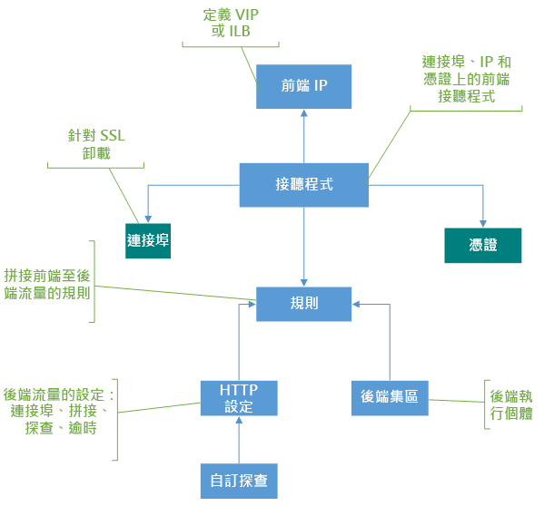

# 應用程式閘道元件

 應用程式閘道充當用戶端的單一連絡人。 它將傳入的應用程式流量分佈在多個後端池中，其中包括 Azure VM、虛擬機器規模集、Azure 應用服務以及本地/外部伺服器。 為了分發流量，應用程式閘道使用本文中描述的幾個元件。

## 前端 IP 位址

前端 IP 位址是與應用程式閘道關聯的 IP 位址。 您可以將應用程式閘道配置為具有公共 IP 位址、私人 IP 位址或兩者。 應用程式閘道支援一個公共或私人 IP 位址。 您的虛擬網路和公共 IP 位址必須與應用程式閘道位於同一位置。 創建後，前端 IP 位址將與攔截器關聯。

### 靜態與動態公共 IP 位址

Azure 應用程式閘道 V2 SKU 可以配置為同時支援靜態內部 IP 位址和靜態公共 IP 位址，也可以僅支援靜態公共 IP 位址。 不能將其配置為僅支援靜態內部 IP 位址。

V1 SKU 可以配置為支援靜態或動態內部 IP 位址和動態公共 IP 位址。 應用程式閘道的動態 IP 位址不會在正在運行的閘道上更改。 它只能在您停止或啟動閘道時更改。 它不會更改系統故障、更新、Azure 主機更新等。 

與應用程式閘道關聯的 DNS 名稱在閘道的生命週期內不會更改。 因此，您應該使用 CNAME 別名並將其指向應用程式閘道的 DNS 位址。

## 接聽程式

攔截器是檢查傳入連接請求的邏輯實體。 如果與請求關聯的協定、埠、主機名稱和 IP 位址與攔截器配置關聯的相同元素，則攔截器接受請求。

在使用應用程式閘道之前，必須至少添加一個攔截器。 可以有多個攔截器連接到應用程式閘道，並且它們可用於同一協定。

攔截器檢測到來自用戶端的傳入請求後，應用程式閘道將這些請求路由到規則中配置的後端池中的成員。

攔截器支援以下埠和協定。

### 連接埠

埠是攔截器偵聽用戶端請求的位置。 您可以為 v1 SKU 配置 1 到 65502 的埠，為 v2 SKU 配置 1 到 65199 的埠。

### 通訊協定

應用程式閘道支援四個協定：HTTP、HTTPS、HTTP/2 和 WebSocket：
>[!NOTE]
>HTTP/2 通訊協定支援僅適用於連線到應用程式閘道接聽程式的用戶端。 與後端伺服器池的通信始終通過 HTTP/1.1。 預設已停用 HTTP/2 支援。 您可以選擇啟用它。

- 在攔截器配置中的 HTTP 協定和 HTTPS 協定之間指定。
- 對[WebSocket 和 HTTP/2 協定](features.md#websocket-and-http2-traffic)的支援是本機提供的，預設情況下啟用[WebSocket 支援](application-gateway-websocket.md)。 使用者無法進行設定來選擇要啟用或停用 WebSocket 支援。 將 WebSocket 與 HTTP 和 HTTPS 攔截器同時使用。

使用 HTTPS 攔截器進行 TLS 終止。 HTTPS 攔截器將加密和解密工作卸載到應用程式閘道，因此 Web 服務器不會因開銷而負擔。

### 自訂錯誤頁面

應用程式閘道允許您創建自訂錯誤頁，而不是顯示預設錯誤頁。 您可以使用自訂錯誤頁面來搭配您自己的商標和版面配置。 當請求無法訪問後端時，應用程式閘道將顯示自訂錯誤頁。

有關詳細資訊，請參閱[應用程式閘道的自訂錯誤頁](custom-error.md)。

### 攔截器類型

有兩種類型的攔截器：

- **基本**。 這種類型的攔截器偵聽單個域網站，其中具有到應用程式閘道 IP 位址的單個 DNS 映射。 當您在應用程式閘道後面託管單個網站時，需要此攔截器配置。

- **多網站**。 當您在同一應用程式閘道實例上配置多個 Web 應用程式時，需要此攔截器配置。 它允許您通過將多達 100 個網站添加到一個應用程式閘道來為部署配置更高效的拓撲。 每個網站都可以導向到自己的後端集區。 例如，三個子域（abc.contoso.com、xyz.contoso.com 和pqr.contoso.com）指向應用程式閘道的 IP 位址。 您將創建三個多網站攔截器，並為相應的埠和協定設置配置每個攔截器。

    有關詳細資訊，請參閱[多網站託管](application-gateway-web-app-overview.md)。

創建攔截器後，將其與請求路由規則相關聯。 此規則確定如何在攔截器上收到的請求路由到後端。

應用程式閘道按[顯示的順序](configuration-overview.md#order-of-processing-listeners)處理攔截器。

## 請求路由規則

請求路由規則是應用程式閘道的關鍵元件，因為它決定了如何在攔截器上路由流量。 該規則綁定攔截器、後端伺服器池和後端 HTTP 設置。

當攔截器接受請求時，請求路由規則會將請求轉發到後端，或將其重定向到其他位置。 如果請求轉發到後端，則請求路由規則將定義要將其轉發到的後端伺服器池。 請求路由規則還確定是否重寫請求中的標頭。 一個攔截器可以附加到一個規則。

有兩種類型的請求路由規則：

- **基本**。 使用關聯的 HTTP 設置將關聯攔截器上的所有請求（例如，blog.contoso.com/*）轉發到關聯的後端池。

- **基於路徑**。 此路由規則允許您根據請求中的 URL 將關聯攔截器上的請求路由到特定的後端池。 如果請求中的 URL 路徑與基於路徑的規則中的路徑模式匹配，則規則將路由該請求。 它僅將路徑模式應用於 URL 路徑，而不是其查詢參數。 如果攔截器請求上的 URL 路徑與任何基於路徑的規則不匹配，它將請求路由到預設後端池和 HTTP 設置。

有關詳細資訊，請參閱基於[URL 的路由](url-route-overview.md)。

### 重新支援

請求路由規則還允許您重定向應用程式閘道上的流量。 這是一個通用重定向機制，因此您可以使用規則重定向到和從您定義的任何埠重定向。

您可以選擇重定向目標為另一個攔截器（這有助於將自動 HTTP 定向為 HTTPS 重定向）或外部網站。 您還可以選擇重定向為臨時或永久，或者將 URI 路徑和查詢字串追加到重定向 URL。

有關詳細資訊，請參閱[應用程式閘道上的重定向流量](redirect-overview.md)。

### 重新撰寫 HTTP 標頭

通過使用請求路由規則，您可以添加、刪除或更新 HTTP（S） 請求和回應標頭，因為請求和回應資料包通過應用程式閘道在用戶端和後端池之間移動。

標頭可以設置為靜態值或其他標頭和伺服器變數。 這有助於處理重要的用例，例如提取用戶端 IP 位址、刪除有關後端的敏感資訊、增加更多安全性等。

有關詳細資訊，請參閱[在應用程式閘道上重寫 HTTP 標頭](rewrite-http-headers.md)。

## HTTP 設定

應用程式閘道使用此元件中詳述的埠號、協定和其他設置將流量路由到後端伺服器（在包含 HTTP 設置的請求路由規則中指定）。

HTTP 設置中使用的埠和協定確定應用程式閘道和後端伺服器之間的流量是加密（提供端到端 TLS）還是未加密。

此元件還用於：

- 使用[基於 Cookie 的會話相關性](features.md#session-affinity)，確定使用者會話是否保留在同一伺服器上。

- 使用[連接排空](features.md#connection-draining)，優雅地刪除後端池成員。

- 關聯自訂探測以監視後端運行狀況、佈建要求超時間隔、覆蓋請求中的主機名稱和路徑，並提供一鍵式輕鬆以指定應用服務後端的設置。

## 後端池

後端池將請求路由到後端伺服器，這些伺服器為請求提供服務。 後端池可以包含：

- NIC
- 虛擬機器擴展集
- 公用 IP 位址
- 內部 IP 位址
- FQDN
- 多租戶後端（如應用服務）

應用程式閘道後端池成員未綁定到可用性集。 應用程式閘道可以與其所位於的虛擬網路外部的實例進行通信。 因此，只要存在 IP 連接，後端池的成員就可以跨群集、跨資料中心或 Azure 外部。

如果使用內部 IP 作為後端池成員，則必須使用[虛擬網路對等互連](../virtual-network/virtual-network-peering-overview.md)或 VPN[閘道](../vpn-gateway/vpn-gateway-about-vpngateways.md)。 支援虛擬網路對等互連，有利於其他虛擬網路中的負載平衡流量。

如果允許流量，應用程式閘道還可以在 Azure ExpressRoute 或 VPN 隧道連接本機伺服器時與它們進行通信。

可以為不同類型的請求創建不同的後端池。 例如，為常規請求創建一個後端池，然後為應用程式微服務的請求創建另一個後端池。

## 健康狀態探查

預設情況下，應用程式閘道監視其後端池中所有資源的運行狀況，並自動刪除不正常的資源。 然後，它會監視不正常的實例，並在它們可用時將它們添加回到健康的後端池，並回應運行狀況探測。

除了使用預設的健全狀況探查監視，您也可以自訂健全狀況探查，以符合應用程式的需求。 自訂探測器允許更精細地控制運行狀況監視。 使用自訂探測時，可以配置探測間隔、要測試的 URL 和路徑，以及後端池實例標記為不正常之前要接受的失敗回應數。 我們建議您配置自訂探測器以監視每個後端池的運行狀況。

有關詳細資訊，請參閱[監視應用程式閘道的運行狀況](../application-gateway/application-gateway-probe-overview.md)。

## 後續步驟

建立應用程式閘道：

* [在 Azure 門戶中](quick-create-portal.md)
* [使用 Azure PowerShell](quick-create-powershell.md)
* [通過使用 Azure CLI](quick-create-cli.md)
