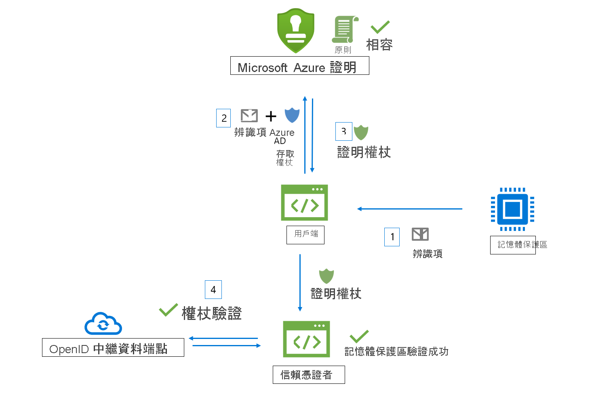

# 工作流程

Microsoft Azure 證明會從記憶體保護區接收辨識項，並針對 Azure 安全性基準和可設定的原則評估辨識項。 成功驗證時，Azure 證明會產生證明權杖，以確認記憶體保護區的可信度。

下列動作項目涉及 Azure 證明工作流程：

- **信賴憑證者**：此元件依賴 Azure 證明來驗證記憶體保護區有效性。 
- **用戶端**：此元件會從記憶體保護區收集資訊，並將要求傳送至 Azure 證明。 
- **Azure 證明**：此元件可接受來自用戶端的記憶體保護區辨識項、進行驗證，並將證明權杖傳回給用戶端

## Intel® Software Guard Extensions (SGX) 記憶體保護區驗證流程

以下是典型 SGX 記憶體保護區證明工作流程中的一般步驟 (使用 Azure 證明)：

1. 用戶端會從記憶體保護區收集辨識項。 辨識項是記憶體保護區環境和在記憶體保護區內執行之用戶端程式庫的相關資訊。
1. 用戶端具有參考 Azure 證明執行個體的 URI。 用戶端會將辨識項傳送至 Azure 證明。 提交給提供者的確切資訊取決於記憶體保護區類型。
1. Azure 證明會驗證已提交的資訊，並針對已設定的原則進行評估。 如果驗證成功，Azure 證明會發出證明權杖並將其傳回給用戶端。 如果此步驟失敗，Azure 證明會向用戶端回報錯誤。 
1. 用戶端會將證明權杖傳送給信賴憑證者。 信賴憑證者會呼叫 Azure 證明的公開金鑰中繼資料端點來擷取簽署憑證。 接著，信賴憑證者會驗證證明權杖的簽章，並確保記憶體保護區的可信度。 

> [!Note]
> 當您在 [2018-09-01-preview](https://github.com/Azure/azure-rest-api-specs/tree/master/specification/attestation/data-plane/Microsoft.Attestation/stable/2018-09-01-preview) API 版本中傳送證明要求時，用戶端必須將辨識項連同 Azure AD 存取權杖一起傳送至 Azure 證明。

## 信賴平臺模組 (TPM) 記憶體保護區驗證工作流程

以下是使用 Azure 證明)  (一般 TPM 記憶體保護區證明工作流程中的一般步驟：

1.  在裝置/平臺開機上，不同的開機載入器和開機服務會測量由 TPM 支援的事件，並安全地儲存 (TCG 記錄) 。
2.  用戶端會從裝置和 TPM 報價收集 TCG 記錄，以證明證明。
3.  用戶端具有參考 Azure 證明執行個體的 URI。 用戶端會將辨識項傳送至 Azure 證明。 提交給提供者的確切資訊視平臺而定。
4.  Azure 證明會驗證已提交的資訊，並針對已設定的原則進行評估。 如果驗證成功，Azure 證明會發出證明權杖並將其傳回給用戶端。 如果此步驟失敗，Azure 證明會向用戶端回報錯誤。 用戶端與證明服務之間的通訊是由 Azure 證明 TPM 通訊協定所決定。
5.  用戶端接著會將證明權杖傳送至信賴憑證者。 信賴憑證者會呼叫 Azure 證明的公開金鑰中繼資料端點來擷取簽署憑證。 信賴憑證者接著會驗證證明權杖的簽章，並確保平臺可信賴。

## 後續步驟
- [如何撰寫和簽署證明原則](author-sign-policy.md)
- [使用 PowerShell 設定 Azure 證明](quickstart-powershell.md)
