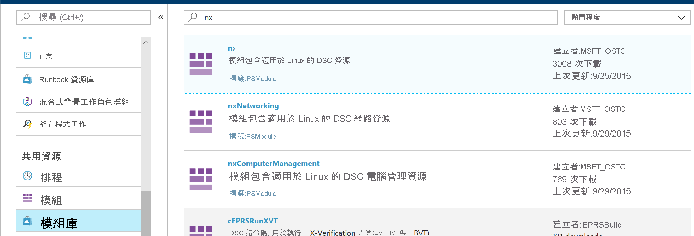

# <a name="configure-a-vm-with-desired-state-configuration"></a>使用 Desired State Configuration 設定 VM

啟用 Azure 自動化狀態設定，便可使用 Desired State Configuration (DSC) 來管理和監視您 Windows 和 Linux 伺服器的設定。 DSC 可以識別或自動更正自所需設定漂移的設定。 本快速入門逐步說明如何使用 Azure 自動化狀態設定來啟用 Linux VM 及部署 LAMP 堆疊。

## <a name="prerequisites"></a>Prerequisites

若要完成本快速入門，您需要：

* Azure 訂用帳戶。 如果您沒有 Azure 訂用帳戶，請[建立免費帳戶](https://azure.microsoft.com/free/)。
* Azure 自動化帳戶。 如需建立 Azure 自動化執行身分帳戶的指示，請參閱 [Azure 執行身分帳戶](automation-sec-configure-azure-runas-account.md)。
* 執行 Red Hat Enterprise Linux、CentOS 或 Oracle Linux 的 Azure Resource Manager VM (非傳統)。 如需建立 VM 的指示，請參閱 [在 Azure 入口網站中建立第一個 Linux 虛擬機器](../virtual-machines/linux/quick-create-portal.md)

## <a name="sign-in-to-azure"></a>登入 Azure
在 https://portal.azure.com 登入 Azure。

## <a name="enable-a-virtual-machine"></a>啟用虛擬機器

有許多不同的方法可為電腦啟用狀態設定功能。 本快速入門說明如何使用自動化帳戶為 VM 啟用此功能。 您可閱讀[讓電腦能夠由 Azure 自動化狀態設定管理](https://docs.microsoft.com/azure/automation/automation-dsc-onboarding)，以深入了解為電腦啟用狀態設定的不同方法。

1. 在 Azure 入口網站的左側窗格中，選取 [自動化帳戶]。 如果未顯示在左窗格中，請按一下 [所有服務]，然後在產生的檢視中搜尋。
1. 在清單中，選取自動化帳戶。
1. 在自動化帳戶的左側窗格中，選取 [狀態組態 (DSC)]。
2. 按一下 [新增] 以開啟 [VM 選取] 頁面。
3. 尋找要啟用 DSC 的虛擬機器。 若要尋找特定的虛擬機器，您可以使用搜尋欄位和篩選選項。
4. 按一下虛擬機器，然後按一下 [連線]。
5. 選取適用於虛擬機器的 DSC 設定。 如果您已經備妥設定，可以將其指定為 `Node Configuration Name`。 您可以設定[設定模式](https://docs.microsoft.com/powershell/scripting/dsc/managing-nodes/metaConfig)來控制電腦的設定行為。
6. 按一下 [確定]。 當 DSC 擴充功能部署至虛擬機器時，狀態會顯示為 `Connecting`。


## <a name="import-modules"></a>匯入模組

模組包含 DSC 資源，當中有許多可以在 [PowerShell 資源庫](https://www.powershellgallery.com)中找到。 您設定中所使用的任何資源在編譯之前，都必須匯入自動化帳戶中。 在本教學課程中，需要名為 **nx** 的模組。

1. 在自動化帳戶的左窗格中，選取 [共用資源] 下的 [模組資源庫]。
1. 輸入要匯入的模組的部分名稱開始搜尋：`nx`。
1. 按一下要匯入的模組。
1. 按一下 [匯入] 。



## <a name="import-the-configuration"></a>匯入設定

本快速入門所使用的 DSC 設定會設定電腦上的 Apache HTTP Server、MySQL 和 PHP。 請參閱 [DSC 設定](https://docs.microsoft.com/powershell/scripting/dsc/configurations/configurations)。

在文字編輯器中輸入下列項目，並將其本機儲存為 **AMPServer.ps1**。

```powershell-interactive
configuration LAMPServer {
   Import-DSCResource -module "nx"

   Node localhost {

        $requiredPackages = @("httpd","mod_ssl","php","php-mysql","mariadb","mariadb-server")
        $enabledServices = @("httpd","mariadb")

        #Ensure packages are installed
        ForEach ($package in $requiredPackages){
            nxPackage $Package{
                Ensure = "Present"
                Name = $Package
                PackageManager = "yum"
            }
        }

        #Ensure daemons are enabled
        ForEach ($service in $enabledServices){
            nxService $service{
                Enabled = $true
                Name = $service
                Controller = "SystemD"
                State = "running"
            }
        }
   }
}
```

若要匯入設定：

1. 在自動化帳戶的左側窗格中選取 [狀態組態 (DSC)]，然後按一下 [組態] 索引標籤。
2. 按一下 [+ 新增]。
3. 選取您在先前步驟中儲存的設定檔。
4. 按一下 [確定]。

## <a name="compile-a-configuration"></a>編譯設定

您必須先將 DSC 設定編譯成節點設定 (MOF 文件)，然後才能將其指派給節點。 編譯程式會驗證設定，並允許輸入參數值。 若要深入了解如何編譯設定，請參閱[在狀態設定中編譯設定](automation-dsc-compile.md)。

1. 在自動化帳戶的左側窗格中選取 [狀態組態 (DSC)]，然後按一下 [組態] 索引標籤。
1. 選取設定 `LAMPServer`。
1. 從功能表選項中，選取 [編譯]，然後按一下 [是]。
1. 在 [設定] 檢視中，您會看到新的編譯作業排入佇列。 當作業順利完成時，即準備好進行下一個步驟。 如果發生任何失敗，您可以按一下該編譯作業來取得詳細資料。

## <a name="assign-a-node-configuration"></a>指派節點設定

您可以將已編譯的節點設定指派給 DSC 節點。 指派會將設定套用至電腦，並監視 (或自動更正) 該設定中的任何漂移。

1. 在自動化帳戶的左側窗格中，選取 [狀態設定 (DSC)]，然後按一下 [節點] 索引標籤。
1. 選取要指派設定的目標節點。
1. 按一下 [指派節點設定]
1. 選取節點設定 `LAMPServer.localhost`，然後按一下 [確定]。 狀態設定現在會將已編譯的設定指派給節點，而該節點狀態會變更為 `Pending`。 下一次定期檢查時，節點會擷取設定、套用設定、然後報告狀態。 節點可能需要 30 分鐘的時間才能擷取設定，根據節點的設定而定。 
1. 若要強制立即檢查，您可以在 Linux 虛擬機器上本機執行下列命令：`sudo /opt/microsoft/dsc/Scripts/PerformRequiredConfigurationChecks.py`


## <a name="view-node-status"></a>檢視節點狀態

您可以在自動化帳戶中，查看狀態設定管理的所有節點的狀態。 選擇 [狀態設定 (DSC)]，然後按一下 [節點] 索引標籤，即可顯示資訊。您可以依狀態、節點設定或名稱搜尋來篩選顯示。


## <a name="next-steps"></a>後續步驟

在本快速入門中，您已為 Linux VM 啟用狀態設定、建立 LAMP 堆疊的組態，以及將組態部署至 VM。 若要了解如何使用 Azure 自動化狀態設定來啟用持續部署，請繼續閱讀以下文章：

> [!div class="nextstepaction"]
> [使用 Chocolatey 設定持續部署](./automation-dsc-cd-chocolatey.md)