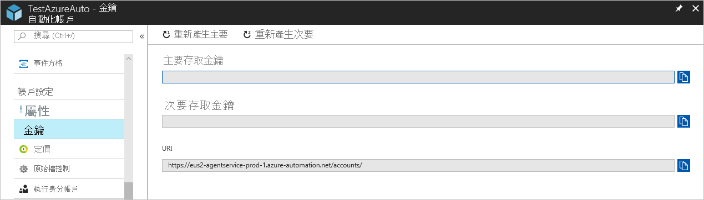

# <a name="deploy-a-windows-hybrid-runbook-worker"></a>部署 Windows 混合式 Runbook 背景工作角色

您可以使用 Azure 自動化的混合式 Runbook 背景工作角色功能，直接在裝載角色的電腦上以及針對環境中的資源執行 Runbook，從而管理這些本機資源。 Azure 自動化存儲和管理 Runbook，然後將它們傳遞到一個或多個指定的電腦。 本文介紹如何在 Windows 電腦上部署混合 Runbook 輔助角色。

在您成功部署 Runbook 背景工作角色後，請檢閱[在混合式 Runbook 背景工作角色上執行 Runbook](automation-hrw-run-runbooks.md)，以了解如何設定 Runbook 以將內部部署資料中心或其他雲端環境中的程序自動化。

[!INCLUDE [azure-monitor-log-analytics-rebrand](../../includes/azure-monitor-log-analytics-rebrand.md)]

>[!NOTE]
>本文已更新為使用新的 Azure PowerShell Az 模組。 AzureRM 模組在至少 2020 年 12 月之前都還會持續收到錯誤 (Bug) 修正，因此您仍然可以持續使用。 若要深入了解新的 Az 模組和 AzureRM 的相容性，請參閱[新的 Azure PowerShell Az 模組簡介](https://docs.microsoft.com/powershell/azure/new-azureps-module-az?view=azps-3.5.0)。 有關混合 Runbook 輔助角色上的 Az 模組安裝說明，請參閱[安裝 Azure PowerShell 模組](https://docs.microsoft.com/powershell/azure/install-az-ps?view=azps-3.5.0)。 對於自動化帳戶，可以使用["如何更新 Azure 自動化 中的 Azure PowerShell"模組](automation-update-azure-modules.md)將模組更新到最新版本。

## <a name="windows-hybrid-runbook-worker-installation-and-configuration"></a>Windows 混合 Runbook 協助工具安裝和配置

要安裝和配置 Windows 混合 Runbook 工作執行緒，可以使用以下方法之一。

* 對於 Azure VM，請使用 Windows 的[虛擬機器副檔名](../virtual-machines/extensions/oms-windows.md)安裝 Windows 的日誌分析代理。 該擴展在 Azure 虛擬機器上安裝日誌分析代理，並使用 Azure 資源管理器範本或 PowerShell 將虛擬機器註冊到現有的日誌分析工作區中。 安裝代理後，可以將 VM 添加到自動化帳戶中的混合 Runbook 輔助角色組。 請參閱["手動部署](#manual-deployment)"部分中的步驟 3 和 4。

* 使用自動化運行簿完全自動執行配置 Windows 電腦的過程。 這是資料中心或其他雲環境中的電腦推薦的方法。

* 按照分步過程在非 Azure VM 上手動安裝和配置混合 Runbook 輔助角色。

> [!NOTE]
> 要使用所需的狀態配置 （DSC） 管理支援混合 Runbook 工作角色的伺服器配置，必須將伺服器添加為 DSC 節點。

### <a name="minimum-requirements-for-windows-hybrid-runbook-worker"></a>Windows 混合 Runbook 工作執行緒的最低要求

「Windows 混合式 Runbook 背景工作角色」的最低需求如下：

* Windows Server 2012 或更新版本
* Windows PowerShell 5.1 或更高版本 （[下載 WMF 5.1](https://www.microsoft.com/download/details.aspx?id=54616)）
* .NET Framework 4.6.2 或更新版本
* 雙核心
* 4 GB 的 RAM
* 連接埠 443 (輸出)

### <a name="network-configuration"></a>網路組態

若要了解「混合式 Runbook 背景工作角色」的其他網路需求，請參閱[設定網路](automation-hybrid-runbook-worker.md#network-planning)。

### <a name="server-onboarding-for-management-with-automation-dsc"></a>使用自動化 DSC 進行伺服器載入管理

有關使用 DSC 進行管理的載入伺服器的資訊，請參閱 Azure[自動化 DSC 管理的載入電腦](automation-dsc-onboarding.md)。

啟用[更新管理解決方案](../operations-management-suite/oms-solution-update-management.md)會自動將連接到日誌分析工作區的任何 Windows 電腦配置為混合 Runbook 輔助角色，以支援解決方案中包含的 Runbook。 但是，此工作人員未註冊到自動化帳戶中已定義的任何混合 Runbook 工作組。

### <a name="addition-of-the-computer-to-a-hybrid-runbook-worker-group"></a>將電腦添加到混合 Runbook 工作組

您可以將輔助電腦添加到自動化帳戶中的混合 Runbook 工作群體。 請注意，只要對解決方案和混合 Runbook 輔助角色使用相同的帳戶，就必須支援自動化 Runbook。 此功能已新增至 Hybrid Runbook Worker 7.2.12024.0 版。

## <a name="automated-deployment"></a>自動化部署

在目的電腦上，執行以下步驟以自動安裝和配置 Windows 混合輔助角色。

### <a name="step-1---download-the-powershell-script"></a>第 1 步 - 下載 PowerShell 腳本

從[PowerShell 庫](https://www.powershellgallery.com/packages/New-OnPremiseHybridWorker)下載 **"全新內部混合工作者.ps1"** 腳本。 下載應直接從運行混合 Runbook 工作角色的電腦或環境中的另一台電腦下載。 下載腳本後，將其複製到工作人員。 **New-Onpremise 混合工作執行緒.ps1**腳本使用執行期間描述的參數。

| 參數 | 狀態 | 描述 |
| --------- | ------ | ----------- |
| `AAResourceGroupName` | 強制性 | 與您的自動化帳戶相關聯的資源群組名稱。 |
| `AutomationAccountName` | 強制性 | 自動化帳戶的名稱。
| `Credential` | 選用 | 登錄到 Azure 環境時要使用的憑據。 |
| `HybridGroupName` | 強制性 | 您針對支援此案例的 Runbook，指定作為目標的「混合式 Runbook 背景工作角色」群組名稱。 |
| `OMSResourceGroupName` | 選用 | Log Analytics 工作區的資源群組名稱。 如果未指定此資源組，則使用 的值`AAResourceGroupName`。 |
| `SubscriptionID` | 強制性 | 與自動化帳戶關聯的 Azure 訂閱的識別碼。 |
| `TenantID` | 選用 | 與自動化帳戶關聯的租戶組織的識別碼。 |
| `WorkspaceName` | 選用 | Log Analytics 工作區名稱。 如果您沒有 Log Analytics 工作區，此指令碼就會建立並設定一個 Log Analytics 工作區。 |

> [!NOTE]
> 啟用解決方案時，Azure 自動化僅支援某些區域連結日誌分析工作區和自動化帳戶。 有關支援的映射對的清單，請參閱[自動化帳戶的區域映射和日誌分析工作區](how-to/region-mappings.md)。

### <a name="step-2---open-windows-powershell-command-line-shell"></a>步驟 2 - 打開 Windows PowerShell 命令列外殼

在"管理員"模式下從 **"開始"** 螢幕打開**Windows PowerShell。**

### <a name="step-3---run-the-powershell-script"></a>步驟 3 - 運行 PowerShell 腳本

在 PowerShell 命令列 shell 中，流覽到包含已下載的腳本的資料夾。 `AutomationAccountName`更改參數`AAResourceGroupName`的值 、 、 `OMSResourceGroupName` `HybridGroupName`、 `SubscriptionID`、 和`WorkspaceName`。 然後執行指令碼。

執行指令碼之後，系統會提示您向 Azure 進行驗證。 您「必須」以「訂用帳戶管理員」角色成員和訂用帳戶共同管理員的帳戶登入。

```powershell-interactive
.\New-OnPremiseHybridWorker.ps1 -AutomationAccountName <NameofAutomationAccount> -AAResourceGroupName <NameofResourceGroup>`
-OMSResourceGroupName <NameofOResourceGroup> -HybridGroupName <NameofHRWGroup> `
-SubscriptionID <AzureSubscriptionId> -WorkspaceName <NameOfLogAnalyticsWorkspace>
```

### <a name="step-4---install-nuget"></a>第 4 步 - 安裝 NuGet

系統將提示您同意安裝 NuGet，並使用 Azure 憑據進行身份驗證。 如果您沒有最新的 NuGet 版本，則可以從[可用的 NuGet 分發版本](https://www.nuget.org/downloads)獲取它。

### <a name="step-5---verify-the-deployment"></a>步驟 5 - 驗證部署

指令碼執行完成之後，[混合式背景工作角色群組] 頁面會顯示新的群組和成員數目。 如果這是現有群組，成員數目就會遞增。 您可以從"混合輔助角色組"頁上的清單中選擇該組，然後選擇 **"混合輔助角色"** 磁貼。 在"混合工作"頁上，您可以看到列出的組的每個成員。

## <a name="manual-deployment"></a>手動部署

在目的電腦上，為自動化環境執行前兩個步驟一次。 然後，對每台工作電腦執行其餘步驟。

### <a name="step-1---create-a-log-analytics-workspace"></a>第 1 步 - 創建日誌分析工作區

如果尚未具有日誌分析工作區，請先在創建工作區之前查看[Azure 監視器日誌設計指南](../azure-monitor/platform/design-logs-deployment.md)。

### <a name="step-2---add-the-automation-solution-to-the-log-analytics-workspace"></a>步驟 2 - 將自動化解決方案添加到日誌分析工作區

自動化解決方案為 Azure 自動化添加了功能，包括對混合 Runbook 輔助角色的支援。 將解決方案添加到日誌分析工作區時，它會自動將安裝的工作元件推送到代理電腦，如下一步所述。

要將自動化解決方案添加到工作區，請運行以下 PowerShell Cmdlet。

```powershell-interactive
Set-AzOperationalInsightsIntelligencePack -ResourceGroupName <logAnalyticsResourceGroup> -WorkspaceName <LogAnalyticsWorkspaceName> -IntelligencePackName "AzureAutomation" -Enabled $true -DefaultProfile <IAzureContextContainer>
```

### <a name="step-3---install-the-log-analytics-agent-for-windows"></a>步驟 3 - 安裝 Windows 的日誌分析代理

Windows 的日誌分析代理將電腦連接到 Azure 監視器日誌分析工作區。 當您在電腦上安裝代理並將其連接到工作區時，它會自動下載混合 Runbook 輔助角色所需的元件。

要在電腦上安裝代理，請按照[將 Windows 電腦連接到 Azure 監視器日誌](../log-analytics/log-analytics-windows-agent.md)的說明進行操作。 您可以對多部電腦重複此程序，將多個背景工作角色加入至您的環境。

當代理在幾分鐘後成功連接到日誌分析工作區時，可以運行以下查詢以驗證是否向工作區發送活動訊號資料。

```kusto
Heartbeat 
| where Category == "Direct Agent" 
| where TimeGenerated > ago(30m)
```

在搜尋結果中，應看到電腦的活動訊號記錄，指示電腦已連接並報告給服務。 預設情況下，每個代理都會將活動訊號記錄轉發到其分配的工作區。 

使用以下步驟完成代理安裝和設置。

1. 使解決方案能夠加入代理電腦。 請參閱[工作區中的板載電腦](https://docs.microsoft.com/azure/automation/automation-onboard-solutions-from-automation-account#onboard-machines-in-the-workspace)。
2. 驗證代理是否正確下載了自動化解決方案。 它應該有一個資料夾，稱為**Azure 自動化檔**在**C：\程式檔\微軟監視代理\代理**。 
3. 要確認混合 Runbook 輔助角色的版本，請流覽到**C：*程式檔\Microsoft 監視代理\代理\Azure自動化**並記下**版本**子資料夾。

### <a name="step-4---install-the-runbook-environment-and-connect-to-azure-automation"></a>步驟 4 - 安裝 Runbook 環境並連接到 Azure 自動化

當您將代理配置為向日志分析工作區報告時，自動化解決方案將向下推送`HybridRegistration`包含 Cmdlet 的`Add-HybridRunbookWorker`PowerShell 模組。 使用此 Cmdlet 在電腦上安裝 Runbook 環境並將其註冊到 Azure 自動化。

以系統管理員模式開啟 PowerShell 工作階段，並執行下列命令來匯入模組。

```powershell-interactive
cd "C:\Program Files\Microsoft Monitoring Agent\Agent\AzureAutomation\<version>\HybridRegistration"
Import-Module .\HybridRegistration.psd1
```

現在使用以下`Add-HybridRunbookWorker`語法運行 Cmdlet。

```powershell-interactive
Add-HybridRunbookWorker –GroupName <String> -EndPoint <Url> -Token <String>
```

您可以從 Azure 入口網站的 [管理金鑰] 頁面取得這個 Cmdlet 所需的資訊。 通過在自動化帳戶中的"設置"頁上選擇 **"按鍵**"打開此頁面。



* 對於參數`GroupName`，請使用混合 Runbook 工作組的名稱。 如果「自動化」帳戶中已經有這個群組，系統就會將目前的電腦新增至其中。 如果此群組不存在，則會新增此群組。
* 對於參數`EndPoint`，請使用"管理金鑰"頁上的**URL**條目。
* 對於參數`Token`，請使用"管理金鑰"頁上的 **"主訪問金鑰"** 條目。
* 如果需要，請設置參數`Verbose`以接收有關安裝的詳細資訊。

### <a name="step-5----install-powershell-modules"></a>第 5 步 - 安裝 PowerShell 模組

Runbook 可以使用 Azure 自動化環境中安裝的模組中定義的任何活動和 Cmdlet。 由於這些模組不會自動部署到本地電腦，因此必須手動安裝它們。 Azure 模組除外。 預設情況下，此模組安裝並提供有關 Azure 自動化所有 Azure 服務和活動的 Cmdlet 的訪問。

由於混合 Runbook 工作功能的主要目的是管理本地資源，因此您很可能需要安裝支援這些資源的`PowerShellGet`模組，尤其是模組。 有關安裝 Windows PowerShell 模組的資訊，請參閱[Windows PowerShell](https://docs.microsoft.com/powershell/scripting/developer/windows-powershell)。

安裝的模組必須位於`PSModulePath`環境變數引用的位置，以便混合輔助角色可以自動導入它們。 有關詳細資訊，請參閱在[PSModulePath 中安裝模組](https://docs.microsoft.com/powershell/scripting/developer/module/installing-a-powershell-module?view=powershell-7)。

## <a name="next-steps"></a>後續步驟

* 若要了解如何設定您的 Runbook，將您在內部部署資料中心或其他雲端環境中的程序自動化，請參閱[在混合式 Runbook 背景工作角色上執行 Runbook](automation-hrw-run-runbooks.md)。
* 有關刪除混合 Runbook 輔助角色的說明，請參閱[刪除 Azure 自動化混合 Runbook 活頁簿](automation-hybrid-runbook-worker.md#remove-a-hybrid-runbook-worker)。
* 要瞭解如何對混合 Runbook 輔助角色進行故障排除，請參閱[故障排除 Windows 混合 Runbook 輔助角色](troubleshoot/hybrid-runbook-worker.md#windows)。
* 有關解決更新管理問題的其他步驟，請參閱[更新管理：故障排除](troubleshoot/update-management.md)。
