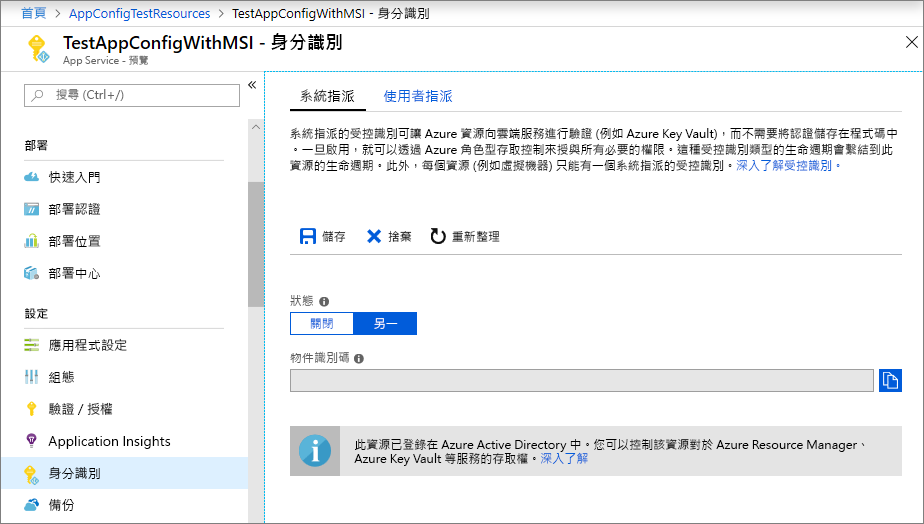
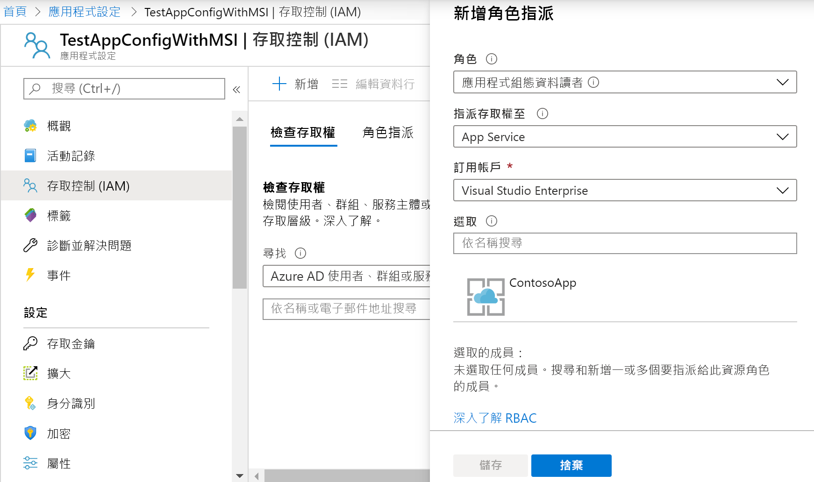

# <a name="integrate-with-azure-managed-identities"></a>與 Azure 受控識別整合

Azure 活動目錄[託管標識](../active-directory/managed-identities-azure-resources/overview.md)簡化了雲應用程式的秘密管理。 使用託管標識，代碼可以使用為其運行的 Azure 服務創建的服務主體。 您會使用受控識別，而不是使用儲存在 Azure Key Vault 中的個別認證或本機連接字串。 

Azure 應用配置及其 .NET Core、.NET 框架和 JAVA Spring 用戶端庫已內置了託管標識支援。 儘管不需要使用它，但託管標識無需使用包含機密的訪問權杖。 您的代碼只能使用服務終結點訪問應用配置存儲。 您可以直接將此 URL 嵌入到代碼中，而無需公開任何機密。

本文演示如何利用託管標識訪問應用配置。 本文會以快速入門中介紹的 Web 應用程式作為基礎。 在繼續之前，首先[使用應用配置創建ASP.NET核心應用](./quickstart-aspnet-core-app.md)。

本文還演示如何將託管標識與應用配置的金鑰保存庫引用結合使用。 使用單個託管標識，您可以無縫地從金鑰保存庫訪問金鑰庫和來自應用配置的配置值。 如果要探索此功能，首先使用[ASP.NET核心金鑰保存庫引用](./use-key-vault-references-dotnet-core.md)。

您可以使用任何程式碼編輯器來進行本教學課程中的步驟。 Windows、macOS 及 Linux 平台上都有提供的 [Visual Studio Code](https://code.visualstudio.com/) 是一個絕佳的選項。

在本文中，您將學會如何：

> [!div class="checklist"]
> * 授與「應用程式組態」的受控識別存取權。
> * 設定讓應用程式在您連線到「應用程式組態」時使用受控識別。
> * 或者，將應用配置為在通過應用配置金鑰保存庫引用連接到金鑰保存庫時使用託管標識。

## <a name="prerequisites"></a>Prerequisites

若要完成本教學課程，您必須具備：

* [.NET 核心 SDK](https://www.microsoft.com/net/download/windows).
* [已設定 Azure Cloud Shell](https://docs.microsoft.com/azure/cloud-shell/quickstart)。

[!INCLUDE [quickstarts-free-trial-note](../../includes/quickstarts-free-trial-note.md)]

## <a name="add-a-managed-identity"></a>新增受控識別

要在門戶中設置託管標識，請先創建應用程式，然後啟用該功能。

1. 在[Azure 門戶](https://portal.azure.com)中創建應用服務實例，與通常一樣。 在入口網站中移至該應用程式。

1. 在左側窗格中，向下捲動到 [設定]**** 群組，然後選取 [身分識別]****。

1. 在 [系統指派]**** 索引標籤上，將 [狀態]**** 切換成 [開啟]****，然後選取 [儲存]****。

1. 當提示啟用系統分配的託管標識時，回答 **"是**"。

    

## <a name="grant-access-to-app-configuration"></a>授與應用程式設定的存取權

1. 在[Azure 門戶](https://portal.azure.com)中，選擇**所有資源**並選擇在快速入門中創建的應用配置存儲。

1. 選擇**存取控制 （IAM）。**

1. 在 [檢查存取權]**** 索引標籤上，選取 [新增角色指派]**** 卡片 UI 中的 [新增]****。

1. 在**角色**下，選擇**應用配置資料讀取器**。 在 [存取權指派對象為]**** 底下，選取 [系統指派的受控識別]**** 底下的 [App Service]****。

1. 在 [訂用帳戶]**** 底下，選取您的 Azure 訂用帳戶。 選取您應用程式的 App Service 資源。

1. 選取 [儲存]****。

    

1. 可選：如果您希望也授予對金鑰保存庫的存取權限，請按照[提供具有託管標識的金鑰保存庫身份驗證](https://docs.microsoft.com/azure/key-vault/managed-identity)中的說明進行操作。

## <a name="use-a-managed-identity"></a>建立受控識別

1. 添加對*Azure.標識*包的引用：

    ```cli
    dotnet add package Azure.Identity
    ```

1. 查找應用配置存儲的終結點。 此 URL 列在 Azure 門戶中存儲的 **"訪問金鑰**"選項卡上。

1. 開啟 *appsettings.json*，然後新增下列指令碼。 * \<將service_endpoint>*（包括括弧）替換為應用配置商店的 URL。 

    ```json
    "AppConfig": {
        "Endpoint": "<service_endpoint>"
    }
    ```

1. 打開*Program.cs*，並添加對`Azure.Identity`和`Microsoft.Azure.Services.AppAuthentication`命名空間的引用：

    ```csharp-interactive
    using Azure.Identity;
    ```

1. 如果只想訪問直接存儲在應用配置中的值，請通過替換 方法`CreateWebHostBuilder`更新`config.AddAzureAppConfiguration()`方法。

    > [!IMPORTANT]
    > `CreateHostBuilder` 會取代 .NET Core 3.0 中的 `CreateWebHostBuilder`。  根據您的環境選取正確的語法。

    ### <a name="net-core-2x"></a>[.NET Core 2.x](#tab/core2x)

    ```csharp
        public static IWebHostBuilder CreateWebHostBuilder(string[] args) =>
            WebHost.CreateDefaultBuilder(args)
                .ConfigureAppConfiguration((hostingContext, config) =>
                {
                    var settings = config.Build();
                    config.AddAzureAppConfiguration(options =>
                        options.Connect(new Uri(settings["AppConfig:Endpoint"]), new ManagedIdentityCredential()));
                })
                .UseStartup<Startup>();
    ```

    ### <a name="net-core-3x"></a>[.NET Core 3.x](#tab/core3x)

    ```csharp
        public static IHostBuilder CreateHostBuilder(string[] args) =>
            Host.CreateDefaultBuilder(args)
            .ConfigureWebHostDefaults(webBuilder =>
            webBuilder.ConfigureAppConfiguration((hostingContext, config) =>
            {
                var settings = config.Build();
                    config.AddAzureAppConfiguration(options =>
                        options.Connect(new Uri(settings["AppConfig:Endpoint"]), new ManagedIdentityCredential()));
                })
                .UseStartup<Startup>());
    ```
    ---

1. 要同時使用應用配置值和金鑰保存庫引用，請更新*Program.cs*如下所示。 此代碼使用 創建`KeyVaultClient`一個`AzureServiceTokenProvider`新代碼，並將此引用傳遞給 方法`UseAzureKeyVault`的調用。

    ### <a name="net-core-2x"></a>[.NET Core 2.x](#tab/core2x)

    ```csharp
            public static IWebHostBuilder CreateWebHostBuilder(string[] args) =>
                WebHost.CreateDefaultBuilder(args)
                    .ConfigureAppConfiguration((hostingContext, config) =>
                    {
                        var settings = config.Build();
                        var credentials = new ManagedIdentityCredential();

                        config.AddAzureAppConfiguration(options =>
                        {
                            options.Connect(new Uri(settings["AppConfig:Endpoint"]), credentials)
                                    .ConfigureKeyVault(kv =>
                                    {
                                        kv.SetCredential(credentials);
                                    });
                        });
                    })
                    .UseStartup<Startup>();
    ```

    ### <a name="net-core-3x"></a>[.NET Core 3.x](#tab/core3x)

    ```csharp
        public static IHostBuilder CreateHostBuilder(string[] args) =>
            Host.CreateDefaultBuilder(args)
            .ConfigureWebHostDefaults(webBuilder =>
            webBuilder.ConfigureAppConfiguration((hostingContext, config) =>
                    {
                        var settings = config.Build();
                        var credentials = new ManagedIdentityCredential();

                        config.AddAzureAppConfiguration(options =>
                        {
                            options.Connect(new Uri(settings["AppConfig:Endpoint"]), credentials)
                                    .ConfigureKeyVault(kv =>
                                    {
                                        kv.SetCredential(credentials);
                                    });
                        });
                    })
                    .UseStartup<Startup>());
    ```
    ---

    現在，您可以像訪問任何其他應用配置金鑰一樣訪問金鑰保存庫引用。 配置提供程式將使用`KeyVaultClient`配置為對金鑰保存庫進行身份驗證並檢索該值的 提供程式。

[!INCLUDE [Prepare repository](../../includes/app-service-deploy-prepare-repo.md)]

## <a name="deploy-from-local-git"></a>從本機 Git 進行部署

使用 Kudu 生成伺服器為應用啟用本地 Git 部署的最簡單方法是使用[Azure 雲外殼](https://shell.azure.com)。

### <a name="configure-a-deployment-user"></a>設定部署使用者

[!INCLUDE [Configure a deployment user](../../includes/configure-deployment-user-no-h.md)]

### <a name="enable-local-git-with-kudu"></a>使用 Kudu 啟用本機 Git
如果沒有應用的本地 git 存儲庫，則需要初始化一個存儲庫。 要初始化本地 git 存儲庫，請從應用的專案目錄中運行以下命令：

```cmd
git init
git add .
git commit -m "Initial version"
```

要使用 Kudu 生成伺服器為應用啟用本地 Git 部署[`az webapp deployment source config-local-git`](/cli/azure/webapp/deployment/source?view=azure-cli-latest#az-webapp-deployment-source-config-local-git)，請在雲外殼中運行。

```azurecli-interactive
az webapp deployment source config-local-git --name <app_name> --resource-group <group_name>
```

此命令為您提供了類似于以下輸出的內容：

```json
{
  "url": "https://<username>@<app_name>.scm.azurewebsites.net/<app_name>.git"
}
```

### <a name="deploy-your-project"></a>部署專案

在_本地終端視窗中_，將 Azure 遠端添加到本地 Git 存儲庫。 將_\<url>_ 替換為從[啟用本地 Git 獲得](#enable-local-git-with-kudu)的 Git 遙控器的 URL 與 Kudu 。

```bash
git remote add azure <url>
```

推送到 Azure 遠端，使用下列命令來部署您的應用程式。 當系統提示您輸入密碼時，請輸入您在[設定部署使用者](#configure-a-deployment-user)中建立的密碼。 請勿使用您用來登入 Azure 入口網站的密碼。

```bash
git push azure master
```

您可能會在輸出中看到執行階段特定的自動化，例如適用於 ASP.NET 的 MSBuild、適用於 Node.js 的 `npm install`，以及適用於 Python 的 `pip install`。

### <a name="browse-to-the-azure-web-app"></a>瀏覽至 Azure Web 應用程式

使用瀏覽器來瀏覽至您的 Web 應用程式，以確認內容已部署。

```bash
http://<app_name>.azurewebsites.net
```

## <a name="use-managed-identity-in-other-languages"></a>以其他語言使用受控識別

適用於 .NET Framework 和 Java Spring 的應用程式設定提供者也有內建的受控識別支援。 配置這些提供程式之一時，可以使用商店的 URL 終結點而不是其完整連接字串。 

例如，您可以更新在快速入門中創建的 .NET 框架主控台應用，以便在*App.config 檔中*指定以下設置：

```xml
    <configSections>
        <section name="configBuilders" type="System.Configuration.ConfigurationBuildersSection, System.Configuration, Version=4.0.0.0, Culture=neutral, PublicKeyToken=b03f5f7f11d50a3a" restartOnExternalChanges="false" requirePermission="false" />
    </configSections>

    <configBuilders>
        <builders>
            <add name="MyConfigStore" mode="Greedy" endpoint="${Endpoint}" type="Microsoft.Configuration.ConfigurationBuilders.AzureAppConfigurationBuilder, Microsoft.Configuration.ConfigurationBuilders.AzureAppConfiguration" />
            <add name="Environment" mode="Greedy" type="Microsoft.Configuration.ConfigurationBuilders.EnvironmentConfigBuilder, Microsoft.Configuration.ConfigurationBuilders.Environment" />
        </builders>
    </configBuilders>

    <appSettings configBuilders="Environment,MyConfigStore">
        <add key="AppName" value="Console App Demo" />
        <add key="Endpoint" value ="Set via an environment variable - for example, dev, test, staging, or production endpoint." />
    </appSettings>
```

## <a name="clean-up-resources"></a>清除資源

[!INCLUDE [azure-app-configuration-cleanup](../../includes/azure-app-configuration-cleanup.md)]

## <a name="next-steps"></a>後續步驟
在本教程中，您添加了 Azure 託管標識，以簡化對應用配置的訪問並改進應用的憑據管理。 若要深入了解「應用程式組態」的使用方式，請繼續進行 Azure CLI 範例。

> [!div class="nextstepaction"]
> [CLI 範例](./cli-samples.md)
