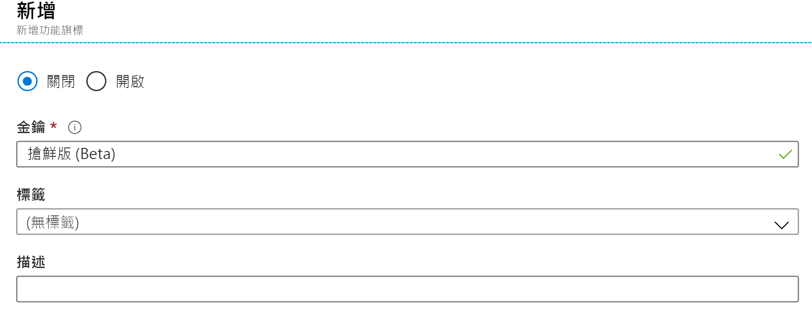
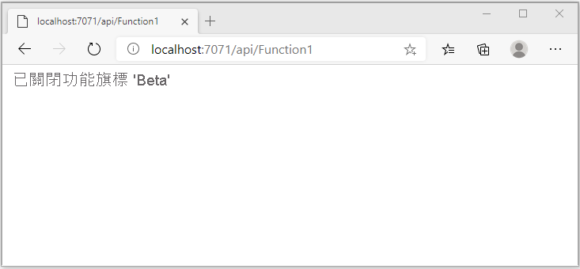
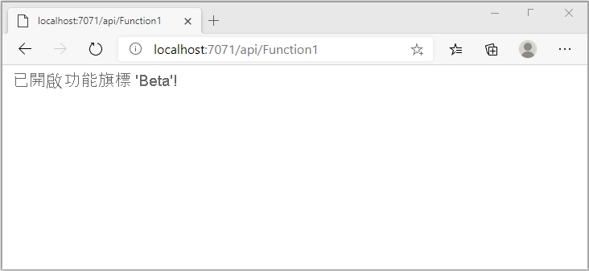

# <a name="quickstart-add-feature-flags-to-an-azure-functions-app"></a>快速入門：將功能旗標新增至 Azure Functions 應用程式

在本快速入門中，您會使用 Azure 應用程式組態，在 Azure Functions 應用程式中建立功能管理的實作。 您將使用應用程式組態服務來集中儲存所有功能旗標及控制其狀態。 

.NET 功能功能管理程式庫可透過功能旗標支援來擴充架構。 這些程式庫會建置在 .NET 組態系統之上。 透過其 .NET 組態提供者與應用程式組態密切整合。

## <a name="prerequisites"></a>必要條件

- Azure 訂用帳戶 - [建立免費帳戶](https://azure.microsoft.com/free/)
- 包含 **Azure 開發**工作負載的 [Visual Studio 2019](https://visualstudio.microsoft.com/vs)。
- [Azure Functions 工具](../azure-functions/functions-develop-vs.md#check-your-tools-version)

## <a name="create-an-app-configuration-store"></a>建立應用程式組態存放區

[!INCLUDE [azure-app-configuration-create](../../includes/azure-app-configuration-create.md)]

7. 選取 [功能管理員]   > [+新增]  ，以新增名為 `Beta` 的功能旗標。

    > [!div class="mx-imgBorder"]
    > 

    請暫且將 `label` 和 `Description` 保留為未定義。

8. 選取 [套用]  以儲存新的功能旗標。

## <a name="create-a-functions-app"></a>建立 Functions 應用程式

[!INCLUDE [Create a project using the Azure Functions template](../../includes/functions-vstools-create.md)]

## <a name="connect-to-an-app-configuration-store"></a>連線至應用程式組態存放區

1. 以滑鼠右鍵按一下專案，然後選取 [管理 NuGet 套件]  。 在 [瀏覽]  索引標籤上，搜尋下列 NuGet 套件並新增至您的專案。 查看 `Microsoft.Extensions.DependencyInjection`，確認您使用的是最新的穩定組建。 

    ```
    Microsoft.Extensions.DependencyInjection
    Microsoft.Extensions.Configuration
    Microsoft.FeatureManagement
    ```


1. 開啟 *Function1.cs*，並新增這些套件的命名空間。

    ```csharp
    using Microsoft.Extensions.Configuration;
    using Microsoft.FeatureManagement;
    using Microsoft.Extensions.DependencyInjection;
    ```

1. 新增下列 `Function1` 靜態建構函式，以啟動 Azure 應用程式組態提供者。 接著，新增兩個 `static` 成員：一個名為 `ServiceProvider` 的欄位用以建立 `ServiceProvider` 的單一執行個體，和一個在 `Function1` 下名為 `FeatureManager` 的屬性，用以建立 `IFeatureManager` 的單一執行個體。 然後，呼叫 `AddAzureAppConfiguration()` 以連線至 `Function1` 中的應用程式組態。 此程序會在應用程式啟動時載入設定。 稍後將會使用相同的組態執行個體進行所有 Functions 呼叫。 

    ```csharp
        // Implements IDisposable, cached for life time of function
        private static ServiceProvider ServiceProvider; 

        static Function1()
        {
            IConfigurationRoot configuration = new ConfigurationBuilder()
                .AddAzureAppConfiguration(options =>
                {
                    options.Connect(Environment.GetEnvironmentVariable("ConnectionString"))
                           .UseFeatureFlags();
                }).Build();

            var services = new ServiceCollection();                                                                             
            services.AddSingleton<IConfiguration>(configuration).AddFeatureManagement();

            ServiceProvider = services.BuildServiceProvider(); 
        }

        private static IFeatureManager FeatureManager => ServiceProvider.GetRequiredService<IFeatureManager>();
    ```

1. 更新 `Run` 方法，以根據功能旗標的狀態變更顯示的訊息值。

    ```csharp
        [FunctionName("Function1")]
        public static async Task<IActionResult> Run(
                [HttpTrigger(AuthorizationLevel.Anonymous, "get", "post", Route = null)] HttpRequest req,
                ILogger log)
            {
                string message = await FeatureManager.IsEnabledAsync("Beta")
                     ? "The Feature Flag 'Beta' is turned ON"
                     : "The Feature Flag 'Beta' is turned OFF";
                
                return (ActionResult)new OkObjectResult(message); 
            }
    ```

## <a name="test-the-function-locally"></a>在本機測試函式

1. 設定名為 **ConnectionString** 的環境變數，其值為您先前在應用程式組態存放區中的 [存取金鑰] 下擷取的存取金鑰。 如果您使用 Windows 命令提示字元，請執行下列命令，然後重新啟動命令提示字元以讓變更生效：

    ```cmd
        setx ConnectionString "connection-string-of-your-app-configuration-store"
    ```

    如果您使用 Windows PowerShell，請執行下列命令：

    ```azurepowershell
        $Env:ConnectionString = "connection-string-of-your-app-configuration-store"
    ```

    如果您使用 macOS 或 Linux，請執行下列命令：

    ```bash
        export ConnectionString='connection-string-of-your-app-configuration-store'
    ```

1. 按 F5 測試您的函式。 如果出現提示，請接受 Visual Studio 所發出要下載及安裝 **Azure Functions Core (CLI)** 工具的要求。 您可能也需要啟用防火牆例外狀況，工具才能處理 HTTP 要求。

1. 從 Azure Functions 執行階段輸出複製函式的 URL。

    

1. 將 HTTP 要求的 URL 貼到瀏覽器的網址列。 下圖顯示的回應指出已停用功能旗標 `Beta`。 

    

1. 登入 [Azure 入口網站](https://portal.azure.com)。 選取 [所有資源]，然後選取您先前建立的應用程式組態存放區執行個體。

1. 選取 [功能管理員]  ，然後將 Beta  金鑰的狀態變更為 [開啟]  。

1. 返回您的命令提示字元，然後按 `Ctrl-C` 取消執行中的程序。  按 F5 重新啟動您的應用程式。 

1. 使用步驟 3 中的相同程序，從 Azure Functions 執行階段輸出複製函式的 URL。 將 HTTP 要求的 URL 貼到瀏覽器的網址列。 瀏覽器回應應已變更，指出已開啟功能旗標 `Beta`，如下圖所示。
 
    

## <a name="clean-up-resources"></a>清除資源

[!INCLUDE [azure-app-configuration-cleanup](../../includes/azure-app-configuration-cleanup.md)]

## <a name="next-steps"></a>後續步驟

在本快速入門中，您已建立功能旗標，並透過[應用程式組態提供者](https://go.microsoft.com/fwlink/?linkid=2074664)將其與 Azure Functions 應用程式搭配使用。

- 深入了解[功能管理](./concept-feature-management.md)。
- [管理功能旗標](./manage-feature-flags.md)。
- [在 Azure Functions 應用程式中使用動態組態](./enable-dynamic-configuration-azure-functions-csharp.md)
