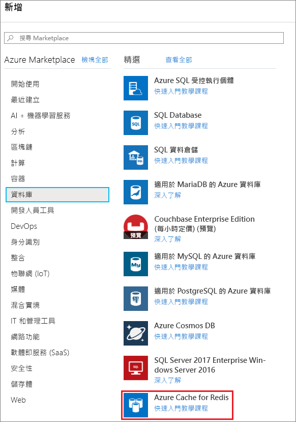
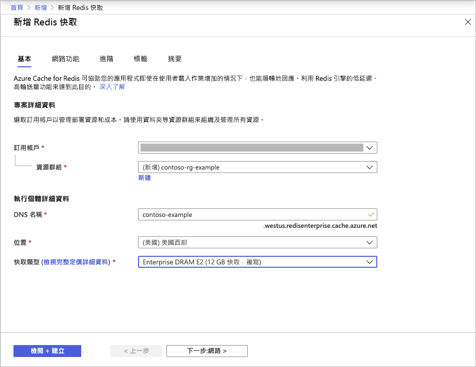
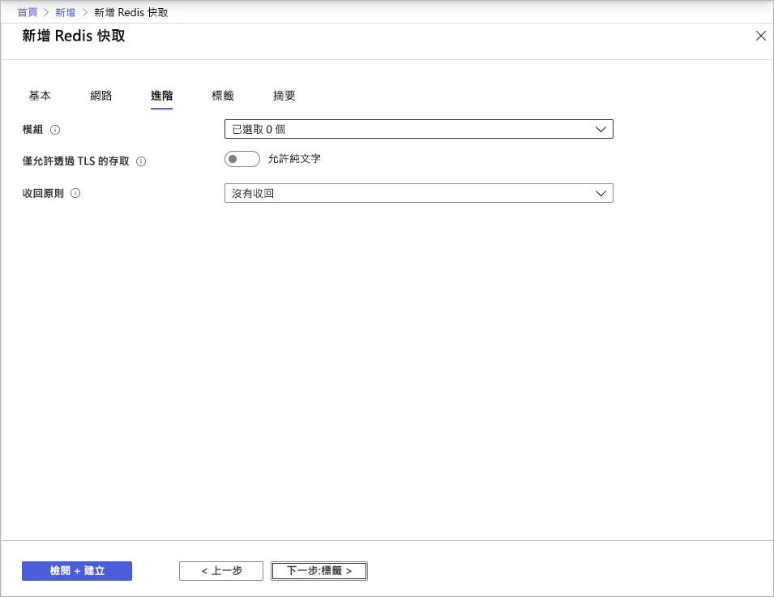
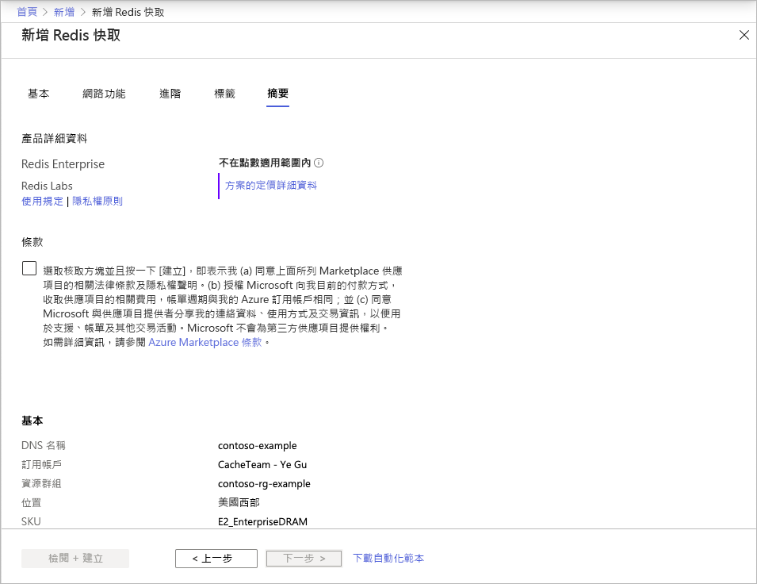

# 快速入門：建立企業層快取 (預覽)

Azure Cache for Redis 的企業層可在 Azure 上提供完全整合且受控的 [Redis Enterprise](https://redislabs.com/redis-enterprise/)。 企業層目前以預覽版形式提供。 此預覽版中有兩個新的階層：
* 企業層，會在虛擬機器上使用揮發性記憶體 (DRAM) 來儲存資料
* 企業 SSD 層，會同時使用揮發性記憶體和非揮發性記憶體 (NVMe) 來儲存資料。

加入預覽版不必任何費用。 如果您有興趣，請透過 [Azure Marketplace](https://aka.ms/redispreviewsignup/) 的**與我連絡**來註冊。 我們所能提供的參與者人數非常有限，因此無法保證您可以加入預覽版。

## Prerequisites

在開始之前，您需要有 Azure 訂用帳戶。 如果您沒有訂用帳戶，請先建立[免費帳戶](https://azure.microsoft.com/free/)。

## 建立快取
1. 若要建立快取，請使用預覽版邀請中的連結來登入 Azure 入口網站，然後選取 [建立資源]。

   > [!IMPORTANT] 
   > 請勿在 Marketplace 中直接訂閱 *Azure Cache for Redis 企業層*。
   > 此步驟會由 Azure Cache for Redis 入口網站 UI 自動執行。
   >
   
1. 在 [新增] 頁面上選取 [資料庫]，然後選取 [Azure Cache for Redis]。
   
   
   
1. 在 [新的 Redis 快取] 頁面上，設定新快取的設定。
   
   | 設定      | 建議的值  | 描述 |
   | ------------ |  ------- | -------------------------------------------------- |
   | **訂用帳戶** | 下拉並選取您的訂用帳戶。 | 這個新的 Azure Cache for Redis 執行個體建立所在的訂用帳戶。 | 
   | **資源群組** | 下拉並選取資源群組，或選取 [新建] 並輸入新的資源群組名稱。 | 用來建立快取和其他資源的資源群組名稱。 將所有的應用程式資源放在一個資源群組中，您將可輕鬆地一併管理或刪除這些資源。 | 
   | **DNS 名稱** | 輸入全域唯一名稱。 | 快取名稱必須是 1 到 63 個字元的字串，且只能包含數字、字母或連字號。 名稱的開頭和結尾必須是數字或字母，且不可包含連續的連字號。 快取執行個體的*主機名稱*會是 *\<DNS name>.<Azure region>.redisenterprise.cache.azure.net*。 | 
   | **位置** | 下拉並選取位置。 | 企業層適用於美國西部、美國東部 2 和西歐。 |
   | **快取層** | 下拉並選取 [企業 DRAM] 或 [企業 SSD] 層和大小。 |  快取的可用大小、效能和功能取決於階層。 |
   
    

1. 完成時，選取 [下一步:網路] 並跳過。

   > [!NOTE] 
   > 晚一點才會提供私人連結支援。
   >

1. 完成時，選取 [下一步:進階]。
   
   您可以保留預設設定，或視需要加以變更。 開啟 [只允許透過 TLS 來存取] 時，您必須使用 TLS 才能從應用程式存取新的快取。

    

   > [!NOTE] 
   > 企業 SSD 層目前尚未支援 Redis 模組。 如果您打算使用 Redis 模組，請務必選擇企業層快取。
   >
   
1. 完成時，選取 [下一步:標籤] 並跳過。

1. 完成時，選取 [下一步:摘要]。

    

1. 按一下 [條款] 底下的核取方塊、檢閱設定，然後選取 [檢閱 + 建立]。
   
   需要一些時間才能建立快取。 您可以在 Azure Cache for Redis 的 [概觀] 頁面上監視進度。 當 [狀態] 顯示為 [執行中] 時，表示快取已可供使用。

   > [!NOTE] 
   > 在企業層快取建立好後經過一段時間時，您會收到 Azure Marketplace 傳來的**需採取動作**電子郵件，以設定 *Azure Cache for Redis 企業層*。 這並非必須採取的動作。 您可以放心地忽略該電子郵件。
   >

## 後續步驟

在本快速入門中，您已了解如何建立 Azure Cache for Redis 的企業層執行個體。

> [!div class="nextstepaction"]
> [建立可使用 Azure Cache for Redis 的 ASP.NET Web 應用程式。](./cache-web-app-howto.md)

