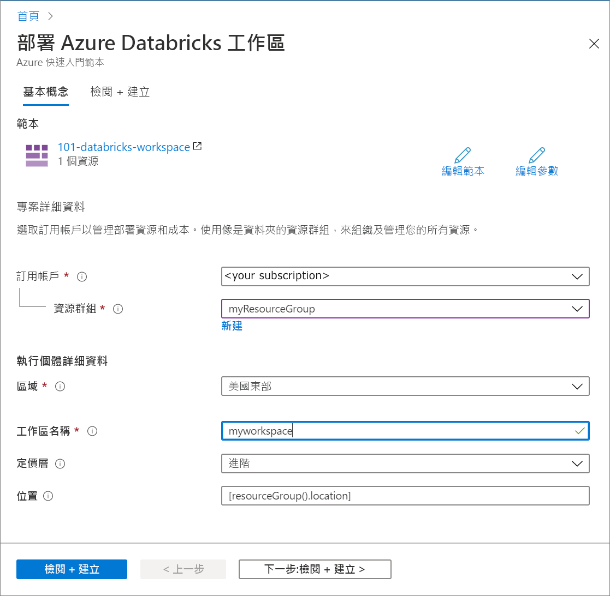

# <a name="quickstart-create-an-azure-databricks-workspace-by-using-the-azure-resource-manager-template"></a>快速入門：使用 Azure Resource Manager 範本，建立 Azure Databricks 工作區

在本快速入門中，您將使用 Azure Resource Manager 範本，建立 Azure Databricks 工作區。 建立工作區之後，即可驗證該部署。

[!INCLUDE [About Azure Resource Manager](../../includes/resource-manager-quickstart-introduction.md)]

## <a name="prerequisites"></a>必要條件

若要完成本文，您需要：

* 擁有 Azure 訂用帳戶 - [建立免費帳戶](https://azure.microsoft.com/free/)

## <a name="create-an-azure-databricks-workspace"></a>建立 Azure Databricks 工作區

### <a name="review-the-template"></a>檢閱範本

本快速入門中使用的範本是來自 [Azure 快速入門範本](https://github.com/Azure/azure-quickstart-templates/tree/master/101-databricks-workspace)。

:::code language="json" source="~/quickstart-templates/101-databricks-workspace/azuredeploy.json" range="1-53":::

範本中定義的 Azure 資源為 Microsoft.Databricks/workspaces：建立 Azure Databricks 工作區。 

## <a name="deploy-the-template"></a>部署範本

在本節中，您會使用 Azure Resource Manager 範本建立 Azure Databricks 工作區。

1. 選取以下影像來登入 Azure 並開啟範本。 此範本會建立 Azure Databricks 工作區。

   [](https://portal.azure.com/#create/Microsoft.Template/uri/https%3A%2F%2Fraw.githubusercontent.com%2FAzure%2Fazure-quickstart-templates%2Fmaster%2F101-databricks-workspace%2Fazuredeploy.json)

2. 提供建立 Azure Databricks 工作區所需的值

   

   提供下列值：

   |屬性  |描述  |
   |---------|---------|
   |**訂用帳戶**     | 從下拉式清單中選取您的 Azure 訂用帳戶。        |
   |**資源群組**     | 指定您是要建立新的資源群組，還是使用現有資源群組。 資源群組是存放 Azure 方案相關資源的容器。 如需詳細資訊，請參閱 [Azure 資源群組概觀](../azure-resource-manager/management/overview.md)。 |
   |**位置**     | 選取 [美國東部 2]。 如需其他可用的區域，請參閱[依區域提供的 Azure 服務](https://azure.microsoft.com/regions/services/)。        |
   |**工作區名稱**     | 提供您 Databricks 工作區的名稱        |
   |定價層     |  選擇 [標準] 或 [進階]。 如需這些定價層的詳細資訊，請參閱 [Databricks 定價頁面](https://azure.microsoft.com/pricing/details/databricks/)。       |

3. 選取 [檢閱 + 建立]，然後選取 [建立]。

4. 工作區建立需要幾分鐘的時間。 當工作區部署失敗時，工作區仍會以失敗狀態建立。 刪除失敗的工作區，並建立可解決部署錯誤的新工作區。 當您刪除失敗的工作區時，也會一併刪除受控資源群組和任何已成功部署的資源。

## <a name="review-deployed-resources"></a>檢閱已部署的資源

您可以使用 Azure 入口網站來查看 Azure Databricks 工作區，或是使用下列 Azure CLI 或 Azure PowerShell 指令碼，列出資源。

### <a name="azure-cli"></a>Azure CLI

```azurecli-interactive
echo "Enter your Azure Databricks workspace name:" &&
read databricksWorkspaceName &&
echo "Enter the resource group where the Azure Databricks workspace exists:" &&
read resourcegroupName &&
az databricks workspace show -g $resourcegroupName -n $databricksWorkspaceName
```

### <a name="azure-powershell"></a>Azure PowerShell

```azurepowershell-interactive
$resourceGroupName = Read-Host -Prompt "Enter the resource group name where your Azure Databricks workspace exists"
(Get-AzResource -ResourceType "Microsoft.Databricks/workspaces" -ResourceGroupName $resourceGroupName).Name
 Write-Host "Press [ENTER] to continue..."
```

## <a name="clean-up-resources"></a>清除資源

如果您預計繼續進行後續的教學課程，可以讓這些資源留在原處。 如果不再需要，請刪除資源群組，而如此會刪除 Azure Databricks 工作區與相關的受控資源。 若要使用 Azure CLI 或 Azure PowerShell 刪除資源群組：

### <a name="azure-cli"></a>Azure CLI

```azurecli-interactive
echo "Enter the Resource Group name:" &&
read resourceGroupName &&
az group delete --name $resourceGroupName &&
echo "Press [ENTER] to continue ..."
```

### <a name="azure-powershell"></a>Azure PowerShell

```azurepowershell-interactive
$resourceGroupName = Read-Host -Prompt "Enter the Resource Group name"
Remove-AzResourceGroup -Name $resourceGroupName
Write-Host "Press [ENTER] to continue..."
```

## <a name="next-steps"></a>後續步驟

在本快速入門中，您已使用 Azure Resource Manager 範本建立了 Azure Databricks 工作區，並已驗證了該部署。 前往下一篇文章，以了解如何使用 Azure Databricks 執行 ETL 作業 (擷取、轉換及載入資料)。

> [!div class="nextstepaction"]
> [使用 Azure Databrick 擷取、轉換和載入資料](databricks-extract-load-sql-data-warehouse.md)
