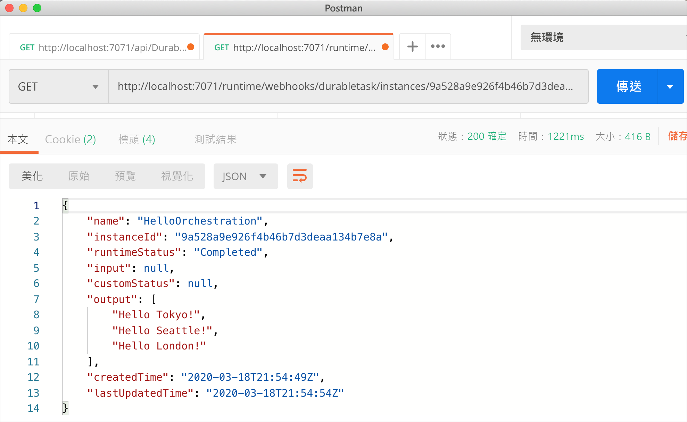
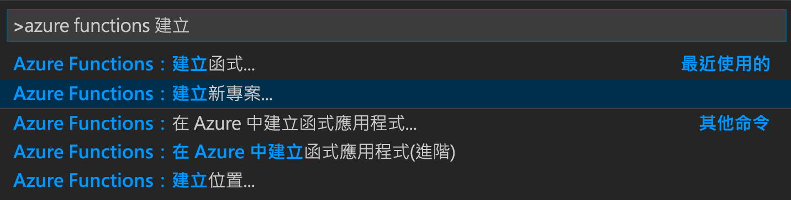
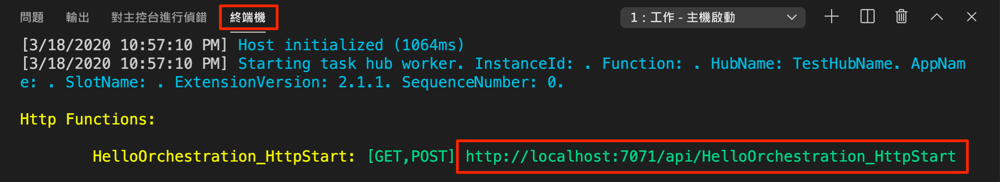
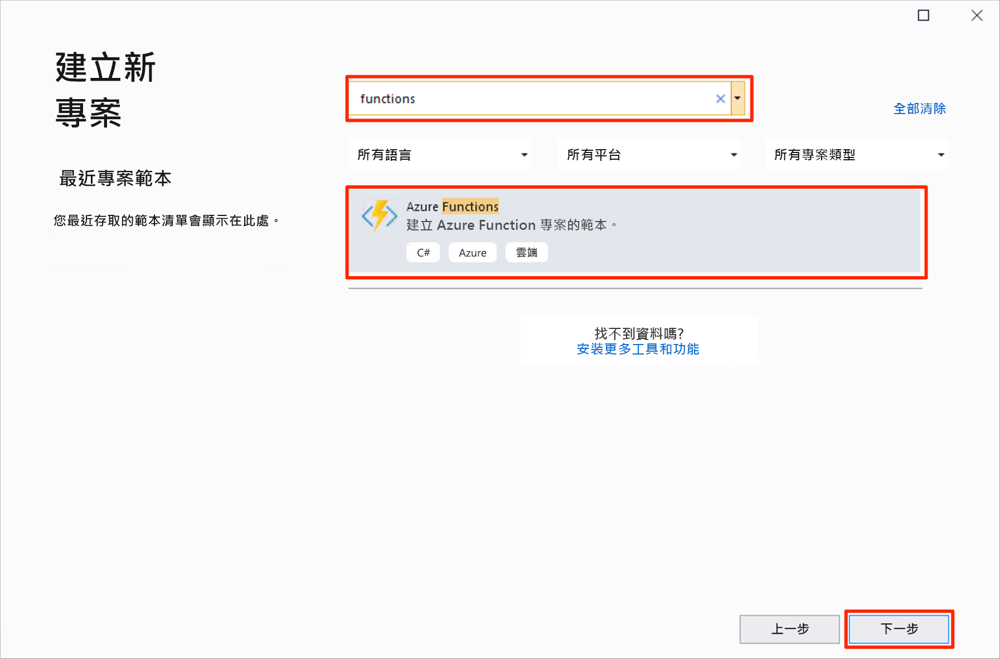
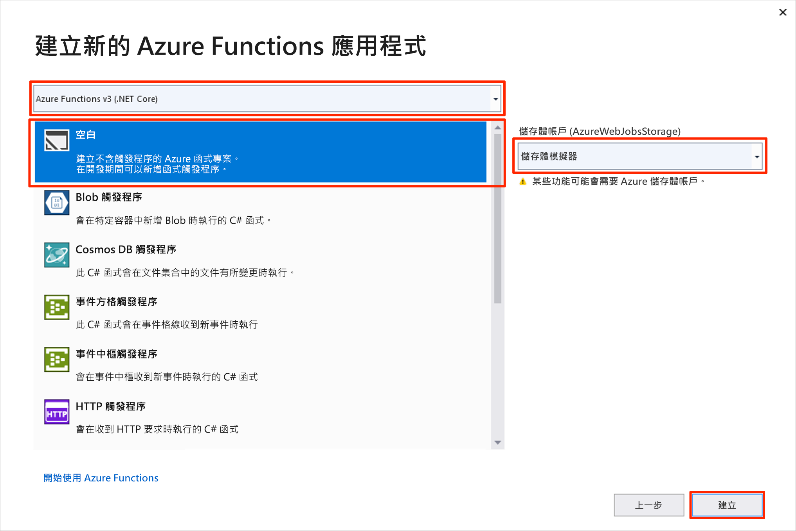
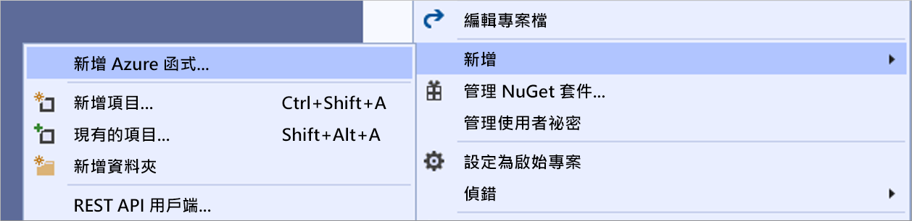

# <a name="create-your-first-durable-function-in-c"></a>使用 C\# 建立第一個耐久函式

*Durable Functions* 是 [Azure Functions](../functions-overview.md) 的擴充功能，可讓您在無伺服器環境中撰寫具狀態函式。 此擴充功能會為您管理狀態、設定檢查點和重新啟動。

::: zone pivot="code-editor-vscode"

在本文中，您將了解如何使用 Visual Studio Code，在本機建立及測試 "hello world" 耐久函式。  此函式會協調對其他函式的呼叫並鏈結在一起。 接著會將函式程式碼發佈至 Azure。 這些工具會在 VS Code [Azure Functions 擴充功能](https://marketplace.visualstudio.com/items?itemName=ms-azuretools.vscode-azurefunctions)中提供。



## <a name="prerequisites"></a>Prerequisites

若要完成本教學課程：

* 安裝 [Visual Studio Code](https://code.visualstudio.com/download)。

* 安裝下列 VS Code 擴充功能：
    - [Azure Functions](https://marketplace.visualstudio.com/items?itemName=ms-azuretools.vscode-azurefunctions)
    - [C#](https://marketplace.visualstudio.com/items?itemName=ms-dotnettools.csharp)

* 確定您有最新版的 [Azure Functions Core Tools](../functions-run-local.md)。

* Durable Functions 需要 Azure 儲存體帳戶。 您需要 Azure 訂用帳戶。

* 確定您已安裝 [.NET Core SDK](https://dotnet.microsoft.com/download) 3.1 版或更新版本。

[!INCLUDE [quickstarts-free-trial-note](../../../includes/quickstarts-free-trial-note.md)]

## <a name="create-your-local-project"></a><a name="create-an-azure-functions-project"></a>建立本機專案 

在這一節中，您會使用 Visual Studio Code 來建立本機 Azure Functions 專案。 

1. 在 Visual Studio Code 中，按 F1 (或 Ctrl/Cmd+Shift+P) 以開啟命令選擇區。 在命令選擇區中，搜尋並選取 `Azure Functions: Create New Project...`。

    

1. 為您的專案選擇空白資料夾位置，然後選擇 [選取]  。

1. 按照提示提供下列資訊：

    | Prompt | 值 | 描述 |
    | ------ | ----- | ----------- |
    | 為您的函式應用程式專案選取語言 | C# | 建立本機 C# Functions 專案。 |
    | 選取版本 | Azure Functions v3 | 您只會在尚未安裝 Core Tools 時看到此選項。 在此情況下，Core Tools 會在您第一次執行應用程式時安裝。 |
    | 選取您專案第一個函式的範本 | 暫時跳過 | |
    | 選取您要如何開啟專案 | 在目前視窗中開啟 | 在您選取的資料夾中重新開啟 VS Code。 |

如有需要，Visual Studio Code 安裝 Azure Functions Core Tools。 其也會在資料夾中建立函式應用程式專案。 此專案包含 [host.json](../functions-host-json.md) 和 [local.settings.json](../functions-run-local.md#local-settings-file) 組態檔。

## <a name="add-functions-to-the-app"></a>將函式新增至應用程式

下列步驟會使用範本在您的專案中建立耐久函式程式碼。

1. 在命令選擇區中，搜尋並選取 `Azure Functions: Create Function...`。

1. 按照提示提供下列資訊：

    | Prompt | 值 | 描述 |
    | ------ | ----- | ----------- |
    | 選取函式的範本 | DurableFunctionsOrchestration | 建立 Durable Functions 協調流程 |
    | 提供函式名稱 | HelloOrchestration | 用來建立函式的類別名稱 |
    | 提供命名空間 | Company.Function | 所產生類別的命名空間 |

1. 當 VS Code 提示您選取儲存體帳戶時，請選擇 [選取儲存體帳戶]  。 遵循提示來提供下列資訊，即可在 Azure 中建立新的儲存體帳戶。

    | Prompt | 值 | 描述 |
    | ------ | ----- | ----------- |
    | 選取訂閱 | 您的訂用帳戶名稱  | 選取您的 Azure 訂用帳戶 |
    | 選取儲存體帳戶 | 建立新的儲存體帳戶 |  |
    | 輸入新儲存體帳戶的名稱 | 唯一名稱  | 要建立的儲存體帳戶名稱 |
    | 選取資源群組 | 唯一名稱  | 要建立的資源群組名稱 |
    | 選取位置 | *region* | 選取您附近的區域 |

包含新函式的類別會新增至專案。 VS Code 也會將儲存體帳戶連接字串新增至 local.settings.json  ，以及將 [`Microsoft.Azure.WebJobs.Extensions.DurableTask`](https://www.nuget.org/packages/Microsoft.Azure.WebJobs.Extensions.DurableTask) NuGet 套件的參考新增至 *.csproj* 專案檔。

開啟新的 HelloOrchestration.cs  檔案以查看內容。 此耐久函式是簡單的函式鏈結範例，包含下列方法：  

| 方法 | FunctionName | 描述 |
| -----  | ------------ | ----------- |
| **`RunOrchestrator`** | `HelloOrchestration` | 管理耐久協調流程。 在此情況下，協調流程會啟動、建立清單，以及將三個函式呼叫的結果新增至清單。  完成三個函式呼叫後，它會傳回清單。 |
| **`SayHello`** | `HelloOrchestration_Hello` | 此函數會傳回 hello。 此函式包含要進行協調的商務邏輯。 |
| **`HttpStart`** | `HelloOrchestration_HttpStart` | [HTTP 觸發的函式](../functions-bindings-http-webhook.md)，該函式會啟動協調流程執行個體並傳回檢查狀態回應。 |

您現在已建立函式專案和耐久函式，可以在本機電腦上進行測試。

## <a name="test-the-function-locally"></a>在本機測試函式

Azure Functions Core Tools 可讓您在本機開發電腦上執行 Azure Functions 專案。 第一次從 Visual Studio Code 啟動函式時，系統會提示您安裝這些工具。

1. 若要測試您的函式，可在 `SayHello` 活動函式程式碼中設定中斷點，並按 F5 以啟動函式應用程式專案。 Core Tools 的輸出會顯示在 **終端機** 面板中。

    > [!NOTE]
    > 如需有關偵錯的詳細資訊，請參閱 [Durable Functions 診斷](durable-functions-diagnostics.md#debugging)。

1. 在 **終端機** 面板中，複製 HTTP 觸發函式的 URL 端點。

    

1. 使用 [Postman](https://www.getpostman.com/) 或 [cURL](https://curl.haxx.se/) 之類的工具，將 HTTP POST 要求傳送至 URL 端點。

   回應是 HTTP 函式的初始結果，讓我們知道耐久協調流程已成功啟動。 這還不是協調流程的最終結果。 回應包含一些實用的 URL。 讓現在我們查詢協調流程的狀態。

1. 複製 `statusQueryGetUri` 的 URL 值並將它貼在瀏覽器的網址列中，然後執行要求。 或者，您也可以繼續使用 Postman 來發出 GET 要求。

   此要求會查詢協調流程執行個體的狀態。 您應該會取得最終回應，內容指出執行個體已完成，並包含耐久函式的輸出或結果。 如下所示： 

    ```json
    {
        "name": "HelloOrchestration",
        "instanceId": "9a528a9e926f4b46b7d3deaa134b7e8a",
        "runtimeStatus": "Completed",
        "input": null,
        "customStatus": null,
        "output": [
            "Hello Tokyo!",
            "Hello Seattle!",
            "Hello London!"
        ],
        "createdTime": "2020-03-18T21:54:49Z",
        "lastUpdatedTime": "2020-03-18T21:54:54Z"
    }
    ```

1. 若要停止偵錯，請在 VS Code 中按 **Shift + F5**。

確認函式在本機電腦上正確執行之後，就可以將專案發佈到 Azure。

[!INCLUDE [functions-create-function-app-vs-code](../../../includes/functions-sign-in-vs-code.md)]

[!INCLUDE [functions-publish-project-vscode](../../../includes/functions-publish-project-vscode.md)]

## <a name="test-your-function-in-azure"></a>在 Azure 中測試您的函式

1. 從 [輸出]  面板中複製 HTTP 觸發程序的 URL。 呼叫 HTTP URL 觸發函式的 URL 應採用下列格式：

    `https://<functionappname>.azurewebsites.net/api/HelloOrchestration_HttpStart`

1. 將 HTTP 要求的新 URL 貼到瀏覽器的網址列。 在使用已發佈的應用程式之前，您應會取得如同以往的相同狀態回應。

## <a name="next-steps"></a>後續步驟

您已使用 Visual Studio Code 來建立及發佈 C# 耐久函式應用程式。

> [!div class="nextstepaction"]
> [了解常見的耐久函式模式](durable-functions-overview.md#application-patterns)

::: zone-end

::: zone pivot="code-editor-visualstudio"

在本文中，您將了解如何使用 Visual Studio 2019，在本機建立及測試 "hello world" 耐久函式。  此函式會協調對其他函式的呼叫並鏈結在一起。 接著會將函式程式碼發佈至 Azure。 這些工具可在 Visual Studio 2019 的 Azure 開發工作負載中取得。


## <a name="prerequisites"></a>Prerequisites

若要完成本教學課程：

* 安裝 [Visual Studio 2019](https://visualstudio.microsoft.com/vs/)。 確定也已經安裝 **Azure 開發** 工作負載。 Visual Studio 2017 也支援 Durable Functions 開發，但 UI 和步驟有所不同。

* 確認您已安裝且正在執行 [Azure 儲存體模擬器](../../storage/common/storage-use-emulator.md)。

[!INCLUDE [quickstarts-free-trial-note](../../../includes/quickstarts-free-trial-note.md)]

## <a name="create-a-function-app-project"></a>建立函式應用程式專案

Azure Functions 範本可建立可發佈至 Azure 中函式應用程式的專案。 函式應用程式可讓您將多個函式群組為邏輯單位，以方便您管理、部署、調整和共用資源。

1. 在 Visual Studio 中，從 [檔案]  功能表中選取 [新增]   >  [專案]  。

1. 在 [建立新專案]  對話方塊中，搜尋 `functions`，選擇 [Azure Functions]  範本，然後選取 [下一步]  。 

    

1. 輸入您的 [專案名稱]  ，然後選取 [確定]  。 專案名稱必須是有效的 C# 命名空間，因此不會使用底線、連字號或任何其他非英數字元。

1. 在 [建立新的 Azure Functions 應用程式]  中，使用影像後面表格中所指定的設定。

    

    | 設定      | 建議的值  | 描述                      |
    | ------------ |  ------- |----------------------------------------- |
    | **版本** | Azure Functions 3.0 <br />(.NET Core) | 建立函式專案，該專案會使用支援 .NET Core 3.1 的 Azure Functions 3.0 版執行階段。 如需詳細資訊，請參閱[如何設定 Azure Functions 執行階段目標版本](../functions-versions.md)。   |
    | **範本** | 空白 | 建立空白的函式應用程式。 |
    | **儲存體帳戶**  | 儲存體模擬器 | 需要儲存體帳戶，才能管理耐久函式應用程式狀態。 |

4. 選取 [建立]  以建立空白的函式專案。 此專案具有執行您的函式所需的基本組態檔。

## <a name="add-functions-to-the-app"></a>將函式新增至應用程式

下列步驟會使用範本在您的專案中建立耐久函式程式碼。

1. 在 Visual Studio 中以滑鼠右鍵按一下專案，然後選取 [新增]   > [新增 Azure Function]  。

    

1. 確認已從 [新增] 功能表中選取 [Azure Function]  輸入您的 C# 檔案名稱，然後選取 [新增]  。

1. 選取 [Durable Functions 協調器]  範本，然後選取 [確定]  。

    

新的耐久函式會新增至應用程式。  開啟新的 .cs 檔案以檢視內容。 此耐久函式是簡單的函式鏈結範例，包含下列方法：  

| 方法 | FunctionName | 描述 |
| -----  | ------------ | ----------- |
| **`RunOrchestrator`** | `<file-name>` | 管理耐久協調流程。 在此情況下，協調流程會啟動、建立清單，以及將三個函式呼叫的結果新增至清單。  完成三個函式呼叫後，它會傳回清單。 |
| **`SayHello`** | `<file-name>_Hello` | 此函數會傳回 hello。 此函式包含要進行協調的商務邏輯。 |
| **`HttpStart`** | `<file-name>_HttpStart` | [HTTP 觸發的函式](../functions-bindings-http-webhook.md)，該函式會啟動協調流程執行個體並傳回檢查狀態回應。 |

您現在已建立函式專案和耐久函式，可以在本機電腦上進行測試。

## <a name="test-the-function-locally"></a>在本機測試函式

Azure Functions Core Tools 可讓您在本機開發電腦上執行 Azure Functions 專案。 第一次從 Visual Studio 啟動函式時，系統會提示您安裝這些工具。

1. 若要測試您的函式，請按 F5。 如果出現提示，接受來自 Visual Studio 之下載及安裝 Azure Functions Core (CLI) 工具的要求。 您可能也需要啟用防火牆例外狀況，工具才能處理 HTTP 要求。

2. 從 Azure Functions 執行階段輸出複製函式的 URL。

    

3. 將 HTTP 要求的 URL 貼到瀏覽器的網址列中，然後執行要求。 下圖顯示瀏覽器中對於函式傳回之本機 GET 要求所做出的回應︰

    

    回應是 HTTP 函式的初始結果，讓我們知道耐久協調流程已成功啟動。  這還不是協調流程的最終結果。  回應包含一些實用的 URL。  讓現在我們查詢協調流程的狀態。

4. 複製 `statusQueryGetUri` 的 URL 值並將它貼在瀏覽器的網址列中，然後執行要求。

    此要求會查詢協調流程執行個體的狀態。 您應會取得如下所示的最終回應。  此輸出顯示執行個體已完成，而且會包含耐久函式的輸出或結果。

    ```json
    {
        "instanceId": "d495cb0ac10d4e13b22729c37e335190",
        "runtimeStatus": "Completed",
        "input": null,
        "customStatus": null,
        "output": [
            "Hello Tokyo!",
            "Hello Seattle!",
            "Hello London!"
        ],
        "createdTime": "2019-11-02T07:07:40Z",
        "lastUpdatedTime": "2019-11-02T07:07:52Z"
    }
    ```

5. 若要停止偵錯，請按 **Shift + F5**。

確認函式在本機電腦上正確執行之後，就可以將專案發佈到 Azure。

## <a name="publish-the-project-to-azure"></a>將專案發佈到 Azure

您的 Azure 訂用帳戶中必須具有函式應用程式，才可以發佈您的專案。 您可以直接從 Visual Studio 建立函式應用程式。

[!INCLUDE [Publish the project to Azure](../../../includes/functions-vstools-publish.md)]

## <a name="test-your-function-in-azure"></a>在 Azure 中測試您的函式

1. 從發行設定檔頁面複製函式應用程式的基底 URL。 使用新的基底 URL，取代在本機測試函式時所使用之 URL 的 `localhost:port` 部分。

    呼叫耐久函式 HTTP 觸發程序的 URL 應採用下列格式：

    `https://<APP_NAME>.azurewebsites.net/api/<FUNCTION_NAME>_HttpStart`

2. 將 HTTP 要求的新 URL 貼到瀏覽器的網址列。 在使用已發佈的應用程式之前，您應會取得如同以往的相同狀態回應。

## <a name="next-steps"></a>後續步驟

您已使用 Visual Studio 來建立及發佈 C# 耐久函式應用程式。

> [!div class="nextstepaction"]
> [了解常見的耐久函式模式](durable-functions-overview.md#application-patterns)

::: zone-end
