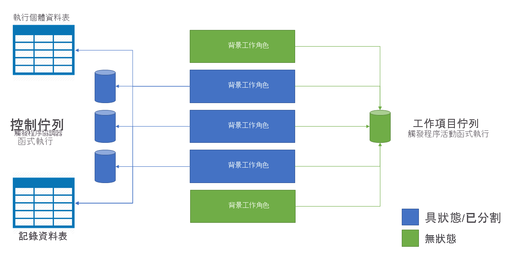

# <a name="performance-and-scale-in-durable-functions-azure-functions"></a>Durable Functions (Azure Functions) 中的效能和級別

若要最佳化效能和延展性，務必了解 [Durable Functions](durable-functions-overview.md) 獨特的調整規模特性。

若要了解調整規模行為，您必須了解基礎 Azure 儲存體提供者的一些詳細資料。

## <a name="history-table"></a>記錄資料表

[歷程記錄] 資料表是 Azure 儲存體資料表，含有工作中樞內所有協調流程執行個體的歷程記錄事件。 此資料表的名稱格式為 *TaskHubName* History。 隨著執行個體執行，此資料表中會新增資料列。 此資料表的資料分割索引鍵衍生自協調流程的執行個體識別碼。 在大部分情況下，執行個體識別碼都是隨機的，可確保 Azure 儲存體中的內部資料分割有最佳的分佈。

當協調流程執行個體需要執行時，系統會將 [歷程記錄] 資料表的適當資料列載入記憶體中。 這些「歷程記錄事件」會接著重新顯示為協調器函式程式碼，使其回到先前的檢查點狀態。 以這種方式使用執行歷程記錄重建狀態，會受[事件來源模式](/azure/architecture/patterns/event-sourcing)所影響。

## <a name="instances-table"></a>執行個體資料表

**實例** 資料表是另一個 Azure 儲存體資料表，其中包含工作中樞內所有協調流程和實體實例的狀態。 隨著執行個體的建立，此資料表中會新增資料列。 此資料表的資料分割索引鍵是協調流程實例識別碼或實體索引鍵，而資料列索引鍵是空字串。 每個協調流程或實體實例都有一個資料列。

此資料表用來滿足來自 ( .NET) 的實例查詢要求 `GetStatusAsync` ，並 `getStatus` (JavaScript) api 以及 [狀態查詢 HTTP API](durable-functions-http-api.md#get-instance-status)。 它終於與先前所述的 [歷程記錄] 資料表內容保持一致。 以這種方式使用不同的 Azure 儲存體資料表有效地滿足執行個體查詢作業，會受到[命令和查詢責任隔離 (CQRS) 模式](/azure/architecture/patterns/cqrs)所影響。

## <a name="internal-queue-triggers"></a>內部佇列觸發程序

協調器函式和活動函式都是由函式應用程式的工作中樞內的內部佇列所觸發。 以這種方式使用佇列會提供可靠的「至少一次」訊息傳遞保證。 Durable Functions 中有兩種佇列：**控制佇列** 和 **工作項目佇列**。

### <a name="the-work-item-queue"></a>工作項目佇列

在 Durable Functions 中，每個工作中樞各有一個工作項目佇列。 這是基本佇列，運作方式類似於 Azure Functions 中的其他任何 `queueTrigger` 佇列。 此佇列用來觸發無狀態「活動函式」，做法是一次從佇列中清除一則訊息。 上述每則訊息都包含活動函式輸入和其他中繼資料，例如要執行哪個函式。 當 Durable Functions 應用程式向外延展至多個虛擬機器時，這些虛擬機器全部會從工作項目佇列中爭奪工作。

### <a name="control-queues"></a>控制佇列

在 Durable Functions 中，每個工作中樞都有多個「控制佇列」。 「控制佇列」比簡單的工作項目佇列更複雜。 控制佇列可用來觸發具狀態協調器和實體函數。 因為協調器和實體函式實例是具狀態的 singleton，所以無法使用競爭取用者模型來將負載分散到各個 Vm。 相反地，協調器和實體訊息會在控制佇列之間進行負載平衡。 後續各節對此行為有更詳細的說明。

控制佇列包含各種不同的協調流程生命週期訊息類型。 例如，[協調器控制訊息](durable-functions-instance-management.md)、活動函式「回應」訊息，以及計時器訊息。 將有 32 則訊息會在單一輪詢中從控制佇列中清除。 這些訊息包含承載資料以及中繼資料，包括適用於哪個協調流程執行個體。 如果有多則已從佇列中清除的訊息適用於相同的協調流程執行個體，系統會將這些訊息當作一個批次處理。

### <a name="queue-polling"></a>佇列輪詢

長期工作延伸模組會執行隨機的指數退避演算法，以降低閒置佇列輪詢對儲存體交易成本的影響。 找到訊息時，執行時間會立即檢查另一個訊息;當找不到任何訊息時，它會等候一段時間，然後再試一次。 後續嘗試取得佇列訊息之後，等候時間會持續增加，直到到達等候時間上限為止（預設為30秒）。

最大輪詢延遲可透過檔案 `maxQueuePollingInterval` [host.js](../functions-host-json.md#durabletask)中的屬性來設定。 將這個屬性設定為較高的值可能會導致訊息處理延遲較高。 只有在閒置一段時間之後，才需要較高的延遲。 將此屬性設定為較低的值，可能會因為儲存體交易增加而導致儲存體成本較高。

> [!NOTE]
> 在 Azure Functions 耗用量和高階方案中執行時， [Azure Functions 調整控制器](../event-driven-scaling.md) 每10秒會輪詢每個控制項和工作專案佇列一次。 需要進行額外的輪詢，以判斷何時要啟動函式應用程式實例，並做出調整決策。 在撰寫本文時，這10秒的間隔是固定的，無法設定。

### <a name="orchestration-start-delays"></a>協調流程開始延遲
協調流程實例的啟動方式是將 `ExecutionStarted` 訊息放在其中一個工作中樞的控制佇列中。 在某些情況下，您可能會觀察到協調流程排定執行的時間與實際開始執行的時間之間的多秒延遲。 在此時間間隔期間，協調流程實例會維持在 `Pending` 狀態中。 此延遲有兩個可能的原因：

1. **累積的控制佇列**：如果這個實例的控制佇列包含大量訊息，則可能需要一些時間，執行時間才會 `ExecutionStarted` 接收和處理訊息。 當協調流程同時處理大量事件時，可能會發生訊息待處理專案（backlog）。 進入控制佇列的事件包括協調流程啟動事件、活動完成、持久計時器、終止和外來事件。 如果在正常情況下發生此延遲，請考慮建立具有大量分割區的新工作中樞。 設定更多資料分割會導致執行時間針對負載分佈建立更多控制佇列。

2. **反向輪詢延遲**：協調流程延遲的另一個常見原因是 [先前所述的控制佇列輪詢行為](#queue-polling)。 不過，只有當應用程式相應放大至兩個或多個實例時，才會發生此延遲。 如果只有一個應用程式實例，或啟動協調流程的應用程式實例也是輪詢目標控制佇列的相同實例，則不會有佇列輪詢延遲。 如先前所述，藉由更新設定的 **host.js** ，可降低輪詢延遲的時間。

## <a name="storage-account-selection"></a>儲存體帳戶選取

Durable Functions 所使用的佇列、資料表和 blob 會在已設定的 Azure 儲存體帳戶中建立。 您可以使用 (中的設定來指定要使用的帳戶，或在檔案 `durableTask/storageProvider/connectionStringName` `durableTask/azureStorageConnectionStringName` **host.js** 的 Durable Functions 1.x) 中設定。

### <a name="durable-functions-2x"></a>Durable Functions 2.x

```json
{
  "extensions": {
    "durableTask": {
      "storageProvider": {
        "connectionStringName": "MyStorageAccountAppSetting"
      }
    }
  }
}
```

### <a name="durable-functions-1x"></a>Durable Functions 1.x

```json
{
  "extensions": {
    "durableTask": {
      "azureStorageConnectionStringName": "MyStorageAccountAppSetting"
    }
  }
}
```

如果未指定，則會使用預設 `AzureWebJobsStorage` 儲存體帳戶。 不過，對於重視效能的工作負載，建置您設定非預設的儲存體帳戶。 Durable Functions 會密集使用 Azure 儲存體，而使用專用儲存體帳戶會隔離 Durable Functions 儲存體使用量與 Azure Functions 主機的內部使用量。

## <a name="orchestrator-scale-out"></a>協調器向外延展

活動函式是無狀態，且經由新增虛擬機器而自動相應放大。 另一方面，協調器函式和實體會 *分割* 成一或多個控制佇列。 控制佇列數目會定義於 **host.json** 檔案中。 下列範例 host.js的程式碼片段會將 `durableTask/storageProvider/partitionCount` 屬性 (或 `durableTask/partitionCount` Durable Functions 1.x) 中設定為 `3` 。

### <a name="durable-functions-2x"></a>Durable Functions 2.x

```json
{
  "extensions": {
    "durableTask": {
      "storageProvider": {
          "partitionCount": 3
      }
    }
  }
}
```

### <a name="durable-functions-1x"></a>Durable Functions 1.x

```json
{
  "extensions": {
    "durableTask": {
      "partitionCount": 3
    }
  }
}
```

一個工作中樞可設定為有 1 到 16 個資料分割。 若未指定，則預設資料分割計數為 **4**。

向外延展至多個函式主機執行個體時 (通常在不同的虛擬機器上)，每個執行個體取得其中一個控制佇列的鎖定。 這些鎖定會在內部實作為 blob 儲存體租用，並確定協調流程實例或實體一次只在單一主控制項實例上執行。 如果工作中樞已設定三個控制佇列，則協調流程實例和實體可在多達三個 Vm 之間進行負載平衡。 您可以新增更多虛擬機器，以增加容量來執行活動函式。

下圖說明在向外延展環境中，Azure Functions 主機與儲存體實體之間的互動方式。



如上圖所示，所有虛擬機器會爭奪工作項目佇列上的訊息。 不過，只有三個虛擬機器可以從控制佇列中取得訊息，每個虛擬機器會鎖定單一控制佇列。

協調流程實例和實體會分散到所有控制佇列實例。 散發的完成方式是將協調流程的實例識別碼或機構名稱和金鑰組進行雜湊處理。 協調流程實例識別碼預設為隨機 Guid，以確保實例會平均分散到所有控制佇列。

一般而言，協調器函式是輕巧的設計，應該不需要大量運算能力。 因此，不需要建立大量的控制佇列分割區來取得協調流程的絕佳輸送量。 大部分繁重的工作應在無狀態活動函式中進行，這還可以無限制地相應放大。

## <a name="auto-scale"></a>自動調整規模

如同在耗用量和彈性 Premium 方案中執行的所有 Azure Functions，Durable Functions 透過 [Azure Functions 調整控制器](../event-driven-scaling.md#runtime-scaling)來支援自動調整規模。 縮放控制器藉由定期發出 _peek_ 命令來監視所有佇列的延遲。 縮放控制器會以所查看訊息的延遲為基礎，決定是要新增或移除 VM。

如果縮放控制器判斷控制佇列訊息延遲太高，它會新增 VM 執行個體，直到訊息延遲減少到可接受的程度或達到控制佇列資料分割計數。 同樣地，如果工作項目佇列延遲偏高，不論資料分割計數為何，縮放控制器都會持續新增 VM 執行個體。

> [!NOTE]
> 從 Durable Functions 2.0 開始，可以將函式應用程式設定為在彈性 Premium 方案中受 VNET 保護的服務端點內執行。 在此設定中，Durable Functions 觸發程式會起始調整要求，而不是縮放控制器。

## <a name="thread-usage"></a>執行緒使用方式

協調器函式會在單一執行緒上執行，確保執行作業可透過多次重新執行來下決定。 由於此單一執行緒執行作業的緣故，所以協調器函式執行緒切勿執行需要大量 CPU 的工作、進行 I/O 或因故封鎖。 任何可能需要 I/O、封鎖或多個執行緒的工作，都應該移入活動函式中。

活動函式和一般佇列觸發的函式有完全相同的行為。 它們可以安全地執行 I/O、執行需要大量 CPU 的作業，以及使用多個執行緒。 因為活動觸發程序是無狀態，所以能夠自由地向外延展至不限數量的虛擬機器。

實體函式也會在單一執行緒上執行，而且作業會一次處理。 不過，實體函式對可執行檔程式碼類型沒有任何限制。

## <a name="concurrency-throttles"></a>並行節流

Azure Functions 支援在單一應用程式執行個體中同時執行多個函式。 此並行執行作業有助於提升平行處理原則，且盡可能減少典型應用程式在一段時間內會遇到的「冷啟動」數目。 不過，高平行存取可能會耗盡每個 VM 的系統資源，例如網路連線或可用的記憶體。 視函式應用程式的需求而定，每個執行個體並行處理可能必須進行節流，以避免在高負載情況下記憶體不足的可能性。

活動、協調器和實體函式的平行存取限制可以在檔案的 **host.js** 中設定。 相關設定適用 `durableTask/maxConcurrentActivityFunctions` 于活動函式和 `durableTask/maxConcurrentOrchestratorFunctions` 協調器和實體功能。

### <a name="functions-20"></a>函數2。0

```json
{
  "extensions": {
    "durableTask": {
      "maxConcurrentActivityFunctions": 10,
      "maxConcurrentOrchestratorFunctions": 10
    }
  }
}
```

### <a name="functions-1x"></a>Functions 1.x

```json
{
  "durableTask": {
    "maxConcurrentActivityFunctions": 10,
    "maxConcurrentOrchestratorFunctions": 10
  }
}
```

在上述範例中，最多可以同時在單一 VM 上執行10個協調器或實體函式和10個活動函式。 如果未指定，並行活動和協調器或實體函式執行的數目會限制為 VM 上核心數目的10倍。

> [!NOTE]
> 這些設定很有用，有助於管理單一 VM 上的記憶體和 CPU 使用量。 不過，在多個 Vm 之間相應放大時，每個 VM 都有自己的一組限制。 這些設定不能用來控制全域層級的平行存取。

## <a name="extended-sessions"></a>擴充的會話

擴充會話是一種設定，可將協調流程和實體保留在記憶體中，即使它們已完成處理訊息。 啟用擴充工作階段的典型效果，就是減少對 Azure 儲存體帳戶的 I/O 及提升整體輸送量。

您可以在 `durableTask/extendedSessionsEnabled` `true` **host.json** 檔案中，將設定為，藉以啟用擴充會話。 您 `durableTask/extendedSessionIdleTimeoutInSeconds` 可以使用此設定來控制閒置會話將保留在記憶體中的時間長度：

**函數2。0**
```json
{
  "extensions": {
    "durableTask": {
      "extendedSessionsEnabled": true,
      "extendedSessionIdleTimeoutInSeconds": 30
    }
  }
}
```

**函數1。0**
```json
{
  "durableTask": {
    "extendedSessionsEnabled": true,
    "extendedSessionIdleTimeoutInSeconds": 30
  }
}
```

這項設定有兩個可能的缺點需要注意：

1. 函數應用程式記憶體使用量的整體增加。
2. 如果有許多並行、短期協調器或實體函式的執行，輸送量的整體可能會降低。

例如，如果 `durableTask/extendedSessionIdleTimeoutInSeconds` 設定為30秒，則在小於1秒內執行的短期協調器或實體函式集會在30秒內仍佔用記憶體。 它也會根據先前所述的配額來計算 `durableTask/maxConcurrentOrchestratorFunctions` ，這可能會導致無法執行其他協調器或實體功能。

協調器和實體函式的擴充會話的特定效果將在下一節中說明。

> [!NOTE]
> 目前只有 .NET 語言支援擴充的會話，例如 c # 或 F #。 `extendedSessionsEnabled` `true` 針對其他平臺設定為，可能會導致執行時間問題，例如以無訊息模式執行活動和協調流程觸發的函式。


### <a name="orchestrator-function-replay"></a>協調器函式重新執行

如先前所述，使用 [歷程記錄] 資料表的內容可重新執行協調器函式。 根據預設，每次從控制佇列中清除一批訊息時，就會重新執行協調器函式程式碼。 即使您使用展開傳送、收合傳送模式，以及等待所有工作完成 (例如， `Task.WhenAll` 在 .net 中或 `context.df.Task.all` 在 JavaScript) 中使用，將會在一段時間內處理工作回應的批次時，才會發生重新執行。 當擴充的會話啟用時，協調器函式實例會保留在記憶體中，而且可以處理新的訊息，而不需要完整的歷程記錄。

在下列情況中，最常觀察到擴充會話的效能改進：

* 當並存執行的協調流程實例數目有限時。
* 當協調流程有大量的連續動作時 (例如，數百個活動函式呼叫，) 快速完成。
* 當協調流程展開並傳入大量以相同時間完成的動作時。
* 當協調器函式需要處理大型訊息或進行任何需要大量 CPU 的資料處理時。

在所有其他情況下，協調器函式通常不會有明顯的效能改進。

> [!NOTE]
> 只有在協調器函式經過完整開發及測試之後，才能使用這些設定。 預設的積極重新執行行為有助於在開發期間偵測協調器函式程式 [代碼條件約束](durable-functions-code-constraints.md) 違規，因此預設為停用。

### <a name="entity-function-unloading"></a>實體函數卸載

實體函式可在單一批次中處理最多20個作業。 一旦實體處理一批次工作之後，就會保存其狀態並從記憶體卸載。 您可以使用 [擴充會話] 設定，從記憶體中延遲卸載實體。 實體會繼續持續保存其狀態變更，但在設定的一段時間內仍會保留在記憶體中，以減少 Azure 儲存體的負載數量。 從 Azure 儲存體減少負載，可以改善經常存取之實體的整體輸送量。

## <a name="performance-targets"></a>效能目標

在規劃將 Durable Functions 用於生產應用程式時，請務必在規劃初期考慮效能需求。 本節涵蓋一些基本使用案例，以及預期的最大輸送量數字。

* **循序活動執行**：這個案例說明的協調器函式會一個接一個執行一系列活動函式。 它最類似於[函式鏈結](durable-functions-sequence.md)範例。
* **平行活動執行**：這個案例說明的協調器函式會使用 [展開傳送、收合傳送](durable-functions-cloud-backup.md)模式平行執行許多活動函式。
* **平行處理回應**：這個案例是 [展開傳送、收合傳送](durable-functions-cloud-backup.md)模式的第二個部份。 它著重於收合傳送的效能。 請務必請注意，不同於展開傳送，收合傳送是由單一協調器函式執行個體進行，因此只能在單一 VM 上執行。
* **外部事件處理**：這個案例代表為 [外部事件](durable-functions-external-events.md)服務的單一協調器函式執行個體 (一次一個)。
* **實體工作處理**：此案例會測試 _單一_[計數器實體](durable-functions-entities.md)可以處理常數資料流程的速度。

> [!TIP]
> 不同於展開傳送，收合傳送作業受限制於單一 VM。 如果您的應用程式使用展開傳送、收合傳送模式，而且您很在意收合傳送效能，請考慮將活動函式展開傳送細分到多個[子協調流程](durable-functions-sub-orchestrations.md)。

下表顯示先前所述案例的預期「最大」輸送量數字。 「執行個體」是指在 Azure App Service 中單一小型 ([A1](../../virtual-machines/sizes-previous-gen.md)) VM 上執行之協調器函式的單一執行個體。 在所有情況下，假設已啟用[擴充工作階段](#orchestrator-function-replay)。 實際結果可能會因函式程式碼所執行的 CPU 或 I/O 工作而有所不同。

| 案例 | 最大輸送量 |
|-|-|
| 循序活動執行 | 每個執行個體每秒 5 個活動 |
| 平行活動執行 (展開傳送) | 每個執行個體每秒 100 個活動 |
| 平行回應處理 (收合傳送) | 每個執行個體每秒 150 個回應 |
| 外部事件處理 | 每個執行個體每秒 50 個事件 |
| 實體操作處理 | 每秒64個作業 |

> [!NOTE]
> 這些數字是 Durable Functions 擴充功能 v1.4.0 (GA) 版的現行資料。 隨著功能更臻成熟及最佳化的進行，這些數字可能會隨時間改變。

如果您未看見您預期的輸送量數字，而且您的 CPU 和記憶體使用狀況似乎良好，請查看原因是否與[儲存體帳戶的健康情況](../../storage/common/storage-monitoring-diagnosing-troubleshooting.md#troubleshooting-guidance)相關。 Durable Functions 擴充功能可能為 Azure 儲存體帳戶帶來大量負載，而極高的負載可能導致儲存體帳戶節流。

## <a name="next-steps"></a>後續步驟

> [!div class="nextstepaction"]
> [瞭解嚴重損壞修復和地理分佈](durable-functions-disaster-recovery-geo-distribution.md)
