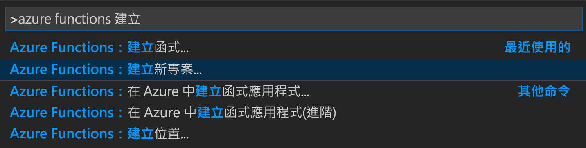
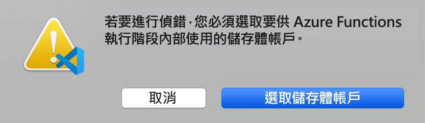
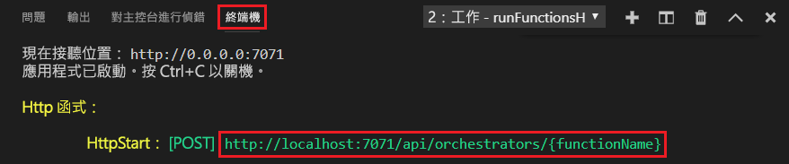

# <a name="create-your-first-durable-function-in-powershell"></a>使用 PowerShell 建立第一個耐久函式

*Durable Functions* 是 [Azure Functions](../functions-overview.md) 的擴充功能，可讓您在無伺服器環境中撰寫具狀態函式。 此擴充功能會為您管理狀態、設定檢查點和重新啟動。

在本文中，您會了解如何使用 Visual Studio Code Azure Functions 擴充功能，在本機建立及測試 "hello world" 耐久函式。  此函式會協調對其他函式的呼叫並鏈結在一起。 接著會將函式程式碼發佈至 Azure。


## <a name="prerequisites"></a>必要條件

若要完成本教學課程：

* 安裝 [Visual Studio Code](https://code.visualstudio.com/download)。

* 安裝 [Azure Functions](https://marketplace.visualstudio.com/items?itemName=ms-azuretools.vscode-azurefunctions) VS Code 擴充功能

* 確定您有最新版的 [Azure Functions Core Tools](../functions-run-local.md)。

* Durable Functions 需要 Azure 儲存體帳戶。 您需要 Azure 訂用帳戶。

[!INCLUDE [quickstarts-free-trial-note](../../../includes/quickstarts-free-trial-note.md)]

## <a name="create-your-local-project"></a><a name="create-an-azure-functions-project"></a>建立本機專案 

在這一節中，您會使用 Visual Studio Code 來建立本機 Azure Functions 專案。 

1. 在 Visual Studio Code 中，按 F1 (或 Ctrl/Cmd+Shift+P) 以開啟命令選擇區。 在命令選擇區中，搜尋並選取 `Azure Functions: Create New Project...`。

    

1. 為您的專案選擇空白資料夾位置，然後選擇 [選取]。

1. 按照提示提供下列資訊：

    | Prompt | 值 | 描述 |
    | ------ | ----- | ----------- |
    | 為您的函式應用程式專案選取語言 | PowerShell | 建立本機 PowerShell Functions 專案。 |
    | 選取版本 | Azure Functions v3 | 您只會在尚未安裝 Core Tools 時看到此選項。 在此情況下，Core Tools 會在您第一次執行應用程式時安裝。 |
    | 選取您專案第一個函式的範本 | 暫時跳過 | |
    | 選取您要如何開啟專案 | 在目前視窗中開啟 | 在您選取的資料夾中重新開啟 VS Code。 |

如有需要，Visual Studio Code 安裝 Azure Functions Core Tools。 其也會在資料夾中建立函式應用程式專案。 此專案包含 [host.json](../functions-host-json.md) 和 [local.settings.json](../functions-run-local.md#local-settings-file) 組態檔。

此外，也會在根資料夾中建立 package.json 檔案。

### <a name="configure-function-app-to-use-powershell-7"></a>將函式應用程式設定為使用 PowerShell 7

開啟 local.settings.json 檔案，並確認名為 `FUNCTIONS_WORKER_RUNTIME_VERSION` 的設定已設定為 `~7`。 如果遺漏或設定為另一個值，請更新檔案內容。

```json
{
  "IsEncrypted": false,
  "Values": {
    "AzureWebJobsStorage": "",
    "FUNCTIONS_WORKER_RUNTIME": "powershell",
    "FUNCTIONS_WORKER_RUNTIME_VERSION" : "~7"
  }
}
```

## <a name="create-your-functions"></a>建立您的函式

最基本的 Durable Functions 應用程式會包含三個函式：

* 協調器函式 - 描述用於協調其他函式的工作流程。
* 活動函式 - 由協調器函式呼叫，可執行工作並選擇性地傳回值。
* 用戶端函式 - 可啟動協調器函式的一般 Azure 函式。 此範例會使用 HTTP 觸發的函式。

### <a name="orchestrator-function"></a>協調器函式

您將使用範本在您的專案中建立耐久函式程式碼。

1. 在命令選擇區中，搜尋並選取 `Azure Functions: Create Function...`。

1. 按照提示提供下列資訊：

    | Prompt | 值 | 描述 |
    | ------ | ----- | ----------- |
    | 選取函式的範本 | Durable Functions 協調器 (預覽) | 建立 Durable Functions 協調流程 |
    | 提供函式名稱 | HelloOrchestrator | 耐久函式的名稱 |

您已新增協調器來協調活動函式。 開啟 HelloOrchestrator/run.ps1 以查看協調器函式。 `Invoke-ActivityFunction` Cmdlet 的每次呼叫都會叫用名為 `Hello` 的活動函式。

接下來，您將新增參考的 `Hello` 活動函式。

### <a name="activity-function"></a>活動函式

1. 在命令選擇區中，搜尋並選取 `Azure Functions: Create Function...`。

1. 按照提示提供下列資訊：

    | Prompt | 值 | 描述 |
    | ------ | ----- | ----------- |
    | 選取函式的範本 | Durable Functions 活動 (預覽) | 建立活動函式 |
    | 提供函式名稱 | 您好 | 活動函式的名稱 |

您已新增協調器所叫用的 `Hello` 活動函式。 開啟 Hello/run.ps1，以查看其是否接受名稱作為輸入並傳回問候語。 活動函式是您將執行動作的地方，例如進行資料庫呼叫或執行計算。

最後，您會新增一個啟動協調流程的 HTTP 觸發函式。

### <a name="client-function-http-starter"></a>用戶端函式 (HTTP 入門)

1. 在命令選擇區中，搜尋並選取 `Azure Functions: Create Function...`。

1. 按照提示提供下列資訊：

    | Prompt | 值 | 描述 |
    | ------ | ----- | ----------- |
    | 選取函式的範本 | Durable Functions HTTP 入門 (預覽) | 建立 HTTP 入門函式 |
    | 提供函式名稱 | HttpStart | 活動函式的名稱 |
    | 授權層級 | 匿名 | 基於示範目的，我們允許在沒有驗證的情況下呼叫函式 |

您已新增可啟動協調流程的 HTTP 觸發函式。 開啟 HttpStart/run.ps1，以查看是否使用 `Start-NewOrchestration` Cmdlet 來啟動新的協調流程。 然後，該函式會使用 `New-OrchestrationCheckStatusResponse` Cmdlet 傳回 HTTP 回應，其中包含可用於監視和管理新協調流程的 URL。

您現在有一個可在本機執行並部署至 Azure 的 Durable Functions 應用程式。

## <a name="test-the-function-locally"></a>在本機測試函式

Azure Functions Core Tools 可讓您在本機開發電腦上執行 Azure Functions 專案。 第一次從 Visual Studio Code 啟動函式應用程式時，系統會提示您安裝這些工具。

1. 若要測試您的函式，請在 `Hello` 活動函式程式碼 (Hello/run.ps1) 中設定中斷點。 按 F5 鍵，或從命令選擇區選取 `Debug: Start Debugging`，以啟動函式應用程式專案。 Core Tools 的輸出會顯示在**終端機**面板中。

    > [!NOTE]
    > 如需有關偵錯的詳細資訊，請參閱 [Durable Functions 診斷](durable-functions-diagnostics.md#debugging)。

1. Durable Functions 需要執行 Azure 儲存體帳戶。 當 VS Code 提示您選取儲存體帳戶時，請選擇 [選取儲存體帳戶]。

    

1. 遵循提示來提供下列資訊，即可在 Azure 中建立新的儲存體帳戶。

    | Prompt | 值 | 描述 |
    | ------ | ----- | ----------- |
    | 選取訂閱 | 您的訂用帳戶名稱 | 選取您的 Azure 訂用帳戶 |
    | 選取儲存體帳戶 | 建立新的儲存體帳戶 |  |
    | 輸入新儲存體帳戶的名稱 | 唯一名稱 | 要建立的儲存體帳戶名稱 |
    | 選取資源群組 | 唯一名稱 | 要建立的資源群組名稱 |
    | 選取位置 | *region* | 選取您附近的區域 |

1. 在**終端機**面板中，複製 HTTP 觸發函式的 URL 端點。

    

1. 使用瀏覽器或 [Postman](https://www.getpostman.com/) 或 [cURL](https://curl.haxx.se/) 之類的工具，將 HTTP POST 要求傳送至 URL 端點。 將最後一個區段取代為協調器函式的名稱 (`HelloOrchestrator`)。 此 URL 應類似於 `http://localhost:7071/api/orchestrators/HelloOrchestrator`。

   回應是 HTTP 函式的初始結果，讓您知道耐久協調流程已成功啟動。 這還不是協調流程的最終結果。 回應包含一些實用的 URL。 讓現在我們查詢協調流程的狀態。

1. 複製 `statusQueryGetUri` 的 URL 值並將它貼在瀏覽器的網址列中，然後執行要求。 或者，您也可以繼續使用 Postman 來發出 GET 要求。

   此要求會查詢協調流程執行個體的狀態。 您應該會取得最終回應，內容指出執行個體已完成，並包含耐久函式的輸出或結果。 如下所示： 

    ```json
    {
        "name": "HelloOrchestrator",
        "instanceId": "9a528a9e926f4b46b7d3deaa134b7e8a",
        "runtimeStatus": "Completed",
        "input": null,
        "customStatus": null,
        "output": [
            "Hello Tokyo!",
            "Hello Seattle!",
            "Hello London!"
        ],
        "createdTime": "2020-03-18T21:54:49Z",
        "lastUpdatedTime": "2020-03-18T21:54:54Z"
    }
    ```

1. 若要停止偵錯，請在 VS Code 中按 **Shift + F5**。

確認函式在本機電腦上正確執行之後，就可以將專案發佈到 Azure。

[!INCLUDE [functions-create-function-app-vs-code](../../../includes/functions-sign-in-vs-code.md)]

## <a name="publish-the-project-to-azure"></a>將專案發佈到 Azure

在這一節中，您會在 Azure 訂用帳戶中建立函式應用程式和相關資源，然後部署程式碼。 

> [!IMPORTANT]
> 發佈至現有的函式應用程式會覆寫該應用程式在 Azure 中的內容。 


1. 選擇活動列中的 Azure 圖示，然後在 [Azure：  函式] 區域中，選擇 [部署至函式應用程式...]  按鈕。

    

1. 依照提示提供下列資訊：

    + **選取資料夾**：從您的工作區選擇資料夾，或瀏覽至其中一個包含您函式應用程式的資料夾。 如果您已經開啟有效的函式應用程式，您就不會看到此提示。

    + **選取訂用帳戶**：選擇要使用的訂用帳戶。 如果您只有一個訂用帳戶，就不會看見此選項。

    + **在 Azure 中選取函式應用程式**：選擇 `+ Create new Function App`。 (請勿選擇本文中未涵蓋的 `Advanced` 選項)。
      
    + **輸入函式應用程式的全域唯一名稱**：輸入在 URL 路徑中有效的名稱。 您輸入的名稱會進行驗證，以確定該名稱在 Azure Functions 中是唯一的。 

    + **選取執行階段**：選擇您在本機上執行的 PowerShell 版本。 您可以使用 `pwsh -version` 命令來檢查您的版本。

        > [!NOTE]
        > Azure Functions VS Code 延伸模組可能還不支援 PowerShell 7。 如果無法選取 PowerShell 7，請立即選取 PowerShell 6.x，並在建立函式應用程式之後[手動更新版本](#update-function-app-ps7)。

    + **選取新資源的位置**：若要獲得較佳的效能，請選擇您附近的[區域](https://azure.microsoft.com/regions/)。 
    
1.  完成時，系統會依您的函式應用程式名稱，在訂用帳戶中建立下列 Azure 資源：
    
    + 資源群組，這是相關資源的邏輯容器。
    + 標準 Azure 儲存體帳戶，其可維護專案的狀態和其他資訊。
    + 耗用量方案，定義無伺服器函式應用程式的基礎主機。 
    + 函式應用程式，可提供用來執行函式程式碼的環境。 函式應用程式可讓您將多個函式群組為邏輯單位，以方便您管理、部署，並在相同主控方案中共用資源。
    + 連線至函式應用程式的 Application Insights 執行個體，可追蹤無伺服器函式的使用量。

    建立函式應用程式並套用部署套件之後，即會顯示通知。

1. <a name="update-function-app-ps7"></a>如果您在建立函式應用程式時無法選取先前的 PowerShell 7，請按 F1 (或 Ctrl/Cmd+Shift+P) 以開啟命令選擇區。 在命令選擇區中，搜尋並選取 `Azure Functions: Upload Local Settings...`。 依照提示，選取您建立的函式應用程式。 如果系統提示您覆寫現有設定，請選取 [全部皆否]。
    
1. 在通知中選取 [檢視輸出]  ，即可檢視建立和部署結果，包括您所建立的 Azure 資源。 如果您錯過通知，請選取右下角的鈴鐺圖示，以再次查看。

    


## <a name="test-your-function-in-azure"></a>在 Azure 中測試您的函式

1. 從 [輸出] 面板中複製 HTTP 觸發程序的 URL。 呼叫 HTTP 觸發函式的 URL 應採用下列格式：`http://<functionappname>.azurewebsites.net/api/orchestrators/HelloOrchestrator`

2. 將 HTTP 要求的新 URL 貼到瀏覽器的網址列。 在使用已發佈的應用程式之前，您應會取得如同以往的相同狀態回應。

## <a name="next-steps"></a>後續步驟

您已使用 Visual Studio Code 來建立及發佈 PowerShell 耐久函式應用程式。

> [!div class="nextstepaction"]
> [了解常見的耐久函式模式](durable-functions-overview.md#application-patterns)
