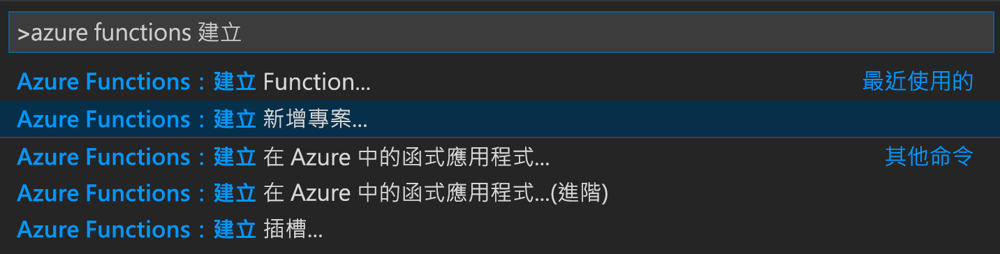
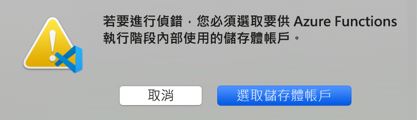

# <a name="create-your-first-durable-function-in-python"></a>使用 Python 建立第一個耐久函式

*Durable Functions* 是 [Azure Functions](../functions-overview.md) 的擴充功能，可讓您在無伺服器環境中撰寫具狀態函式。 此擴充功能會為您管理狀態、設定檢查點和重新啟動。

在本文中，您會了解如何使用 Visual Studio Code Azure Functions 擴充功能，在本機建立及測試 "hello world" 耐久函式。  此函式會協調對其他函式的呼叫並鏈結在一起。 接著會將函式程式碼發佈至 Azure。


## <a name="prerequisites"></a>必要條件

若要完成本教學課程：

* 安裝 [Visual Studio Code](https://code.visualstudio.com/download)。

* 安裝 [Azure Functions](https://marketplace.visualstudio.com/items?itemName=ms-azuretools.vscode-azurefunctions) VS Code 擴充功能。

* 確定您有最新版的 [Azure Functions Core Tools](../functions-run-local.md)。

* Durable Functions 需要 Azure 儲存體帳戶。 您需要 Azure 訂用帳戶。

* 請確定您已安裝 [Python](https://www.python.org/) 版本 3.6、3.7 或 3.8。

[!INCLUDE [quickstarts-free-trial-note](../../../includes/quickstarts-free-trial-note.md)]

## <a name="create-your-local-project"></a><a name="create-an-azure-functions-project"></a>建立本機專案 

在這一節中，您會使用 Visual Studio Code 來建立本機 Azure Functions 專案。 

1. 在 Visual Studio Code 中，按 F1 (或 <kbd>Ctrl/Cmd+Shift+P</kbd>) 以開啟命令選擇區。 在命令選擇區中，搜尋並選取 `Azure Functions: Create New Project...`。

    

1. 為您的專案選擇空白資料夾位置，然後選擇 [選取]。

1. 按照提示提供下列資訊：

    | Prompt | 值 | 描述 |
    | ------ | ----- | ----------- |
    | 為您的函式應用程式專案選取語言 | Python | 建立本機 Python Functions 專案。 |
    | 選取版本 | Azure Functions v3 | 您只會在尚未安裝 Core Tools 時看到此選項。 在此情況下，Core Tools 會在您第一次執行應用程式時安裝。 |
    | Python 版本 | Python 3.6、3.7 或 3.8 | VS Code 將會使用您選取的版本來建立虛擬環境。 |
    | 選取您專案第一個函式的範本 | 暫時跳過 | |
    | 選取您要如何開啟專案 | 在目前視窗中開啟 | 在您選取的資料夾中重新開啟 VS Code。 |

如有需要，Visual Studio Code 安裝 Azure Functions Core Tools。 其也會在資料夾中建立函式應用程式專案。 此專案包含 [host.json](../functions-host-json.md) 和 [local.settings.json](../functions-run-local.md#local-settings-file) 組態檔。

此外，也會在根資料夾中建立一個需求 requirements.txt 檔案。 其會指定執行函數應用程式所需的 Python 套件。

## <a name="update-azure-functions-extension-bundles-version"></a>更新 Azure Functions 擴充功能組合版本

Python Azure Functions 需要 2.x 版的 [Azure Functions 擴充功能組合](../functions-bindings-register.md#access-extensions-in-non-net-languages)。 擴充功能組合設定於 *host.json* 中。

1. 在專案中開啟 *host.json*。 將擴充功能組合 `version` 更新為 `[2.*, 3.0.0)`。 這會指定大於或等於2.0 且小於 3.0 的版本範圍。

    ```json
    "extensionBundle": {
        "id": "Microsoft.Azure.Functions.ExtensionBundle",
        "version": "[2.*, 3.0.0)"
    }
    ```

1. 必須先重新載入 VS Code，才會反映更新的擴充功能組合版本。 在命令選擇區中，搜尋 *開發人員：重新載入視窗* 命令，並加以執行。

## <a name="install-azure-functions-durable-from-pypi"></a>從 PyPI 安裝 azure-functions-durable

當您建立專案時，Azure Functions VS Code 擴充功能會自動使用您選取的 Python 版本建立虛擬環境。 您將會在終端機中啟用虛擬環境，並安裝 Azure Functions 和 Durable Functions 所需的一些相依性。

1. 在編輯器中開啟 *requirements.txt*，並將其內容變更為下列內容：

    ```
    azure-functions
    azure-functions-durable>=1.0.0b12
    ```

1. 在目前的資料夾中開啟編輯器的整合式終端 (<kbd>Ctrl+Shift+`</kbd>)。

1. 在整合式終端中，啟動目前資料夾中的虛擬環境：

    **Linux 或 macOS**

    ```bash
    source .venv/bin/activate
    ```

    **Windows**

    ```powershell
    .venv\scripts\activate
    ```

    

1. 在啟動虛擬環境的整合式終端中，使用 pip 來安裝您剛定義的套件：

    ```bash
    python -m pip install -r requirements.txt
    ```

## <a name="create-your-functions"></a>建立您的函式

基本的 Durable Functions 應用程式會包含三個函式：

* 協調器函式 - 描述用於協調其他函式的工作流程。
* 活動函式 - 由協調器函式呼叫，可執行工作並選擇性地傳回值。
* 用戶端函式 - 可啟動協調器函式的一般 Azure 函式。 此範例會使用 HTTP 觸發的函式。

### <a name="orchestrator-function"></a>協調器函式

您將使用範本在您的專案中建立耐久函式程式碼。

1. 在命令選擇區中，搜尋並選取 `Azure Functions: Create Function...`。

1. 按照提示提供下列資訊：

    | Prompt | 值 | 描述 |
    | ------ | ----- | ----------- |
    | 選取函式的範本 | Durable Functions orchestrator | 建立 Durable Functions 協調流程 |
    | 提供函式名稱 | HelloOrchestrator | 耐久函式的名稱 |

您已新增協調器來協調活動函式。 開啟 *HelloOrchestrator/\_\_init__.py* 以查看協調器函式。 `context.call_activity` 的每個呼叫都會叫用名為 `Hello` 的活動函式。

接下來，您將新增參考的 `Hello` 活動函式。

### <a name="activity-function"></a>活動函式

1. 在命令選擇區中，搜尋並選取 `Azure Functions: Create Function...`。

1. 按照提示提供下列資訊：

    | Prompt | 值 | 描述 |
    | ------ | ----- | ----------- |
    | 選取函式的範本 | Durable Functions 活動 | 建立活動函式 |
    | 提供函式名稱 | 您好 | 活動函式的名稱 |

您已新增協調器所叫用的 `Hello` 活動函式。 開啟 *Hello/\_\_init__.py* 以查看其是否接受名稱作為輸入，並傳回問候語。 活動函式是您將執行動作的地方，例如進行資料庫呼叫或執行計算。

最後，您會新增一個啟動協調流程的 HTTP 觸發函式。

### <a name="client-function-http-starter"></a>用戶端函式 (HTTP 入門)

1. 在命令選擇區中，搜尋並選取 `Azure Functions: Create Function...`。

1. 按照提示提供下列資訊：

    | Prompt | 值 | 描述 |
    | ------ | ----- | ----------- |
    | 選取函式的範本 | Durable Functions HTTP 入門 | 建立 HTTP 入門函式 |
    | 提供函式名稱 | DurableFunctionsHttpStart | 活動函式的名稱 |
    | 授權層級 | 匿名 | 基於示範目的，我們允許在沒有驗證的情況下呼叫函式 |

您已新增可啟動協調流程的 HTTP 觸發函式。 開啟 *DurableFunctionsHttpStart/\_\_init__.py*，以查看其是否使用 `client.start_new` 來啟動新的協調流程。 然後，該函式會使用 `client.create_check_status_response` 傳回 HTTP 回應，其中包含可用於監視和管理新協調流程的 URL。

您現在有一個可在本機執行並部署至 Azure 的 Durable Functions 應用程式。

## <a name="test-the-function-locally"></a>在本機測試函式

Azure Functions Core Tools 可讓您在本機開發電腦上執行 Azure Functions 專案。 第一次從 Visual Studio Code 啟動函式時，系統會提示您安裝這些工具 (如果您尚未安裝)。

1. 若要測試您的函式，請在 `Hello` 活動函式程式碼 (*Hello/\_\_init__.py*) 中設定中斷點。 按 F5 鍵，或從命令選擇區選取 `Debug: Start Debugging`，以啟動函式應用程式專案。 Core Tools 的輸出會顯示在 **終端機** 面板中。

    > [!NOTE]
    > 如需有關偵錯的詳細資訊，請參閱 [Durable Functions 診斷](durable-functions-diagnostics.md#debugging)。

1. Durable Functions 需要執行 Azure 儲存體帳戶。 當 VS Code 提示您選取儲存體帳戶時，請選擇 [選取儲存體帳戶]  。

    

1. 遵循提示來提供下列資訊，即可在 Azure 中建立新的儲存體帳戶。

    | Prompt | 值 | 描述 |
    | ------ | ----- | ----------- |
    | 選取訂閱 | 您的訂用帳戶名稱  | 選取您的 Azure 訂用帳戶 |
    | 選取儲存體帳戶 | 建立新的儲存體帳戶 |  |
    | 輸入新儲存體帳戶的名稱 | 唯一名稱  | 要建立的儲存體帳戶名稱 |
    | 選取資源群組 | 唯一名稱  | 要建立的資源群組名稱 |
    | 選取位置 | *region* | 選取您附近的區域 |

1. 在 **終端機** 面板中，複製 HTTP 觸發函式的 URL 端點。

    

1. 使用瀏覽器或 [Postman](https://www.getpostman.com/) 或 [cURL](https://curl.haxx.se/) 之類的工具，將 HTTP 要求傳送至 URL 端點。 將最後一個區段取代為協調器函式的名稱 (`HelloOrchestrator`)。 此 URL 應類似於 `http://localhost:7071/api/orchestrators/HelloOrchestrator`。

   回應是 HTTP 函式的初始結果，讓您知道耐久協調流程已成功啟動。 這還不是協調流程的最終結果。 回應包含一些實用的 URL。 讓現在我們查詢協調流程的狀態。

1. 複製 `statusQueryGetUri` 的 URL 值並將它貼在瀏覽器的網址列中，然後執行要求。 或者，您也可以繼續使用 Postman 來發出 GET 要求。

   此要求會查詢協調流程執行個體的狀態。 您應該會取得最終回應，內容指出執行個體已完成，並包含耐久函式的輸出或結果。 如下所示： 

    ```json
    {
        "name": "HelloOrchestrator",
        "instanceId": "9a528a9e926f4b46b7d3deaa134b7e8a",
        "runtimeStatus": "Completed",
        "input": null,
        "customStatus": null,
        "output": [
            "Hello Tokyo!",
            "Hello Seattle!",
            "Hello London!"
        ],
        "createdTime": "2020-03-18T21:54:49Z",
        "lastUpdatedTime": "2020-03-18T21:54:54Z"
    }
    ```

1. 若要停止偵錯，請在 VS Code 中按 <kbd>Shift+F5</kbd>。

確認函式在本機電腦上正確執行之後，就可以將專案發佈到 Azure。

[!INCLUDE [functions-create-function-app-vs-code](../../../includes/functions-sign-in-vs-code.md)]

[!INCLUDE [functions-publish-project-vscode](../../../includes/functions-publish-project-vscode.md)]

## <a name="test-your-function-in-azure"></a>在 Azure 中測試您的函式

1. 從 [輸出]  面板中複製 HTTP 觸發程序的 URL。 呼叫 HTTP 觸發函式的 URL 應採用下列格式：`http://<functionappname>.azurewebsites.net/orchestrators/HelloOrchestrator`

2. 將 HTTP 要求的新 URL 貼到瀏覽器的網址列。 在使用已發佈的應用程式之前，您應會取得如同以往的相同狀態回應。

## <a name="next-steps"></a>後續步驟

您已使用 Visual Studio Code 來建立及發佈 Python 耐久函式應用程式。

> [!div class="nextstepaction"]
> [了解常見的耐久函式模式](durable-functions-overview.md#application-patterns)
