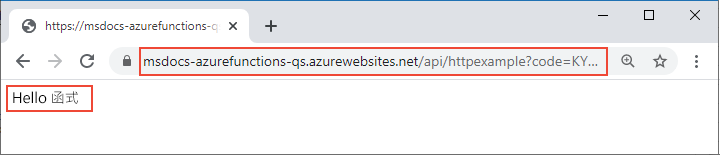

# <a name="connect-azure-functions-to-azure-storage-using-command-line-tools"></a>使用命令列工具將 Azure Functions 連線到 Azure 儲存體

在本文中，您將整合 Azure 儲存體佇列與您在[前一個快速入門](functions-create-first-azure-function-azure-cli.md)中建立的函式和儲存體帳戶。 您可以使用*輸出繫結*將 HTTP 要求中的資料寫入至佇列中的訊息，以完成這項整合。 完成本文的作業，並不會在先前的快速入門收取的幾美分以外產生額外的費用。 若要深入了解繫結，請參閱 [Azure Functions 觸發程序和繫結概念](functions-triggers-bindings.md)。

## <a name="configure-your-local-environment"></a>設定您的本機環境

開始之前，您必須先完成[快速入門：從命令列建立 Azure Functions 專案](functions-create-first-azure-function-azure-cli.md)。 如果您已在該文章結束時清除資源，請重新執行這些步驟以在 Azure 中重新建立函式應用程式和相關資源。

[!INCLUDE [functions-cli-get-storage-connection](../../includes/functions-cli-get-storage-connection.md)]

[!INCLUDE [functions-register-storage-binding-extension-csharp](../../includes/functions-register-storage-binding-extension-csharp.md)]

[!INCLUDE [functions-add-output-binding-cli](../../includes/functions-add-output-binding-cli.md)]

::: zone pivot="programming-language-csharp"  
[!INCLUDE [functions-add-storage-binding-csharp-library](../../includes/functions-add-storage-binding-csharp-library.md)]  
::: zone-end  
::: zone pivot="programming-language-java" 
[!INCLUDE [functions-add-output-binding-java-cli](../../includes/functions-add-output-binding-java-cli.md)]
::: zone-end   

如需繫結的詳細資訊，請參閱 [Azure Functions 觸發程序和繫結概念](functions-triggers-bindings.md)與[佇列輸出設定](functions-bindings-storage-queue-output.md#configuration)。

## <a name="add-code-to-use-the-output-binding"></a>新增程式碼以使用輸出繫結

定義了佇列繫結後，您現在可以更新函式以接收 `msg` 輸出參數，並將訊息寫入至佇列。

::: zone pivot="programming-language-python"     
[!INCLUDE [functions-add-output-binding-python](../../includes/functions-add-output-binding-python.md)]
::: zone-end  

::: zone pivot="programming-language-javascript"  
[!INCLUDE [functions-add-output-binding-js](../../includes/functions-add-output-binding-js.md)]
::: zone-end  

::: zone pivot="programming-language-typescript"  
[!INCLUDE [functions-add-output-binding-ts](../../includes/functions-add-output-binding-ts.md)]
::: zone-end  

::: zone pivot="programming-language-powershell"  
[!INCLUDE [functions-add-output-binding-powershell](../../includes/functions-add-output-binding-powershell.md)]  
::: zone-end

::: zone pivot="programming-language-csharp"  
[!INCLUDE [functions-add-storage-binding-csharp-library-code](../../includes/functions-add-storage-binding-csharp-library-code.md)]
::: zone-end 

::: zone pivot="programming-language-java"
[!INCLUDE [functions-add-output-binding-java-code](../../includes/functions-add-output-binding-java-code.md)]

[!INCLUDE [functions-add-output-binding-java-test-cli](../../includes/functions-add-output-binding-java-test-cli.md)]
::: zone-end

請留意，您*無須*撰寫任何程式碼來進行驗證、取得佇列參考或寫入資料。 這些整合工作全都可在 Azure Functions 執行階段和佇列輸出繫結中輕易處理。

[!INCLUDE [functions-run-function-test-local-cli](../../includes/functions-run-function-test-local-cli.md)]

[!INCLUDE [functions-extension-bundles-info](../../includes/functions-extension-bundles-info.md)]

## <a name="view-the-message-in-the-azure-storage-queue"></a>檢視 Azure 儲存體佇列中的訊息

[!INCLUDE [functions-add-output-binding-view-queue-cli](../../includes/functions-add-output-binding-view-queue-cli.md)]

## <a name="redeploy-the-project-to-azure"></a>將專案重新部署至 Azure

現在，您已在本機確認函式已將訊息寫入至 Azure 儲存體佇列，您可以重新部署專案，以更新在 Azure 上執行的端點。

::: zone pivot="programming-language-javascript,programming-language-typescript,programming-language-python,programming-language-powershell,programming-language-csharp" 
在 *LocalFunctionsProj* 資料夾中，使用 [`func azure functionapp publish`](functions-run-local.md#project-file-deployment) 命令來重新部署專案 (請將 `<APP_NAME>` 取代為您的應用程式名稱)。

```
func azure functionapp publish <APP_NAME>
```
::: zone-end  

::: zone pivot="programming-language-java" 

在 [本機專案] 資料夾中，使用下列 Maven 命令來重新發佈專案：
```
mvn azure-functions:deploy
```
::: zone-end

## <a name="verify-in-azure"></a>在 Azure 中驗證

1. 如先前的快速入門所示，使用瀏覽器或 CURL 來測試已重新部署的函式。

    # <a name="browser"></a>[瀏覽器](#tab/browser)
    
    將發佈命令的輸出中顯示的完整**叫用 URL** 複製到瀏覽器網址列中 (請附加查詢參數 `&name=Functions`)。 瀏覽器應該會顯示與您在本機執行函式時類似的輸出。

    

    # <a name="curl"></a>[curl](#tab/curl)
    
    使用**叫用 URL** 來執行 [`curl`](https://curl.haxx.se/) (請附加參數 `&name=Functions`)。 命令的輸出應該是文字 "Hello Functions"。
    
    

    --- 

1. 再次檢查儲存體佇列 (如上一節所述)，以確認其中包含寫入至佇列的新訊息。

## <a name="clean-up-resources"></a>清除資源

完成之後，請使用下列命令刪除資源群組及其包含的所有資源，以避免產生額外的成本。

```azurecli
az group delete --name AzureFunctionsQuickstart-rg
```

## <a name="next-steps"></a>後續步驟

您已更新 HTTP 觸發的函式，以將資料寫入至儲存體佇列。 您現在可以深入了解如何使用 Core Tools 和 Azure CLI，從命令列開發 Functions：

+ [使用 Azure Functions Core Tools](functions-run-local.md)  

::: zone pivot="programming-language-csharp"  
+ [C# 中完整函式專案的範例](/samples/browse/?products=azure-functions&languages=csharp)。

+ [Azure Functions C# 開發人員參考](functions-dotnet-class-library.md)  
::: zone-end 
::: zone pivot="programming-language-javascript"  
+ [JavaScript 中完整函式專案的範例](/samples/browse/?products=azure-functions&languages=javascript)。

+ [Azure Functions JavaScript 開發人員指南](functions-reference-node.md)  
::: zone-end  
::: zone pivot="programming-language-typescript"  
+ [TypeScript 中完整函式專案的範例](/samples/browse/?products=azure-functions&languages=typescript)。

+ [Azure Functions TypeScript 開發人員指南](functions-reference-node.md#typescript)  
::: zone-end  
::: zone pivot="programming-language-python"  
+ [Python 中完整函式專案的範例](/samples/browse/?products=azure-functions&languages=python)。

+ [Azure Functions Python 開發人員指南](functions-reference-python.md)  
::: zone-end  
::: zone pivot="programming-language-powershell"  
+ [PowerShell 中完整函式專案的例](/samples/browse/?products=azure-functions&languages=azurepowershell)。

+ [Azure Functions PowerShell 開發人員指南](functions-reference-powershell.md) 
::: zone-end
+ [Azure Functions 觸發程序和繫結](functions-triggers-bindings.md)

+ [Functions 定價頁面](https://azure.microsoft.com/pricing/details/functions/)

+ [估計取用方案成本](functions-consumption-costs.md) 
