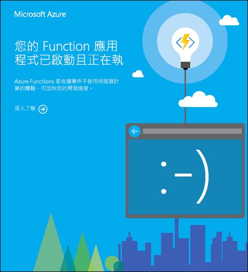

# <a name="app-settings-reference-for-azure-functions"></a>Azure Functions 的應用程式設定參考

函式應用程式中應用程式設定所包含的全域設定選項會影響該函式應用程式的所有函式。 當您在本機執行時，這些設定會當作本機[環境變數](functions-run-local.md#local-settings-file)來使用。 本文列出函式應用程式中可用的應用程式設定。

[!INCLUDE [Function app settings](../../includes/functions-app-settings.md)]

在 [host.json](functions-host-json.md) 檔案和 [local.settings.json](functions-run-local.md#local-settings-file) 檔案中，還有其他全域設定選項。

> [!NOTE]  
> 您可以使用應用程式設定來覆寫設定值的 host.js，而不需要變更檔案本身的 host.js。 當您需要針對特定環境設定或修改特定的 host.js設定時，這會很有説明。 這也可讓您變更 host.js設定，而不需要重新發佈專案。 若要深入瞭解，請參閱 [host.js的參考文章](functions-host-json.md#override-hostjson-values)。  

## <a name="appinsights_instrumentationkey"></a>APPINSIGHTS_INSTRUMENTATIONKEY

Application Insights 的檢測金鑰。 只使用或的其中一個 `APPINSIGHTS_INSTRUMENTATIONKEY` `APPLICATIONINSIGHTS_CONNECTION_STRING` 。 當 Application Insights 在主權雲端中執行時，請使用 `APPLICATIONINSIGHTS_CONNECTION_STRING` 。 如需詳細資訊，請參閱 [如何設定 Azure Functions 的監視](configure-monitoring.md)。 

|Key|範例值|
|---|------------|
|APPINSIGHTS_INSTRUMENTATIONKEY|55555555-af77-484b-9032-64f83bb83bb|

## <a name="applicationinsights_connection_string"></a>APPLICATIONINSIGHTS_CONNECTION_STRING

Application Insights 的連接字串。 `APPLICATIONINSIGHTS_CONNECTION_STRING` `APPINSIGHTS_INSTRUMENTATIONKEY` 在下列情況下，請使用而非：

+ 當您的函數應用程式需要使用連接字串所支援的新增自訂時。 
+ 當您的 Application Insights 實例在主權雲端中執行時，需要自訂端點。

如需詳細資訊，請參閱 [連接字串](../azure-monitor/app/sdk-connection-string.md)。 

|Key|範例值|
|---|------------|
|APPLICATIONINSIGHTS_CONNECTION_STRING|InstrumentationKey = [key]; IngestionEndpoint = [url];LiveEndpoint = [url];ProfilerEndpoint = [url];SnapshotEndpoint = [url];|

## <a name="azure_function_proxy_disable_local_call"></a>AZURE_FUNCTION_PROXY_DISABLE_LOCAL_CALL

根據預設，函式 proxy 會使用快捷 [方式，直接](functions-proxies.md) 將 API 呼叫從 proxy 傳送至相同函式應用程式中的函式。 使用這個快捷方式，而不是建立新的 HTTP 要求。 此設定可讓您停用該快捷方式的行為。

|Key|值|描述|
|-|-|-|
|AZURE_FUNCTION_PROXY_DISABLE_LOCAL_CALL|true|具有指向區域函式應用程式中函式之後端 URL 的呼叫，不會直接傳送至函式。 相反地，會將要求導向回函式應用程式的 HTTP 前端。|
|AZURE_FUNCTION_PROXY_DISABLE_LOCAL_CALL|false|具有指向區域函式應用程式中函式之後端 URL 的呼叫，會直接轉送至函式。 這是預設值。 |

## <a name="azure_function_proxy_backend_url_decode_slashes"></a>AZURE_FUNCTION_PROXY_BACKEND_URL_DECODE_SLASHES

這 `%2F` 項設定會控制當字元插入至後端 URL 時，是否要將這些字元解碼為路由參數中的斜線。 

|Key|值|描述|
|-|-|-|
|AZURE_FUNCTION_PROXY_BACKEND_URL_DECODE_SLASHES|true|具有編碼斜線的路由參數會解碼。 |
|AZURE_FUNCTION_PROXY_BACKEND_URL_DECODE_SLASHES|false|所有路由參數都會原封不動地傳遞，這是預設行為。 |

例如，請考慮網域上的函式應用程式的 proxies.json 檔案 `myfunction.com` 。

```JSON
{
    "$schema": "http://json.schemastore.org/proxies",
    "proxies": {
        "root": {
            "matchCondition": {
                "route": "/{*all}"
            },
            "backendUri": "example.com/{all}"
        }
    }
}
```

當 `AZURE_FUNCTION_PROXY_BACKEND_URL_DECODE_SLASHES` 設定為時 `true` ，URL 會 `example.com/api%2ftest` 解析為 `example.com/api/test` 。 根據預設，URL 會維持不變 `example.com/test%2fapi` 。 如需詳細資訊，請參閱 [函數](functions-proxies.md)proxy。

## <a name="azure_functions_environment"></a>AZURE_FUNCTIONS_ENVIRONMENT

在2.x 版和更新版本的函式執行時間中，會根據執行時間環境來設定應用程式行為。 此值會 [在初始化期間讀取](https://github.com/Azure/azure-functions-host/blob/dev/src/WebJobs.Script.WebHost/Program.cs#L43)。 您可以設定 `AZURE_FUNCTIONS_ENVIRONMENT` 為任何值，但支援 [三個值](/dotnet/api/microsoft.aspnetcore.hosting.environmentname) ： [開發](/dotnet/api/microsoft.aspnetcore.hosting.environmentname.development)、 [預備](/dotnet/api/microsoft.aspnetcore.hosting.environmentname.staging)和 [生產環境](/dotnet/api/microsoft.aspnetcore.hosting.environmentname.production)。 `AZURE_FUNCTIONS_ENVIRONMENT`若未設定，它會預設為 `Development` 本機環境和 `Production` Azure 上的。 應該使用此設定，而不是 `ASPNETCORE_ENVIRONMENT` 設定執行時間環境。 

## <a name="azurefunctionsjobhost__"></a>AzureFunctionsJobHost__\*

在2.x 版和更新版本的函式執行時間中，應用程式設定可以覆寫目前環境中設定的 [host.js](functions-host-json.md) 。 這些覆寫會以名為的應用程式設定來表示 `AzureFunctionsJobHost__path__to__setting` 。 如需詳細資訊，請參閱覆 [寫值的 host.js](functions-host-json.md#override-hostjson-values)。

## <a name="azurewebjobsdashboard"></a>AzureWebJobsDashboard

選擇性儲存體帳戶連接字串，用於儲存記錄並將它們顯示在入口網站的 [監視器] 索引標籤中。 這項設定僅適用于以 Azure Functions 執行時間1.x 版為目標的應用程式。 儲存體帳戶必須是一般用途的帳戶，支援 Blob、佇列和資料表。 若要深入了解，請參閱[儲存體帳戶需求](storage-considerations.md#storage-account-requirements)。

|Key|範例值|
|---|------------|
|AzureWebJobsDashboard|DefaultEndpointsProtocol=https;AccountName=<name>;AccountKey=<key>|

> [!NOTE]
> 為了獲得更好的效能和經驗，runtime 2.x 版和更新版本會使用 APPINSIGHTS_INSTRUMENTATIONKEY 和 App Insights 進行監視，而不是 `AzureWebJobsDashboard` 。

## <a name="azurewebjobsdisablehomepage"></a>AzureWebJobsDisableHomepage

`true` 表示停用針對函式應用程式根 URL 所顯示的預設登陸頁面。 預設為 `false`。

|Key|範例值|
|---|------------|
|AzureWebJobsDisableHomepage|true|

省略這個應用程式設定或將其設為 `false` 時，會顯示與下列範例類似的頁面，以回應 URL `<functionappname>.azurewebsites.net`。



## <a name="azurewebjobsdotnetreleasecompilation"></a>AzureWebJobsDotNetReleaseCompilation

`true` 表示在編譯 .NET 程式碼時使用「釋放」模式；`false` 表示使用「偵錯」模式。 預設為 `true`。

|Key|範例值|
|---|------------|
|AzureWebJobsDotNetReleaseCompilation|true|

## <a name="azurewebjobsfeatureflags"></a>AzureWebJobsFeatureFlags

要啟用的搶鮮版 (Beta) 功能清單 (以逗號分隔)。 這些旗標所啟用的搶鮮版 (Beta) 功能還不適合在生產環境內使用，但在上線之前可以針對實驗使用予以啟用。

|Key|範例值|
|---|------------|
|AzureWebJobsFeatureFlags|feature1,feature2|

## <a name="azurewebjobssecretstoragetype"></a>AzureWebJobsSecretStorageType

指定要用於金鑰儲存的存放庫或提供者。 目前支援的存放庫是 Blob 儲存體 ("Blob") 和本機檔案系統 ("Files")。 預設值在第 2 版中為 Blob，在第 1 版中則為檔案系統。

|Key|範例值|
|---|------------|
|AzureWebJobsSecretStorageType|檔案|

## <a name="azurewebjobsstorage"></a>AzureWebJobsStorage

Azure Functions 執行時間會使用此儲存體帳戶連接字串來進行一般作業。 此儲存體帳戶的一些用途包括金鑰管理、計時器觸發程式管理，以及事件中樞檢查點。 儲存體帳戶必須是一般用途的帳戶，支援 Blob、佇列和資料表。 請參閱[儲存體帳戶](functions-infrastructure-as-code.md#storage-account)和[儲存體帳戶需求](storage-considerations.md#storage-account-requirements)。

|Key|範例值|
|---|------------|
|AzureWebJobsStorage|DefaultEndpointsProtocol=https;AccountName=[name];AccountKey=[key]|

## <a name="azurewebjobs_typescriptpath"></a>AzureWebJobs_TypeScriptPath

用於 TypeScript 之編譯器的路徑。 可讓您覆寫預設值 (需要的話)。

|Key|範例值|
|---|------------|
|AzureWebJobs_TypeScriptPath|%HOME%\typescript|

## <a name="function_app_edit_mode"></a>FUNCTION\_APP\_EDIT\_MODE

指定是否啟用 Azure 入口網站中的編輯。 有效值為 "readwrite" 和 "readonly"。

|Key|範例值|
|---|------------|
|FUNCTION\_APP\_EDIT\_MODE|readonly|

## <a name="functions_extension_version"></a>FUNCTIONS\_EXTENSION\_VERSION

要在此函式應用程式中使用的 Functions 執行階段版本。 含主要版本的波狀符號表示使用該主要版本的最新版本 (例如，"~2")。 有相同主要版本的新版本可用時，會將它們自動安裝在函式應用程式中。 若要將應用程式釘選至特定版本，請使用完整版本號碼 (例如，"2.0.12345")。 預設值為 "~2"。 `~1` 的值會將您的應用程式釘選至 1.x 版執行階段。

|Key|範例值|
|---|------------|
|FUNCTIONS\_EXTENSION\_VERSION|~2|

## <a name="functions_v2_compatibility_mode"></a>函數 \_ V2 \_ 相容性 \_ 模式

這項設定可讓您的函數應用程式在2.x 版執行時間的2.x 版相容模式中執行。 只有在將函式 [應用程式從2.x 版升級至3.x 的運行](functions-versions.md#migrating-from-2x-to-3x)時間時遇到問題時，才使用此設定。 

>[!IMPORTANT]
> 這項設定僅適用于當您更新應用程式以在3.x 版上正確執行的短期因應措施。 只要 [支援2.x 運行](functions-versions.md)時間，就會支援此設定。 如果您遇到會導致應用程式無法在3.x 版上執行的問題，而不使用此設定，請 [報告您的問題](https://github.com/Azure/azure-functions-host/issues/new?template=Bug_report.md)。

需要將函式 [ \_ 擴充功能 \_ 版本](functions-app-settings.md#functions_extension_version) 設定為 `~3` 。

|Key|範例值|
|---|------------|
|函數 \_ V2 \_ 相容性 \_ 模式|true|

## <a name="functions_worker_process_count"></a>函數 \_ 工作者 \_ 進程 \_ 計數

指定語言工作者進程的最大數目，預設值為 `1` 。 允許的最大值為 `10` 。 函式呼叫會平均分散在不同的語言工作者進程中。 每隔10秒就會產生一次語言工作者進程，直到 \_ 達到函式工作者 \_ 進程計數所設定的計數為止 \_ 。 使用多個語言工作者進程與 [縮放](functions-scale.md)不同。 當您的工作負載混合 CPU 系結和 i/o 系結調用時，請考慮使用此設定。 此設定適用于所有 non-.NET 語言。

|Key|範例值|
|---|------------|
|函數 \_ 工作者 \_ 進程 \_ 計數|2|

## <a name="python_threadpool_thread_count"></a>PYTHON \_ \_ 執行緒執行緒 \_ 計數

指定 Python 語言背景工作角色用來執行函式調用的執行緒數目上限，預設值 `1` 為 Python 版本的預設值 `3.8` 。 針對 Python 版本 `3.9` 和更新版本，此值會設定為 `None` 。 請注意，此設定不保證在執行期間將設定的執行緒數目。 此設定可讓 Python 將執行緒數目展開為指定的值。 此設定僅適用于 Python 函數應用程式。 此外，此設定會套用至同步函式調用，而不會用於協同程式。

|Key|範例值|最大值|
|---|------------|---------|
|PYTHON \_ \_ 執行緒執行緒 \_ 計數|2|32|


## <a name="functions_worker_runtime"></a>FUNCTIONS\_WORKER\_RUNTIME

要在函式應用程式中載入的語言背景工作角色執行階段。  這會對應至您應用程式 (例如，"dotnet") 中所使用的語言。 對於使用多種語言的函式，您必須將其發佈到多個應用程式，每個都有對應的背景工作角色執行階段值。  有效的值包括 `dotnet` (c #/f # ) 、 `node` (JavaScript/TypeScript) 、 `java` (JAVA) 、 `powershell` (PowerShell) 和 `python` (Python) 。

|Key|範例值|
|---|------------|
|FUNCTIONS\_WORKER\_RUNTIME|dotnet|

## <a name="pip_extra_index_url"></a>PIP \_ 額外 \_ 索引 \_ URL

此設定的值表示適用于 Python 應用程式的自訂套件索引 URL。 當您需要使用在額外的封裝索引中找到的自訂相依性來執行遠端組建時，請使用此設定。   

|Key|範例值|
|---|------------|
|PIP \_ 額外 \_ 索引 \_ URL|http://my.custom.package.repo/simple |

若要深入瞭解，請參閱 Python 開發人員參考中的 [自訂](functions-reference-python.md#remote-build-with-extra-index-url) 相依性。

## <a name="scale_controller_logging_enable"></a>調整 \_ 控制器 \_ 記錄 \_ 啟用

_此設定目前為預覽狀態。_  

此設定會控制 Azure Functions 調整控制器的記錄。 如需詳細資訊，請參閱 [調整控制器記錄](functions-monitoring.md#scale-controller-logs)。

|Key|範例值|
|-|-|
|SCALE_CONTROLLER_LOGGING_ENABLE|AppInsights： Verbose|

此索引鍵的值是以格式提供 `<DESTINATION>:<VERBOSITY>` ，其定義如下：

[!INCLUDE [functions-scale-controller-logging](../../includes/functions-scale-controller-logging.md)]

## <a name="website_contentazurefileconnectionstring"></a>網站 \_ CONTENTAZUREFILECONNECTIONSTRING

儲存體帳戶的連接字串，其中函式應用程式程式碼和設定會儲存在 Windows 上執行的事件驅動調整計畫中。 如需詳細資訊，請參閱 [建立函數應用程式](functions-infrastructure-as-code.md#windows)。

|Key|範例值|
|---|------------|
|WEBSITE_CONTENTAZUREFILECONNECTIONSTRING|DefaultEndpointsProtocol=https;AccountName=[name];AccountKey=[key]|

只有在部署到在 Windows 上執行的耗用量或高階方案時，才會使用。 不支援 Linux。 變更或移除此設定可能會導致您的函數應用程式無法啟動。 若要深入瞭解，請參閱 [這篇疑難排解文章](functions-recover-storage-account.md#storage-account-application-settings-were-deleted)。 

## <a name="website_contentovervnet"></a>網站 \_ CONTENTOVERVNET

僅適用于 Premium 方案。 的值可讓您的函式 `1` 應用程式在您的儲存體帳戶限制為虛擬網路時進行調整。 將您的儲存體帳戶限制為虛擬網路時，您應該啟用此設定。 若要深入瞭解，請參閱將 [您的儲存體帳戶限制為虛擬網路](functions-networking-options.md#restrict-your-storage-account-to-a-virtual-network)。

|Key|範例值|
|---|------------|
|WEBSITE_CONTENTOVERVNET|1|

## <a name="website_contentshare"></a>WEBSITE\_CONTENTSHARE

函式應用程式程式碼的檔案路徑，以及 Windows 上事件驅動調整計畫中的設定。 Used with WEBSITE_CONTENTAZUREFILECONNECTIONSTRING. 預設值是開頭為函式應用程式名稱的唯一字串。 請參閱[建立函式應用程式](functions-infrastructure-as-code.md#windows)。

|Key|範例值|
|---|------------|
|WEBSITE_CONTENTSHARE|functionapp091999e2|

僅供函式應用程式在 Windows 上執行的耗用量或高階方案上使用。 不支援 Linux。 變更或移除此設定可能會導致您的函數應用程式無法啟動。 若要深入瞭解，請參閱 [這篇疑難排解文章](functions-recover-storage-account.md#storage-account-application-settings-were-deleted)。

使用 Azure Resource Manager 在部署期間建立函數應用程式時，請勿在範本中包含 WEBSITE_CONTENTSHARE。 此應用程式設定會在部署期間產生。 若要深入瞭解，請參閱 [將函數應用程式的資源部署自動化](functions-infrastructure-as-code.md#windows)。   

## <a name="website_max_dynamic_application_scale_out"></a>WEBSITE\_MAX\_DYNAMIC\_APPLICATION\_SCALE\_OUT

函式應用程式可相應放大的執行個體數目上限。 預設值是無限制。

> [!IMPORTANT]
> 此設定目前為預覽狀態。  已新增函式 [最大 scale out 的應用程式屬性](./event-driven-scaling.md#limit-scale-out) ，而且是限制 scale out 的建議方式。

|Key|範例值|
|---|------------|
|WEBSITE\_MAX\_DYNAMIC\_APPLICATION\_SCALE\_OUT|5|

## <a name="website_node_default_version"></a>WEBSITE\_NODE\_DEFAULT_VERSION

_僅限 Windows。_  
設定當您在 Windows 上執行函數應用程式時，所要使用的 Node.js 版本。 您應該使用波狀符號 (~) 讓執行時間使用目標主要版本的最新可用版本。 例如，當設定為時 `~10` ，就會使用 Node.js 10 的最新版本。 當主要版本以波狀符號為目標時，您不需要手動更新次要版本。 

|Key|範例值|
|---|------------|
|WEBSITE\_NODE\_DEFAULT_VERSION|~ 10|

## <a name="website_run_from_package"></a>WEBSITE\_RUN\_FROM\_PACKAGE

可讓函式應用程式從掛接的套件檔案執行。

|Key|範例值|
|---|------------|
|WEBSITE\_RUN\_FROM\_PACKAGE|1|

有效值為 URL (可解析為部署套件檔案的位置) 或 `1`。 設定為 `1` 時，套件必須位於 `d:\home\data\SitePackages` 資料夾。 搭配使用 ZIP 部署與這項設定時，系統會將套件自動上傳到這個位置。 在預覽中，這項設定命名為 `WEBSITE_RUN_FROM_ZIP`。 如需詳細資訊，請參閱[從套件檔案執行函式](run-functions-from-deployment-package.md)。

## <a name="website_time_zone"></a>網站 \_ 時區 \_

可讓您設定函數應用程式的時區。 

|Key|OS|範例值|
|---|--|------------|
|網站 \_ 時區 \_|Windows|美加東部標準時間|
|網站 \_ 時區 \_|Linux|北美洲/New_York|

[!INCLUDE [functions-timezone](../../includes/functions-timezone.md)]

## <a name="next-steps"></a>後續步驟

[了解如何更新應用程式設定](functions-how-to-use-azure-function-app-settings.md#settings)

[請參閱 host.json 檔案中的全域設定](functions-host-json.md)

[查看 App Service 應用程式的其他應用程式設定](https://github.com/projectkudu/kudu/wiki/Configurable-settings)
