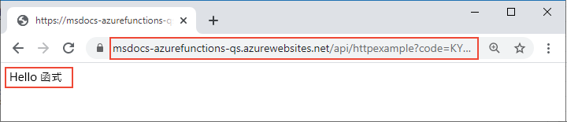

# <a name="quickstart-create-a-function-in-azure-that-responds-to-http-requests"></a>快速入門：在 Azure 中建立可回應 HTTP 要求的函式

::: zone pivot="programming-language-csharp"  
在本文中，您會使用命令列工具建立可回應 HTTP 要求的 C# 類別庫函式。 在本機測試程式碼之後，您可以將其部署到 Azure Functions 的無伺服器環境。 
::: zone-end  
::: zone pivot="programming-language-javascript"
在本文中，您會使用命令列工具建立可回應 HTTP 要求的 JavaScript 函式。 在本機測試程式碼之後，您可以將其部署到 Azure Functions 的無伺服器環境。 
::: zone-end
::: zone pivot="programming-language-typescript"
在本文中，您會使用命令列工具建立可回應 HTTP 要求的 TypeScript 函式。 在本機測試程式碼之後，您可以將其部署到 Azure Functions 的無伺服器環境。 
::: zone-end   
::: zone pivot="programming-language-powershell"
在本文中，您會使用命令列工具建立可回應 HTTP 要求的 PowerShell 函式。 在本機測試程式碼之後，您可以將其部署到 Azure Functions 的無伺服器環境。 
::: zone-end  
::: zone pivot="programming-language-python" 
在本文中，您會使用命令列工具建立可回應 HTTP 要求的 Python 函式。 在本機測試程式碼之後，您可以將其部署到 Azure Functions 的無伺服器環境。 
::: zone-end  
::: zone pivot="programming-language-java" 
在本文中，您會使用命令列工具建立可回應 HTTP 要求的 Java 函式。 在本機測試程式碼之後，您可以將其部署到 Azure Functions 的無伺服器環境。 
::: zone-end

完成本快速入門後，您的 Azure 帳戶中會產生幾美分或更少的少許費用。

::: zone pivot="programming-language-csharp,programming-language-javascript,programming-language-typescript,programming-language-powershell,programming-language-python"  
這也是本文的 [Visual Studio Code 版本](functions-create-first-function-vs-code.md)。
::: zone-end  
::: zone pivot="programming-language-java"  
> [!NOTE]
> 如果 Maven 不是您慣用的開發工具，請參閱供 JAVA 開發人員參考的類似教學課程，內容分別使用 [Gradle](./functions-create-first-java-gradle.md)、[IntelliJ IDEA](/azure/developer/java/toolkit-for-intellij/quickstart-functions) 和 [Visual Studio Code](./functions-create-first-function-vs-code.md?pivots=programming-language-java) 等開發工具。
::: zone-end  

[!INCLUDE [functions-requirements-cli](../../includes/functions-requirements-cli.md)]

[!INCLUDE [functions-cli-verify-prereqs](../../includes/functions-cli-verify-prereqs.md)]

[!INCLUDE [functions-cli-create-venv](../../includes/functions-cli-create-venv.md)]

## <a name="create-a-local-function-project"></a>建立本機函式專案

在 Azure Functions 中，函式專案是包含一或多個個別函式的容器，而每個函式分別會回應特定的觸發程序。 專案中的所有函式會共用相同的本機和裝載設定。 在本節中，您將建立包含單一函式的函式專案。

::: zone pivot="programming-language-csharp,programming-language-javascript,programming-language-typescript,programming-language-powershell,programming-language-python"  
執行 `func init` 命令，以使用指定的執行階段在名為 LocalFunctionProj 的資料夾中建立函式專案：  
::: zone-end  
::: zone pivot="programming-language-python"  
```
func init LocalFunctionProj --python
```
::: zone-end  
::: zone pivot="programming-language-csharp"  
```
func init LocalFunctionProj --dotnet
```
::: zone-end  
::: zone pivot="programming-language-javascript"  
```
func init LocalFunctionProj --javascript
```
::: zone-end  
::: zone pivot="programming-language-typescript"  
```
func init LocalFunctionProj --typescript
```
::: zone-end  
::: zone pivot="programming-language-powershell"  
```
func init LocalFunctionProj --powershell
```
::: zone-end    
::: zone pivot="programming-language-java"  
在空的資料夾中，執行下列命令以從 [Maven 原型](https://maven.apache.org/guides/introduction/introduction-to-archetypes.html) \(英文\) 產生 Functions 專案。

# <a name="bash"></a>[bash](#tab/bash)
```bash
mvn archetype:generate -DarchetypeGroupId=com.microsoft.azure -DarchetypeArtifactId=azure-functions-archetype 
```
# <a name="powershell"></a>[PowerShell](#tab/powershell)
```powershell
mvn archetype:generate "-DarchetypeGroupId=com.microsoft.azure" "-DarchetypeArtifactId=azure-functions-archetype" 
```
# <a name="cmd"></a>[Cmd](#tab/cmd)
```cmd
mvn archetype:generate "-DarchetypeGroupId=com.microsoft.azure" "-DarchetypeArtifactId=azure-functions-archetype" 
```
---

Maven 會要求您提供在部署時完成產生專案所需的值。   
當系統提示時，提供下列值：

| Prompt | 值 | 描述 |
| ------ | ----- | ----------- |
| **groupId** | `com.fabrikam` | 此值可在所有專案中唯一識別您的專案，並遵循適用於 Java 的[套件命名規則](https://docs.oracle.com/javase/specs/jls/se6/html/packages.html#7.7)。 |
| **artifactId** | `fabrikam-functions` | 此值是 jar 的名稱 (不含版本號碼)。 |
| **version** | `1.0-SNAPSHOT` | 選擇預設值。 |
| **套件** | `com.fabrikam` | 此值是所產生函式程式碼的 Java 套件。 使用預設值。 |

輸入 `Y` 或按 Enter 進行確認。

Maven 會以 _artifactId_ 名稱在新資料夾中建立專案檔案，在此例中為 `fabrikam-functions`。 

若要在 Azure 的 Java 11 上執行，您必須修改 pom.xml 檔案中的值。 若要深入了解，請參閱 [Java 版本](functions-reference-java.md#java-versions)。 

::: zone-end  
瀏覽至專案資料夾：

::: zone pivot="programming-language-csharp,programming-language-javascript,programming-language-typescript,programming-language-powershell,programming-language-python"  
```
cd LocalFunctionProj
```
::: zone-end  
::: zone pivot="programming-language-java"  
```
cd fabrikam-functions
```
::: zone-end  
此資料夾會包含專案的各種檔案，包括名為 [local.settings.json](functions-run-local.md#local-settings-file) 和 [host.json](functions-host-json.md) 的組態檔。 由於 *local.settings.json* 可能會包含從 Azure 下載的秘密，因此 *.gitignore* 檔案依預設會將該檔案排除在原始檔控制以外。

[!INCLUDE [functions-cli-add-function](../../includes/functions-cli-add-function.md)]

### <a name="optional-examine-the-file-contents"></a>(選擇性) 檢查檔案內容

如有需要，您可以跳到[在本機執行函式](#run-the-function-locally)，並於稍後再檢查檔案內容。

::: zone pivot="programming-language-csharp"
#### <a name="httpexamplecs"></a>HttpExample.cs

*HttpExample.cs* 包含 `Run` 方法，會接收 `req` 變數中的要求資料，而該變數是一個以 **HttpTriggerAttribute** 裝飾的 [HttpRequest](/dotnet/api/microsoft.aspnetcore.http.httprequest)，可定義觸發程序行為。 

:::code language="csharp" source="~/functions-docs-csharp/http-trigger-template/HttpExample.cs":::

傳回物件是 [ActionResult](/dotnet/api/microsoft.aspnetcore.mvc.actionresult)，會以 [OkObjectResult](/dotnet/api/microsoft.aspnetcore.mvc.okobjectresult) (200) 或 [BadRequestObjectResult](/dotnet/api/microsoft.aspnetcore.mvc.badrequestobjectresult) (400) 的形式傳回回應消息。 若要深入了解，請參閱 [Azure Functions HTTP 觸發程序和繫結](./functions-bindings-http-webhook.md?tabs=csharp)。
::: zone-end

::: zone pivot="programming-language-java"
#### <a name="functionjava"></a>Function.java
Function.java 包含 `run` 方法，會接收 `request` 變數中的要求資料，而該變數是一個以 [HttpTrigger](/java/api/com.microsoft.azure.functions.annotation.httptrigger) 註釋裝飾的 [HttpRequestMessage](/java/api/com.microsoft.azure.functions.httprequestmessage)，可定義觸發程序行為。 

:::code language="java" source="~/azure-functions-samples-java/src/main/java/com/functions/Function.java":::

回應訊息是由 [HttpResponseMessage.Builder](/java/api/com.microsoft.azure.functions.httpresponsemessage.builder) API 所產生。

#### <a name="pomxml"></a>pom.xml

為裝載應用程式所建立的 Azure 資源設定，會定義於外掛程式的 **configuration** 元素中，並在產生的 pom.xml 檔案中使用 `com.microsoft.azure` 的 **groupId**。 例如，下方的 configuration 元素會指示以 Maven 為基礎的部署，以在 `westus` 區域的 `java-functions-group` 資源群組中建立函式應用程式。 函式應用程式本身會在 `java-functions-app-service-plan` 方案所裝載的 Windows 上執行，預設為無伺服器取用方案。    

:::code language="java" source="~/azure-functions-samples-java/pom.xml" range="62-102":::

您可以變更這些設定，以控制在 Azure 中建立資源的方式，例如，在初始部署之前將 `runtime.os` 從 `windows` 變更為 `linux`。 如需 Maven 外掛程式支援的設定完整清單，請參閱[組態詳細資料](https://github.com/microsoft/azure-maven-plugins/wiki/Azure-Functions:-Configuration-Details)。

如果要在 JAVA 11 (而不是 JAVA 8) 上執行函式應用程式，您必須將 pom.xml 檔案手動更新為 Java 11 的值。 若要深入了解，請參閱 [Java 版本](functions-reference-java.md#java-versions)。 在 Java 11 上執行時，請確定  

#### <a name="functiontestjava"></a>FunctionTest.java

原型也會產生函式的單元測試。 變更函式以新增繫結或將新函式新增至專案時，也需要修改 FunctionTest.java 檔案中的測試。
::: zone-end  
::: zone pivot="programming-language-python"
#### <a name="__init__py"></a>\_\_init\_\_.py

*\_\_init\_\_.py* 包含 `main()` Python 函式，此函式會根據 *function.json* 中的設定而觸發。

:::code language="python" source="~/functions-quickstart-templates/Functions.Templates/Templates/HttpTrigger-Python/__init__.py":::

針對 HTTP 觸發程序，函式會接收變數 `req` 中的要求資料，如 *function.json* 中所定義。 `req` 是 [azure.functions.HttpRequest 類別](/python/api/azure-functions/azure.functions.httprequest)的執行個體。 傳回物件 (在 function.json 中定義為 `$return`)，是 [azure.functions.HttpResponse 類別](/python/api/azure-functions/azure.functions.httpresponse)的執行個體。 若要深入了解，請參閱 [Azure Functions HTTP 觸發程序和繫結](./functions-bindings-http-webhook.md?tabs=python)。
::: zone-end

::: zone pivot="programming-language-javascript"
#### <a name="indexjs"></a>index.js

*index.js* 會匯出根據 *function.json* 中的設定而觸發的函式。

:::code language="javascript" source="~/functions-quickstart-templates/Functions.Templates/Templates/HttpTrigger-JavaScript/index.js":::

針對 HTTP 觸發程序，函式會接收變數 `req` 中的要求資料，如 *function.json* 中所定義。 傳回物件 (在 *function.json* 中定義為 `$return`) 是回應。 若要深入了解，請參閱 [Azure Functions HTTP 觸發程序和繫結](./functions-bindings-http-webhook.md?tabs=javascript)。
::: zone-end

::: zone pivot="programming-language-typescript"
#### <a name="indexts"></a>index.ts

*index.ts* 會匯出根據 *function.json* 中的設定而觸發的函式。

:::code language="typescript" source="~/functions-quickstart-templates/Functions.Templates/Templates/HttpTrigger-TypeScript/index.ts":::

針對 HTTP 觸發程序，函式會接收變數 `req` 中的要求資料，而該變數的類型 **HttpRequest** 如 *function.json* 中所定義。 傳回物件 (在 *function.json* 中定義為 `$return`) 是回應。 
::: zone-end

::: zone pivot="programming-language-powershell"
#### <a name="runps1"></a>run.ps1

*run.ps1* 會定義根據 *function.json* 中的設定而觸發的函式指令碼。

:::code language="powershell" source="~/functions-quickstart-templates/Functions.Templates/Templates/HttpTrigger-PowerShell/run.ps1":::

針對 HTTP 觸發程序，函式會接收傳至 `$Request` 變數 (定義於 *function.json* 中) 的要求資料。 傳回物件 (在 *function.json* 中定義為 `Response`) 會傳至 `Push-OutputBinding` Cmdlet 作為回應。 
::: zone-end

::: zone pivot="programming-language-javascript,programming-language-typescript,programming-language-python,programming-language-powershell"
#### <a name="functionjson"></a>function.json

*function.json* 是一個組態檔，會定義函式的輸入和輸出 `bindings`，包括觸發程序類型。 
::: zone-end

::: zone pivot="programming-language-python"
如有需要，您可以變更 `scriptFile` 以叫用不同的 Python 檔案。

:::code language="json" source="~/functions-quickstart-templates/Functions.Templates/Templates/HttpTrigger-Python/function.json":::
::: zone-end

::: zone pivot="programming-language-javascript,programming-language-typescript"
:::code language="json" source="~/functions-quickstart-templates/Functions.Templates/Templates/HttpTrigger-JavaScript/function.json":::
::: zone-end

::: zone pivot="programming-language-powershell"
:::code language="json" source="~/functions-quickstart-templates/Functions.Templates/Templates/HttpTrigger-PowerShell/function.json":::
::: zone-end

::: zone pivot="programming-language-javascript,programming-language-typescript,programming-language-python,programming-language-powershell"  
每個繫結都需要方向、類型和唯一名稱。 HTTP 觸發程序具有 [`httpTrigger`](functions-bindings-http-webhook-trigger.md) 類型的輸入繫結，和 [`http`](functions-bindings-http-webhook-output.md) 類型的輸出繫結。
::: zone-end  

[!INCLUDE [functions-run-function-test-local-cli](../../includes/functions-run-function-test-local-cli.md)]

::: zone pivot="programming-language-javascript,programming-language-typescript,programming-language-python,programming-language-powershell,programming-language-csharp"    
## <a name="create-supporting-azure-resources-for-your-function"></a>為您的函式建立支援的 Azure 資源

若要將函式程式碼部署至 Azure，您必須先建立三個資源：

- 資源群組，這是相關資源的邏輯容器。
- 儲存體帳戶，用來維護專案的狀態和其他資訊。
- 函式應用程式，可提供用來執行函式程式碼的環境。 函式應用程式可對應至您的本機函式專案，並可讓您將函式分組為邏輯單位，以便管理、部署和共用資源。

請使用下列 Azure CLI 命令來建立這些項目。 每個命令都會在完成時提供 JSON 輸出。

如果您尚未執行此作業，請使用 [az login](/cli/azure/reference-index#az-login) 命令登入 Azure：

```azurecli
az login
```
    
使用 [az group create](/cli/azure/group#az-group-create) 命令來建立資源群組。 下列範例會在 `westeurope` 區域建立名為 `AzureFunctionsQuickstart-rg` 的資源群組。 (您通常會使用來自 `az account list-locations` 命令的可用區域，在您附近的區域中建立資源群組和資源。)

```azurecli
az group create --name AzureFunctionsQuickstart-rg --location westeurope
```

> [!NOTE]
> 您無法在相同的資源群組中裝載 Linux 和 Windows 應用程式。 如果您有名為 `AzureFunctionsQuickstart-rg` 的現有資源群組，且其中包含 Windows 函式應用程式或 Web 應用程式，則必須使用不同的資源群組。
 
    
使用 [az storage account create](/cli/azure/storage/account#az-storage-account-create) 命令，在您的資源群組和區域中建立一般用途的儲存體帳戶。 在下列範例中，使用適合您的全域唯一名稱取代 `<STORAGE_NAME>`。 名稱只能包含 3 到 24 個字元的數字和小寫字母。 `Standard_LRS` 會指定[受 Functions 支援](storage-considerations.md#storage-account-requirements)的一般用途帳戶。

```azurecli
az storage account create --name <STORAGE_NAME> --location westeurope --resource-group AzureFunctionsQuickstart-rg --sku Standard_LRS
```

在本快速入門中，儲存體帳戶只會產生幾美分的費用。
    
使用 [az functionapp create](/cli/azure/functionapp#az-functionapp-create) 命令來建立函式應用程式。 在下列範例中，使用您在上一個步驟中所用的帳戶名稱取代 `<STORAGE_NAME>`，並使用適合您的全域唯一名稱取代 `<APP_NAME>`。 `<APP_NAME>` 也是函式應用程式的預設 DNS 網域。 
::: zone-end  

::: zone pivot="programming-language-python"  
如果您使用 Python 3.8，請將 `--runtime-version` 變更為 `3.8`，並將 `--functions_version` 變更為 `3`。

如果您使用 Python 3.6，請將 `--runtime-version` 變更為 `3.6`。

```azurecli
az functionapp create --resource-group AzureFunctionsQuickstart-rg --os-type Linux --consumption-plan-location westeurope --runtime python --runtime-version 3.7 --functions-version 2 --name <APP_NAME> --storage-account <STORAGE_NAME>
```
::: zone-end  

::: zone pivot="programming-language-javascript,programming-language-typescript"  
如果您使用 Node.js 8，也請將 `--runtime-version` 變更為 `8`。


```azurecli
az functionapp create --resource-group AzureFunctionsQuickstart-rg --consumption-plan-location westeurope --runtime node --runtime-version 10 --functions-version 2 --name <APP_NAME> --storage-account <STORAGE_NAME>
```
::: zone-end  

::: zone pivot="programming-language-csharp"  
```azurecli
az functionapp create --resource-group AzureFunctionsQuickstart-rg --consumption-plan-location westeurope --runtime dotnet --functions-version 2 --name <APP_NAME> --storage-account <STORAGE_NAME>
```
::: zone-end  

::: zone pivot="programming-language-powershell"  
```azurecli
az functionapp create --resource-group AzureFunctionsQuickstart-rg --consumption-plan-location westeurope --runtime powershell --functions-version 2 --name <APP_NAME> --storage-account <STORAGE_NAME>
```
::: zone-end  

::: zone pivot="programming-language-javascript,programming-language-typescript,programming-language-python,programming-language-powershell,programming-language-csharp"  
此命令會依據 [Azure Functions 使用方案](functions-scale.md#consumption-plan)，建立在您指定的語言執行階段中執行的函式應用程式，而此應用程式在此處產生的使用量是免費的。 此命令也會在相同的資源群組中佈建相關聯的 Azure Application Insights 執行個體，您可將其用於監視函式應用程式和檢視記錄。 如需詳細資訊，請參閱[監視 Azure Functions](functions-monitoring.md)。 在您啟用此執行個體之前，並不會產生任何成本。
    
## <a name="deploy-the-function-project-to-azure"></a>將函式專案部署至 Azure
::: zone-end  

::: zone pivot="programming-language-typescript"  
使用 Core Tools 將您的專案部署至 Azure 之前，您可以從 TypeScript 來源檔案建立已準備好用於生產環境的 JavaScript 檔案組建。

下列命令會為您的 TypeScript 專案進行部署準備：

```
npm run build:production 
```
::: zone-end  

::: zone pivot="programming-language-javascript,programming-language-typescript,programming-language-python,programming-language-powershell,programming-language-csharp"  
備妥必要的資源後，您就可以開始使用 [func azure functionapp publish](functions-run-local.md#project-file-deployment) 命令，將您的本機函式專案部署至 Azure 中的函式應用程式。 在下列範例中，請將 `<APP_NAME>` 取代為您的應用程式名稱。

```
func azure functionapp publish <APP_NAME>
```

如果您看到錯誤：「找不到具有該名稱的應用程式」，請稍等幾秒再重試，因為 Azure 在上一個 `az functionapp create` 命令之後可能尚未完全初始化應用程式。

發佈命令會顯示類似於下列輸出的結果 (為了簡單起見已將其截斷)：

<pre>
...

Getting site publishing info...
Creating archive for current directory...
Performing remote build for functions project.

...

Deployment successful.
Remote build succeeded!
Syncing triggers...
Functions in msdocs-azurefunctions-qs:
    HttpExample - [httpTrigger]
        Invoke url: https://msdocs-azurefunctions-qs.azurewebsites.net/api/httpexample?code=KYHrydo4GFe9y0000000qRgRJ8NdLFKpkakGJQfC3izYVidzzDN4gQ==
</pre>

::: zone-end  
::: zone pivot="programming-language-java"  
## <a name="deploy-the-function-project-to-azure"></a>將函式專案部署至 Azure

第一次部署函式應用程式時，會在 Azure 中建立函式專案和相關資源。 為裝載應用程式所建立的 Azure 資源設定會在 [pom.xml 檔案](#pomxml)中定義。 在本文中，您將接受預設值。

> [!TIP]
> 若要建立在 Linux 上執行而不是在 Windows 上執行的函式應用程式，請將 pom.xml 檔案中的 `runtime.os` 元素從 `windows` 變更為 `linux`。 [這些區域](https://github.com/Azure/azure-functions-host/wiki/Linux-Consumption-Regions)支援以耗用量方案執行 Linux。 您的應用程式不能在相同的資源群組中在 Linux 和 Windows 上執行。

請先使用 [az login](/cli/azure/authenticate-azure-cli) Azure CLI 命令登入您的 Azure 訂用帳戶，才可部署。 

```azurecli
az login
```

使用下列命令，將您的專案部署至新的函式應用程式。 

```
mvn azure-functions:deploy
```

這會在 Azure 中建立下列資源：

+ 資源群組。 命名為 java-functions-group。
+ 儲存體帳戶。 Functions 所需。 此名稱會根據儲存體帳戶名稱需求隨機產生。
+ 主控方案。 在 westus 中以無伺服器方式主控您的函式應用程式。 名稱為 java-functions-app-service-plan。
+ 函式應用程式。 函式應用程式是您函式的部署和執行單位。 系統會根據您的 artifactId 隨機產生名稱，此名稱會附加隨機產生的號碼。 

部署會封裝專案檔案，並使用 [zip deployment](functions-deployment-technologies.md#zip-deploy) 將其部署至新的函式應用程式， 且程式碼會從 Azure 中的部署套件執行。
::: zone-end

## <a name="invoke-the-function-on-azure"></a>在 Azure 上叫用函式

由於您的函式會使用 HTTP 觸發程序，因此您在叫用函式時，可以在瀏覽器中對其 URL 提出 HTTP 要求，或使用 curl 之類的工具。 無論採用何種方式，`code` URL 參數都會是您為函式端點授與叫用權限的唯一[函式金鑰](functions-bindings-http-webhook-trigger.md#authorization-keys)。

# <a name="browser"></a>[瀏覽器](#tab/browser)

將發佈命令的輸出中顯示的完整**叫用 URL** 複製到瀏覽器網址列中 (請附加查詢參數 `&name=Functions`)。 瀏覽器應該會顯示與您在本機執行函式時類似的輸出。




# <a name="curl"></a>[curl](#tab/curl)

使用**叫用 URL** 來執行 [`curl`](https://curl.haxx.se/) (請附加參數 `&name=Functions`)。 命令的輸出應該是文字 "Hello Functions"。


---

> [!TIP]
> 若要針對已發佈的函式應用程式檢視近乎即時的記錄，請使用 [Application Insights 即時計量資料流](functions-monitoring.md#streaming-logs)。
>
> 執行下列命令，以在瀏覽器中開啟即時計量串流。
>   ```
>   func azure functionapp logstream <APP_NAME> --browser
>   ```

## <a name="clean-up-resources"></a>清除資源

如果您要繼續進行下一個步驟[新增 Azure 儲存體佇列輸出繫結](functions-add-output-binding-storage-queue-cli.md)，請保留您所有的資源，因為在後續的工作還會用到。

否則，請使用下列命令刪除資源群組及其包含的所有資源，以避免產生額外的成本。

::: zone pivot="programming-language-javascript,programming-language-typescript,programming-language-python,programming-language-powershell,programming-language-csharp" 
```azurecli
az group delete --name AzureFunctionsQuickstart-rg
```
::: zone-end
::: zone pivot="programming-language-java"
```azurecli
az group delete --name java-functions-group
```
::: zone-end
::: zone pivot="programming-language-python"
若要退出虛擬環境，請執行 `deactivate`。
::: zone-end

## <a name="next-steps"></a>後續步驟

> [!div class="nextstepaction"]
> [連線至 Azure 儲存體佇列](functions-add-output-binding-storage-queue-cli.md)
 
