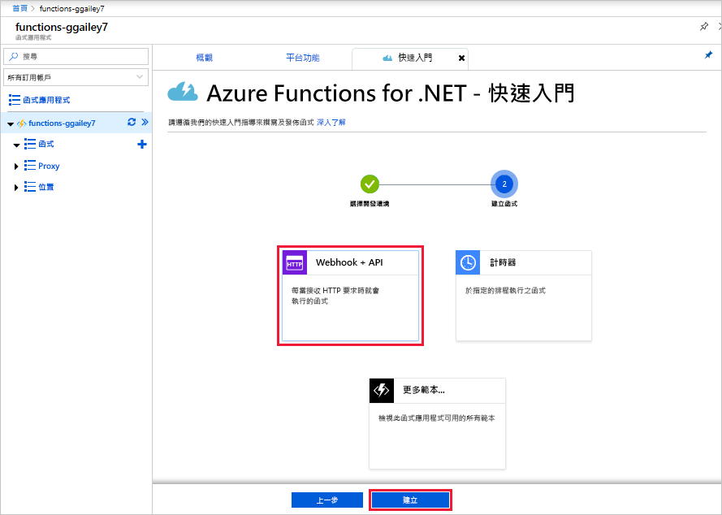
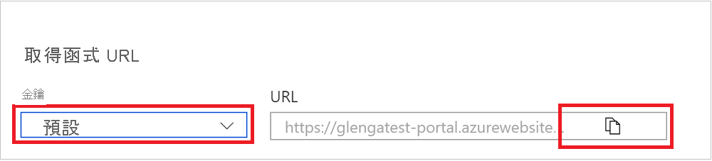
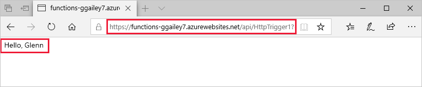
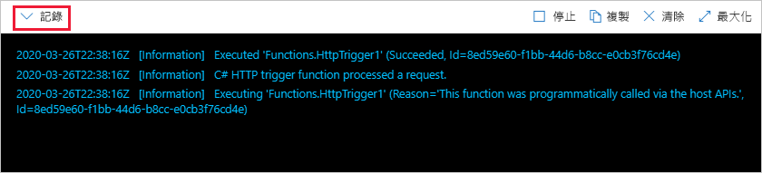

# 在 Azure 入口網站中建立您的第一個函式

Azure Functions 可讓您在無伺服器環境中執行程式碼，而不需要先建立虛擬機器 (VM) 或發佈 Web 應用程式。 在本文中，您將了解如何使用 Azure Functions 在 Azure 入口網站中建立 "hello world" HTTP 觸發函式。

[!INCLUDE [quickstarts-free-trial-note](../../includes/quickstarts-free-trial-note.md)]

如果您是 C# 開發人員，請考慮[在 Visual Studio 2019 中建立第一個函式](functions-create-your-first-function-visual-studio.md)，而不是在入口網站中建立。 

## 登入 Azure

使用您的 Azure 帳戶登入 [Azure 入口網站](https://portal.azure.com) 。

## 建立函數應用程式

您必須擁有函式應用程式以便主控函式的執行。 函式應用程式可讓您將多個函式群組為邏輯單位，以方便您管理、部署、調整和共用資源。

[!INCLUDE [Create function app Azure portal](../../includes/functions-create-function-app-portal.md)]

接下來，您要在新的函式應用程式中建立函式。

## 建立由 HTTP 觸發的函式

1. 展開新的函式應用程式，選取 [Functions]  旁的 **+** 按鈕、選擇 [入口網站內]  ，然後選取 [繼續]  。

    

1. 選擇 [WebHook + API]  ，然後選取 [建立]  。

    

   系統隨即會使用由 HTTP 觸發的函式特定語言範本來建立函式。

現在，您可以藉由傳送 HTTP 要求來執行新的函式。

## 測試函式

1. 在您的新函式中，選取右上方的 [</> 取得函式 URL]  。 

1. 在 [取得函式 URL]  對話方塊中，從下拉式清單中選取 [預設 (函式金鑰)]  ，然後選取 [複製]  。 

    

1. 將函式 URL 貼入瀏覽器的網址列中。 將查詢字串值 `&name=<your_name>` 新增至此 URL 的結尾，然後按 Enter 鍵以執行要求。 

    下列範例會顯示瀏覽器中的回應：

    

    要求 URL 預設會包含所需金鑰，以便透過 HTTP 存取您的函式。

1. 當函式執行時，系統會將追蹤資訊寫入到記錄中。 若要查看上次執行的追蹤輸出，請在入口網站中返回您的函式，然後選取畫面底部的箭號來展開**記錄**。

   

## 清除資源

[!INCLUDE [Clean-up resources](../../includes/functions-quickstart-cleanup.md)]

## 後續步驟

[!INCLUDE [Next steps note](../../includes/functions-quickstart-next-steps.md)]

