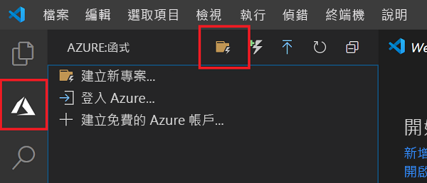
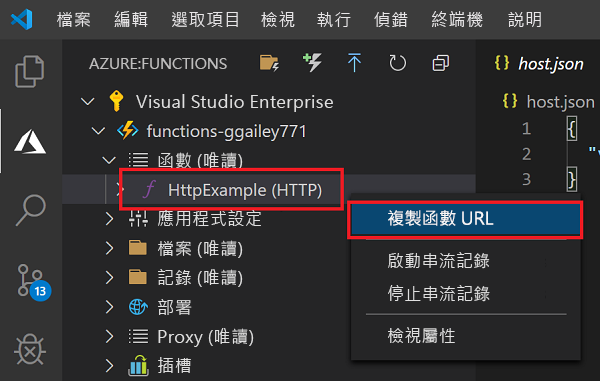
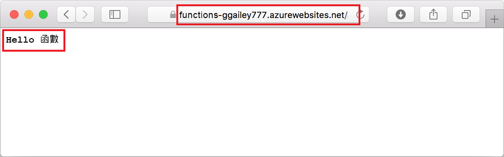

# <a name="quickstart-create-a-function-in-azure-using-visual-studio-code"></a>快速入門：使用 Visual Studio Code 在 Azure 中建立函式

::: zone pivot="programming-language-csharp"  
在本文中，您會使用 Visual Studio Code 建立可回應 HTTP 要求的 C# 類別庫函式。 在本機測試程式碼之後，您可以將其部署到 Azure Functions 的無伺服器環境。 
::: zone-end  
::: zone pivot="programming-language-javascript"
在本文中，您會使用 Visual Studio Code 建立可回應 HTTP 要求的 JavaScript 函式。 在本機測試程式碼之後，您可以將其部署到 Azure Functions 的無伺服器環境。 
::: zone-end
::: zone pivot="programming-language-typescript"
在本文中，您會使用 Visual Studio Code 建立可回應 HTTP 要求的 TypeScript 函式。 在本機測試程式碼之後，您可以將其部署到 Azure Functions 的無伺服器環境。 
::: zone-end   
::: zone pivot="programming-language-powershell"
在本文中，您會使用 Visual Studio Code 建立可回應 HTTP 要求的 PowerShell 函式。 在本機測試程式碼之後，您可以將其部署到 Azure Functions 的無伺服器環境。 
::: zone-end  
::: zone pivot="programming-language-python" 
在本文中，您會使用 Visual Studio Code 建立可回應 HTTP 要求的 Python 函式。 在本機測試程式碼之後，您可以將其部署到 Azure Functions 的無伺服器環境。 
::: zone-end  
::: zone pivot="programming-language-java" 
在本文中，您會使用 Visual Studio Code 建立可回應 HTTP 要求的 Java 函式。 在本機測試程式碼之後，您可以將其部署到 Azure Functions 的無伺服器環境。 
::: zone-end

完成本快速入門後，您的 Azure 帳戶中會產生幾美分或更少的少許費用。 

::: zone pivot="programming-language-csharp,programming-language-javascript,programming-language-typescript,programming-language-powershell,programming-language-python"
本文還有 [CLI 型版本](functions-create-first-azure-function-azure-cli.md)。
::: zone-end
::: zone pivot="programming-language-java"  
> [!NOTE]
> 如果 Visual Studio Code 不是您慣用的開發工具，請參閱供 JAVA 開發人員參考的類似教學課程，內容分別使用 [Maven](./functions-create-first-azure-function-azure-cli.md?pivots=programming-language-java)、[Gradle](./functions-create-first-java-gradle.md) 和 [IntelliJ IDEA](/azure/developer/java/toolkit-for-intellij/quickstart-functions) 等開發工具。
::: zone-end  

## <a name="configure-your-environment"></a>設定環境

開始使用之前，請先確定您具備下列必要項目︰

+ 具有有效訂用帳戶的 Azure 帳戶。 [免費建立帳戶](https://azure.microsoft.com/free/?ref=microsoft.com&utm_source=microsoft.com&utm_medium=docs&utm_campaign=visualstudio)。

::: zone pivot="programming-language-csharp,programming-language-powershell,programming-language-python"  
+ [Node.js](https://nodejs.org/)，Windows 需要將其用於 npm。 僅限[作用中 LTS 和維修 LTS 版本](https://nodejs.org/about/releases/)。 請使用 `node --version` 命令來檢查您的版本。
    macOS 和 Linux 上的本機開發不需要此項目。   
::: zone-end  
::: zone pivot="programming-language-javascript,programming-language-typescript"  
+ [Node.js](https://nodejs.org/)、作用中 LTS 和維修 LTS 版本 (建議使用 10.14.1)。 請使用 `node --version` 命令來檢查您的版本。
::: zone-end 
::: zone pivot="programming-language-python"
+ Azure Functions (x64) 支援 [Python 3.8](https://www.python.org/downloads/release/python-381/)、[Python 3.7](https://www.python.org/downloads/release/python-375/)、[Python 3.6](https://www.python.org/downloads/release/python-368/)。
::: zone-end   
::: zone pivot="programming-language-powershell"
+ [PowerShell Core](/powershell/scripting/install/installing-powershell-core-on-windows)

+ [.NET Core SDK 2.2+](https://www.microsoft.com/net/download)  
::: zone-end  
::: zone pivot="programming-language-java"  
+ [Java Developer Kit](https://aka.ms/azure-jdks) 第 8 版。

+ [Apache Maven](https://maven.apache.org) 3.0 版或更高版本。
::: zone-end  
+ 其中一個[支援的平台](https://code.visualstudio.com/docs/supporting/requirements#_platforms)上有 [Visual Studio Code](https://code.visualstudio.com/)。  
::: zone pivot="programming-language-csharp"  
+ 適用於 Visual Studio Code 的 [ 擴充功能](https://marketplace.visualstudio.com/items?itemName=ms-dotnettools.csharp)。  
::: zone-end  
::: zone pivot="programming-language-python"
+ 適用於 Visual Studio Code 的 [Python 擴充功能](https://marketplace.visualstudio.com/items?itemName=ms-python.python)。  
::: zone-end  
::: zone pivot="programming-language-powershell"
+ [適用於 Visual Studio Code 的 PowerShell 擴充功能](https://marketplace.visualstudio.com/items?itemName=ms-vscode.PowerShell)。 
::: zone-end  
::: zone pivot="programming-language-java"  
+ [Java 延伸模組套件](https://marketplace.visualstudio.com/items?itemName=vscjava.vscode-java-pack)
::: zone-end  

+ 適用於 Visual Studio Code 的 [Azure Functions 擴充功能](https://marketplace.visualstudio.com/items?itemName=ms-azuretools.vscode-azurefunctions)。 

## <a name="create-your-local-project"></a><a name="create-an-azure-functions-project"></a>建立本機專案 

在這一節中，您會使用 Visual Studio Code 在您所選的語言中建立本機 Azure Functions 專案。 稍後在本文中，您會將函式程式碼發佈至 Azure。 

1. 選擇活動列中的 Azure 圖示，然後在 [Azure：  函式] 區域，選取 [建立新專案...]  圖示。

    

1. 選擇您專案工作區的目錄位置，然後選擇 [選取]  。

    > [!NOTE]
    > 這些步驟主要設計為在工作區以外的地方完成。 在此案例中，請勿選取屬於工作區的專案資料夾。

1. 依照提示提供下列資訊：

    ::: zone pivot="programming-language-csharp"
    + **為您的函式專案選取語言**：選擇 `C#`。
    ::: zone-end
    ::: zone pivot="programming-language-javascript"
    + **為您的函式專案選取語言**：選擇 `JavaScript`。
    ::: zone-end
    ::: zone pivot="programming-language-typescript"
    + **為您的函式專案選取語言**：選擇 `TypeScript`。
    ::: zone-end
    ::: zone pivot="programming-language-powershell"
    + **為您的函式專案選取語言**：選擇 `PowerShell`。
    ::: zone-end
    ::: zone pivot="programming-language-python"
    + **為您的函式專案選取語言**：選擇 `Python`。

    + **選取 Python 別名以建立虛擬環境**：選擇 Python 解譯器的位置。 如果未顯示位置，請輸入 Python 二進位檔的完整路徑。  
    ::: zone-end

    ::: zone pivot="programming-language-java"  
    + **為您的函式專案選取語言**：選擇 `Java`。

    + **提供群組識別碼**：選擇 `com.function`。

    + **提供成品識別碼**：選擇 `myFunction`。

    + **提供版本**：選擇 `1.0-SNAPSHOT`。

    + **提供套件名稱**：選擇 `com.function`。

    + **提供應用程式名稱**：選擇 `myFunction-12345`。
    ::: zone-end  
    ::: zone pivot="programming-language-csharp,programming-language-javascript,programming-language-typescript,programming-language-powershell,programming-language-python"
    + **選取您的專案第一個函式的範本**：選擇 `HTTP trigger`。
    
    + **提供函式名稱**：輸入 `HttpExample`。
    ::: zone-end  
    ::: zone pivot="programming-language-csharp"
    + **提供命名空間**：輸入 `My.Functions`。 
    ::: zone-end  
    ::: zone pivot="programming-language-csharp,programming-language-javascript,programming-language-typescript,programming-language-powershell,programming-language-python"
    + **授權層級**選擇 `Anonymous`，讓任何人都能呼叫您的函式端點。 若要了解授權層級，請參閱[授權金鑰](functions-bindings-http-webhook-trigger.md#authorization-keys)。
    ::: zone-end  
    + **選取您開啟專案的方式**：選擇 `Add to workspace`。

1. Visual Studio Code 會使用這項資訊產生具有 HTTP 觸發程序的 Azure Functions 專案。 您可以在 Explorer 中檢視本機專案檔。 若要深入了解所建立的檔案，請參閱[產生的專案檔](functions-develop-vs-code.md#generated-project-files)。 

::: zone pivot="programming-language-csharp,programming-language-javascript,programming-language-python,programming-language-java"

[!INCLUDE [functions-run-function-test-local-vs-code](../../includes/functions-run-function-test-local-vs-code.md)]

::: zone-end

::: zone pivot="programming-language-powershell"

[!INCLUDE [functions-run-function-test-local-vs-code-ps](../../includes/functions-run-function-test-local-vs-code-ps.md)]

::: zone-end

確認函式在本機電腦上正確執行之後，就可以使用 Visual Studio Code 將專案直接發佈到 Azure。 

[!INCLUDE [functions-sign-in-vs-code](../../includes/functions-sign-in-vs-code.md)]

[!INCLUDE [functions-publish-project-vscode](../../includes/functions-publish-project-vscode.md)]

## <a name="run-the-function-in-azure"></a>在 Azure 中執行函式

1. 返回 [Azure：  函式] 區域 (位於提要欄位中)，在訂用帳戶下展開新的函式應用程式。 展開 [函式]  ，以滑鼠右鍵按一下 (Windows) 或按住 Ctrl 並在 (macOS) **HttpExample** 上按一下，然後選擇 [複製函式 URL]  。

    

1. 將 HTTP 要求的這個 URL 貼到瀏覽器的網址列中，並在此 URL 的結尾處新增 `name` 查詢字串 `?name=Functions`，然後執行要求。 呼叫 HTTP URL 觸發函式的 URL 應採用下列格式：

    ```http
    http://<functionappname>.azurewebsites.net/api/httpexample?name=Functions
    ```
        
    下列範例顯示瀏覽器中對於函式所傳回遠端 GET 要求所做出的回應︰ 

    

## <a name="clean-up-resources"></a>清除資源

當您繼續進行下一個步驟[將 Azure 儲存體佇列繫結新增至您的函式](functions-add-output-binding-storage-queue-vs-code.md)時，您必須保留所有資源，以您所完成的工作為基礎。

否則，您可以使用下列步驟來刪除函式應用程式及其相關資源，以避免產生任何額外的成本。

[!INCLUDE [functions-cleanup-resources-vs-code.md](../../includes/functions-cleanup-resources-vs-code.md)]

若要深入了解 Functions 成本，請參閱[估計使用量方案成本](functions-consumption-costs.md)。

## <a name="next-steps"></a>後續步驟

您已透過 Visual Studio Code，使用簡單的 HTTP 觸發函式建立函式應用程式。 在下一篇文章中，您可以藉由新增輸出繫結來展開該函式。 這個繫結會從 HTTP 要求將字串寫入 Azure 佇列儲存體佇列中的訊息。 

> [!div class="nextstepaction"]
> [將 Azure 儲存體佇列繫結新增至您的函式](functions-add-output-binding-storage-queue-vs-code.md)

[Azure Functions Core Tools]: functions-run-local.md
[Azure Functions extension for Visual Studio Code]: https://marketplace.visualstudio.com/items?itemName=ms-azuretools.vscode-azurefunctions
