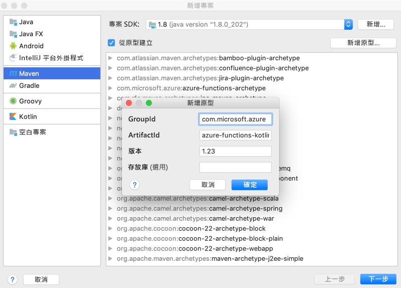
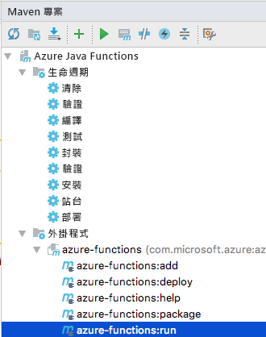

# <a name="quickstart-create-your-first-http-triggered-function-with-kotlin-and-intellij"></a>快速入門：使用 Kotlin 和 IntelliJ 建立您的第一個 HTTP 觸發函式

本文說明如何使用 IntelliJ IDEA 和 Apache Maven 建立[無伺服器](https://azure.microsoft.com/overview/serverless-computing/)函式專案。 其中還說明如何在整合式開發環境 (IDE) 中對您的函式程式碼進行本機偵錯，然後將函式專案部署至 Azure。

[!INCLUDE [quickstarts-free-trial-note](../../includes/quickstarts-free-trial-note.md)]

## <a name="set-up-your-development-environment"></a>設定開發環境

若要使用 Kotlin 和 IntelliJ 開發函式，請安裝下列軟體：

- [Java Developer Kit](https://aka.ms/azure-jdks) (JDK) 第 8 版
- [Apache Maven](https://maven.apache.org) 3.0 版或更高版本
- [IntelliJ IDEA](https://www.jetbrains.com/idea/download) Community 或 Ultimate 版 (含 Maven)
- [Azure CLI](/cli/azure)
- [2.x 版](functions-run-local.md#v2) 的 Azure Functions Core Tools。 其可提供撰寫、執行和偵錯 Azure Functions 的本機開發環境。

> [!IMPORTANT]
> JAVA_HOME 環境變數必須設定為 JDK 的安裝位置，才能完成本文步驟。

## <a name="create-a-functions-project"></a>建立 Functions 專案

1. 在 IntelliJ IDEA 中，選取 [建立新專案]  。  
1. 在 [新增專案]  視窗中，從左窗格選取 [Maven]  。
1. 選取 [從 Archetype 建立]  核取方塊，並針對 [azure-functions-kotlin-archetype](https://mvnrepository.com/artifact/com.microsoft.azure/azure-functions-kotlin-archetype) 選取 [新增 Archetype]  。
1. 在 [新增 Archetype]  視窗中，完成如下欄位：
    - GroupId  ：com.microsoft.azure
    - _ArtifactId_：azure-functions-kotlin-archetype
    - _版本_：使用來自[中央存放庫](https://mvnrepository.com/artifact/com.microsoft.azure/azure-functions-kotlin-archetype)的最新版本
      
1. 依序選取 [確定]  和 [下一步]  。
1. 輸入目前專案的詳細資料，然後選取 [完成]  。

Maven 會在和 [ArtifactId]  值具有相同名稱的新資料夾中建立專案檔。 專案所產生的程式碼是 [HTTP 觸發](./functions-bindings-http-webhook.md)的簡單函式，此函式會回應觸發 HTTP 要求的本文。

## <a name="run-functions-locally-in-the-ide"></a>在 IDE 中本機執行函式

> [!NOTE]
> 若要在本機執行函式並進行偵錯，請確定您已安裝 [Azure Functions Core Tools 第 2 版](functions-run-local.md#v2)。

1. 手動匯入變更，或啟用[自動匯入](https://www.jetbrains.com/help/idea/creating-and-optimizing-imports.html)。
1. 開啟 [Maven 專案]  工具列。
1. 展開 [生命週期]  ，然後開啟 [套件]  。 解決方案會建置並封裝在新建立的目標目錄中。
1. 展開 [外掛程式]   > [azure-functions]  ，然後開啟 [azure-functions:run]  以啟動 Azure Functions 本機執行階段。  
    

1. 當您完成測試函式時，關閉執行對話方塊。 一次只能有一個函式主機是作用中且在本機執行。

## <a name="debug-the-function-in-intellij"></a>對 IntelliJ 中的函式進行偵錯

1. 若要以偵錯模式啟動函式主機，請新增 **-DenableDebug** 作為您執行函式時的引數。 您可以變更 [maven 目標](https://www.jetbrains.com/help/idea/maven-support.html#run_goal)中的組態，也可以在終端機視窗中執行下列命令：  

   ```
   mvn azure-functions:run -DenableDebug
   ```

   此命令會讓函式主機開啟 5005 偵錯連接埠。

1. 在 [執行]  功能表中選取 [編輯組態]  。
1. 選取 **(+)** 以新增 [遠端]  。
1. 完成 [名稱]  和 [設定]  欄位，然後選取 [確定]  以儲存組態。
1. 設定完成後，選取 [對 <遠端組態名稱> 進行偵錯]  或在鍵盤上按 Shift+F9 來開始偵錯。

   

1. 完成時，停止偵錯工具和執行中處理序。 一次只能有一個函式主機是作用中且在本機執行。

## <a name="deploy-the-function-to-azure"></a>將函式部署到 Azure

1. 您必須先[使用 Azure CLI 登入](/cli/azure/authenticate-azure-cli?view=azure-cli-latest)，才可以將函式部署到 Azure。

   ``` azurecli
   az login
   ```

1. 使用 `azure-functions:deploy` Maven 目標將程式碼部署到新的函式。 您也可以在 [Maven 專案] 視窗中選取 [azure-functions:deploy]  選項。

   ```
   mvn azure-functions:deploy
   ```

1. 成功部署函式之後，請在 Azure CLI 輸出中尋找函式的 URL。

   ``` output
   [INFO] Successfully deployed Function App with package.
   [INFO] Deleting deployment package from Azure Storage...
   [INFO] Successfully deleted deployment package fabrikam-function-20170920120101928.20170920143621915.zip
   [INFO] Successfully deployed Function App at https://fabrikam-function-20170920120101928.azurewebsites.net
   [INFO] ------------------------------------------------------------------------
   ```

## <a name="next-steps"></a>後續步驟

既然您已將第一個 Kotlin 函式部署至 Azure，請檢閱 [Java Functions 開發人員指南](functions-reference-java.md)，以取得開發 Java 和 Kotlin 函式的詳細資訊。
- 使用 `azure-functions:add` Maven 目標，將具有不同觸發程序的其他函式新增至專案。
