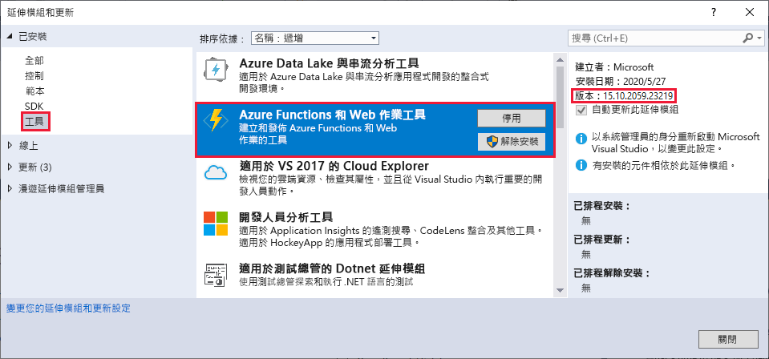
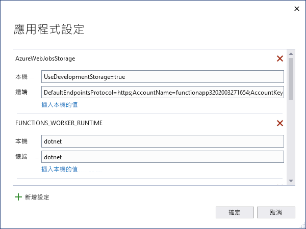

# <a name="develop-azure-functions-using-visual-studio"></a>使用 Visual Studio 來開發 Azure Functions  

Visual Studio 可讓您開發、測試 c # 類別庫函數，並將其部署至 Azure。 如果這是您第一次使用 Azure Functions 的經驗，請參閱 [Azure Functions 的簡介](functions-overview.md)。

當您開發函式時，Visual Studio 提供下列優點： 

* 在本機開發電腦上編輯、建置及執行函數。 
* 將 Azure Functions 專案直接發佈至 Azure，並視需要建立 Azure 資源。 
* 使用 c # 屬性，直接在 c # 程式碼中宣告函數系結。
* 開發及部署預先編譯的 C# 函數。 預先編譯的函數提供的冷啟動效能比 C# 指令碼型函數更好。 
* 在 C# 中編寫函數，同時享有 Visual Studio 開發的所有優點。 

本文提供如何使用 Visual Studio 開發 c # 類別庫函式並將其發佈至 Azure 的詳細資料。 閱讀本文之前，請考慮完成 Visual Studio 的 [功能快速入門](functions-create-your-first-function-visual-studio.md)。 

除非另有說明，否則顯示的程式和範例適用于 Visual Studio 2019。 

## <a name="prerequisites"></a>Prerequisites

- Azure Functions 工具。 若要新增 Azure 函數工具，請在您的 Visual Studio 安裝中包含 **azure 開發** 工作負載。 從 Visual Studio 2017 開始，Azure 開發工作負載中有 Azure Functions 工具可供使用。

- 您需要的其他資源（例如 Azure 儲存體帳戶）會在發佈程式期間建立于您的訂用帳戶中。

- [!INCLUDE [quickstarts-free-trial-note](../../includes/quickstarts-free-trial-note.md)]

> [!NOTE]
> 在 Visual Studio 2017 中，Azure 開發工作負載會將 Azure Functions 工具安裝為個別的擴充功能。 當您更新 Visual Studio 2017 安裝時，請確定您使用的是 [最新版](#check-your-tools-version) 的 Azure Functions 工具。 下列各節說明如何在必要時檢查和 () 更新 Visual Studio 2017 中的 Azure Functions 工具延伸模組。 
>
> 如果您使用的是 Visual Studio 2019，請略過這些區段。

### <a name="check-your-tools-version-in-visual-studio-2017"></a><a name="check-your-tools-version"></a>在 Visual Studio 2017 中檢查您的工具版本

1. 在 [工具] 功能表中，選擇 [擴充功能和更新]。 展開 [**已安裝**  >  的 **工具**]，然後選擇 [ **Azure Functions 和 Web 作業工具**]。

    

1. 請記下已安裝的 **版本** ，並將此版本 [與版本資訊](https://github.com/Azure/Azure-Functions/blob/master/VS-AzureTools-ReleaseNotes.md)中所列的最新版本進行比較。 

1. 如果您的版本較舊，請依照下一節中的說明在 Visual Studio 中更新您的工具。

### <a name="update-your-tools-in-visual-studio-2017"></a>在 Visual Studio 2017 中更新您的工具

1. 在 [延伸模組和更新] 對話方塊中，展開 [更新] > [Visual Studio Marketplace]，選擇 [Azure Functions 與 Web 工作工具]，然後選取 [更新]。

       

1. 下載工具更新之後，請選取 [ **關閉**]，然後關閉 Visual Studio，以使用 VSIX 安裝程式來觸發工具更新。

1. 在 [VSIX 安裝程式] 中，選擇 [ **修改** ] 以更新工具。 

1. 更新完成後，請選擇 [ **關閉**]，然後重新開機 Visual Studio。

> [!NOTE]  
> 在 Visual Studio 2019 和更新版本中，Azure Functions 工具延伸模組會在 Visual Studio 中更新。  

## <a name="create-an-azure-functions-project"></a>建立 Azure Functions 專案

[!INCLUDE [Create a project using the Azure Functions](../../includes/functions-vstools-create.md)]

在您建立 Azure Functions 專案之後，專案範本會建立 c # 專案、安裝 `Microsoft.NET.Sdk.Functions` NuGet 套件，並設定目標 framework。 新專案含有下列檔案：

* **host.json**：讓您設定 Functions 主機。 這些設定同時適用於在本機執行及在 Azure 中執行。 如需詳細資訊，請參閱 [host.json 參考](functions-host-json.md)。

* **local.settings.json**：維持在本機執行函數時所使用的設定。 在 Azure 中執行時，不會使用這些設定。 如需詳細資訊，請參閱 [本機設定檔](#local-settings-file)。

    >[!IMPORTANT]
    >因為檔案上的 local.settings.js可以包含秘密，所以您必須將它從專案原始檔控制中排除。 請確定此檔案的 [ **複製到輸出目錄** ] 設定為 [ **更新時才複製**]。 

如需詳細資訊，請參閱 [Functions 類別庫專案](functions-dotnet-class-library.md#functions-class-library-project)。

[!INCLUDE [functions-local-settings-file](../../includes/functions-local-settings-file.md)]

當您發行專案時，Visual Studio 不會自動上傳 local.settings.js的設定。 若要確定這些設定也存在於 Azure 的函式應用程式中，請在您發佈專案之後將它們上傳。 如需詳細資訊，請參閱 [函數應用程式設定](#function-app-settings)。 集合中的值 `ConnectionStrings` 永遠不會發行。

您的程式碼也可以將函數應用程式設定值讀取為環境變數。 如需詳細資訊，請參閱 [環境變數](functions-dotnet-class-library.md#environment-variables)。

## <a name="configure-your-build-output-settings"></a>設定組建輸出設定

建立 Azure Functions 專案時，組建工具會將輸出優化，以便保留與函式執行時間共用之任何元件的一個複本。 結果是優化的組建，可盡可能節省最多空間。 但是，當您移至任何專案元件的最新版本時，build 工具可能不知道必須保留這些元件。 為了確保在優化程式期間保留這些元件，您可以使用 `FunctionsPreservedDependencies` 專案中的專案 ( .csproj) 檔來指定這些元件：

```xml
  <ItemGroup>
    <FunctionsPreservedDependencies Include="Microsoft.AspNetCore.Http.dll" />
    <FunctionsPreservedDependencies Include="Microsoft.AspNetCore.Http.Extensions.dll" />
    <FunctionsPreservedDependencies Include="Microsoft.AspNetCore.Http.Features.dll" />
  </ItemGroup>
```

## <a name="configure-the-project-for-local-development"></a>設定專案以進行本機開發

函數執行階段會在內部使用 Azure 儲存體帳戶。 針對 HTTP 和 webhook 以外的所有觸發程式類型，將索引 `Values.AzureWebJobsStorage` 鍵設定為有效的 Azure 儲存體帳戶連接字串。 您的函數應用程式也可以針對專案所需的連線設定使用 [Azure 儲存體模擬器](../storage/common/storage-use-emulator.md) `AzureWebJobsStorage` 。 若要使用模擬器，請將的值設定 `AzureWebJobsStorage` 為 `UseDevelopmentStorage=true` 。 在部署之前，請將此設定變更為實際的儲存體帳戶連接字串。

設定儲存體帳戶連接字串：

1. 在 Visual Studio 中，選取 [ **View**  >  **Cloud Explorer**。

2. 在 **Cloud Explorer** 中，展開 [ **儲存體帳戶**]，然後選取您的儲存體帳戶。 在 [ **屬性** ] 索引標籤中，複製 **主要連接字串** 值。

2. 在您的專案中，開啟檔案 local.settings.js，並將索引鍵的值設定 `AzureWebJobsStorage` 為您所複製的連接字串。

3. 重複上述步驟，為函式所需的任何其他連接，將唯一索引鍵新增至 `Values` 陣列。 

## <a name="add-a-function-to-your-project"></a>將函式新增至您的專案

在 c # 類別庫函式中，函式所使用的系結是藉由在程式碼中套用屬性來定義。 當您從提供的範本建立函式觸發程式時，系統會為您套用觸發程式屬性。 

1. 在 **方案總管** 中，以滑鼠右鍵按一下您的專案節點，然後選取 [**加入**  >  **新專案**]。 

2. 選取 [ **Azure 函數**]，輸入類別的 **名稱** ，然後選取 [ **新增**]。

3. 選擇您的觸發程式、設定系結屬性，然後選取 **[確定]**。 下列範例顯示建立佇列儲存體觸發程式函數的設定。 

    

    此觸發程式範例會使用具有名為之索引鍵的連接字串 `QueueStorage` 。 在檔案的 [local.settings.js](functions-run-local.md#local-settings-file)中定義此連接字串設定。

4. 檢查新加入的類別。 您會看到 `Run()` 以屬性屬性化的靜態方法 `FunctionName` 。 這個屬性指出該方法是函數的進入點。

    例如，下列 c # 類別代表基本佇列儲存體觸發程式函數：

    ```csharp
    using System;
    using Microsoft.Azure.WebJobs;
    using Microsoft.Azure.WebJobs.Host;
    using Microsoft.Extensions.Logging;

    namespace FunctionApp1
    {
        public static class Function1
        {
            [FunctionName("QueueTriggerCSharp")]
            public static void Run([QueueTrigger("myqueue-items", 
                Connection = "QueueStorage")]string myQueueItem, ILogger log)
            {
                log.LogInformation($"C# Queue trigger function processed: {myQueueItem}");
            }
        }
    }
    ```

會將繫結特定屬性套用至提供給進入點方法的每個繫結參數。 屬性會將繫結資訊作為參數使用。 在先前的範例中，第一個參數已套用 `QueueTrigger` 屬性，表示佇列儲存體觸發程式函數。 佇列名稱和連接字串設定名稱會作為參數傳遞至 `QueueTrigger` 屬性。 如需詳細資訊，請參閱 [Azure Functions 的 Azure 佇列儲存體繫結](functions-bindings-storage-queue-trigger.md)。

使用上述程式，將更多函式新增至函數應用程式專案。 專案中的每個函式都可以有不同的觸發程序，但函式必須只有一個觸發程序。 如需詳細資訊，請參閱 [Azure Functions 觸發程式和](functions-triggers-bindings.md)系結概念。

## <a name="add-bindings"></a>新增繫結

和觸發程序一樣，輸入和輸出繫結會新增至函式作為繫結屬性。 請將繫結新增至函式，如下所示：

1. 確定您已 [設定專案以進行本機開發](#configure-the-project-for-local-development)。

2. 為特定繫結新增適當的 NuGet 擴充功能套件。 

   如需詳細資訊，請參閱 [具有 Visual Studio 的 c # 類別庫](./functions-bindings-register.md#local-csharp)。 在系結的參考文章中尋找系結特定的 NuGet 套件需求。 例如，您可以在[事件中樞繫結參考文章](functions-bindings-event-hubs.md)中尋找事件中樞觸發程序的套件需求。

3. 如果有系結所需的應用程式設定，請將它們新增至 `Values` [本機設定檔](functions-run-local.md#local-settings-file)案中的集合。 

   函數在本機執行時，會使用這些值。 當函式在 Azure 中的函式應用程式中執行時，它會使用 [函數應用程式設定](#function-app-settings)。

4. 在方法簽章中新增適當的繫結屬性。 在下列範例中，佇列訊息會觸發函式，而且輸出繫結會在不同的佇列中，使用相同文字建立新的佇列訊息。

    ```csharp
    public static class SimpleExampleWithOutput
    {
        [FunctionName("CopyQueueMessage")]
        public static void Run(
            [QueueTrigger("myqueue-items-source", Connection = "AzureWebJobsStorage")] string myQueueItem, 
            [Queue("myqueue-items-destination", Connection = "AzureWebJobsStorage")] out string myQueueItemCopy,
            ILogger log)
        {
            log.LogInformation($"CopyQueueMessage function processed: {myQueueItem}");
            myQueueItemCopy = myQueueItem;
        }
    }
    ```
   佇列儲存體的連接是從 `AzureWebJobsStorage` 設定中取得的。 如需詳細資訊，請參閱特定繫結的參考文章。 

[!INCLUDE [Supported triggers and bindings](../../includes/functions-bindings.md)]

## <a name="testing-functions"></a>測試函式

Azure Functions Core Tools 可讓您在本機開發電腦上執行 Azure Functions 專案。 如需詳細資訊，請參閱使用 [Azure Functions Core Tools](functions-run-local.md)。 當您第一次從 Visual Studio 啟動函式時，系統會提示您安裝這些工具。 

若要在 Visual Studio 中測試您的函式：

1. 按 F5。 如果出現提示，接受來自 Visual Studio 之下載及安裝 Azure Functions Core (CLI) 工具的要求。 您可能也需要啟用防火牆例外狀況，工具才能處理 HTTP 要求。

2. 當專案執行時，請測試您的程式碼，就像測試已部署的函式一樣。 

   如需詳細資訊，請參閱[在 Azure Functions 中測試程式碼的策略](functions-test-a-function.md)。 當您在「調試」模式中執行 Visual Studio 時，會如預期般叫用中斷點。

<!---
For an example of how to test a queue triggered function, see the [queue triggered function quickstart tutorial](functions-create-storage-queue-triggered-function.md#test-the-function).  
-->


## <a name="publish-to-azure"></a>發佈至 Azure

當您從 Visual Studio 發佈時，它會使用兩種部署方法的其中一種：

* [Web Deploy](functions-deployment-technologies.md#web-deploy-msdeploy)：套件，並將 Windows 應用程式部署到任何 IIS 伺服器。
* [已啟用從套件執行的 Zip 部署](functions-deployment-technologies.md#zip-deploy)：建議用於 Azure Functions 部署。

使用下列步驟，將專案發佈至 Azure 中的函數應用程式。

[!INCLUDE [Publish the project to Azure](../../includes/functions-vstools-publish.md)]

## <a name="function-app-settings"></a>函數應用程式設定

因為 Visual Studio 不會在您發佈專案時自動上傳這些設定，所以您在 local.settings.js中新增的任何設定也必須新增至 Azure 中的函數應用程式。

將必要設定上傳至 Azure 中的函式應用程式最簡單的方式是選取 [ **管理 Azure App Service 設定** ] 連結，該連結會在您成功發佈專案後出現。

:::image type="content" source="./media/functions-develop-vs/functions-vstools-app-settings.png" alt-text="[發行] 視窗中的設定":::

選取此連結會顯示函數應用程式的 [ **應用程式設定** ] 對話方塊，您可以在其中新增新的應用程式設定或修改現有的應用程式設定。



[**本機**] 會在 [檔案 local.settings.js] 中顯示設定值，而 [**遠端**] 會在 Azure 中的函數應用程式中顯示目前的設定值。 選擇 [新增設定] 來建立新的應用程式設定。 使用 [從本機插入值] 連結，將設定值複製到 [遠端] 欄位。 當您選取 [確定] 時，暫止的變更會寫入至本機設定檔案和函式應用程式。

> [!NOTE]
> 依預設，檔案上的 local.settings.js不會簽入原始檔控制中。 這表示，如果您從原始檔控制複製本機函式專案，該專案就不會有 local.settings.js的檔案。 在此情況下，您需要在專案根目錄中手動建立檔案 local.settings.js，讓 [ **應用程式設定** ] 對話方塊如預期般運作。 

您也可以使用下列其中一種方式管理應用程式設定：

* [使用 Azure 入口網站](functions-how-to-use-azure-function-app-settings.md#settings)。
* [使用 `--publish-local-settings` Azure Functions Core Tools 中的 [發佈] 選項](functions-run-local.md#publish)。
* [使用 Azure CLI](/cli/azure/functionapp/config/appsettings#az-functionapp-config-appsettings-set)。

## <a name="monitoring-functions"></a>監視函式

若要監視您的函式的執行情況，建議您整合您的函式應用程式與 Azure Application Insights。 當您在 Azure 入口網站中建立函式應用程式時，系統會依預設為您完成這項整合。 不過，當您在 Visual Studio 發佈期間建立函式應用程式時，則不會完成您的函式應用程式在 Azure 中的整合。 若要瞭解如何將 Application Insights 連接到您的函數應用程式，請參閱 [啟用 Application Insights 整合](configure-monitoring.md#enable-application-insights-integration)。

若要深入瞭解如何使用 Application Insights 進行監視，請參閱 [監視 Azure Functions](functions-monitoring.md)。

## <a name="next-steps"></a>後續步驟

如需 Azure Functions Core Tools 的詳細資訊，請參閱使用 [Azure Functions Core Tools](functions-run-local.md)。

如需將函數開發為 .NET 類別庫的詳細資訊，請參閱 [Azure Functions c # 開發人員參考](functions-dotnet-class-library.md)。 本文也會連結至範例以示範如何使用屬性宣告 Azure Functions 所支援的各種繫結類型。    
