# <a name="monitor-azure-functions"></a>監視 Azure Functions

[Azure 函數](functions-overview.md)提供與 Azure[應用程式見解](../azure-monitor/app/app-insights-overview.md)的內置集成，以監視功能。 本文介紹如何配置 Azure 函數以將系統生成的日誌檔發送到應用程式見解。

我們建議使用應用程式見解，因為它收集日誌、性能和錯誤資料。 它可自動檢測性能異常，並包括強大的分析工具，説明您診斷問題並瞭解函數的使用方式。 它是設計來協助您持續改善效能和可用性。 您甚至可以在本地函數應用專案開發期間使用應用程式見解。 有關詳細資訊，請參閱[什麼是應用程式見解？](../azure-monitor/app/app-insights-overview.md)

由於所需的應用程式見解檢測內置於 Azure 函數中，因此只需有效的檢測金鑰即可將函數應用連接到應用程式見解資源。 在 Azure 中創建函數應用資源時，應將檢測金鑰添加到應用程式設定中。 如果函數應用尚未具有此金鑰，則可以[手動設置它](#enable-application-insights-integration)。  

## <a name="application-insights-pricing-and-limits"></a>Application Insights 定價和限制

您可以免費嘗試 Azure Application Insights 與 Function Apps 整合。 每天可以免費處理的資料量是有限制的。 在測試期間，可能會達到此限制。 當您趨近每日限制時，Azure 會提供入口網站及電子郵件通知。 如果您錯過了這些警報並達到限制，新日誌將不會顯示在應用程式見解查詢中。 注意限制，以避免不必要的故障排除時間。 如需詳細資訊，請參閱[管理 Application Insights 中的價格和資料磁碟區](../azure-monitor/app/pricing.md)。

函數應用可用的應用程式見解功能的完整清單詳見[Azure 函數支援功能的應用程式見解](../azure-monitor/app/azure-functions-supported-features.md)。

## <a name="view-telemetry-in-monitor-tab"></a>在監視索引標籤中檢視遙測

[啟用應用程式見解集成後](#enable-application-insights-integration)，您可以在 **"監視器"** 選項卡中查看遙測資料。

1. 在函數應用頁中，選擇在配置應用程式見解後至少運行一次的函數。 然後選擇"**監視器"** 選項卡。定期選擇 **"刷新**"，直到出現函式呼叫清單。

   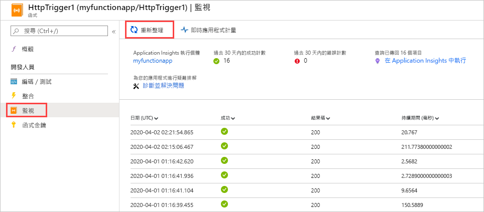

    > [!NOTE]
    > 當遙測用戶端批次處理資料以傳輸到伺服器時，清單最多可能需要五分鐘才能顯示。 延遲不適用於[即時指標流](../azure-monitor/app/live-stream.md)。 當您載入頁面時，該服務連接到功能主機，因此日誌將直接資料流到該頁。

1. 要查看特定函式呼叫的日誌，請選擇該調用**的日期 （UTC）** 列連結。 該引動過程的記錄輸出會顯示在新頁面中。

   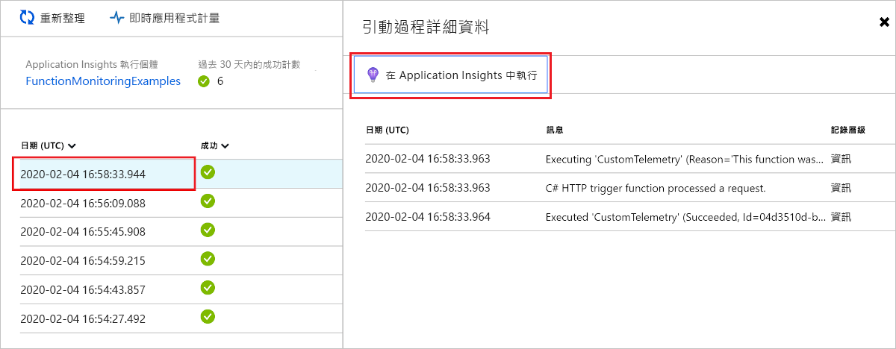

1. 選擇"**在應用程式中運行見解"** 連結以查看在 Azure 日誌中檢索 Azure 監視器日誌資料的查詢源（如果這是首次在訂閱中使用 Azure 日誌分析），則要求您啟用 。

1. 當您選擇該連結並選擇啟用日誌分析時。 將顯示以下查詢。 您可以看到查詢結果限制為最近 30 天 （）。`where timestamp > ago(30d)` 此外，結果顯示不超過 20 行 （`take 20`。 相反，函數的調用詳細資訊清單是最近 30 天沒有限制的。

   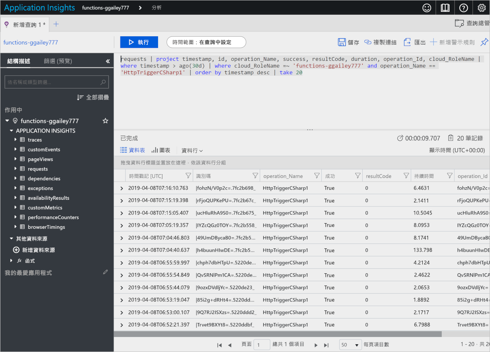

如需詳細資訊，請參閱本文稍後的[查詢遙測資料](#query-telemetry-data)。

## <a name="view-telemetry-in-application-insights"></a>在 Application Insights 中檢視遙測

要從 Azure 門戶中的函數應用打開應用程式見解，請轉到函數應用的 **"概述"** 頁。 在 **"配置的功能"** 下，選擇 **"應用程式見解**"。

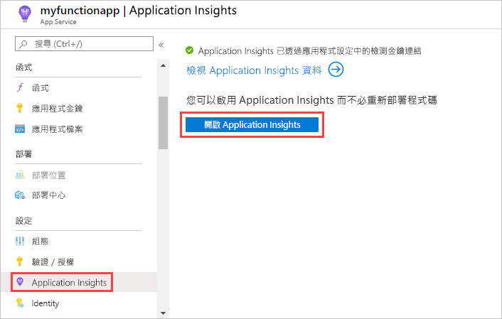

如需如何使用 Application Insights 的相關資訊，請參閱 [Application Insights 文件](https://docs.microsoft.com/azure/application-insights/)。 本節示範一些如何在 Application Insights 中檢視資料的範例。 如果您已經熟悉應用程式見解，則可以直接轉到[有關如何配置和自訂遙測資料的部分](#configure-categories-and-log-levels)。

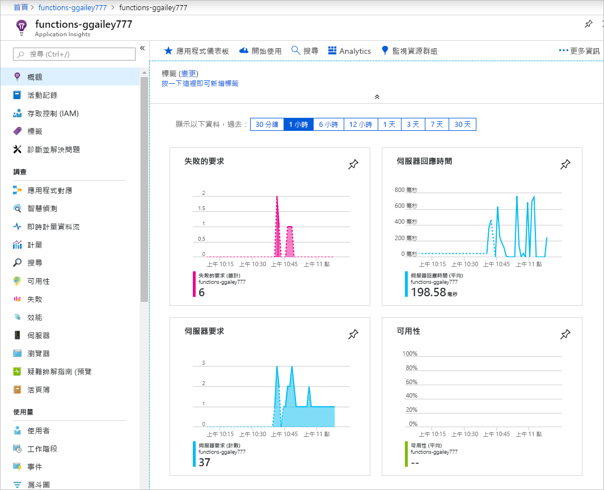

在評估函數中的行為、性能和錯誤時，應用程式見解的以下領域非常有用：

| 調查 | 描述 |
| ---- | ----------- |
| **[失敗](../azure-monitor/app/asp-net-exceptions.md)** |  根據功能故障和伺服器異常創建圖表和警報。 **作業名稱**是函式名稱。 除非為依賴項實現自訂遙測，否則不會顯示依賴項中的失敗。 |
| **[效能](../azure-monitor/app/performance-counters.md)** | 通過查看每個**雲角色實例**的資源利用率和輸送量來分析性能問題。 如果要對函式拖累基礎資源的案例進行偵錯，此資料非常有用。 |
| **[計量](../azure-monitor/app/metrics-explorer.md)** | 創建基於指標的圖表和警報。 指標包括函式呼叫數、執行時間和成功率。 |
| **[即時指標](../azure-monitor/app/live-stream.md)** | 查看指標資料，因為它幾乎即時創建。 |

## <a name="query-telemetry-data"></a>查詢遙測資料

[應用程式見解分析](../azure-monitor/app/analytics.md)使您能夠以資料庫中表的形式訪問所有遙測資料。 分析會提供用於擷取、操作和視覺化資料的查詢語言。 

選擇 **"日誌"** 以流覽或查詢記錄的事件。

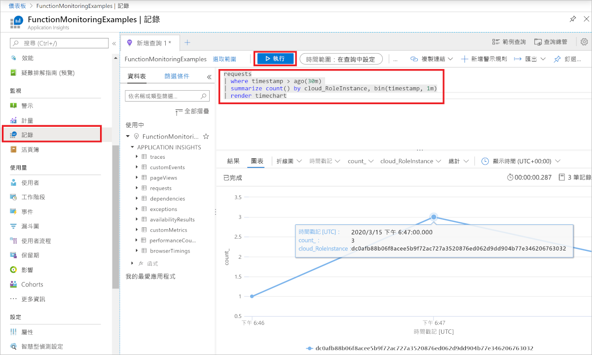

以下的查詢範例會顯示過去 30 分鐘內每個背景工作角色的要求分佈狀況。

<pre>
requests
| where timestamp > ago(30m) 
| summarize count() by cloud_RoleInstance, bin(timestamp, 1m)
| render timechart
</pre>

可用的表顯示在左側的 **"架構"** 選項卡中。 您可以找到下表中函式引動過程所產生的資料：

| Table | 描述 |
| ----- | ----------- |
| **痕跡** | 由運行時和函數代碼創建的日誌。 |
| **要求** | 每個函式呼叫的一個請求。 |
| **異常** | 運行時引發的任何異常。 |
| **自訂指標** | 成功和失敗的調用計數、成功率和持續時間。 |
| **自訂事件** | 運行時跟蹤的事件，例如：觸發函數的 HTTP 要求。 |
| **效能計數器** | 有關運行函數的伺服器的性能的資訊。 |

其他表用於可用性測試以及用戶端和瀏覽器遙測。 您可以實作自訂遙測，將資料新增至它們。

在每個資料表內，一些 Functions 特有的資料會位於 `customDimensions` 欄位中。  例如，下列查詢會擷取記錄層級為 `Error` 的所有追蹤。

<pre>
traces 
| where customDimensions.LogLevel == "Error"
</pre>

運行時提供 和`customDimensions.LogLevel``customDimensions.Category`欄位。 您可以在函數代碼中寫入的日誌中提供其他欄位。 請參閱本文稍後的[結構化記錄](#structured-logging)。

## <a name="configure-categories-and-log-levels"></a>設定類別和記錄層級

您可以使用應用程式見解，而無需任何自訂配置。 預設配置可能會導致大量資料。 如果您使用 Visual Studio Azure 訂用帳戶，可能就會達到 Application Insights 適用的資料上限。 在本文的後面部分，您將瞭解如何配置和自訂函數發送到應用程式見解的資料。 對於函數應用，日誌記錄在[host.json]檔中配置。

### <a name="categories"></a>類別

Azure Functions 記錄器包括每個記錄的「類別」**。 類別指出寫入記錄的是哪個部分的執行階段程式碼或函式程式碼。 下圖描述了運行時創建的日誌的主要類別。 

| 類別 | 描述 |
| ----- | ----- | 
| Host.Results | 這些日誌在應用程式見解中作為**請求**顯示。 它們表示函式的成功或失敗。 所有這些日誌都是在級別上`Information`編寫的。 如果按或`Warning`以上進行篩選，則看不到任何此資料。 |
| 主機.聚合器 | 這些記錄會透過[可設定](#configure-the-aggregator)的期間來提供函式引動過程的計數與平均。 預設期間為 30 秒或 1,000 個結果，視何者較早達到而定。 您可在 Application Insights 中的 **customMetrics** 資料表取得記錄。 示例包括運行次數、成功率和持續時間。 所有這些日誌都是在級別上`Information`編寫的。 如果按或`Warning`以上進行篩選，則看不到任何此資料。 |

除了這些類別之外，所有類別的日誌都可以在應用程式見解中**跟蹤**表中找到。

所有類別開始日誌`Host`的日誌都由函數運行時編寫。 **函數啟動**和**函數已完成**的日誌具有類別`Host.Executor`。 對於成功運行，這些日誌是`Information`水準。 異常記錄在級別。 `Error` 執行階段也會建立 `Warning` 層級的記錄，例如：傳送至有害佇列的佇列訊息。

函數運行時創建具有以"主機"開頭的類別的日誌。 在版本 1.x`function started`中`function executed`，`function completed`和 日誌具有`Host.Executor`類別 。 從版本 2.x 開始，這些日誌具有`Function.<YOUR_FUNCTION_NAME>`類別。

如果在函數代碼中寫入日誌，則類別是`Function.<YOUR_FUNCTION_NAME>.User`，並且可以是任何日誌級別。 在函數運行時的版本 1.x 中，類別為`Function`。

### <a name="log-levels"></a>記錄層級

Azure 函數記錄器還包括包含每個*日誌的日誌級別*。 [LogLevel](/dotnet/api/microsoft.extensions.logging.loglevel) 為一個列舉，而整數代碼表示相對的重要性：

|LogLevel    |程式碼|
|------------|---|
|追蹤       | 0 |
|偵錯       | 1 |
|資訊 | 2 |
|警告     | 3 |
|錯誤       | 4 |
|重大    | 5 |
|None        | 6 |

下一節會說明記錄層級 `None`。 

### <a name="log-configuration-in-hostjson"></a>主機中的日誌配置.

[host.json] 檔案會設定函式應用程式傳送到 Application Insights 的記錄數量。 針對每個類別，您可以指出要傳送的最小記錄層級。 有兩個示例：第一個示例針對[版本 2.x 和函數運行時（](functions-versions.md#version-2x)帶 .NET Core）的更高版本，第二個示例針對版本 1.x 運行時。

### <a name="version-2x-and-higher"></a>版本 2.x 及更高版本

版本 v2.x 和函數運行時的更高版本使用[.NET Core 日誌記錄篩選器層次結構](https://docs.microsoft.com/aspnet/core/fundamentals/logging/?view=aspnetcore-2.1#log-filtering)。 

```json
{
  "logging": {
    "fileLoggingMode": "always",
    "logLevel": {
      "default": "Information",
      "Host.Results": "Error",
      "Function": "Error",
      "Host.Aggregator": "Trace"
    }
  }
}
```

### <a name="version-1x"></a>1.x 版

```json
{
  "logger": {
    "categoryFilter": {
      "defaultLevel": "Information",
      "categoryLevels": {
        "Host.Results": "Error",
        "Function": "Error",
        "Host.Aggregator": "Trace"
      }
    }
  }
}
```

此範例會設定下列規則：

* 對於具有類別`Host.Results`或`Function`的日誌，`Error`僅將級別及以上級別發送到應用程式見解。 `Warning` 層級和以下層級的記錄均會被忽略。
* 針對類別為 `Host.Aggregator` 的記錄，則會將所有記錄傳送到 Application Insights。 `Trace` 記錄層級和某些記錄器稱為 `Verbose` 的記錄層級相同，但會在 [host.json] 檔案中使用 `Trace`。
* 針對所有其他記錄，只會將 `Information` 層級和以上層級傳送至 Application Insights。

[Host.json] 中的類別值會控制以相同值開頭之所有類別的記錄。 `Host`在[host.json]中`Host.General`控制`Host.Executor``Host.Results`日誌記錄 、、等。

如果 [host.json] 包含多個以相同字串開頭的類別，則會先比對較長的類別。 假設您希望從運行時的所有內容（`Host.Aggregator`但要在級別上`Error`記錄）的所有內容，但`Host.Aggregator`您希望在`Information`級別上登錄：

### <a name="version-2x-and-later"></a>版本 2.x 及更高版本

```json
{
  "logging": {
    "fileLoggingMode": "always",
    "logLevel": {
      "default": "Information",
      "Host": "Error",
      "Function": "Error",
      "Host.Aggregator": "Information"
    }
  }
}
```

### <a name="version-1x"></a>1.x 版 

```json
{
  "logger": {
    "categoryFilter": {
      "defaultLevel": "Information",
      "categoryLevels": {
        "Host": "Error",
        "Function": "Error",
        "Host.Aggregator": "Information"
      }
    }
  }
}
```

若要隱藏類別的所有記錄，您可以使用記錄層級 `None`。 沒有使用該類別寫入日誌，並且上面沒有日誌級別。

## <a name="configure-the-aggregator"></a>設定彙總工具

如前一節所述，執行階段經過一段時間就會彙總有關函式執行的資料。 預設期間為 30 秒或 1,000 個執行，視何者較早達到而定。 您可以在 [host.json] 檔案中設定此設定。  以下是範例：

```json
{
    "aggregator": {
      "batchSize": 1000,
      "flushTimeout": "00:00:30"
    }
}
```

## <a name="configure-sampling"></a>設定取樣

應用程式見解具有[一個採樣](../azure-monitor/app/sampling.md)功能，可保護您在高峰負載時完成執行時生成過多的遙測資料。 當傳入執行速率超過指定的閾值時，應用程式見解開始隨機忽略某些傳入執行。 每秒最大執行次數的預設設置為 20（版本 1.x 中的 5 個）。 您可以在 [host.json] 中設定取樣。  以下是範例：

### <a name="version-2x-and-later"></a>版本 2.x 及更高版本

```json
{
  "logging": {
    "applicationInsights": {
      "samplingSettings": {
        "isEnabled": true,
        "maxTelemetryItemsPerSecond" : 20
      }
    }
  }
}
```

### <a name="version-1x"></a>1.x 版 

```json
{
  "applicationInsights": {
    "sampling": {
      "isEnabled": true,
      "maxTelemetryItemsPerSecond" : 5
    }
  }
}
```

> [!NOTE]
> [取樣](../azure-monitor/app/sampling.md)預設為啟用。 如果出現資料丟失，則可能需要調整採樣設置以適合您的特定監視方案。

## <a name="write-logs-in-c-functions"></a>在 C# 函式中寫入記錄

您可以在函式程式碼中寫入記錄，其會在 Application Insights 中顯示為追蹤。

### <a name="ilogger"></a>ILogger

在您的函式中使用 [ILogger](https://docs.microsoft.com/dotnet/api/microsoft.extensions.logging.ilogger) 參數而不是 `TraceWriter` 參數。 使用 轉到`TraceWriter`應用程式見解創建的日誌，但`ILogger`允許您執行[結構化日誌記錄](https://softwareengineering.stackexchange.com/questions/312197/benefits-of-structured-logging-vs-basic-logging)。

利用 `ILogger` 物件，您可以呼叫 `Log<level>` [擴充方法 (位於 ILogger 上)](https://docs.microsoft.com/dotnet/api/microsoft.extensions.logging.loggerextensions#methods) \(英文\) 來建立記錄。 以下代碼使用類別`Information`"功能.<YOUR_FUNCTION_NAME>寫入日誌。使用者。

```cs
public static async Task<HttpResponseMessage> Run(HttpRequestMessage req, ILogger logger)
{
    logger.LogInformation("Request for item with key={itemKey}.", id);
```

### <a name="structured-logging"></a>結構化記錄

預留位置的順序 (而不是名稱) 會決定要在記錄訊息中使用的參數。 假設您有以下代碼：

```csharp
string partitionKey = "partitionKey";
string rowKey = "rowKey";
logger.LogInformation("partitionKey={partitionKey}, rowKey={rowKey}", partitionKey, rowKey);
```

如果您保留相同的訊息字串並反轉參數的順序，則產生的訊息文字值會處於錯誤的位置上。

您可以使用這種方式來處理預留位置，讓您能夠執行結構化記錄。 應用程式見解存儲參數名稱值對和消息字串。 結果就是訊息引數會變成您可以查詢的欄位。

如果記錄器方法調用與前面的示例類似，則可以查詢欄位`customDimensions.prop__rowKey`。 添加`prop__`首碼以確保運行時添加的欄位和函數代碼添加的欄位之間沒有衝突。

您也可以藉由參考欄位 `customDimensions.prop__{OriginalFormat}`，在原始訊息字串上進行查詢。  

以下是 `customDimensions` 資料的範例 JSON 表示法：

```json
{
  customDimensions: {
    "prop__{OriginalFormat}":"C# Queue trigger function processed: {message}",
    "Category":"Function",
    "LogLevel":"Information",
    "prop__message":"c9519cbf-b1e6-4b9b-bf24-cb7d10b1bb89"
  }
}
```

### <a name="custom-metrics-logging"></a>自訂指標日誌記錄

在 C# 指令碼函式中，您可以使用 `ILogger` 上的 `LogMetric` 擴充方法，在 Application Insights 中建立自訂計量。 以下是範例方法呼叫：

```csharp
logger.LogMetric("TestMetric", 1234);
```

此代碼是使用 .NET`TrackMetric`的應用程式見解 API 呼叫的替代方法。

## <a name="write-logs-in-javascript-functions"></a>在 JavaScript 函式中寫入記錄

在 Node.js 函式，使用 `context.log` 寫入記錄。 未啟用結構化日誌記錄。

```
context.log('JavaScript HTTP trigger function processed a request.' + context.invocationId);
```

### <a name="custom-metrics-logging"></a>自訂指標日誌記錄

當您在函數運行時的版本[1.x](functions-versions.md#creating-1x-apps)上運行時，Node.js 函數可以使用`context.log.metric`方法在應用程式見解中創建自訂指標。 此方法當前在版本 2.x 和更高版本中不受支援。 以下是範例方法呼叫：

```javascript
context.log.metric("TestMetric", 1234);
```

此代碼是使用 Node.js SDK 進行應用程式見解的調用的替代方法`trackMetric`。

## <a name="log-custom-telemetry-in-c-functions"></a>在 C# 函式中記錄自訂遙測

應用程式見解 SDK 的特定于函數的版本可用於將自訂遙測資料從函數發送到應用程式見解[：Microsoft.Azure.WebJobs.日誌記錄.應用程式見解](https://www.nuget.org/packages/Microsoft.Azure.WebJobs.Logging.ApplicationInsights)。 使用命令提示中的以下命令安裝此包：

# <a name="command"></a>[命令](#tab/cmd)

```cmd
dotnet add package Microsoft.Azure.WebJobs.Logging.ApplicationInsights --version <VERSION>
```

# <a name="powershell"></a>[電源外殼](#tab/powershell)

```powershell
Install-Package Microsoft.Azure.WebJobs.Logging.ApplicationInsights -Version <VERSION>
```

---

在此命令中，替換`<VERSION>`此包的版本，該程式支援已安裝版本的[Microsoft.Azure.WebJobs](https://www.nuget.org/packages/Microsoft.Azure.WebJobs/)。 

以下 C# 示例使用[自訂遙測 API](../azure-monitor/app/api-custom-events-metrics.md)。 此範例適用於 .NET 類別庫，但 Application Insights 程式碼同樣適用於 C# 指令碼。

### <a name="version-2x-and-later"></a>版本 2.x 及更高版本

2.x 版本和更高版本的運行時使用應用程式見解中的較新的功能自動將遙測與當前操作相關聯。 無需手動設置操作`Id`、`ParentId`或`Name`欄位。

```cs
using System;
using System.Threading.Tasks;
using Microsoft.AspNetCore.Mvc;
using Microsoft.Azure.WebJobs;
using Microsoft.Azure.WebJobs.Extensions.Http;
using Microsoft.AspNetCore.Http;
using Microsoft.Extensions.Logging;

using Microsoft.ApplicationInsights;
using Microsoft.ApplicationInsights.DataContracts;
using Microsoft.ApplicationInsights.Extensibility;
using System.Linq;

namespace functionapp0915
{
    public class HttpTrigger2
    {
        private readonly TelemetryClient telemetryClient;

        /// Using dependency injection will guarantee that you use the same configuration for telemetry collected automatically and manually.
        public HttpTrigger2(TelemetryConfiguration telemetryConfiguration)
        {
            this.telemetryClient = new TelemetryClient(telemetryConfiguration);
        }

        [FunctionName("HttpTrigger2")]
        public Task<IActionResult> Run(
            [HttpTrigger(AuthorizationLevel.Anonymous, "get", Route = null)]
            HttpRequest req, ExecutionContext context, ILogger log)
        {
            log.LogInformation("C# HTTP trigger function processed a request.");
            DateTime start = DateTime.UtcNow;

            // Parse query parameter
            string name = req.Query
                .FirstOrDefault(q => string.Compare(q.Key, "name", true) == 0)
                .Value;

            // Track an Event
            var evt = new EventTelemetry("Function called");
            evt.Context.User.Id = name;
            this.telemetryClient.TrackEvent(evt);

            // Track a Metric
            var metric = new MetricTelemetry("Test Metric", DateTime.Now.Millisecond);
            metric.Context.User.Id = name;
            this.telemetryClient.TrackMetric(metric);

            // Track a Dependency
            var dependency = new DependencyTelemetry
            {
                Name = "GET api/planets/1/",
                Target = "swapi.co",
                Data = "https://swapi.co/api/planets/1/",
                Timestamp = start,
                Duration = DateTime.UtcNow - start,
                Success = true
            };
            dependency.Context.User.Id = name;
            this.telemetryClient.TrackDependency(dependency);

            return Task.FromResult<IActionResult>(new OkResult());
        }
    }
}
```

[GetMetric](../azure-monitor/app/api-custom-events-metrics.md#getmetric)是當前推薦的用於創建指標的 API。

### <a name="version-1x"></a>1.x 版

```cs
using System;
using System.Net;
using Microsoft.ApplicationInsights;
using Microsoft.ApplicationInsights.DataContracts;
using Microsoft.ApplicationInsights.Extensibility;
using Microsoft.Azure.WebJobs;
using System.Net.Http;
using System.Threading.Tasks;
using Microsoft.Azure.WebJobs.Extensions.Http;
using Microsoft.Extensions.Logging;
using System.Linq;

namespace functionapp0915
{
    public static class HttpTrigger2
    {
        private static string key = TelemetryConfiguration.Active.InstrumentationKey = 
            System.Environment.GetEnvironmentVariable(
                "APPINSIGHTS_INSTRUMENTATIONKEY", EnvironmentVariableTarget.Process);

        private static TelemetryClient telemetryClient = 
            new TelemetryClient() { InstrumentationKey = key };

        [FunctionName("HttpTrigger2")]
        public static async Task<HttpResponseMessage> Run(
            [HttpTrigger(AuthorizationLevel.Anonymous, "get", "post", Route = null)]
            HttpRequestMessage req, ExecutionContext context, ILogger log)
        {
            log.LogInformation("C# HTTP trigger function processed a request.");
            DateTime start = DateTime.UtcNow;

            // Parse query parameter
            string name = req.GetQueryNameValuePairs()
                .FirstOrDefault(q => string.Compare(q.Key, "name", true) == 0)
                .Value;

            // Get request body
            dynamic data = await req.Content.ReadAsAsync<object>();

            // Set name to query string or body data
            name = name ?? data?.name;
         
            // Track an Event
            var evt = new EventTelemetry("Function called");
            UpdateTelemetryContext(evt.Context, context, name);
            telemetryClient.TrackEvent(evt);
            
            // Track a Metric
            var metric = new MetricTelemetry("Test Metric", DateTime.Now.Millisecond);
            UpdateTelemetryContext(metric.Context, context, name);
            telemetryClient.TrackMetric(metric);
            
            // Track a Dependency
            var dependency = new DependencyTelemetry
                {
                    Name = "GET api/planets/1/",
                    Target = "swapi.co",
                    Data = "https://swapi.co/api/planets/1/",
                    Timestamp = start,
                    Duration = DateTime.UtcNow - start,
                    Success = true
                };
            UpdateTelemetryContext(dependency.Context, context, name);
            telemetryClient.TrackDependency(dependency);
        }
        
        // Correlate all telemetry with the current Function invocation
        private static void UpdateTelemetryContext(TelemetryContext context, ExecutionContext functionContext, string userName)
        {
            context.Operation.Id = functionContext.InvocationId.ToString();
            context.Operation.ParentId = functionContext.InvocationId.ToString();
            context.Operation.Name = functionContext.FunctionName;
            context.User.Id = userName;
        }
    }    
}
```

不要調用`TrackRequest`，或者`StartOperation<RequestTelemetry>`因為您將看到函式呼叫的重複請求。  Functions 執行階段會自動追蹤要求。

請勿設定 `telemetryClient.Context.Operation.Id`。 當多個函數同時運行時，此全域設置會導致不正確的關聯。 請改為建立新的遙測執行個體 (`DependencyTelemetry`、`EventTelemetry`)，並修改其 `Context` 屬性。 然後，將遙測實例傳遞到 （上`Track``TrackMetric()`的`TelemetryClient`）`TrackDependency()``TrackEvent()`上的相應方法 。 此方法可確保遙測具有當前函式呼叫的正確相關詳細資訊。

## <a name="log-custom-telemetry-in-javascript-functions"></a>在 JavaScript 函式中記錄自訂遙測

下面是一個示例程式碼片段，該程式碼片段使用[應用程式見解 Node.js SDK](https://github.com/microsoft/applicationinsights-node.js)發送自訂遙測資料 ：

```javascript
const appInsights = require("applicationinsights");
appInsights.setup();
const client = appInsights.defaultClient;

module.exports = function (context, req) {
    context.log('JavaScript HTTP trigger function processed a request.');

    client.trackEvent({name: "my custom event", tagOverrides:{"ai.operation.id": context.invocationId}, properties: {customProperty2: "custom property value"}});
    client.trackException({exception: new Error("handled exceptions can be logged with this method"), tagOverrides:{"ai.operation.id": context.invocationId}});
    client.trackMetric({name: "custom metric", value: 3, tagOverrides:{"ai.operation.id": context.invocationId}});
    client.trackTrace({message: "trace message", tagOverrides:{"ai.operation.id": context.invocationId}});
    client.trackDependency({target:"http://dbname", name:"select customers proc", data:"SELECT * FROM Customers", duration:231, resultCode:0, success: true, dependencyTypeName: "ZSQL", tagOverrides:{"ai.operation.id": context.invocationId}});
    client.trackRequest({name:"GET /customers", url:"http://myserver/customers", duration:309, resultCode:200, success:true, tagOverrides:{"ai.operation.id": context.invocationId}});

    context.done();
};
```

參數`tagOverrides`將`operation_Id`設置 到函數的調用 ID。 此設定能夠讓指定的函式引動過程中所有自動產生和自訂的遙測相互關聯。

## <a name="dependencies"></a>相依性

函數 v2 自動收集 HTTP 要求、服務匯流排、事件Hub和 SQL 的依賴項。

您可以編寫自訂代碼來顯示依賴項。 有關示例，請參閱[C# 自訂遙測部分](#log-custom-telemetry-in-c-functions)中的示例代碼。 示例代碼在應用程式見解中生成*應用程式映射*，如下所示：

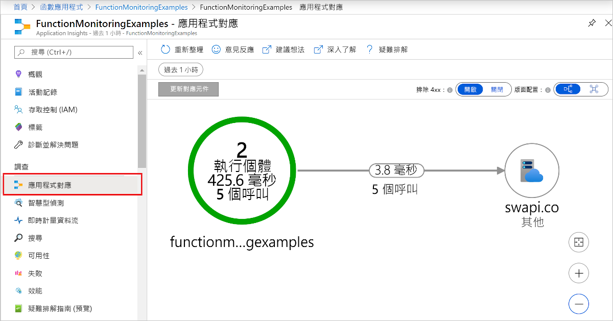

## <a name="enable-application-insights-integration"></a>啟用 Application Insights 整合

針對將資料傳送至 Application Insights 的函式應用程式，它需要知道 Application Insights 資源的檢測金鑰。 金鑰必須在名為 **APPINSIGHTS_INSTRUMENTATIONKEY** 的應用程式設定中。

當您[在 Azure 門戶中](functions-create-first-azure-function.md)、使用[Azure 函數核心工具](functions-create-first-azure-function-azure-cli.md)從命令列創建函數應用或使用[視覺化工作室代碼](functions-create-first-function-vs-code.md)時，預設情況下啟用應用程式見解集成。 應用程式見解資源的名稱與函數應用相同，並且創建在同一區域或最近區域中。

### <a name="new-function-app-in-the-portal"></a>門戶中的新功能應用

要查看正在創建的應用程式見解資源，請選擇它以展開 **"應用程式見解"** 視窗。 可以更改 **"新建資源"名稱**，或在要存儲資料的[Azure 地理區域](https://azure.microsoft.com/global-infrastructure/geographies/)中選擇其他**位置**。

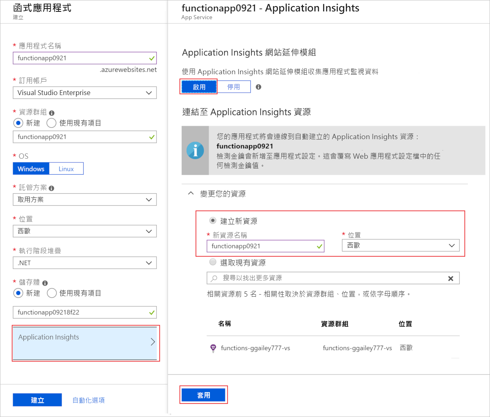

當您選擇 **"創建**"時，將使用函數應用創建應用程式見解資源，該應用在`APPINSIGHTS_INSTRUMENTATIONKEY`應用程式設定中具有該設置。 一切都準備好了。

<a id="manually-connect-an-app-insights-resource"></a>
### <a name="add-to-an-existing-function-app"></a>添加到現有功能應用 

使用[Visual Studio](functions-create-your-first-function-visual-studio.md)創建函數應用時，必須創建應用程式見解資源。 然後，您可以將來自該資源的檢測金鑰作為函數應用中的應用程式設定添加。

[!INCLUDE [functions-connect-new-app-insights.md](../../includes/functions-connect-new-app-insights.md)]

函數的早期版本使用內置監視，不再推薦。 為此類函數應用啟用應用程式見解集成時，還必須[禁用內置日誌記錄](#disable-built-in-logging)。  

## <a name="report-issues"></a>報告問題

若要回報關於 Functions 中 Application Insights 整合的問題，或是提出建議或要求，請[在 GitHub 中建立問題](https://github.com/Azure/Azure-Functions/issues/new) \(英文\)。

## <a name="streaming-logs"></a>串流記錄

在開發應用程式時，您通常希望查看在 Azure 中運行時以近乎即時的方式寫入日誌的內容。

有兩種方法可以查看函數執行生成的日誌檔流。

* **內置日誌流：** 應用服務平臺允許您查看應用程式日誌檔的流。 這等效于在[本地開發](functions-develop-local.md)期間調試函數時以及門戶中使用 **"測試"** 選項卡時看到的輸出。 將顯示所有基於日誌的資訊。 有關詳細資訊，請參閱[流日誌](../app-service/troubleshoot-diagnostic-logs.md#stream-logs)。 此流式處理方法僅支援單個實例，不能與在"消費"計畫中在 Linux 上運行的應用一起使用。

* **即時指標流**：當函數應用[連接到應用程式見解](#enable-application-insights-integration)時，可以使用[即時指標流](../azure-monitor/app/live-stream.md)在 Azure 門戶中近乎即時地查看日誌資料和其他指標。 在監視在多個實例或 Linux 上運行的函數時，在消耗計畫中使用此方法。 此方法使用[採樣資料](#configure-sampling)。

可以在門戶和大多數本地開發環境中查看日誌流。 

### <a name="portal"></a>入口網站

您可以在門戶中查看這兩種類型的日誌流。

#### <a name="built-in-log-streaming"></a>內置日誌流

要查看門戶中的流式處理日誌，請在功能應用中選擇 **"平臺功能**"選項卡。 然後，在 **"監視"** 下，選擇 **"日誌流**"。

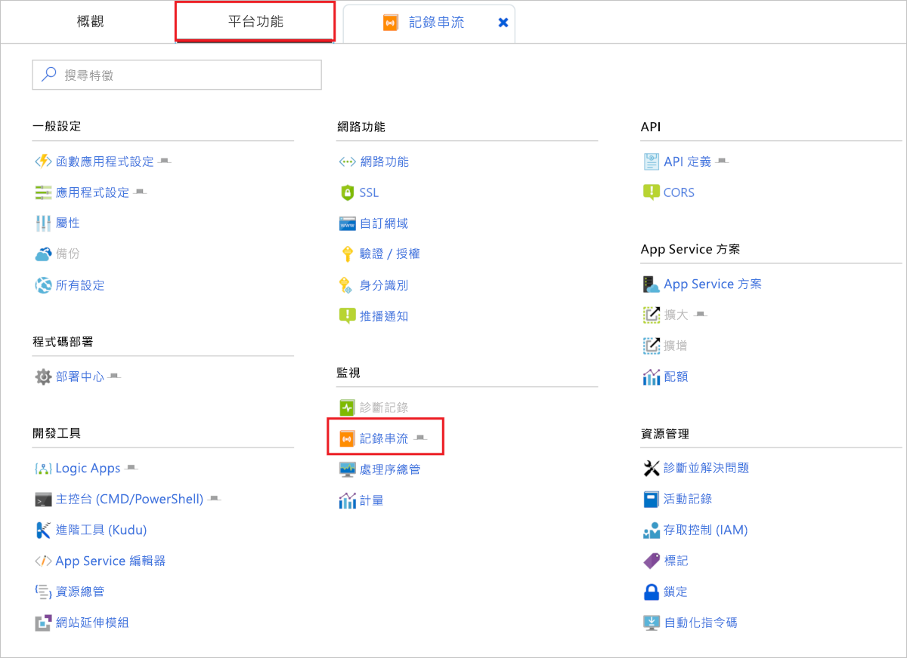

這會將應用連接到日誌流服務，應用程式日誌將顯示在視窗中。 您可以在**應用程式日誌**和**Web 服務器日誌**之間切換。  

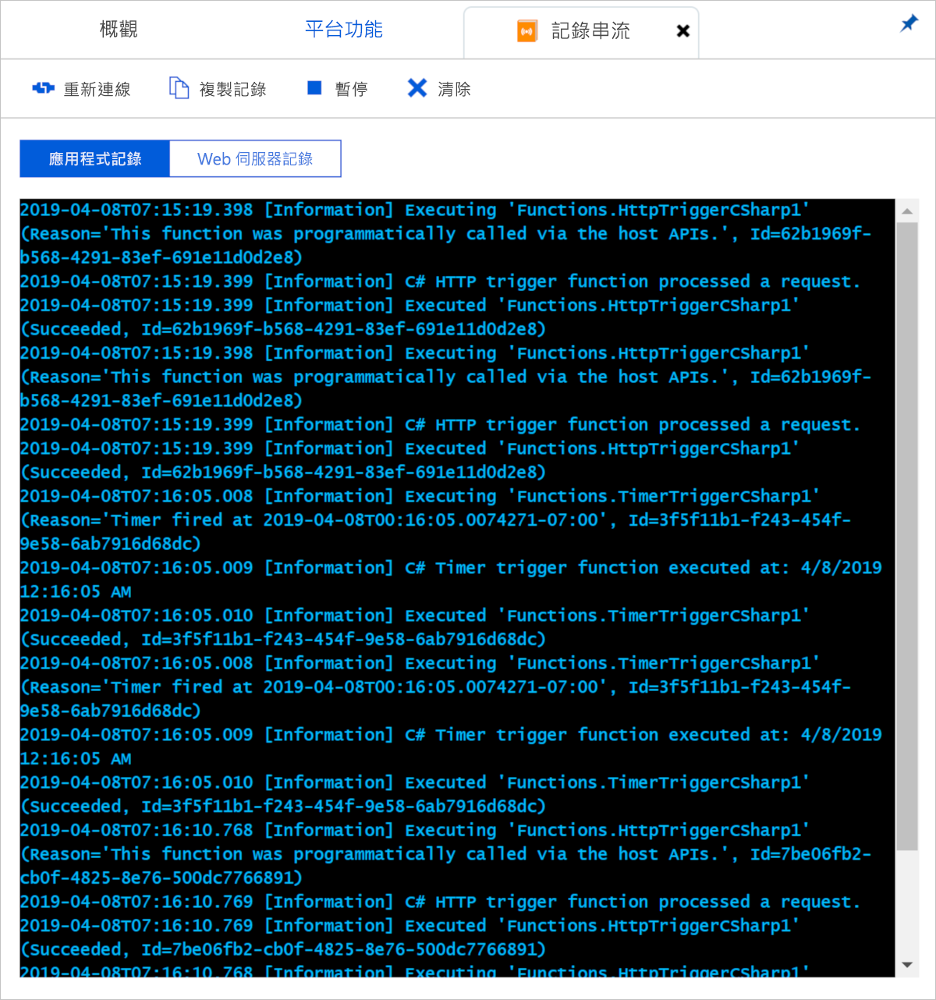

#### <a name="live-metrics-stream"></a>即時計量串流

要查看應用的即時指標流，請選擇功能應用的 **"概述"** 選項卡。 啟用應用程式見解後，請參閱 **"配置"功能**下**的應用程式見解**連結。 此連結將帶您到應用的應用程式見解頁面。

在"應用程式見解"中，選擇**即時指標流**。 [採樣日誌條目](#configure-sampling)顯示在 **"示例遙測"** 下。

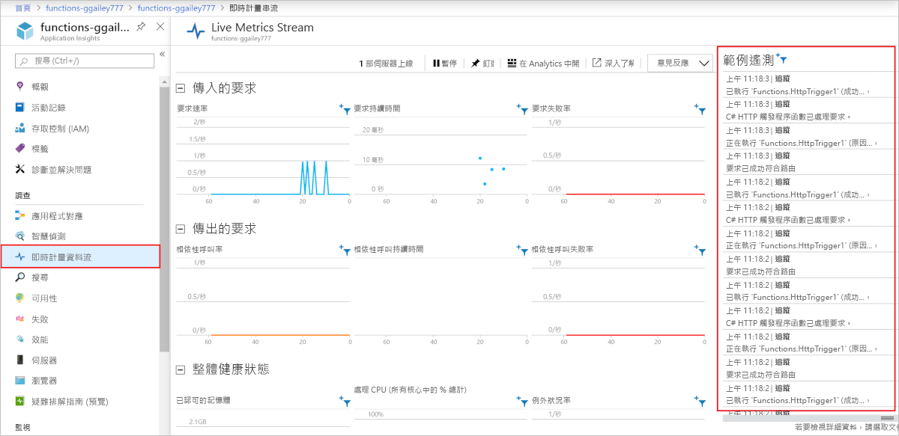 

### <a name="visual-studio-code"></a>Visual Studio Code

[!INCLUDE [functions-enable-log-stream-vs-code](../../includes/functions-enable-log-stream-vs-code.md)]

### <a name="core-tools"></a>核心工具

[!INCLUDE [functions-streaming-logs-core-tools](../../includes/functions-streaming-logs-core-tools.md)]

### <a name="azure-cli"></a>Azure CLI

可以使用[Azure CLI](/cli/azure/install-azure-cli)啟用流式處理日誌。 使用以下命令登錄、選擇訂閱和流日誌檔：

```azurecli
az login
az account list
az account set --subscription <subscriptionNameOrId>
az webapp log tail --resource-group <RESOURCE_GROUP_NAME> --name <FUNCTION_APP_NAME>
```

### <a name="azure-powershell"></a>Azure PowerShell

可以使用[Azure PowerShell](/powershell/azure/overview)啟用流式處理日誌。 對於 PowerShell，請使用以下命令添加 Azure 帳戶、選擇訂閱和流日誌檔：

```powershell
Add-AzAccount
Get-AzSubscription
Get-AzSubscription -SubscriptionName "<subscription name>" | Select-AzSubscription
Get-AzWebSiteLog -Name <FUNCTION_APP_NAME> -Tail
```

## <a name="disable-built-in-logging"></a>停用內建記錄

啟用應用程式見解時，禁用使用 Azure 存儲的內置日誌記錄。 內置日誌記錄可用於使用輕型工作負載進行測試，但不適用於高負載生產用途。 對於生產監控，我們建議應用見解。 如果在生產中使用內置日誌記錄，則由於 Azure 存儲的限制，日誌記錄可能不完整。

若要停用內建記錄，請刪除 `AzureWebJobsDashboard` 應用程式設定。 如需在 Azure 入口網站中刪除應用程式設定的相關資訊，請參閱[如何管理函式應用程式](functions-how-to-use-azure-function-app-settings.md#settings)的**應用程式設定**。 在刪除應用設置之前，請確保同一函數應用中沒有現有函數使用 Azure 存儲觸發器或綁定的設置。

## <a name="next-steps"></a>後續步驟

如需詳細資訊，請參閱下列資源：

* [Application Insights](/azure/application-insights/)
* [ASP.NET Core 記錄](/aspnet/core/fundamentals/logging/)

[主機.json]: functions-host-json.md
