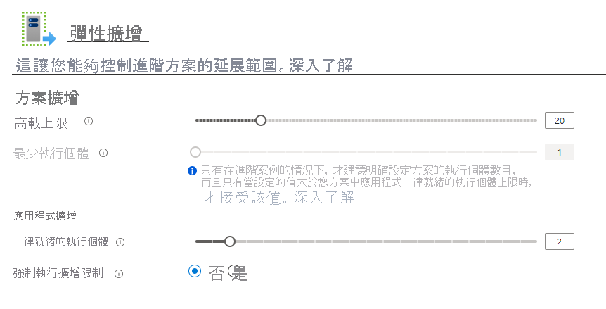

# <a name="azure-functions-premium-plan"></a>Azure Functions Premium 方案

Azure Functions Premium 方案（有時稱為彈性高階方案）是函數應用程式的裝載選項。 Premium 方案提供 VNet 連線能力、無冷啟動和 Premium 硬體等功能。  多個函數應用程式可以部署到相同的高階方案，而方案則可讓您設定計算實例大小、基本方案大小和最大方案大小。  如需高階計畫和其他計畫和裝載類型的比較，請參閱[函數級別和裝載選項](functions-scale.md)。

## <a name="create-a-premium-plan"></a>建立進階方案

[!INCLUDE [functions-premium-create](../../includes/functions-premium-create.md)]

您也可以使用 Azure CLI 中的[az functionapp plan create](/cli/azure/functionapp/plan#az-functionapp-plan-create)來建立高階計畫。 下列範例會建立_彈性 Premium 1_層方案：

```azurecli-interactive
az functionapp plan create --resource-group <RESOURCE_GROUP> --name <PLAN_NAME> \
--location <REGION> --sku EP1
```

在此範例中，請將取代為 `<RESOURCE_GROUP>` 您的資源群組，並 `<PLAN_NAME>` 以您方案的名稱（在資源群組中是唯一的）。 指定[支援 `<REGION>` ](https://azure.microsoft.com/global-infrastructure/services/?products=functions)的。 若要建立支援 Linux 的 Premium 方案，請包含 `--is-linux` 選項。

建立計畫之後，您可以使用[az functionapp create](/cli/azure/functionapp#az-functionapp-create)來建立函數應用程式。 在入口網站中，會同時建立方案和應用程式。 如需完整 Azure CLI 腳本的範例，請參閱[在 Premium 方案中建立函數應用程式](scripts/functions-cli-create-premium-plan.md)。

## <a name="features"></a>特性

下列功能可供部署至 Premium 方案的函數應用程式使用。

### <a name="pre-warmed-instances"></a>預先準備就緒的實例

如果目前在取用方案中沒有發生任何事件和執行，您的應用程式可能會相應縮小為零個實例。 當新事件進入時，必須將新的實例專門提供給在其上執行的應用程式。  根據應用程式，將新的實例特製化可能需要一些時間。  第一次呼叫時的此額外延遲通常稱為應用程式冷啟動。

在高階方案中，您可以讓應用程式預先準備就緒指定的實例數目，最多可達您最小的方案大小。  預先準備就緒的實例也可讓您在高負載前預先調整應用程式。 當應用程式相應放大時，它會先調整為預先準備就緒的實例。 其他實例會繼續緩衝並立即準備好進行下一個調整作業。 藉由擁有預先準備就緒之實例的緩衝區，您可以有效地避免冷啟動延遲。  預先準備就緒的實例是高階方案的一項功能，而且您必須至少保留一個執行中的實例，而且在計畫作用中的任何時候都可以使用。

您可以選取您的**函數應用程式**、前往 [**平臺功能**] 索引標籤，然後選取**Scale Out**選項，以在 Azure 入口網站中設定預先準備就緒的實例數目。 在 [函數應用程式] [編輯] 視窗中，預先準備就緒的實例是該應用程式特有的，但最小和最大實例適用于整個計畫。



您也可以使用 Azure CLI 為應用程式設定預先準備就緒的實例。

```azurecli-interactive
az resource update -g <resource_group> -n <function_app_name>/config/web --set properties.preWarmedInstanceCount=<desired_prewarmed_count> --resource-type Microsoft.Web/sites
```

### <a name="private-network-connectivity"></a>私人網路連線能力

部署至 Premium 方案的 Azure Functions 會利用[web 應用程式的新 VNet 整合](../app-service/web-sites-integrate-with-vnet.md)。  設定之後，您的應用程式就可以與 VNet 內的資源通訊，或透過服務端點來保護其安全。  應用程式也可以使用 IP 限制來限制連入流量。

將子網指派給高階方案中的函式應用程式時，您需要有足夠的 IP 位址可用於每個潛在實例的子網。 我們需要至少具有100個可用位址的 IP 區塊。

如需詳細資訊，請參閱[整合您的函數應用程式與 VNet](functions-create-vnet.md)。

### <a name="rapid-elastic-scale"></a>快速彈性調整

系統會使用與取用方案相同的快速調整邏輯，為您的應用程式自動新增額外的計算實例。 相同 App Service 方案中的應用程式會根據個別應用程式的需求，彼此獨立地進行調整。 不過，相同 App Service 方案中的函式應用程式會共用 VM 資源，以協助降低成本（可能的話）。 與 VM 相關聯的應用程式數目取決於每個應用程式的使用量和 VM 的大小。

若要深入瞭解調整如何運作，請參閱[函數級別和裝載](./functions-scale.md#how-the-consumption-and-premium-plans-work)。

### <a name="longer-run-duration"></a>較長的執行持續時間

取用方案中的 Azure Functions 僅限10分鐘的時間執行一次。  在 Premium 方案中，回合持續時間預設為30分鐘，以防止執行失控。 不過，您可以[修改設定上的 host.js](./functions-host-json.md#functiontimeout) ，讓 Premium 方案應用程式不受限制（保證60分鐘）。

## <a name="plan-and-sku-settings"></a>方案和 SKU 設定

當您建立方案時，可以設定兩個設定：實例的最小數目（或方案大小）和最大高載限制。  實例的最小值為保留且一律正在執行。

> [!IMPORTANT]
> 不論函式是否正在執行，您都會針對每個配置於最小實例計數的實例向您收費。

如果您的應用程式需要超過方案大小的實例，它可以繼續相應放大，直到實例數目達到最大高載限制為止。  只有在執行並出租給您的情況下，才會向您收取方案大小以外的實例費用。  我們會盡力將您的應用程式調整為其定義的最大限制，而最小方案實例則可保證您的應用程式。

您可以在 [Azure 入口網站中設定計劃大小和上限，方法是選取方案中的**Scale Out**選項或部署至該方案的函式應用程式（在 [**平臺功能**] 底下）。

您也可以從 Azure CLI 增加最大的高載限制：

```azurecli-interactive
az resource update -g <resource_group> -n <premium_plan_name> --set properties.maximumElasticWorkerCount=<desired_max_burst> --resource-type Microsoft.Web/serverfarms 
```

### <a name="available-instance-skus"></a>可用的實例 Sku

建立或調整您的方案時，您可以選擇三種實例大小。  系統會向您收取每秒耗用的核心和記憶體總數。  您的應用程式可以視需要自動相應放大至多個實例。  

|SKU|核心|Memory|儲存體|
|--|--|--|--|
|EP1|1|3.5 GB|250GB|
|EP2|2|7 GB|250GB|
|EP3|4|14 GB|250GB|

### <a name="memory-utilization-considerations"></a>記憶體使用量考慮
在具有更多記憶體的電腦上執行，並不一定表示您的函式應用程式會使用所有可用的記憶體。

例如，JavaScript 函式應用程式受限於 Node.js 中的預設記憶體限制。 若要增加此固定記憶體限制，請新增 `languageWorkers:node:arguments` 具有值的應用程式設定 `--max-old-space-size=<max memory in MB>` 。

## <a name="region-max-scale-out"></a>區域最大 Scale Out

以下是每個區域和 OS 設定中，單一計畫目前支援的最大相應放大值。 若要要求增加，請開啟支援票證。

請參閱這裡的函式完整區域可用性： [Azure.com](https://azure.microsoft.com/global-infrastructure/services/?products=functions)

|區域| Windows | Linux |
|--| -- | -- |
|澳大利亞中部| 20 | 無法使用 |
|澳大利亞中部 2| 20 | 無法使用 |
|澳大利亞東部| 100 | 20 |
|澳大利亞東南部 | 100 | 20 |
|巴西南部| 60 | 20 |
|加拿大中部| 100 | 20 |
|美國中部| 100 | 20 |
|東亞| 100 | 20 |
|美國東部 | 100 | 20 |
|美國東部 2| 100 | 20 |
|法國中部| 100 | 20 |
|德國中西部| 100 | 無法使用 |
|日本東部| 100 | 20 |
|日本西部| 100 | 20 |
|南韓中部| 100 | 20 |
|美國中北部| 100 | 20 |
|北歐| 100 | 20 |
|挪威東部| 20 | 20 |
|美國中南部| 100 | 20 |
|印度南部 | 100 | 無法使用 |
|東南亞| 100 | 20 |
|英國南部| 100 | 20 |
|英國西部| 100 | 20 |
|西歐| 100 | 20 |
|印度西部| 100 | 20 |
|美國中西部| 20 | 20 |
|美國西部| 100 | 20 |
|美國西部 2| 100 | 20 |

## <a name="next-steps"></a>後續步驟

> [!div class="nextstepaction"]
> [瞭解 Azure Functions 規模和裝載選項](functions-scale.md)
