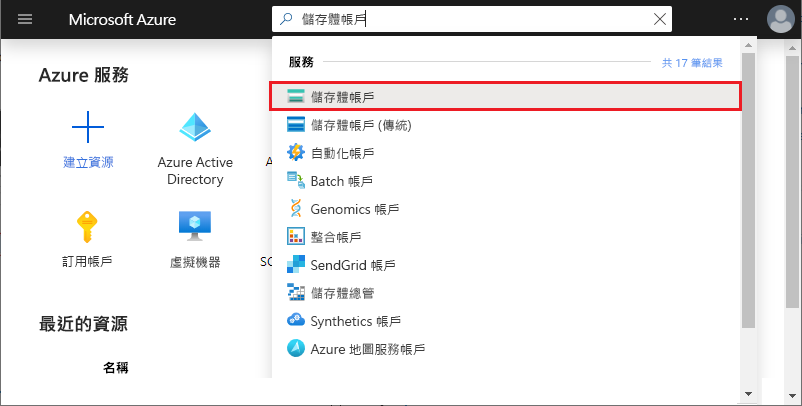
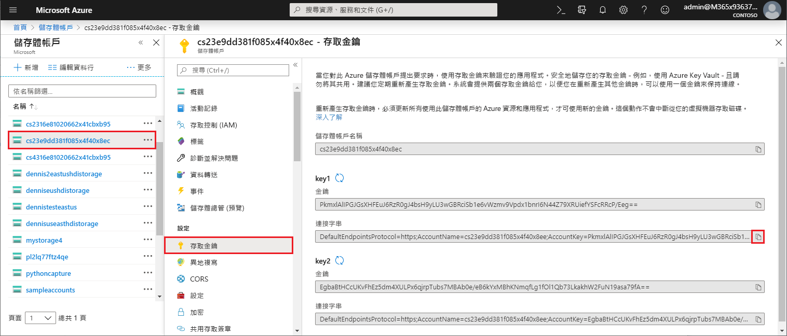
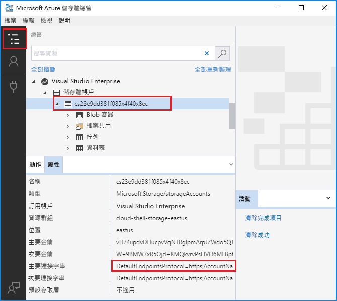

# <a name="work-with-azure-functions-core-tools"></a>使用 Azure Functions Core Tools

Azure Functions Core Tools 可讓您從命令提示字元或終端機，在本機電腦上開發及測試您的函式。 您的本機函式可以連線到即時 Azure 服務，而且您可以在本機電腦上使用完整的 Functions 執行階段進行您的函式偵錯。 您甚至可以將函式應用程式部署至您的 Azure 訂用帳戶。

[!INCLUDE [Don't mix development environments](../../includes/functions-mixed-dev-environments.md)]

在本地電腦上開發函數並使用核心工具將其發佈到 Azure，遵循以下基本步驟：

> [!div class="checklist"]
> * [安裝核心工具和依賴項。](#v2)
> * [從特定于語言的範本創建函數應用專案。](#create-a-local-functions-project)
> * [註冊觸發器和綁定擴展。](#register-extensions)
> * [定義存儲和其他連接。](#local-settings-file)
> * [從觸發器和特定于語言的範本創建函數。](#create-func)
> * [在本地運行函數。](#start)
> * [將專案發佈到 Azure。](#publish)

## <a name="core-tools-versions"></a>Core Tools 版本

Azure 函數核心工具有三個版本。 您使用的版本取決於本地開發環境、[語言選擇](supported-languages.md)以及所需的支援級別：

+ **版本 1.x**： 支援 Azure 函數運行時的版本 1.x。 這個版本的工具只有在 Windows 電腦上提供支援，並且從 [npm 套件](https://www.npmjs.com/package/azure-functions-core-tools)進行安裝。

+ [**版本 2.x/3.x**](#v2)： 支援[Azure 函數運行時的版本 2.x 或 3.x。](functions-versions.md) 這些版本支援[Windows](/azure/azure-functions/functions-run-local?tabs=windows#v2) [Windows、macOS](/azure/azure-functions/functions-run-local?tabs=macos#v2)和[Linux，](/azure/azure-functions/functions-run-local?tabs=linux#v2)並使用特定于平臺的包管理器或 npm 進行安裝。

除非另有說明，本文中的示例適用于版本 3.x。

## <a name="install-the-azure-functions-core-tools"></a>安裝 Azure Functions Core Tools

[Azure Functions Core Tools] 包含相同的執行階段版本，以支援您可在本機開發電腦上執行的 Azure Functions 執行階段。 它也提供命令來建立函式、連線到 Azure，以及部署函式專案。

>[!IMPORTANT]
>您必須在本地安裝[Azure CLI](/cli/azure/install-azure-cli)才能從 Azure 函數核心工具發佈到 Azure。  

### <a name="version-2x-and-3x"></a><a name="v2"></a>版本 2.x 和 3.x

工具的版本 2.x/3.x 使用在 .NET Core 上構建的 Azure 函數運行時。 此版本在所有平臺上都支援 .NET Core 支援，包括[Windows、macOS](/azure/azure-functions/functions-run-local?tabs=windows#v2)和[Linux](/azure/azure-functions/functions-run-local?tabs=linux#v2)。 [macOS](/azure/azure-functions/functions-run-local?tabs=macos#v2) 

> [!IMPORTANT]
> 您可以使用[擴展包]繞過安裝 .NET Core SDK 的要求。

# <a name="windows"></a>[Windows](#tab/windows)

下列步驟使用 npm 在 Windows 上安裝 Core Tools。 您也可以使用 [Chocolatey](https://chocolatey.org/)。 如需詳細資訊，請參閱 [Core Tools 讀我檔案](https://github.com/Azure/azure-functions-core-tools/blob/master/README.md#windows)。

1. 安裝 [Node.js] (內含 npm)。
    - 針對 2.x 版的工具，只支援 Node.js 8.5 和更新版本。
    - 對於工具的版本 3.x，僅支援 Node.js 10 和更高版本。

1. 安裝 Core Tools 套件：

    ##### <a name="v2x"></a>v2.x

    ```cmd
    npm install -g azure-functions-core-tools
    ```

    ##### <a name="v3x"></a>v3.x

    ```cmd
    npm install -g azure-functions-core-tools@3
    ```

   下載並安裝核心工具組可能需要幾分鐘時間。

1. 如果您不打算使用[擴展包]，請安裝用於 Windows 的[.NET Core 2.x SDK。](https://www.microsoft.com/net/download/windows)

# <a name="macos"></a>[macOS](#tab/macos)

下列步驟使用 Homebrew 在 macOS 上安裝 Core Tools。

1. 如果尚未安裝 [Homebrew](https://brew.sh/)，請加以安裝。

1. 安裝 Core Tools 套件：

    ##### <a name="v2x"></a>v2.x

    ```bash
    brew tap azure/functions
    brew install azure-functions-core-tools
    ```

    ##### <a name="v3x"></a>v3.x

    ```bash
    brew tap azure/functions
    brew install azure-functions-core-tools@3
    # if upgrading on a machine that has 2.x installed
    brew link --overwrite azure-functions-core-tools@3
    ```

# <a name="linux"></a>[Linux](#tab/linux)

下列步驟使用 [APT](https://wiki.debian.org/Apt) 在 Ubuntu/Debian Linux 散發套件上安裝 Core Tools。 若為其他 Linux 散發套件，請參閱 [Core Tools 讀我檔案](https://github.com/Azure/azure-functions-core-tools/blob/master/README.md#linux)。

1. 安裝 Microsoft 包存儲庫 GPG 金鑰，以驗證封裝的完整性：

    ```bash
    curl https://packages.microsoft.com/keys/microsoft.asc | gpg --dearmor > microsoft.gpg
    sudo mv microsoft.gpg /etc/apt/trusted.gpg.d/microsoft.gpg
    ```

1. 在進行 APT 更新之前設置 .NET 開發源清單。

   要設置 Ubuntu 的 APT 源清單，運行以下命令：

    ```bash
    sudo sh -c 'echo "deb [arch=amd64] https://packages.microsoft.com/repos/microsoft-ubuntu-$(lsb_release -cs)-prod $(lsb_release -cs) main" > /etc/apt/sources.list.d/dotnetdev.list'
    ```

   要設置 Debian 的 APT 源清單，運行以下命令：

    ```bash
    sudo sh -c 'echo "deb [arch=amd64] https://packages.microsoft.com/debian/$(lsb_release -rs | cut -d'.' -f 1)/prod $(lsb_release -cs) main" > /etc/apt/sources.list.d/dotnetdev.list'
    ```

1. 檢查檔`/etc/apt/sources.list.d/dotnetdev.list`中列出的相應 Linux 版本字串之一：

    | Linux 發行版本 | 版本 |
    | --------------- | ----------- |
    | Debian 9 | `stretch` |
    | Debian 8 | `jessie` |
    | Ubuntu 18.10    | `cosmic`    |
    | Ubuntu 18.04    | `bionic`    |
    | Ubuntu 17.04    | `zesty`     |
    | Ubuntu 16.04/Linux Mint 18    | `xenial`  |

1. 啟動 APT 源更新：

    ```bash
    sudo apt-get update
    ```

1. 安裝 Core Tools 套件：

    ```bash
    sudo apt-get install azure-functions-core-tools
    ```

1. 如果您不打算使用[擴展包]，請[安裝 .NET Core 2.x SDK 作為 Linux](https://www.microsoft.com/net/download/linux)。

---

## <a name="create-a-local-functions-project"></a>建立本機的 Functions 專案

Functions 專案目錄包含 [host.json](functions-host-json.md) 和 [local.settings.json](#local-settings-file) 檔案，以及包含個別函式程式碼的子資料夾。 此目錄相當於 Azure 中的函式應用程式。 若要深入了解 Functions 的資料夾結構，請參閱 [Azure Functions 的開發人員指南](functions-reference.md#folder-structure)。

版本 2.x 要求您在初始化專案時為專案選擇預設語言。 在版本 2.x 中，添加的所有函數都使用預設語言範本。 在 1.x 版中，您會在每次建立函式時指定語言。

在終端機視窗或命令提示字元中，執行下列命令來建立專案和本機 Git 存放庫：

```
func init MyFunctionProj
```

當您提供專案名稱時，系統會建立具有該名稱的新資料夾，並將其初始化。 否則，會將目前的資料夾初始化。  
在 2.x 版中，當您執行命令時，您必須為您的專案選擇執行階段。 

<pre>
Select a worker runtime:
dotnet
node
python 
powershell
</pre>

使用向上/向下鍵來選擇語言，然後按 Enter。 如果您計畫開發 JavaScript 或 TypeScript 函數，請選擇**節點**，然後選擇語言。 TypeScript 有[一些附加要求](functions-reference-node.md#typescript)。 

JavaScript 專案的輸出看起來會像下列範例：

<pre>
Select a worker runtime: node
Writing .gitignore
Writing host.json
Writing local.settings.json
Writing C:\myfunctions\myMyFunctionProj\.vscode\extensions.json
Initialized empty Git repository in C:/myfunctions/myMyFunctionProj/.git/
</pre>

`func init` 支援下列選項 (僅限用於 2.x 版，除非另有指定)：

| 選項     | 描述                            |
| ------------ | -------------------------------------- |
| **`--csharp`**<br/> **`--dotnet`** | 初始化[C# 類庫 （.cs） 專案](functions-dotnet-class-library.md)。 |
| **`--csx`** | 初始化[C# 腳本 （.csx） 專案](functions-reference-csharp.md)。 您必須在後續的命令中指定 `--csx`。 |
| **`--docker`** | 使用以選擇的 `--worker-runtime` 為基礎的基底映像，為容器建立 Dockerfile。 如果您要發佈至自訂 Linux 容器，請使用此選項。 |
| **`--docker-only`** |  將 Dockerfile 添加到現有專案。 如果未指定或在本地.set.json 中設置，則提示輔助角色運行時。 當您計畫將現有專案發佈到自訂 Linux 容器時，請使用此選項。 |
| **`--force`** | 即使專案中有現有的檔案，仍初始化專案。 此設定會以相同的名稱覆寫現有的檔案。 專案資料夾中的其他檔案不會受到影響。 |
| **`--java`**  | 初始化[JAVA 專案](functions-reference-java.md)。 |
| **`--javascript`**<br/>**`--node`**  | 初始化[JavaScript 專案](functions-reference-node.md)。 |
| **`--no-source-control`**<br/>**`-n`** | 在 1.x 版中防止依預設建立 Git 存放庫。 在 2.x 版中，依預設不會建立 Git 存放庫。 |
| **`--powershell`**  | 初始化[PowerShell 專案](functions-reference-powershell.md)。 |
| **`--python`**  | 初始化[Python 專案](functions-reference-python.md)。 |
| **`--source-control`** | 控制是否要建立 Git 存放庫。 依預設不會建立存放庫。 設為 `true` 時，就會建立存放庫。 |
| **`--typescript`**  | 初始化[TypeScript 專案](functions-reference-node.md#typescript)。 |
| **`--worker-runtime`** | 設定專案的語言執行階段。 支援的值包括： `csharp` `dotnet` `node` `powershell`、、、、、、`python``typescript``java``javascript`和 。 未設置時，系統會提示您在初始化期間選擇運行時。 |

> [!IMPORTANT]
> 根據預設，2.x 版的 Core Tools 會建立適用於 .NET 執行階段的函數應用程式專案作為 [C# 類別專案](functions-dotnet-class-library.md) (.csproj)。 這些 C# 專案可以與 Visual Studio 或 Visual Studio Code 搭配使用，並在測試期間以及發佈至 Azure 時進行編譯。 如果您想要改為建立和使用在 1.x 版中以及在入口網站中建立的相同 C# 指令碼 (.csx) 檔案，當您建立及部署函式時，必須包含 `--csx` 參數。

[!INCLUDE [functions-core-tools-install-extension](../../includes/functions-core-tools-install-extension.md)]

[!INCLUDE [functions-local-settings-file](../../includes/functions-local-settings-file.md)]

根據預設，在專案發佈至 Azure 時，這些設定將不會自動移轉。 請在[發佈時](#publish)使用 `--publish-local-settings` 參數，以確保這些設定會新增至 Azure 中的函式應用程式。 請注意，**ConnectionStrings** 中的值一律不會發佈。

這些函數應用程式設定值在您的程式碼中也可以做為環境變數加以讀取。 如需詳細資訊，請參閱這些特定語言參考主題的「環境變數」章節：

* [先行編譯 C#](functions-dotnet-class-library.md#environment-variables)
* [C# 指令碼 (.csx)](functions-reference-csharp.md#environment-variables)
* [JAVA](functions-reference-java.md#environment-variables)
* [JAVAscript](functions-reference-node.md#environment-variables)

當未為其[`AzureWebJobsStorage`]設置有效的存儲連接字串且未使用模擬器時，將顯示以下錯誤訊息：

> 在 local.settings.json 中遺失 AzureWebJobsStorage 的值。 這對 HTTP 以外的所有觸發程序是必要的。 您可以執行 'func azure functionapp fetch-app-settings \<functionAppName\>'，或指定 local.settings.json 中的連接字串。

### <a name="get-your-storage-connection-strings"></a>取得您的儲存體連接字串

即使使用 Microsoft Azure 存儲模擬器進行開發，也可能需要使用實際存儲連接進行測試。 假設您已經[建立了儲存體帳戶](../storage/common/storage-create-storage-account.md)，您可以透過下列其中一種方式取得有效的儲存體連接字串：

- 從[Azure 門戶]中，搜索並選擇**存儲帳戶**。 
  
  
  選擇存儲帳戶，在 **"設置"** 中選擇 **"便捷鍵**"，然後複製**連接字串**值之一。
  

- 使用 [Azure 儲存體總管](https://storageexplorer.com/)以連接至您的 Azure 帳戶。 在**資源管理器**中，展開訂閱、展開**存儲帳戶**、選擇存儲帳戶以及複製主連接字串或輔助連接字串。

  

+ 使用核心工具，並藉由以下其中一個命令從 Azure 下載連接字串：

  + 從現有的函數應用程式下載所有設定：

    ```
    func azure functionapp fetch-app-settings <FunctionAppName>
    ```
  + 取得特定儲存體帳戶的連接字串：

    ```
    func azure storage fetch-connection-string <StorageAccountName>
    ```

    如果您尚未登錄到 Azure，系統將提示您執行此操作。

## <a name="create-a-function"></a><a name="create-func"></a>建立函式

若要建立函式，請執行下列命令：

```
func new
```

在 2.x 版中，當您執行 `func new` 時，系統會提示您選擇採用函式應用程式預設語言的範本，然後系統也會提示您為您的函式選擇名稱。 在 1.x 版中，系統也會提示您選擇語言。

<pre>
Select a language: Select a template:
Blob trigger
Cosmos DB trigger
Event Grid trigger
HTTP trigger
Queue trigger
SendGrid
Service Bus Queue trigger
Service Bus Topic trigger
Timer trigger
</pre>

如您在下列佇列觸發程序輸出中所見，函式程式碼會在子資料夾中產生並採用所提供的函式名稱：

<pre>
Select a language: Select a template: Queue trigger
Function name: [QueueTriggerJS] MyQueueTrigger
Writing C:\myfunctions\myMyFunctionProj\MyQueueTrigger\index.js
Writing C:\myfunctions\myMyFunctionProj\MyQueueTrigger\readme.md
Writing C:\myfunctions\myMyFunctionProj\MyQueueTrigger\sample.dat
Writing C:\myfunctions\myMyFunctionProj\MyQueueTrigger\function.json
</pre>

您也可以使用下列引數，在命令中指定這些選項：

| 引數     | 描述                            |
| ------------------------------------------ | -------------------------------------- |
| **`--csx`** | (2.x 版) 產生 1.x 版中和入口網站中所使用的相同 C# 指令碼 (.csx) 範本。 |
| **`--language`**, **`-l`**| 範本程式語言，例如 C#、F# 或 JavaScript。 這是 1.x 版中的必要選項。 在 2.x 版中請勿使用此選項，或選擇符合背景工作執行階段的語言。 |
| **`--name`**, **`-n`** | 函數名稱。 |
| **`--template`**, **`-t`** | 使用 `func templates list` 命令，以針對每個支援的語言查看可用範本的完整清單。   |

例如，若要在單一命令中建立 JavaScript HTTP 觸發程序，請執行：

```
func new --template "Http Trigger" --name MyHttpTrigger
```

若要在單一命令中建立佇列所觸發的函式，請執行：

```
func new --template "Queue Trigger" --name QueueTriggerJS
```

## <a name="run-functions-locally"></a><a name="start"></a>在本機執行函式

若要執行 Functions 專案，請執行 Functions 主機。 主機啟用專案中的所有函數的觸發器。 視您的專案語言而定，啟動命令會有所不同。

# <a name="c"></a>[C\#](#tab/csharp)

```
func start --build
```
# <a name="javascript"></a>[JAVAscript](#tab/node)

```
func start
```

# <a name="python"></a>[Python](#tab/python)

```
func start
```
此命令必須在[虛擬環境中運行](/azure/azure-functions/functions-create-first-azure-function-azure-cli?pivots=programming-language-python#create-venv)。

# <a name="typescript"></a>[TypeScript](#tab/ts)

```
npm install
npm start     
```

---

>[!NOTE]  
> 函數運行時的版本 1.x 需要命令`host`，如以下示例所示：
>
> ```
> func host start
> ```

`func start` 支援下列選項：

| 選項     | 描述                            |
| ------------ | -------------------------------------- |
| **`--no-build`** | 執行前請勿建置目前的專案。 僅適用於 dotnet 專案。 預設會設定為 false。 版本 1.x 不支援。 |
| **`--cert`** | 包含私密金鑰的 .pfx 檔案路徑。 僅能與 `--useHttps` 搭配使用。 版本 1.x 不支援。 |
| **`--cors-credentials`** | 允許版本 1.x 不支援的跨源身份驗證請求（即 Cookie 和身份驗證標頭）。 |
| **`--cors`** | 以逗號分隔的 CORS 來源清單，不含空格。 |
| **`--language-worker`** | 用來設定語言背景工作角色的引數。 例如，您可以通過提供[調試埠和其他必需的參數](https://github.com/Azure/azure-functions-core-tools/wiki/Enable-Debugging-for-language-workers)來啟用語言工作者的調試。 版本 1.x 不支援。 |
| **`--nodeDebugPort`**, **`-n`** | Node.js 調試器要使用的埠。 預設值：Launch.json 中的值或 5858。 僅限 1.x 版。 |
| **`--password`** | 密碼或包含 .pfx 檔案密碼的檔案。 僅能與 `--cert` 搭配使用。 版本 1.x 不支援。 |
| **`--port`**, **`-p`** | 要接聽的本機連接埠。 預設值：7071。 |
| **`--pause-on-error`** | 暫停以在結束處理程序之前取得其他輸入。 這僅適用於從整合式開發環境 (IDE) 啟動 Core Tools 時。|
| **`--script-root`**, **`--prefix`** | 用來為要執行或部署的函式應用程式指定根目錄的路徑。 此選項可用於在子資料夾中產生專案檔的編譯專案。 例如，當您建置 C# 類別庫專案時，將會以類似於 `MyProject/bin/Debug/netstandard2.0` 的路徑在 *root* 子資料夾中產生 host.json、local.settings.json 和 function.json 等檔案。 在此情況下，請將前置詞設為 `--script-root MyProject/bin/Debug/netstandard2.0`。 這是函式應用程式在 Azure 中執行時的根目錄。 |
| **`--timeout`**, **`-t`** | Functions 主機要啟動的逾時 (以秒為單位)。 預設值：20 秒。|
| **`--useHttps`** | 繫結至 `https://localhost:{port}` 而不是 `http://localhost:{port}` 。 根據預設，此選項會在您的電腦上建立受信任的憑證。|

Functions 主機啟動時，它會輸出 HTTP 觸發函式的 URL：

<pre>
Found the following functions:
Host.Functions.MyHttpTrigger

Job host started
Http Function MyHttpTrigger: http://localhost:7071/api/MyHttpTrigger
</pre>

>[!IMPORTANT]
>在本地運行時，不會為 HTTP 終結點強制實施授權。 這表示所有的本機 HTTP 要求會作為 `authLevel = "anonymous"` 處理。 如需詳細資訊，請參閱 [HTTP 繫結文章](functions-bindings-http-webhook-trigger.md#authorization-keys)。

### <a name="passing-test-data-to-a-function"></a>將測試資料傳遞至函式

若要在本機測試您的函式，您要使用 HTTP 要求在本機伺服器上[啟動 Functions 主機](#start)並呼叫端點。 您呼叫的端點取決於函式的類型。

>[!NOTE]
> 本主題中的範例使用 cURL 工具，從終端機或命令提示字元傳送 HTTP 要求。 您可以使用您選擇的工具，將 HTTP 要求傳送至本機伺服器。 cURL 工具在基於 Linux 的系統和 Windows 10 版本 17063 及更高版本中預設可用。 在較舊的 Windows 上，必須首先下載並安裝[cURL 工具](https://curl.haxx.se/)。

如需測試函式的更多一般資訊，請參閱[在 Azure Functions 中測試程式碼的策略](functions-test-a-function.md)。

#### <a name="http-and-webhook-triggered-functions"></a>HTTP 和 Webhook 觸發的函式

您要呼叫下列端點，以在本機執行 HTTP 和 Webhook 觸發的函式：

    http://localhost:{port}/api/{function_name}

請務必使用 Functions 主機接聽的相同伺服器名稱和連接埠。 啟動 Function 主機時，您會在產生的輸出中看到下列內容。 您可以使用觸發程序支援的任何 HTTP 方法呼叫此 URL。

下列 cURL 命令從 GET 要求在查詢字串中傳遞 _name_ 參數，觸發 `MyHttpTrigger` 快速入門函式。

```
curl --get http://localhost:7071/api/MyHttpTrigger?name=Azure%20Rocks
```

下列範例與從 POST 要求在要求本文中傳遞 _name_ 所呼叫的函式相同：

# <a name="bash"></a>[Bash](#tab/bash)
```bash
curl --request POST http://localhost:7071/api/MyHttpTrigger --data '{"name":"Azure Rocks"}'
```
# <a name="cmd"></a>[Cmd](#tab/cmd)
```cmd
curl --request POST http://localhost:7071/api/MyHttpTrigger --data "{'name':'Azure Rocks'}"
```
---

您可以從瀏覽器在查詢字串中傳遞資料來進行 GET 要求。 對於所有其他 HTTP 方法，您必須使用 cURL、Fiddler、Postman 或類似的 HTTP 測試工具。

#### <a name="non-http-triggered-functions"></a>非 HTTP 觸發函式

對於 HTTP 觸發器、Webhook 和事件網格觸發器以外的所有類型的函數，可以通過調用管理終結點在本地測試函數。 在本機伺服器上使用 HTTP POST 要求來呼叫此端點會觸發函式。 

要在本地測試事件網格觸發的函數，請參閱[使用檢視器 Web 應用進行本地測試](functions-bindings-event-grid-trigger.md#local-testing-with-viewer-web-app)。

您可以在 POST 要求本文中選擇性地傳遞測試資料到執行程序。 這項功能類似於 Azure 入口網站中的 [測試]**** 索引標籤。

您可以呼叫下列系統管理員端點來觸發非 HTTP 函式：

    http://localhost:{port}/admin/functions/{function_name}

若要將測試資料傳遞至函式的管理員端點，您必須在 POST 要求訊息的本文中提供資料。 訊息本文必須具備下列 JSON 格式：

```JSON
{
    "input": "<trigger_input>"
}
```

`<trigger_input>` 值包含函式預期格式的資料。 下列 cURL 範例是 POST 到 `QueueTriggerJS` 函式。 在此情況下，輸入是一個相當於在佇列中預期找到的訊息字串。

# <a name="bash"></a>[Bash](#tab/bash)
```bash
curl --request POST -H "Content-Type:application/json" --data '{"input":"sample queue data"}' http://localhost:7071/admin/functions/QueueTrigger
```
# <a name="cmd"></a>[Cmd](#tab/cmd)
```bash
curl --request POST -H "Content-Type:application/json" --data "{'input':'sample queue data'}" http://localhost:7071/admin/functions/QueueTrigger
```
---

#### <a name="using-the-func-run-command-version-1x-only"></a>使用命令`func run`（僅限版本 1.x）

>[!IMPORTANT]
> 該`func run`命令僅在工具的版本 1.x 中受支援。 如需詳細資訊，請參閱[如何設定 Azure Functions 執行階段版本目標](set-runtime-version.md)主題。

在版本 1.x 中，還可以通過使用`func run <FunctionName>`和 提供函數的輸入資料直接調用函數。 此命令類似於使用 Azure 入口網站中的 [測試]**** 索引標籤執行函式。

`func run` 支援下列選項：

| 選項     | 描述                            |
| ------------ | -------------------------------------- |
| **`--content`**, **`-c`** | 內嵌內容。 |
| **`--debug`**, **`-d`** | 在執行函式之前，請先將偵錯工具附加到主機處理序。|
| **`--timeout`**, **`-t`** | 本機 Functions 主機就緒前的等候時間 (以秒為單位)。|
| **`--file`**, **`-f`** | 要用來作為內容的檔案名稱。|
| **`--no-interactive`** | 不會提示輸入。 適用於自動化情節。|

例如，若要呼叫 HTTP 觸發的函式並傳遞內容的內文，請執行下列命令：

```
func run MyHttpTrigger -c '{\"name\": \"Azure\"}'
```

## <a name="publish-to-azure"></a><a name="publish"></a>發佈至 Azure

Azure 函數核心工具支援兩種類型的部署：通過[Zip 部署](functions-deployment-technologies.md#zip-deploy)將函數專案檔案直接部署到函數應用，並[部署自訂 Docker 容器](functions-deployment-technologies.md#docker-container)。 您必須已在[Azure 訂閱中創建了函數應用](functions-cli-samples.md#create)，您將向其部署代碼。 應建置需要編譯的專案，以便部署二進位檔。

>[!IMPORTANT]
>您必須在本地安裝[Azure CLI](/cli/azure/install-azure-cli)才能從核心工具發佈到 Azure。  

專案資料夾可能包含不應發佈的特定于語言的檔和目錄。 排除的專案列在根專案資料夾中的 .funcignore 檔中。     

### <a name="deploy-project-files"></a><a name="project-file-deployment"></a>部署專案檔案

要將本地代碼發佈到 Azure 中的函數應用，請使用以下`publish`命令：

```
func azure functionapp publish <FunctionAppName>
```

此命令會發行至 Azure 中的現有函式應用程式。 如果您嘗試發佈到訂閱中不存在的 ，`<FunctionAppName>`則將收到錯誤。 若要了解如何使用 Azure CLI 從命令提示字元或終端機視窗建立函式應用程式，請參閱[建立無伺服器也可執行的函式應用程式](./scripts/functions-cli-create-serverless.md)。 預設情況下，此命令使用[遠端生成](functions-deployment-technologies.md#remote-build)並部署應用[以從部署包運行](run-functions-from-deployment-package.md)。 要禁用此建議的部署模式，請使用`--nozip`選項。

>[!IMPORTANT]
> 當您在 Azure 入口網站中建立函式應用程式時，依預設會使用 2.x 版的函式執行階段。 若要讓函式應用程式使用 1.x 版的執行階段，請依照[在 1.x 版上執行](functions-versions.md#creating-1x-apps)中的指示操作。
> 若函式應用程式具有現有的函式，您就無法變更其執行階段版本。

以下發布選項適用于 1.x 和 2.x 兩個版本：

| 選項     | 描述                            |
| ------------ | -------------------------------------- |
| **`--publish-local-settings -i`** |  將 local.settings.json 中的設定發佈至 Azure，若設定已經存在，則提示進行覆寫。 如果使用 Microsoft Azure 存儲模擬程式，則首先將應用設置更改為[實際存儲連接](#get-your-storage-connection-strings)。 |
| **`--overwrite-settings -y`** | 在使用 `--publish-local-settings -i` 時隱藏覆寫應用程式設定的提示。|

下列發佈選項僅在 2.x 版中受到支援：

| 選項     | 描述                            |
| ------------ | -------------------------------------- |
| **`--publish-settings-only`**, **`-o`** |  僅發佈設定而略過內容。 預設值為提示。 |
|**`--list-ignored-files`** | 顯示在發佈期間忽略的檔案清單，以 .funcignore 檔案為準。 |
| **`--list-included-files`** | 顯示要發佈的檔案清單，以 .funcignore 檔案為準。 |
| **`--nozip`** | 關閉預設 `Run-From-Package` 模式。 |
| **`--build-native-deps`** | 在發佈 Python 函數應用時跳過生成 .wheels 資料夾。 |
| **`--build`**, **`-b`** | 部署到 Linux 函數應用時執行生成操作。 接受： `remote` `local`和 。 |
| **`--additional-packages`** | 建置原生相依性時將安裝的套件清單。 例如：`python3-dev libevent-dev`。 |
| **`--force`** | 在設定情況下忽略發佈前驗證。 |
| **`--csx`** | 發佈 C# 指令碼 (.csx) 專案。 |
| **`--no-build`** | 不要生成 .NET 類庫函數。 |
| **`--dotnet-cli-params`** | 發佈已編譯的 C# (.csproj) 函式時，Core Tools 會呼叫 'dotnet build --output bin/publish'。 傳至此處的任何參數都會附加至命令列。 |

### <a name="deploy-custom-container"></a>部署自訂容器

Azure 函數允許您在[自訂 Docker 容器](functions-deployment-technologies.md#docker-container)中部署函數專案。 如需詳細資訊，請參閱[使用自訂映像在 Linux 上建立函式](functions-create-function-linux-custom-image.md)。 自訂容器必須具有 Dockerfile。 要使用 Dockerfile 創建應用，請使用 中的`func init`--dockerfile 選項。

```
func deploy
```

以下是可用的自訂容器部署選項：

| 選項     | 描述                            |
| ------------ | -------------------------------------- |
| **`--registry`** | 目前的使用者所登入的 Docker 登錄名稱。 |
| **`--platform`** | 函式應用程式的裝載平台。 有效選項為 `kubernetes` |
| **`--name`** | 函式應用程式名稱。 |
| **`--max`**  | (選擇性) 設定作為部署目標的函式應用程式執行個體數目上限。 |
| **`--min`**  | (選擇性) 設定作為部署目標的函式應用程式執行個體數目下限。 |
| **`--config`** | 設定選用的部署組態檔。 |

## <a name="monitoring-functions"></a>監視函式

監視函數執行的建議方法是與 Azure 應用程式見解集成。 您還可以將執行日誌資料流到本地電腦。 若要深入了解，請參閱[監視 Azure Functions](functions-monitoring.md)。

### <a name="application-insights-integration"></a>應用程式洞察集成

在 Azure 中創建函數應用時，應啟用應用程式見解集成。 如果由於某種原因，函數應用未連接到應用程式見解實例，則很容易在 Azure 門戶中進行此集成。 

[!INCLUDE [functions-connect-new-app-insights.md](../../includes/functions-connect-new-app-insights.md)]

### <a name="enable-streaming-logs"></a>啟用流式處理日誌

您可以在本地電腦上的命令列會話中查看函數生成的日誌檔流。 

#### <a name="native-streaming-logs"></a>本機流日誌

[!INCLUDE [functions-streaming-logs-core-tools](../../includes/functions-streaming-logs-core-tools.md)]

這種類型的流式處理日誌要求為函數應用啟用應用程式見解集成。   


## <a name="next-steps"></a>後續步驟

瞭解如何使用 Azure 函數核心工具開發、測試和發佈 Azure 函數[Microsoft 學習模組](https://docs.microsoft.com/learn/modules/develop-test-deploy-azure-functions-with-core-tools/)Azure 函數核心工具是[開源的，託管在 GitHub](https://github.com/azure/azure-functions-cli)上。  
若要提出錯誤或功能要求，[請開啟 GitHub 問題](https://github.com/azure/azure-functions-cli/issues)。

<!-- LINKS -->

[Azure 函數核心工具]: https://www.npmjs.com/package/azure-functions-core-tools
[Azure 門戶]: https://portal.azure.com 
[Node.js]: https://docs.npmjs.com/getting-started/installing-node#osx-or-windows
[`FUNCTIONS_WORKER_RUNTIME`]: functions-app-settings.md#functions_worker_runtime
["Azure Web 作業存儲"]: functions-app-settings.md#azurewebjobsstorage
[擴展包]: functions-bindings-register.md#extension-bundles
