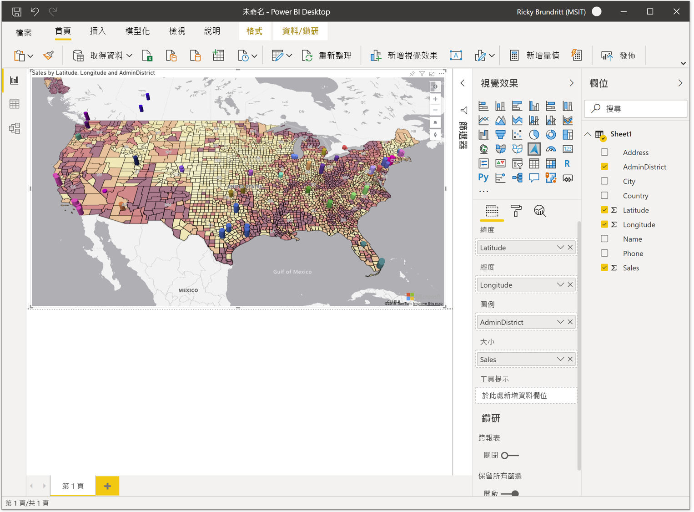

# 開始使用 Azure 地圖服務 Power BI 視覺效果

<Token>**適用物件：**  Power BI 服務取用***者***的 [是]  Power BI 服務適用于設計師 & 開發人員  Power BI Desktop  需要 Pro 或 Premium 授權</Token>

本文說明如何使用適用于 Power BI 的 [Microsoft Azure 地圖] 視覺效果。

> [!NOTE]
> 您可以在 Power BI Desktop 和 Power BI 服務中建立和查看此視覺效果。 本文中的步驟和圖例來自 Power BI Desktop。

Power BI 的 [Azure 地圖服務] 視覺效果會針對地圖上的空間資料提供一組豐富的資料視覺化。 估計超過80% 的商務資料有位置內容。 Azure 地圖服務視覺效果可用來深入瞭解此位置內容與您的商務資料有何關聯和影響。

## 傳送至 Azure 的內容為何？

Azure 地圖服務視覺效果會連接到裝載于 Azure 中的雲端服務，以取得位置資料，例如用來建立地圖視覺效果的地圖影像和座標。 

-   地圖的焦點區域詳細資料會傳送至 Azure，以抓取轉譯地圖畫布所需的影像， (也稱為地圖底圖) 。 
-   [位置]、[緯度] 和 [經度] 值區中的資料可能會傳送至 Azure，以 (稱為地理編碼) 的進程來抓取地圖座標。 

您或您的系統管理員可能需要更新防火牆，以允許存取使用下列 URL 的 Azure 地圖服務平臺。

> `https://atlas.microsoft.com`

若要深入瞭解與 Azure 地圖服務視覺效果相關的隱私權和使用規定，請參閱[Microsoft Azure 法律資訊](https://azure.microsoft.com/support/legal/)。

## 預覽行為及需求

此預覽版本的**Azure 地圖服務**有幾個考慮和需求：

-   **Azure 地圖服務**視覺效果處於預覽狀態，必須在 Power BI Desktop 中啟用。 若要啟用**Azure 地圖服務**，**請選取** &gt; [檔案**選項和設定**] [ &gt; **Options** &gt; **預覽功能**]，然後選取 [ **Azure 地圖服務視覺效果**] 核取方塊。 執行此動作之後，如果 Azure 地圖服務視覺效果無法使用，可能必須啟用管理入口網站中的租使用者系統管理員切換。
-   資料集必須具有包含**緯度**和**經度**資訊的欄位。 在未來的更新中將會新增位置欄位的地理編碼。
-   Power BI 的內建圖例控制項目前不會出現在此預覽中。 它將會在未來的更新中新增。

## 使用 Azure 地圖服務視覺效果

**Azure 地圖服務**視覺效果啟用後，請從 [視覺**效果**] 窗格中選取 [ **Azure 地圖服務**] 圖示。

![[視覺效果] 窗格上的 Azure 地圖服務視覺化] 按鈕](media/power-bi-visual/azure-maps-in-visualizations-pane.png)

Power BI 會建立空白的 Azure 地圖服務視覺化設計畫布。 在預覽期間，會顯示其他免責聲明。

請採取下列步驟來載入 Azure 地圖服務視覺效果：

1.  在 [**欄位**] 窗格中，將包含緯度和經度座標資訊的資料欄位拖曳到 [**緯度**] 和/或 [**經度**] 值區中。 這是載入 Azure 地圖服務視覺效果所需的最少資料。
    
    > [!div class="mx-imgBorder"]
    > 

2.  若要根據分類來為數據上色，請將類別欄位拖曳到 [**欄位**] 窗格的 [**圖例**] 值區。 在此範例中，我們會使用**AdminDistrict**資料行 (也稱為州或省) 。  
    
    > [!div class="mx-imgBorder"]
    > 

    > [!NOTE]
    > Power BI 的內建圖例控制項目前不會出現在此預覽中。 它將會在未來的更新中新增。

3.  若要調整資料的相對比例，請將量值拖曳到 [**欄位**] 窗格的 [**大小**] bucket。 在此範例中，我們使用的是**Sales**資料行。  
    
    > [!div class="mx-imgBorder"]
    > ![Azure 地圖服務視覺效果，會在提供的 [大小] 欄位之後，將點顯示為彩色和縮放的氣泡。](media/power-bi-visual/bubble-layer-with-legend-color-and-size.png)

4.  使用 [**格式**] 窗格中的選項來自訂資料的呈現方式。 下圖與上述影像相同，但 [反升圖層填滿透明度] 選項設為 [50%] 和 [高對比外框] 選項已啟用。  
    
    > [!div class="mx-imgBorder"]
    > 

## 欄位窗格 bucket

在 [Azure 地圖服務] 視覺效果的 [**欄位**] 窗格中，可以使用下列資料 bucket。

| 欄位     | 說明  |
|-----------|--------------|
| 緯度  | 用來指定資料點之緯度值的欄位。 緯度值的格式應該介於-90 和90之間。  |
| 經度 | 用來指定資料點之經度值的欄位。 經度值的格式應該介於-180 和180之間。  |
| 圖例    | 用來分類資料的欄位，並為每個類別中的資料點指派唯一的色彩。 當此 bucket 填滿時，[**資料色彩**] 區段會出現在 [**格式**] 窗格中，讓您能夠調整色彩。 |
| 大小      | 地圖上資料點的相對大小所使用的量值。   |
| 工具提示  | 當圖形暫留時，工具提示中顯示的其他資料欄位。 |

## 地圖設定

[格式] 窗格的 [**對應設定**] 區段提供選項，可讓您自訂地圖的顯示方式，以及回應更新。

| 設定             | 描述  |
|---------------------|--------------|
| 自動縮放           | 自動將地圖縮放至透過視覺效果的 [**欄位**] 窗格載入的資料。 當資料變更時，對應將會據以更新其位置。 當滑杆位於 [**關閉**] 位置時，會顯示預設地圖視圖的其他地圖視圖設定。 |
| 世界包裝          | 可讓使用者以無限的方式水準移動地圖。 |
| 樣式選擇器        | 將按鈕加入至地圖，讓報表讀者可以變更地圖的樣式。 |
| 導覽控制項 | 將按鈕新增至地圖做為另一種方法，讓報表讀者可以縮放、旋轉和變更地圖的間距。 如需詳細資訊，請參閱[流覽地圖](map-accessibility.md#navigating-the-map)上的這份檔，以取得使用者可以流覽地圖的各種不同方式的詳細資料。 |
| 地圖樣式           | 地圖的樣式。 如需詳細資訊，請參閱這份檔，以取得[支援的地圖樣式](supported-map-styles.md)的詳細資訊。 |

### 地圖視圖設定

如果 [**自動縮放**] 滑杆位於 [**關閉**] 位置，則會顯示下列設定，並允許使用者指定預設地圖視圖資訊。

| 設定          | 描述   |
|------------------|---------------|
| Zoom             | 地圖的預設縮放層級。 可以是介於0和22之間的數位。 |
| 中心緯度  | 地圖中心的預設緯度。 |
| 中心經度 | 地圖中心的預設經度。 |
| 朝向          | 地圖的預設方向（以度為單位），其中0是北部，90是東部，180是南部，而270是 west。 可以是介於0到360之間的任何數位。 |
| 音調            | 地圖的預設傾斜度，介於0到60之間，其中0會在地圖上直接向下尋找。 |

## 考量與限制

Azure 地圖服務視覺效果可在下列服務和應用程式中使用：

| 服務/應用程式                              | 可用性 |
|------------------------------------------|--------------|
| Power BI Desktop                         | 是          |
| Power BI 服務 (app.powerbi.com)       | 是          |
| Power BI 行動應用程式             | 是          |
| Power BI 的發佈至網路功能                  | 否           |
| Power BI Embedded                        | 否           |
| Power BI 服務內嵌 (PowerBI.com) | 是          |

未來的更新將會新增其他 Power BI 服務/應用程式的支援。

**Azure 地圖服務可用的位置為何？**

目前，所有國家和地區都有 Azure 地圖服務，但下列除外：

- 中國
- 南韓

如需 power 此視覺效果之不同 Azure 地圖服務服務的涵蓋範圍詳細資料，請參閱[地理涵蓋範圍資訊](geographic-coverage.md)檔。

**Azure 地圖服務視覺效果支援哪些 web 瀏覽器？**

如需[Azure 地圖服務 WEB SDK 支援的瀏覽器](supported-browsers.md)的詳細資訊，請參閱此檔。

**我可以視覺化多少個資料點？**

此視覺效果支援最多30000個資料點。

**此視覺效果中是否可以使用位址或其他位置字串？**

此視覺效果的初始預覽僅支援以小數為單位的緯度和經度值。 未來的更新將會新增位址和其他位置字串的支援。

## 後續步驟

深入瞭解 Azure 地圖服務 Power BI 視覺效果：

> [!div class="nextstepaction"]
> [瞭解 Azure 地圖服務 Power BI 視覺效果中的圖層](power-bi-visual-understanding-layers.md)

> [!div class="nextstepaction"]
> [管理您組織內的 Azure 地圖服務視覺效果](power-bi-visual-manage-access.md)

自訂視覺效果：

> [!div class="nextstepaction"]
> [在 Power BI 中色彩格式化的秘訣和訣竅](https://docs.microsoft.com/power-bi/visuals/service-tips-and-tricks-for-color-formatting)

> [!div class="nextstepaction"]
> [自訂視覺效果標題、背景和圖例](https://docs.microsoft.com/power-bi/visuals/power-bi-visualization-customize-title-background-and-legend)
