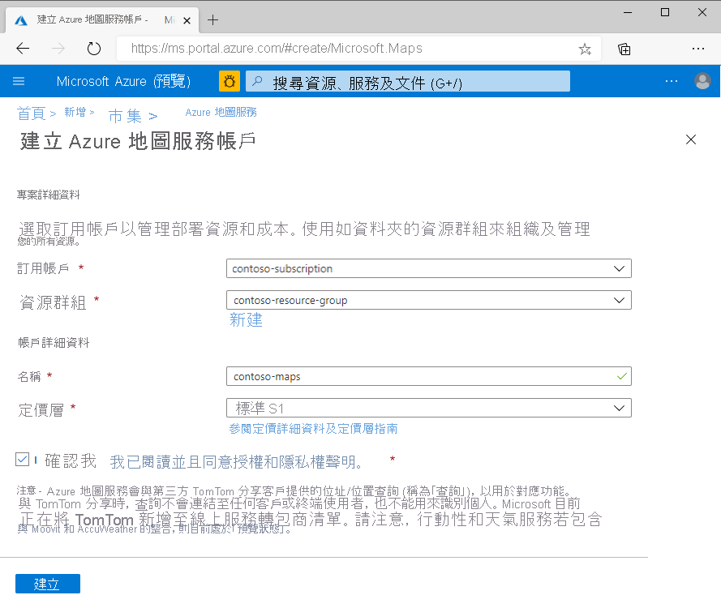
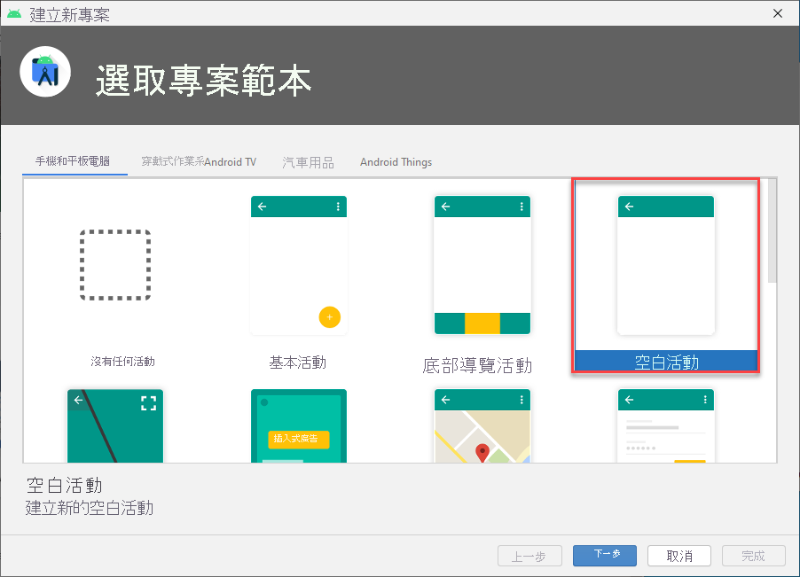
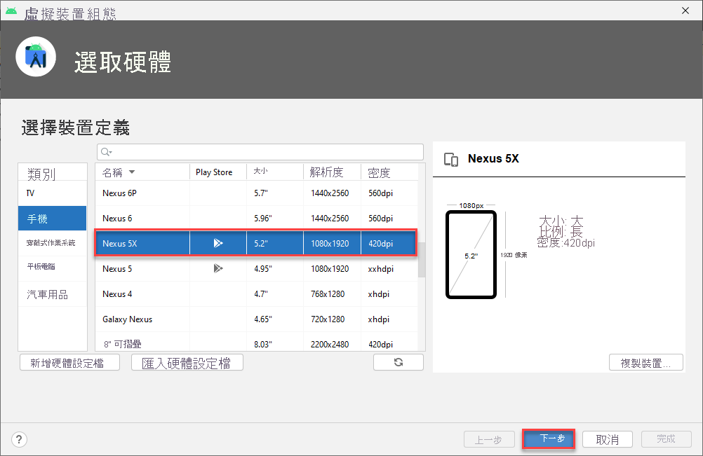
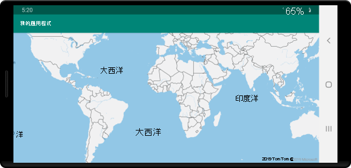

# <a name="quickstart-create-an-android-app-with-azure-maps"></a>快速入門：使用 Azure 地圖服務建立 Android 應用程式

本文說明如何將 Azure 地圖服務新增至 Android 應用程式。 文中會逐步引導您完成下列基本步驟：

* 設定開發環境。
* 建立您自己的 Azure 地圖服務帳戶。
* 取得您的主要 Azure 地圖服務金鑰以在應用程式中使用。
* 從專案參考 Azure 地圖服務程式庫。
* 將 Azure 地圖服務控制項新增至應用程式。

## <a name="prerequisites"></a>必要條件

1. 藉由登入 [Azure 入口網站](https://portal.azure.com) 來建立 Azure 地圖服務帳戶。 如果您沒有 Azure 訂用帳戶，請在開始前建立[免費帳戶](https://azure.microsoft.com/free/)。
2. [建立 Azure 地圖服務帳戶](quick-demo-map-app.md#create-an-azure-maps-account)
3. [取得主要訂用帳戶金鑰](quick-demo-map-app.md#get-the-primary-key-for-your-account)，也稱為主要金鑰或訂用帳戶金鑰。 如需 Azure 地圖服務中驗證的詳細資訊，請參閱[管理 Azure 地圖服務中的驗證](how-to-manage-authentication.md)。
4. 從 Google 免費下載 [Android Studio](https://developer.android.com/studio/)。

## <a name="create-an-azure-maps-account"></a>建立 Azure 地圖服務帳戶

使用下列步驟建立新的 Azure 地圖服務帳戶：

1. 按一下 [Azure 入口網站](https://portal.azure.com)左上角的 [建立資源]。
2. 在 [搜尋 Marketplace] 方塊中，輸入 **Azure 地圖服務**。
3. 從 [結果] 中，選取 [Azure 地圖服務]。 按一下地圖下方顯示的 [建立] 按鈕。
4. 在 [建立地圖服務帳戶] 頁面上輸入下列值：
    * 您想要使用於此帳戶的 [訂用帳戶]。
    * 此帳戶的 [資源群組] 名稱。 您可以選擇 [建立新的] 或 [使用現有的] 資源群組。
    * 新帳戶的 [名稱]。
    * 此帳戶的 [定價層]。
    * 閱讀 [授權] 和 [隱私權聲明]，然後選取核取方塊以接受條款。
    * 按一下 [ **建立** ] 按鈕。

    

## <a name="get-the-primary-key-for-your-account"></a>取得帳戶的主要金鑰

成功建立地圖服務帳戶後，擷取主要金鑰以便能查詢地圖服務 API。

1. 在入口網站中開啟地圖服務帳戶。
2. 在 [設定] 區段上，選取 [驗證]。
3. 將 [主索引鍵] 複製到剪貼簿。 將其儲存在本機，以供本教學課程稍後使用。

>[!NOTE]
> 如果您使用 Azure 訂用帳戶金鑰而非 Azure 地圖服務主要金鑰，您的地圖將無法正確轉譯。 此外，為了安全起見，建議您在主要和次要金鑰之間輪替。 若要輪替金鑰，將您的應用程式更新為使用次要金鑰，部署，然後按下主要金鑰旁的循環/重新整理按鈕，以產生新的主要金鑰。 舊的主要金鑰將會停用。 如需金鑰輪替的詳細資訊，請參閱[使用金鑰輪替和稽核來設定 Azure Key Vault](https://docs.microsoft.com/azure/key-vault/secrets/key-rotation-log-monitoring)


## <a name="create-a-project-in-android-studio"></a>在 Android Studio 中建立專案

首先，請建立具有空白活動的新專案。 完成下列步驟來建立 Android Studio 專案：

1. 在 [選擇您的專案] 底下選取 [手機和平板電腦]。 您的應用程式會在此板型規格上執行。
2. 在 [手機和平板電腦] 索引標籤上選取 [空白活動]，然後選取 [下一步]。
3. 在 [設定專案] 底下，選取 `API 21: Android 5.0.0 (Lollipop)` 作為最低版本的 SDK。 這是 Azure 地圖服務 Android SDK 所支援的最早版本。
4. 接受預設值 `Activity Name` 和 `Layout Name`，然後選取 [完成]。

請參閱 [Android Studio 文件](https://developer.android.com/studio/intro/)，以取得更多如何安裝 Android Studio 並建立新專案的說明。



## <a name="set-up-a-virtual-device"></a>設定虛擬裝置

Android Studio 可讓您在電腦上設定虛擬 Android 裝置。 這麼做可以協助您在開發期間測試應用程式。 若要設定虛擬裝置，請選取專案畫面右上角的 [Android 虛擬裝置 (AVD) 管理員] 圖示，然後選取 [建立虛擬裝置]。 您也可以從工具列選取 [工具] > [Android] > [AVD 管理員]，以前往 AVD 管理員。 在 [手機] 類別中選取 [Nexus 5X]，然後選取 [下一步]。

您可以在 [Android Studio 文件](https://developer.android.com/studio/run/managing-avds)中深入了解如何設定 AVD。



## <a name="install-the-azure-maps-android-sdk"></a>安裝 Azure 地圖服務 Android SDK

建置應用程式的下一步是安裝 Azure 地圖服務 Android SDK。 完成下列步驟以安裝 SDK：

1. 開啟頂層 **build.gradle** 檔案，並將下列程式碼新增至 [所有專案]、[存放庫區塊] 區段：

    ```java
    maven {
        url "https://atlas.microsoft.com/sdk/android"
    }
    ```

2. 更新 **app/build.gradle**，並於其中新增下列程式碼：

    1. 確定專案的 **minSdkVersion** 是 API 21 或更新版本。

    2. 將下列程式碼新增至 Android 區段：

        ```java
        compileOptions {
            sourceCompatibility JavaVersion.VERSION_1_8
            targetCompatibility JavaVersion.VERSION_1_8
        }
        ```

    3. 更新您的相依性區塊，並且為最新的 Azure 地圖服務 Android SDK 新增實作相依性程式行：

        ```java
        implementation "com.microsoft.azure.maps:mapcontrol:0.6"
        ```

        > [!Note]
        > 您也可以將版本號碼設定為 "0+"，使您的程式碼一律指向最新版本。

    4. 移至工具列中 [檔案]，然後按一下 [同步處理專案與 Gradle 檔案]。
3. 將地圖片段新增至主要活動 (res \> layout \> activity\_main.xml)：

    ```XML
    <?xml version="1.0" encoding="utf-8"?>
    <FrameLayout
        xmlns:android="http://schemas.android.com/apk/res/android"
        xmlns:app="http://schemas.android.com/apk/res-auto"
        android:layout_width="match_parent"
        android:layout_height="match_parent"
        >

        <com.microsoft.azure.maps.mapcontrol.MapControl
            android:id="@+id/mapcontrol"
            android:layout_width="match_parent"
            android:layout_height="match_parent"
            />
    </FrameLayout>
    ```

4. 在 **MainActivity.java** 檔案中，您將必須：

    * 新增 Azure 地圖服務 SDK 的匯入
    * 設定您的 Azure 地圖服務驗證資訊
    * 在 **onCreate** 方法中取得地圖控制項執行個體

    使用 `setSubscriptionKey` 或 `setAadProperties` 方法全域設定 `AzureMaps` 類別的驗證資訊，而無須在每個檢視上新增您的驗證資訊。

    地圖控制項包含其本身用來管理 Android OpenGL 生命週期的生命週期方法。 這些生命週期方法必須直接從包含的活動中呼叫。 若要讓應用程式正確地呼叫地圖控制項的生命週期方法，您必須在包含地圖控制項的活動中覆寫下列生命週期方法。 而且，您必須呼叫各自的地圖控制方法。

    * `onCreate(Bundle)`
    * `onStart()`
    * `onResume()`
    * `onPause()`
    * `onStop()`
    * `onDestroy()`
    * `onSaveInstanceState(Bundle)`
    * `onLowMemory()`

    編輯 **MainActivity.java** 檔案，如下所示：

    ```Java
    package com.example.myapplication;
    
    //For older versions use: import android.support.v7.app.AppCompatActivity; 
    import androidx.appcompat.app.AppCompatActivity;
    import com.microsoft.azure.maps.mapcontrol.AzureMaps;
    import com.microsoft.azure.maps.mapcontrol.MapControl;
    import com.microsoft.azure.maps.mapcontrol.layer.SymbolLayer;
    import com.microsoft.azure.maps.mapcontrol.options.MapStyle;
    import com.microsoft.azure.maps.mapcontrol.source.DataSource;
    
    public class MainActivity extends AppCompatActivity {
        
    static {
        AzureMaps.setSubscriptionKey("<Your Azure Maps subscription key>");

        //Alternatively use Azure Active Directory authenticate.
        //AzureMaps.setAadProperties("<Your aad clientId>", "<Your aad AppId>", "<Your aad Tenant>");
    }

    MapControl mapControl;

    @Override
    protected void onCreate(Bundle savedInstanceState) {
        super.onCreate(savedInstanceState);
        setContentView(R.layout.activity_main);

        mapControl = findViewById(R.id.mapcontrol);

        mapControl.onCreate(savedInstanceState);

        //Wait until the map resources are ready.
        mapControl.onReady(map -> {
            //Add your post map load code here.

        });
    }

    @Override
    public void onResume() {
        super.onResume();
        mapControl.onResume();
    }

    @Override
    protected void onStart(){
        super.onStart();
        mapControl.onStart();
    }

    @Override
    public void onPause() {
        super.onPause();
        mapControl.onPause();
    }

    @Override
    public void onStop() {
        super.onStop();
        mapControl.onStop();
    }

    @Override
    public void onLowMemory() {
        super.onLowMemory();
        mapControl.onLowMemory();
    }

    @Override
    protected void onDestroy() {
        super.onDestroy();
        mapControl.onDestroy();
    }

    @Override
    protected void onSaveInstanceState(Bundle outState) {
        super.onSaveInstanceState(outState);
        mapControl.onSaveInstanceState(outState);
    }}
    ```

    > [!NOTE]
    > 完成上述步驟之後，您大概會收到 Android Studio 所傳來關於某些程式碼的警告。 若要解決這些警告，請匯入 `MainActivity.java` 中所參考的類別。
    > 您可以選取 `Alt` + `Enter` (Mac 上則為 `Option` + `Return`) 自動匯入這些類別。

5. 如下圖所示選取 [執行] 按鈕 (在 Mac 上則按 `Control` + `R`) 以建置應用程式。

    ![按一下 [執行]](media/quick-android-map/run-app.png)

Android Studio 需要幾秒鐘的時間來建置應用程式。 建置完成後，您就可以在模擬的 Android 裝置中測試您的應用程式。 您應該會看到類似下面的地圖：



## <a name="clean-up-resources"></a>清除資源

>[!WARNING]
> [後續步驟](#next-steps)一節中所列出的教學課程詳述了如何利用您的帳戶來使用及設定 Azure 地圖服務。 如果您打算繼續進行教學課程，請勿清除在此快速入門中建立的資源。

如果您不打算繼續教學課程，則請採取下列步驟來清除資源：

1. 關閉 Android Studio，並刪除您建立的應用程式。
2. 如果您已在外部裝置上測試應用程式，請將該裝置上的應用程式解除安裝。

如果您不打算繼續使用 Azure 地圖服務 SDK 來開發：

1. 瀏覽至 Azure 入口網站頁面。 從主要入口網站頁面中選取 [所有資源]。 或者，按一下左上角的功能表圖示。 選取 [所有資源]。
2. 按一下您的 Azure 地圖服務帳戶。 按一下頁面頂端的 [刪除]。
3. 或者，如果您不打算繼續開發 Android 應用程式，請將 Android Studio 解除安裝。

如需更多程式碼範例，請參閱下列指南：

* [管理 Azure 地圖服務中的驗證](how-to-manage-authentication.md)
* [變更 Android 地圖中的地圖樣式](set-android-map-styles.md)
* [新增符號圖層](how-to-add-symbol-to-android-map.md)
* [新增線條圖層](android-map-add-line-layer.md)
* [新增多邊形圖層](how-to-add-shapes-to-android-map.md)

## <a name="next-steps"></a>後續步驟

在本快速入門中，您已建立 Azure 地圖服務帳戶，並建立了示範應用程式。 查看下列教學課程，以深入了解 Azure 地圖服務：

> [!div class="nextstepaction"]
> [將 GeoJSON 資料載入 Azure 地圖服務](tutorial-load-geojson-file-android.md)
