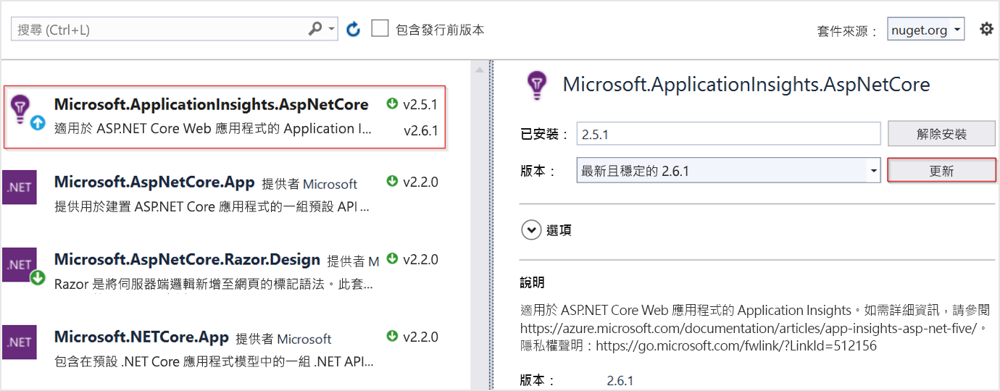

# <a name="application-insights-for-aspnet-core-applications"></a>ASP.NET Core 應用程式的 Application Insights

本文說明如何啟用[ASP.NET Core](https://docs.microsoft.com/aspnet/core)應用程式的 Application Insights。 當您完成本文中的指示時，Application Insights 將會從您的 ASP.NET Core 應用程式收集要求、相依性、例外狀況、效能計數器、心跳和記錄。

我們將在此使用的範例是以為目標的[MVC 應用程式](https://docs.microsoft.com/aspnet/core/tutorials/first-mvc-app) `netcoreapp3.0` 。 您可以將這些指示套用至所有 ASP.NET Core 應用程式。 如果您使用的是背景[工作角色服務](https://docs.microsoft.com/aspnet/core/fundamentals/host/hosted-services#worker-service-template)，請使用[這裡](./worker-service.md)的指示。

## <a name="supported-scenarios"></a>支援的案例

[適用于 ASP.NET Core 的 APPLICATION INSIGHTS SDK](https://nuget.org/packages/Microsoft.ApplicationInsights.AspNetCore)可以監視您的應用程式，不論其執行位置或方式為何。 如果您的應用程式正在執行，且具有與 Azure 的網路連線，則可以收集遙測。 支援 .NET Core 的任何位置都支援 Application Insights 監視。 支援涵蓋：
* **作業系統**： Windows、Linux 或 Mac。
* **裝載方法**：內部處理序或跨處理序。
* **部署方法**：架構相依或獨立式。
* **網頁伺服器**：IIS (網際網路資訊伺服器) 或 Kestrel。
* **裝載平台**：Azure App Service、Azure VM、Docker、Azure Kubernetes Service (AKS) 等的 Web Apps 功能。
* **.Net Core 執行階段版本**： 1. xx、2. xx 或 3. xx
* **IDE**： Visual Studio、VS Code 或命令列。

> [!NOTE]
> ASP.NET Core 3.x 需要[Application Insights 2.8.0](https://www.nuget.org/packages/Microsoft.ApplicationInsights.AspNetCore/2.8.0)或更新版本。

## <a name="prerequisites"></a>必要條件

- 正常運作的 ASP.NET Core 應用程式。 如果您需要建立 ASP.NET Core 應用程式，請遵循此[ASP.NET Core 教學](https://docs.microsoft.com/aspnet/core/getting-started/)課程。
- 有效的 Application Insights 檢測金鑰。 必須要有此金鑰，才能將任何遙測資料傳送至 Application Insights。 如果您需要建立新的 Application Insights 資源來取得檢測金鑰，請參閱[建立 Application Insights 資源](https://docs.microsoft.com/azure/azure-monitor/app/create-new-resource)。

## <a name="enable-application-insights-server-side-telemetry-visual-studio"></a>啟用 Application Insights 伺服器端遙測（Visual Studio）

1. 在 Visual Studio 中，開啟您的專案。

    > [!TIP]
    > 如果您想要的話，可以設定專案的原始檔控制，以便追蹤 Application Insights 進行的所有變更。 若要啟用原始檔控制，**請選取 [** 檔案] [  >  **新增至原始檔控制**]。

2. 選取 [**專案**] [  >  **新增 Application Insights 遙測**]。

3. 選取 **[馬上開始]** 。 根據您的 Visual Studio 版本而定，此選取的文字可能會有所不同。 某些較舊版本則改為使用 [**開始免費**] 按鈕。

4. 選取您的訂用帳戶。 然後選取 [**資源**  >  **註冊**]。

5. 將 Application Insights 新增至您的專案之後，請檢查以確認您使用的是最新穩定版本的 SDK。 移至 [**專案**] [  >  **管理 NuGet 套件**] [  >  **ApplicationInsights. AspNetCore**]。 如有需要，請選擇 [**更新**]。

     

6. 如果您已遵循選用提示並將專案加入至原始檔控制，請移至 [ **View**]  >  **Team Explorer**[  >  **變更**]。 然後選取每個檔案，以查看 Application Insights 遙測所做變更的差異觀點。

## <a name="enable-application-insights-server-side-telemetry-no-visual-studio"></a>啟用 Application Insights 伺服器端遙測（無 Visual Studio）

1. 安裝[適用于 ASP.NET Core 的 APPLICATION INSIGHTS SDK NuGet 套件](https://nuget.org/packages/Microsoft.ApplicationInsights.AspNetCore)。 我們建議您一律使用最新的穩定版本。 在[開放原始碼 GitHub](https://github.com/Microsoft/ApplicationInsights-dotnet/releases)存放庫中尋找 SDK 的完整版本資訊。

    下列程式碼範例顯示要新增至專案檔案的變更 `.csproj` 。

    ```xml
        <ItemGroup>
          <PackageReference Include="Microsoft.ApplicationInsights.AspNetCore" Version="2.13.1" />
        </ItemGroup>
    ```

2. 將新增 `services.AddApplicationInsightsTelemetry();` 至 `ConfigureServices()` 類別中的方法 `Startup` ，如下列範例所示：

    ```csharp
        // This method gets called by the runtime. Use this method to add services to the container.
        public void ConfigureServices(IServiceCollection services)
        {
            // The following line enables Application Insights telemetry collection.
            services.AddApplicationInsightsTelemetry();
    
            // This code adds other services for your application.
            services.AddMvc();
        }
    ```

3. 設定檢測金鑰。

    雖然您可以提供檢測金鑰做為的引數 `AddApplicationInsightsTelemetry` ，但我們建議您在設定中指定檢測金鑰。 下列程式碼範例顯示如何在中指定檢測金鑰 `appsettings.json` 。 請確定在 `appsettings.json` 發行期間，會將複製到應用程式根資料夾。

    ```json
        {
          "ApplicationInsights": {
            "InstrumentationKey": "putinstrumentationkeyhere"
          },
          "Logging": {
            "LogLevel": {
              "Default": "Warning"
            }
          }
        }
    ```

    或者，在下列其中一個環境變數中指定檢測金鑰：

    * `APPINSIGHTS_INSTRUMENTATIONKEY`

    * `ApplicationInsights:InstrumentationKey`

    例如：

    * `SET ApplicationInsights:InstrumentationKey=putinstrumentationkeyhere`

    * `SET APPINSIGHTS_INSTRUMENTATIONKEY=putinstrumentationkeyhere`

    * `APPINSIGHTS_INSTRUMENTATIONKEY`通常用於[Azure Web Apps](https://docs.microsoft.com/azure/azure-monitor/app/azure-web-apps?tabs=net)，但也可以用於支援此 SDK 的所有位置。 （如果您正在進行無程式碼 web 應用程式監視，如果您不使用連接字串，則需要此格式）。

    您現在也可以使用[連接字串](https://docs.microsoft.com/azure/azure-monitor/app/sdk-connection-string?tabs=net)，代替設定檢測金鑰。

    > [!NOTE]
    > 在程式碼中指定的檢測金鑰是透過環境變數 `APPINSIGHTS_INSTRUMENTATIONKEY` 來進行，這會優先于其他選項。

## <a name="run-your-application"></a>執行您的應用程式

執行您的應用程式，並對其提出要求。 遙測現在應流向 Application Insights。 Application Insights SDK 也會自動向您的應用程式收集傳入的 web 要求，以及下列遙測。

### <a name="live-metrics"></a>即時計量    

[即時計量](https://docs.microsoft.com/azure/application-insights/app-insights-live-stream)可以用來快速驗證是否已正確設定 Application Insights 監視。 雖然可能需要幾分鐘的時間，遙測才會開始出現在入口網站和分析中，但即時計量會以近乎即時的方式顯示執行中進程的 CPU 使用量。 它也可以顯示其他遙測，例如要求、相依性、追蹤等。

### <a name="ilogger-logs"></a>ILogger 記錄

`ILogger` `Warning` 系統會自動捕捉透過嚴重性或更新版本發出的記錄。 遵循[ILogger](ilogger.md#control-logging-level)檔來自訂 Application Insights 所要捕獲的記錄層級。

### <a name="dependencies"></a>相依性

依預設會啟用相依性集合。 [本文說明](asp-net-dependencies.md#automatically-tracked-dependencies)自動收集的相依性，也包含執行手動追蹤的步驟。

### <a name="performance-counters"></a>效能計數器

ASP.NET Core 中的[效能計數器](https://azure.microsoft.com/documentation/articles/app-insights-web-monitor-performance/)支援有限：

* 如果應用程式是在 Azure Web Apps (Windows) 中執行，SDK 版本2.4.1 和以後版本會收集效能計數器。
* 如果應用程式是在 Windows 中執行，而且目標是 `NETSTANDARD2.0` 或以後版本，SDK 版本2.7.1 和更新版本會收集效能計數器。
* 對於以 .NET Framework 為目標的應用程式，所有版本的 SDK 都支援效能計數器。
* SDK 2.8.0 和更新版本支援 Linux 中的 cpu/記憶體計數器。 Linux 不支援其他計數器。 在 Linux (和其他非 Windows 環境) 中取得系統計數器的建議方式是使用 [EventCounters](#eventcounter)

### <a name="eventcounter"></a>EventCounter

`EventCounterCollectionModule`預設為啟用，而且會從 .NET Core 3.x 應用程式收集一組預設的計數器。 [EventCounter](eventcounters.md)教學課程會列出所收集的預設計數器集合。 其中也包含自訂清單的指示。

## <a name="enable-client-side-telemetry-for-web-applications"></a>啟用 web 應用程式的用戶端遙測

上述步驟足以協助您開始收集伺服器端遙測資料。 如果您的應用程式有用戶端元件，請遵循後續步驟來開始收集[使用量遙測](https://docs.microsoft.com/azure/azure-monitor/app/usage-overview)。

1. 在中 `_ViewImports.cshtml` ，新增插入：

    ```cshtml
        @inject Microsoft.ApplicationInsights.AspNetCore.JavaScriptSnippet JavaScriptSnippet
    ```

2. 在中 `_Layout.cshtml` ，于 `HtmlHelper` 區段結尾，但在 `<head>` 任何其他腳本之前插入。 如果您想要從頁面報告任何自訂的 JavaScript 遙測，請將它插入此程式碼片段後面：

    ```cshtml
        @Html.Raw(JavaScriptSnippet.FullScript)
        </head>
    ```
    
或者，您可以 `FullScript` `ScriptBody` 從 SDK v 2.14 開始使用。 如果您需要控制 `<script>` 標記來設定內容安全性原則，請使用此動作：

```cshtml
 <script> // apply custom changes to this script tag.
     @Html.Raw(JavaScriptSnippet.ScriptBody)
 </script>
```

`.cshtml`先前參考的檔案名是來自預設的 MVC 應用程式範本。 最後，如果您想要適當地為應用程式啟用用戶端監視，則 JavaScript 程式碼片段必須出現在您 `<head>` 應用程式的每個頁面的區段中，您想要監視。 您可以藉由將 JavaScript 程式碼片段新增至，來為此應用程式範本達成此目標 `_Layout.cshtml` 。 

如果您的專案不包含 `_Layout.cshtml` ，您仍然可以加入[用戶端監視](https://docs.microsoft.com/azure/azure-monitor/app/website-monitoring)。 若要這麼做，您可以將 JavaScript 程式碼片段新增至對等的檔案，以控制 `<head>` 應用程式內所有頁面的。 或者，您也可以將程式碼片段新增至多個頁面，但此解決方案很難以維護，而且通常不建議這麼做。

## <a name="configure-the-application-insights-sdk"></a>設定 Application Insights SDK

您可以自訂 ASP.NET Core 的 Application Insights SDK，以變更預設設定。 Application Insights ASP.NET SDK 的使用者可能會熟悉使用或修改來變更設定 `ApplicationInsights.config` `TelemetryConfiguration.Active` 。 您會以不同的方式變更 ASP.NET Core 的設定。 將 ASP.NET Core SDK 新增至應用程式，並使用 ASP.NET Core 內建相依性[插入](https://docs.microsoft.com/aspnet/core/fundamentals/dependency-injection)來設定它。 `ConfigureServices()` `Startup.cs` 除非另有指示，否則請在類別的方法中進行幾乎所有的設定變更。 下列各節提供詳細資訊。

> [!NOTE]
> 在 ASP.NET Core 應用程式中，不支援透過修改來變更設定 `TelemetryConfiguration.Active` 。

### <a name="using-applicationinsightsserviceoptions"></a>使用 ApplicationInsightsServiceOptions

您可以藉由傳遞至來修改一些一般設定 `ApplicationInsightsServiceOptions` `AddApplicationInsightsTelemetry` ，如下列範例所示：

```csharp
public void ConfigureServices(IServiceCollection services)
{
    Microsoft.ApplicationInsights.AspNetCore.Extensions.ApplicationInsightsServiceOptions aiOptions
                = new Microsoft.ApplicationInsights.AspNetCore.Extensions.ApplicationInsightsServiceOptions();
    // Disables adaptive sampling.
    aiOptions.EnableAdaptiveSampling = false;

    // Disables QuickPulse (Live Metrics stream).
    aiOptions.EnableQuickPulseMetricStream = false;
    services.AddApplicationInsightsTelemetry(aiOptions);
}
```

中的完整設定清單`ApplicationInsightsServiceOptions`

|設定 | 描述 | 預設
|---------------|-------|-------
|EnablePerformanceCounterCollectionModule  | 啟用/停用`PerformanceCounterCollectionModule` | true
|EnableRequestTrackingTelemetryModule   | 啟用/停用`RequestTrackingTelemetryModule` | true
|EnableEventCounterCollectionModule   | 啟用/停用`EventCounterCollectionModule` | true
|EnableDependencyTrackingTelemetryModule   | 啟用/停用`DependencyTrackingTelemetryModule` | true
|EnableAppServicesHeartbeatTelemetryModule  |  啟用/停用`AppServicesHeartbeatTelemetryModule` | true
|EnableAzureInstanceMetadataTelemetryModule   |  啟用/停用`AzureInstanceMetadataTelemetryModule` | true
|EnableQuickPulseMetricStream | 啟用/停用 LiveMetrics 功能 | true
|EnableAdaptiveSampling | 啟用/停用調適型取樣 | true
|EnableHeartbeat | [啟用/停用心跳] 功能會定期（15分鐘的預設值）傳送名為 ' HeartbeatState ' 的自訂計量，其中包含執行時間的相關資訊，例如 .NET 版本、Azure 環境資訊（如果適用）等等。 | true
|AddAutoCollectedMetricExtractor | 啟用/停用 AutoCollectedMetrics 解壓縮程式，這是一種 TelemetryProcessor，會在進行取樣之前，先傳送要求/相依性的預先匯總計量。 | true
|RequestCollectionOptions.TrackExceptions | 啟用/停用要求收集模組未處理之例外狀況追蹤的報告。 | 在 NETSTANDARD 2.0 中為 false （因為例外狀況是使用 ApplicationInsightsLoggerProvider 來追蹤），否則為 true。

如需最新清單，請參閱[中 `ApplicationInsightsServiceOptions` 的可設定設定](https://github.com/microsoft/ApplicationInsights-dotnet/blob/develop/NETCORE/src/Shared/Extensions/ApplicationInsightsServiceOptions.cs)。

### <a name="sampling"></a>取樣

適用于 ASP.NET Core 的 Application Insights SDK 支援固定速率和調適型取樣。 預設會啟用調適型取樣。 

如需詳細資訊，請參閱[設定 ASP.NET Core 應用程式的](../../azure-monitor/app/sampling.md#configuring-adaptive-sampling-for-aspnet-core-applications)調適型取樣。

### <a name="adding-telemetryinitializers"></a>加入 TelemetryInitializers

當您想要使用其他資訊來擴充遙測時，請使用[遙測初始化運算式](https://docs.microsoft.com/azure/azure-monitor/app/api-filtering-sampling#addmodify-properties-itelemetryinitializer)。

將任何新 `TelemetryInitializer` 的新增至 `DependencyInjection` 容器，如下列程式碼所示。 SDK 會自動挑選 `TelemetryInitializer` 已新增至容器的任何 `DependencyInjection` 。

```csharp
public void ConfigureServices(IServiceCollection services)
{
    services.AddSingleton<ITelemetryInitializer, MyCustomTelemetryInitializer>();
}
```

### <a name="removing-telemetryinitializers"></a>移除 TelemetryInitializers

預設會顯示遙測初始化運算式。 若要移除所有或特定的遙測初始化運算式，請在呼叫*之後*使用下列範例程式碼 `AddApplicationInsightsTelemetry()` 。

```csharp
public void ConfigureServices(IServiceCollection services)
{
    services.AddApplicationInsightsTelemetry();

    // Remove a specific built-in telemetry initializer
    var tiToRemove = services.FirstOrDefault<ServiceDescriptor>
                        (t => t.ImplementationType == typeof(AspNetCoreEnvironmentTelemetryInitializer));
    if (tiToRemove != null)
    {
        services.Remove(tiToRemove);
    }

    // Remove all initializers
    // This requires importing namespace by using Microsoft.Extensions.DependencyInjection.Extensions;
    services.RemoveAll(typeof(ITelemetryInitializer));
}
```

### <a name="adding-telemetry-processors"></a>新增遙測處理器

您可以 `TelemetryConfiguration` 使用上的擴充方法，將自訂遙測處理器加入至 `AddApplicationInsightsTelemetryProcessor` `IServiceCollection` 。 您在[advanced 篩選案例](https://docs.microsoft.com/azure/azure-monitor/app/api-filtering-sampling#itelemetryprocessor-and-itelemetryinitializer)中使用遙測處理器。 請使用下列範例。

```csharp
public void ConfigureServices(IServiceCollection services)
{
    // ...
    services.AddApplicationInsightsTelemetry();
    services.AddApplicationInsightsTelemetryProcessor<MyFirstCustomTelemetryProcessor>();

    // If you have more processors:
    services.AddApplicationInsightsTelemetryProcessor<MySecondCustomTelemetryProcessor>();
}
```

### <a name="configuring-or-removing-default-telemetrymodules"></a>設定或移除預設 TelemetryModules

Application Insights 使用遙測模組自動收集有關特定工作負載的實用遙測，而不需要使用者手動追蹤。

預設會啟用下列自動收集模組。 這些模組負責自動收集遙測。 您可以停用或設定它們來改變其預設行為。

* `RequestTrackingTelemetryModule`-從傳入的 web 要求收集 RequestTelemetry。
* `DependencyTrackingTelemetryModule`-從傳出 HTTP 呼叫和 sql 呼叫收集[DependencyTelemetry](./asp-net-dependencies.md) 。
* `PerformanceCollectorModule`-收集 Windows PerformanceCounters。
* `QuickPulseTelemetryModule`-收集遙測以顯示在即時計量入口網站中。
* `AppServicesHeartbeatTelemetryModule`-收集有關裝載應用程式之 Azure App Service 環境的核心節拍（以自訂計量的形式傳送）。
* `AzureInstanceMetadataTelemetryModule`-收集關於裝載應用程式之 Azure VM 環境的核心節拍（以自訂計量傳送）。
* `EventCounterCollectionModule`-收集[EventCounters。](eventcounters.md) 此模組是新功能，並可在 SDK 版本2.8.0 和更新版本中取得。

若要設定任何預設值 `TelemetryModule` ，請在上使用擴充方法 `ConfigureTelemetryModule<T>` `IServiceCollection` ，如下列範例所示。

```csharp
using Microsoft.ApplicationInsights.DependencyCollector;
using Microsoft.ApplicationInsights.Extensibility.PerfCounterCollector;

public void ConfigureServices(IServiceCollection services)
{
    services.AddApplicationInsightsTelemetry();

    // The following configures DependencyTrackingTelemetryModule.
    // Similarly, any other default modules can be configured.
    services.ConfigureTelemetryModule<DependencyTrackingTelemetryModule>((module, o) =>
            {
                module.EnableW3CHeadersInjection = true;
            });

    // The following removes all default counters from EventCounterCollectionModule, and adds a single one.
    services.ConfigureTelemetryModule<EventCounterCollectionModule>(
            (module, o) =>
            {
                module.Counters.Clear();
                module.Counters.Add(new EventCounterCollectionRequest("System.Runtime", "gen-0-size"));
            }
        );

    // The following removes PerformanceCollectorModule to disable perf-counter collection.
    // Similarly, any other default modules can be removed.
    var performanceCounterService = services.FirstOrDefault<ServiceDescriptor>(t => t.ImplementationType == typeof(PerformanceCollectorModule));
    if (performanceCounterService != null)
    {
        services.Remove(performanceCounterService);
    }
}
```

從2.12.2 版本開始， [`ApplicationInsightsServiceOptions`](#using-applicationinsightsserviceoptions) 包含可停用任何預設模組的簡單選項。

### <a name="configuring-a-telemetry-channel"></a>設定遙測通道

預設的[遙測通道](./telemetry-channels.md)是 `ServerTelemetryChannel` 。 您可以覆寫它，如下列範例所示。

```csharp
using Microsoft.ApplicationInsights.Channel;

    public void ConfigureServices(IServiceCollection services)
    {
        // Use the following to replace the default channel with InMemoryChannel.
        // This can also be applied to ServerTelemetryChannel.
        services.AddSingleton(typeof(ITelemetryChannel), new InMemoryChannel() {MaxTelemetryBufferCapacity = 19898 });

        services.AddApplicationInsightsTelemetry();
    }
```

### <a name="disable-telemetry-dynamically"></a>動態停用遙測

如果您想要有條件且動態地停用遙測，您可以在 `TelemetryConfiguration` 程式碼中的任何位置使用 ASP.NET Core 相依性插入容器來解析實例，並 `DisableTelemetry` 在其上設定旗標。

```csharp
    public void ConfigureServices(IServiceCollection services)
    {
        services.AddApplicationInsightsTelemetry();
    }

    public void Configure(IApplicationBuilder app, IHostingEnvironment env, TelemetryConfiguration configuration)
    {
        configuration.DisableTelemetry = true;
        ...
    }
```

上述不會防止任何自動收集模組收集遙測。 只有將遙測傳送至 Application Insights 會使用上述方法來停用。 如果不需要特定的自動收集模組，最好先[移除遙測模組](#configuring-or-removing-default-telemetrymodules)

## <a name="frequently-asked-questions"></a>常見問題集

### <a name="does-application-insights-support-aspnet-core-3x"></a>Application Insights 支援 ASP.NET Core 3.x 嗎？

是。 更新為 ASP.NET Core 2.8.0 或更高版本[的 APPLICATION INSIGHTS SDK](https://nuget.org/packages/Microsoft.ApplicationInsights.AspNetCore) 。 較舊版本的 SDK 不支援 ASP.NET Core 3.x。

此外，如果您在[這裡](#enable-application-insights-server-side-telemetry-visual-studio)使用 Visual Studio 的指示，請更新至最新版本的 Visual Studio 2019 （16.3.0）以上線。 舊版的 Visual Studio 不支援 ASP.NET Core 3.x 應用程式的自動上架。

### <a name="how-can-i-track-telemetry-thats-not-automatically-collected"></a>如何追蹤不會自動收集的遙測？

使用函式插入來取得的實例 `TelemetryClient` ，並在其上呼叫所需的 `TrackXXX()` 方法。 我們不建議 `TelemetryClient` 在 ASP.NET Core 應用程式中建立新的實例。 的單一實例 `TelemetryClient` 已經在容器中註冊 `DependencyInjection` ，而這會 `TelemetryConfiguration` 與其余的遙測資料共用。 `TelemetryClient`只有當您需要的設定與其余的遙測資料不同時，才建議建立新的實例。

下列範例顯示如何追蹤來自控制器的其他遙測。

```csharp
using Microsoft.ApplicationInsights;

public class HomeController : Controller
{
    private TelemetryClient telemetry;

    // Use constructor injection to get a TelemetryClient instance.
    public HomeController(TelemetryClient telemetry)
    {
        this.telemetry = telemetry;
    }

    public IActionResult Index()
    {
        // Call the required TrackXXX method.
        this.telemetry.TrackEvent("HomePageRequested");
        return View();
    }
```

如需 Application Insights 中自訂資料包表的詳細資訊，請參閱[Application Insights 自訂計量 API 參考](https://docs.microsoft.com/azure/azure-monitor/app/api-custom-events-metrics/)。 您可以使用類似的方法，將自訂計量傳送至使用[GETMETRIC API](./get-metric.md)的 Application Insights。

### <a name="some-visual-studio-templates-used-the-useapplicationinsights-extension-method-on-iwebhostbuilder-to-enable-application-insights-is-this-usage-still-valid"></a>某些 Visual Studio 範本會在 IWebHostBuilder 上使用 .Useapplicationinsights （）擴充方法來啟用 Application Insights。 這種用法仍然有效嗎？

雖然 `UseApplicationInsights()` 仍然支援擴充方法，但是在 APPLICATION INSIGHTS SDK 版本2.8.0 中，它會標示為過時。 它將在 SDK 的下一個主要版本中移除。 啟用 Application Insights 遙測的建議方式是使用， `AddApplicationInsightsTelemetry()` 因為它會提供多載來控制某些設定。 此外，在 ASP.NET Core 3.x 應用程式中， `services.AddApplicationInsightsTelemetry()` 是啟用 application insights 的唯一方法。

### <a name="im-deploying-my-aspnet-core-application-to-web-apps-should-i-still-enable-the-application-insights-extension-from-web-apps"></a>我要將 ASP.NET Core 應用程式部署到 Web Apps。 我仍然應該從 Web Apps 啟用 Application Insights 擴充功能嗎？

如果 SDK 是在組建期間安裝，如本文所示，您就不需要從 App Service 入口網站啟用[Application Insights 擴充](https://docs.microsoft.com/azure/azure-monitor/app/azure-web-apps)功能。 即使已安裝延伸模組，當它偵測到 SDK 已新增至應用程式時，它也會重新開機。 如果您從擴充功能啟用 Application Insights，就不需要安裝及更新 SDK。 但是，如果您依照本文中的指示來啟用 Application Insights，您會有更大的彈性，原因如下：

   * Application Insights 遙測會繼續在中使用：
       * 所有的作業系統，包括 Windows、Linux 和 Mac。
       * 所有發行模式，包括獨立或架構相依。
       * 所有目標 framework，包括完整的 .NET Framework。
       * 所有裝載選項，包括 Web Apps、Vm、Linux、容器、Azure Kubernetes Service 和非 Azure 裝載。
       * 所有 .NET Core 版本，包括預覽版本。
   * 當您從 Visual Studio 進行調試時，您可以在本機看到遙測。
   * 您可以使用 API 來追蹤其他自訂遙測 `TrackXXX()` 。
   * 您可以完整控制設定。

### <a name="can-i-enable-application-insights-monitoring-by-using-tools-like-status-monitor"></a>我可以使用狀態監視器之類的工具來啟用 Application Insights 監視嗎？

否。 [狀態監視器](https://docs.microsoft.com/azure/azure-monitor/app/monitor-performance-live-website-now)和[狀態監視器 v2](https://docs.microsoft.com/azure/azure-monitor/app/status-monitor-v2-overview)目前僅支援 ASP.NET 4.x。

### <a name="is-application-insights-automatically-enabled-for-my-aspnet-core-20-application"></a>Application Insights 自動啟用我的 ASP.NET Core 2.0 應用程式嗎？

`Microsoft.AspNetCore.All`2.0 中繼套件包含 APPLICATION INSIGHTS SDK （版本2.1.0）。 如果您在 Visual Studio 偵錯工具下執行應用程式，Visual Studio 會啟用 Application Insights，並在 IDE 本身的本機顯示遙測。 除非指定了檢測金鑰，否則遙測不會傳送至 Application Insights 服務。 我們建議遵循本文中的指示來啟用 Application Insights，即使是2.0 應用程式也是如此。

### <a name="if-i-run-my-application-in-linux-are-all-features-supported"></a>如果我在 Linux 中執行應用程式，是否支援所有功能？

是。 SDK 的功能支援在所有平臺上都相同，但有下列例外狀況：

* SDK 會收集 Linux 上的[事件計數器](https://docs.microsoft.com/azure/azure-monitor/app/eventcounters)，因為只有 Windows 才支援[效能計數器](https://docs.microsoft.com/azure/azure-monitor/app/performance-counters)。 大部分的計量都相同。
* 雖然 `ServerTelemetryChannel` 預設會啟用，但如果應用程式是在 Linux 或 MacOS 中執行，則通道不會自動建立本機儲存體資料夾，以在發生網路問題時暫時保存遙測。 由於這項限制，當發生暫時性網路或伺服器問題時，就會遺失遙測。 若要解決此問題，請設定通道的本機資料夾：

```csharp
using Microsoft.ApplicationInsights.Channel;
using Microsoft.ApplicationInsights.WindowsServer.TelemetryChannel;

    public void ConfigureServices(IServiceCollection services)
    {
        // The following will configure the channel to use the given folder to temporarily
        // store telemetry items during network or Application Insights server issues.
        // User should ensure that the given folder already exists
        // and that the application has read/write permissions.
        services.AddSingleton(typeof(ITelemetryChannel),
                                new ServerTelemetryChannel () {StorageFolder = "/tmp/myfolder"});
        services.AddApplicationInsightsTelemetry();
    }
```

### <a name="is-this-sdk-supported-for-the-new-net-core-3x-worker-service-template-applications"></a>這是新的 .NET Core 3.x 背景工作角色服務範本應用程式支援的 SDK 嗎？

此 SDK 需要 `HttpContext` ，因此無法在任何非 HTTP 應用程式中運作，包括 .Net Core 3.x 背景工作角色服務應用程式。 請參閱[這](worker-service.md)份檔，以使用新發行的 APPLICATIONINSIGHTS WorkerService SDK，在這類應用程式中啟用 application insights。

## <a name="open-source-sdk"></a>開放原始碼 SDK

[閱讀並參與程式碼](https://github.com/microsoft/ApplicationInsights-dotnet#recent-updates)。

## <a name="next-steps"></a>後續步驟

* [探索使用者流程](../../azure-monitor/app/usage-flows.md)，以瞭解使用者如何流覽您的應用程式。
* [設定快照集集合](https://docs.microsoft.com/azure/application-insights/app-insights-snapshot-debugger)，以查看擲回例外狀況時原始程式碼和變數的狀態。
* [使用 API](../../azure-monitor/app/api-custom-events-metrics.md)來傳送您自己的事件和計量，以深入瞭解應用程式的效能和使用方式。
* 使用[可用性測試](../../azure-monitor/app/monitor-web-app-availability.md)持續從世界各地檢查您的應用程式。
* [ASP.NET Core 中的相依性插入](https://docs.microsoft.com/aspnet/core/fundamentals/dependency-injection)
