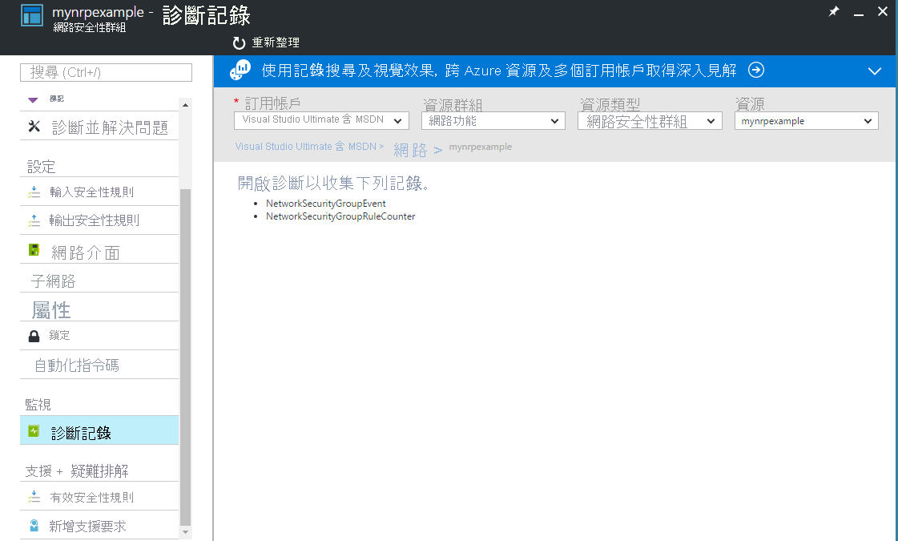
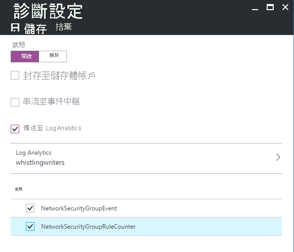

# <a name="azure-networking-monitoring-solutions-in-azure-monitor"></a>Azure 監視器中的 Azure 網路監視解決方案

[!INCLUDE [updated-for-az](../../../includes/updated-for-az.md)]

Azure 監視器提供了以下用於監視網路的解決方案：
* 網路效能監視器 (NPM) 以
    * 監視網路的健康狀態
* 要檢閱的 Azure 應用程式閘道分析
    * Azure 應用程式閘道記錄
    * Azure 應用程式閘道計量
* 監視和稽核雲端網路上網路活動的解決方案
    * [流量分析](https://docs.microsoft.com/azure/networking/network-monitoring-overview#traffic-analytics) 
    * Azure 網路安全性群組分析

## <a name="network-performance-monitor-npm"></a>網路效能監視器 (NPM)

[網路效能監視器](https://docs.microsoft.com/azure/networking/network-monitoring-overview)管理解決方案是網路監視解決方案，可監視網路的健康狀態、可用性和連線能力。  可用來監視下列項目之間的連線能力︰

* 公用雲端與內部部署環境
* 資料中心與使用者地點 (分公司)
* 裝載多層式應用程式各層的子網路。

如需詳細資訊，請參閱[網路效能監視器](https://docs.microsoft.com/azure/networking/network-monitoring-overview)。

## <a name="azure-application-gateway-and-network-security-group-analytics"></a>Azure 應用程式閘道和網路安全性群組分析
若要使用解決方案：
1. 將管理解決方案添加到 Azure 監視器，以及
2. 啟用診斷以將診斷定向到 Azure 監視器中的日誌分析工作區。 不需要將記錄寫入 Azure Blob 儲存體。

您可以針對應用程式閘道和網路安全性群組其中之一 (或兩者) 啟用診斷與對應的解決方案。

如果不為特定資源類型啟用診斷資源日誌記錄，但安裝解決方案，則該資源的儀表板邊欄選項卡為空並顯示錯誤訊息。

> [!NOTE]
> 2017 年 1 月，支援將日誌從應用程式閘道和網路安全性群組發送到日誌分析工作區的方式已更改。 如果您看到 **Azure 網路分析 (已過時)** 解決方案，請參閱[從舊的網路分析解決方案進行移轉](#migrating-from-the-old-networking-analytics-solution)，以取得您必須遵循的步驟。
>
>

## <a name="review-azure-networking-data-collection-details"></a>檢閱 Azure 網路資料集合詳細資料
Azure 應用程式閘道分析和網路安全性群組分析管理解決方案，會直接從 Azure 應用程式閘道和網路安全性群組收集診斷記錄。 不需要將記錄寫入 Azure Blob 儲存體，也不需要代理程式來收集資料。

下表顯示資料收集方法，與其他有關如何針對 Azure 應用程式閘道分析和網路安全性群組分析收集資料的詳細資料。

| Platform | 直接代理程式 | Systems Center Operations Manager 代理程式 | Azure | 是否需要 Operations Manager？ | 透過管理群組傳送的 Operations Manager 代理程式資料 | 收集頻率 |
| --- | --- | --- | --- | --- | --- | --- |
| Azure |  |  |&#8226; |  |  |登入時 |


## <a name="azure-application-gateway-analytics-solution-in-azure-monitor"></a>Azure 監視器中的 Azure 應用程式閘道分析解決方案


應用程式閘道支援下列記錄︰

* ApplicationGatewayAccessLog
* ApplicationGatewayPerformanceLog
* ApplicationGatewayFirewallLog

應用程式閘道支援下列計量︰again


* 5 分鐘輸送量

### <a name="install-and-configure-the-solution"></a>安裝和設定解決方案
使用下列指示來安裝和設定 Azure 應用程式閘道分析解決方案：

1. 從[Azure 應用商店](https://azuremarketplace.microsoft.com/marketplace/apps/Microsoft.AzureAppGatewayAnalyticsOMS?tab=Overview)啟用 Azure 應用程式閘道分析解決方案，或使用[解決方案庫中添加 Azure 監視器解決方案](../../azure-monitor/insights/solutions.md)中描述的過程。
2. 針對您想要監視的[應用程式閘道](../../application-gateway/application-gateway-diagnostics.md)啟用診斷記錄。

#### <a name="enable-azure-application-gateway-diagnostics-in-the-portal"></a>在入口網站中啟用 Azure 應用程式閘道診斷

1. 在 Azure 門戶中，導航到要監視的應用程式閘道資源。
2. 選擇*診斷日誌*以打開以下頁面。

   
3. 按一下 *"打開診斷*"以打開以下頁面。

   
4. 要打開診斷程式，請按一下"*狀態*" 下的 *"打開*"。
5. 按一下 *"發送到日誌分析*"的核取方塊。
6. 選擇現有的日誌分析工作區，或創建工作區。
7. 按一下 **"日誌"** 下要收集的每種日誌類型的核取方塊。
8. 按一下 *"保存*"以啟用對 Azure 監視器的診斷日誌記錄。

#### <a name="enable-azure-network-diagnostics-using-powershell"></a>使用 PowerShell 啟用 Azure 網路診斷

以下 PowerShell 腳本提供了如何為應用程式閘道啟用資源日誌記錄的示例。

```powershell
$workspaceId = "/subscriptions/d2e37fee-1234-40b2-5678-0b2199de3b50/resourcegroups/oi-default-east-us/providers/microsoft.operationalinsights/workspaces/rollingbaskets"

$gateway = Get-AzApplicationGateway -Name 'ContosoGateway'

Set-AzDiagnosticSetting -ResourceId $gateway.ResourceId  -WorkspaceId $workspaceId -Enabled $true
```

### <a name="use-azure-application-gateway-analytics"></a>使用 Azure 應用程式閘道分析


在您按一下 [概觀] 上的 [Azure 應用程式閘道分析]**** 圖格之後，您可以檢視記錄摘要，然後深入探索下列類別的詳細資訊：

* 應用程式閘道存取記錄
  * 應用程式閘道存取記錄的用戶端和伺服器錯誤
  * 每個應用程式閘道的每小時要求數
  * 每個應用程式閘道的每小時失敗要求數
  * 應用程式閘道依使用者代理程式分類的錯誤
* 應用程式閘道效能
  * 應用程式閘道的主機健康狀態
  * 應用程式閘道失敗要求的最大和第 95 個百分位數


在 [Azure 應用程式閘道分析]**** 儀表板上，檢閱其中一個刀鋒視窗中的摘要資訊，然後按一下其中一個以在記錄搜尋頁面中檢視詳細資訊。

您可以在任何 [記錄搜尋] 頁面上，按時間、詳細結果和您的記錄搜尋記錄來檢視結果。 您也可以按 Facet 篩選以縮減結果。


## <a name="azure-network-security-group-analytics-solution-in-azure-monitor"></a>Azure 網路安全性群組分析解決方案在 Azure 監視器中


> [!NOTE]
> 網路安全性群組分析解決方案將會移至社群支援，因為其功能已由[流量分析](../../network-watcher/traffic-analytics.md)取代。
> - 解決方案現已在 [Azure 快速入門範本](https://azure.microsoft.com/resources/templates/oms-azurensg-solution/)中提供，而且將很快不再於 Azure Marketplace 中提供。
> - 對於已將此解決方案新增至其工作區的現有客戶，它會繼續運作而不需要變更。
> - Microsoft 將繼續支援使用診斷設置將 NSG 資源日誌發送到工作區。

網路安全性群組支援下列記錄︰

* NetworkSecurityGroupEvent
* NetworkSecurityGroupRuleCounter

### <a name="install-and-configure-the-solution"></a>安裝和設定解決方案
使用下列指示來安裝和設定 Azure 網路分析解決方案︰

1. 從[Azure 應用商店](https://azuremarketplace.microsoft.com/marketplace/apps/Microsoft.AzureNSGAnalyticsOMS?tab=Overview)啟用 Azure 網路安全性群組分析解決方案，或使用[解決方案庫中添加 Azure 監視器解決方案](../../azure-monitor/insights/solutions.md)中描述的過程。
2. 針對您想要監視的[網路安全性群組](../../virtual-network/virtual-network-nsg-manage-log.md)資源啟用診斷記錄。

### <a name="enable-azure-network-security-group-diagnostics-in-the-portal"></a>在入口網站中啟用 Azure 網路安全性群組診斷

1. 在 Azure 入口網站中，瀏覽至要監視的網路安全性群組資源
2. 選取 [診斷記錄]** 以開啟下列頁面

   
3. 按一下 [開啟診斷]** 以開啟下列頁面

   
4. 若要開啟診斷，請按一下 [狀態]** 下的 [開啟]**
5. 按一下 [傳送到 Log Analytics]** 核取方塊
6. 選取現有的 Log Analytics 工作區，或建立工作區
7. 針對每一個要收集的記錄類型，按一下 [記錄]**** 下的核取方塊
8. 按一下 [儲存]** 以啟用 Log Analytics 的診斷記錄

### <a name="enable-azure-network-diagnostics-using-powershell"></a>使用 PowerShell 啟用 Azure 網路診斷

以下 PowerShell 腳本提供了如何為網路安全性群組啟用資源日誌記錄的示例
```powershell
$workspaceId = "/subscriptions/d2e37fee-1234-40b2-5678-0b2199de3b50/resourcegroups/oi-default-east-us/providers/microsoft.operationalinsights/workspaces/rollingbaskets"

$nsg = Get-AzNetworkSecurityGroup -Name 'ContosoNSG'

Set-AzDiagnosticSetting -ResourceId $nsg.ResourceId  -WorkspaceId $workspaceId -Enabled $true
```

### <a name="use-azure-network-security-group-analytics"></a>使用 Azure 網路安全性群組分析
在您按一下 [概觀] 上的 [Azure 網路安全性群組分析]**** 圖格之後，您可以檢視記錄摘要，然後深入探索下列類別的詳細資訊：

* 網路安全性群組封鎖流量
  * 網路安全性群組規則與封鎖流量
  * MAC 位址與封鎖流量
* 網路安全性群組允許流量
  * 網路安全性群組規則與允許流量
  * MAC 位址與允許流量


在 [Azure 網路安全性群組分析]**** 儀表板上，檢閱其中一個刀鋒視窗中的摘要資訊，然後按一下其中一個以在記錄搜尋頁面中檢視詳細資訊。

您可以在任何 [記錄搜尋] 頁面上，按時間、詳細結果和您的記錄搜尋記錄來檢視結果。 您也可以按 Facet 篩選以縮減結果。

## <a name="migrating-from-the-old-networking-analytics-solution"></a>從舊的網路分析解決方案進行移轉
2017 年 1 月，支援將日誌從 Azure 應用程式閘道和 Azure 網路安全性群組發送到日誌分析工作區的方式已更改。 這些變更可提供下列優點︰
+ 日誌直接寫入 Azure 監視器，而無需使用存儲帳戶
+ 從生成日誌到 Azure 監視器中可用的日誌時，延遲更少
+ 較少的組態步驟
+ 所有 Azure 診斷類型的通用格式

若要使用更新的解決方案：

1. [配置從 Azure 應用程式閘道直接發送到 Azure 監視器的診斷](#enable-azure-application-gateway-diagnostics-in-the-portal)
2. [配置從 Azure 網路安全性群組直接發送到 Azure 監視器的診斷](#enable-azure-network-security-group-diagnostics-in-the-portal)
2. 使用[解決方案庫中添加 Azure 監視器解決方案](solutions.md)中描述的過程，啟用*Azure 應用程式閘道分析和* *Azure 網路安全性群組分析*解決方案
3. 更新任何已儲存的查詢、儀表板或警示，以使用新的資料類型
   + 類型是 AzureDiagnostics。 您可以使用 ResourceType 來篩選 Azure 網路記錄。

     | 不要這樣撰寫： | 使用︰ |
     | --- | --- |
     | NetworkApplicationgateways &#124; 其中 OperationName=="ApplicationGatewayAccess" | Azure 診斷&#124;資源類型 ="應用閘道"和"操作名稱"="應用程式閘道訪問" |
     | NetworkApplicationgateways &#124; 其中 OperationName=="ApplicationGatewayPerformance" | Azure 診斷&#124;資源類型 ="應用閘道"和"操作名稱"="應用程式閘道性能" |
     | NetworkSecuritygroups | AzureDiagnostics &#124; 其中 ResourceType=="NETWORKSECURITYGROUPS" |

   + 針對任何名稱尾碼有 \_s、\_d 或 \_g 的欄位，請將第一個字元變更為小寫
   + 針對任何名稱尾碼有 \_o 的欄位，資料會根據巢狀欄位名稱分割為個別欄位。
4. 移除 *Azure 網路分析 (已過時)* 解決方案。
   + 如果您是使用 PowerShell，請使用 `Set-AzureOperationalInsightsIntelligencePack -ResourceGroupName <resource group that the workspace is in> -WorkspaceName <name of the log analytics workspace> -IntelligencePackName "AzureNetwork" -Enabled $false`

在變更之前所收集的資料不會顯示在新的解決方案中。 您可以繼續使用舊的類型和欄位名稱查詢此資料。

## <a name="troubleshooting"></a>疑難排解
[!INCLUDE [log-analytics-troubleshoot-azure-diagnostics](../../../includes/log-analytics-troubleshoot-azure-diagnostics.md)]

## <a name="next-steps"></a>後續步驟
* 使用[Azure 監視器中的日誌查詢](../log-query/log-query-overview.md)查看詳細的 Azure 診斷資料。
