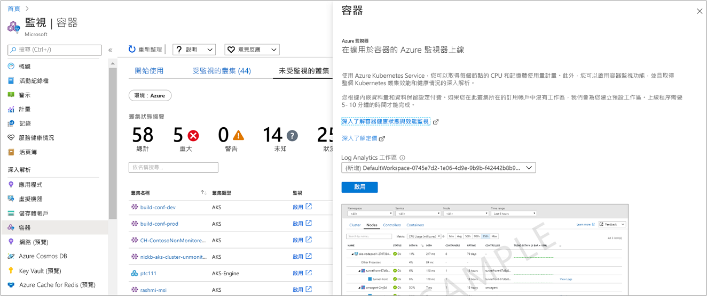

# <a name="configure-azure-red-hat-openshift-v3-with-azure-monitor-for-containers"></a>使用容器 Azure 監視器設定 Azure Red Hat OpenShift v3

>[!IMPORTANT]
> Azure Red Hat OpenShift 3.11 將于6月2022日淘汰。
>
> 從2020年10月起，您將無法再建立新的3.11 叢集。
> 現有的3.11 叢集將會繼續運作到6月2022，但在該日期之後將不再受到支援。
>
> 遵循本指南來 [建立 Azure Red Hat OpenShift 4](../../openshift/tutorial-create-cluster.md)叢集。
> 如果您有特定問題， [請洽詢我們](mailto:aro-feedback@microsoft.com)。

適用于容器的 Azure 監視器可針對 Azure Kubernetes Service (AKS) 和 AKS 引擎叢集提供豐富的監視體驗。 本文說明如何啟用監視裝載于 [Azure Red Hat OpenShift](../../openshift/intro-openshift.md) 第3版和最新支援版本3的 Kubernetes 叢集，以達成類似的監視體驗。

>[!NOTE]
>Azure Red Hat OpenShift 的支援目前為公開預覽功能。
>

您可以使用下列支援的方法，針對新的或 Azure Red Hat OpenShift 的一或多個現有部署啟用容器的 Azure 監視器：

- 針對 Azure 入口網站中的現有叢集或使用 Azure Resource Manager 範本。
- 適用于使用 Azure Resource Manager 範本的新叢集，或使用 [Azure CLI](/cli/azure/openshift?view=azure-cli-latest#az-openshift-create)建立新叢集時。

## <a name="supported-and-unsupported-features"></a>支援和不支援的功能

除了下列功能以外， [容器的 Azure 監視器](container-insights-overview.md) 支援監視 Azure Red Hat OpenShift，如下列功能所述：

- 即時資料 (預覽) 
- 從叢集節點和 pod[收集計量](container-insights-update-metrics.md)，並將其儲存在 Azure 監視器計量資料庫中

## <a name="prerequisites"></a>必要條件

- [Log Analytics 工作區](../platform/design-logs-deployment.md)。

    適用于容器的 Azure 監視器支援 [依區域](https://azure.microsoft.com/global-infrastructure/services/?regions=all&products=monitor)列示在 Azure 產品的區域中的 Log Analytics 工作區。 若要建立您自己的工作區，您可以透過 [Azure Resource Manager](../samples/resource-manager-workspace.md)、 [PowerShell](../scripts/powershell-sample-create-workspace.md?toc=%2fpowershell%2fmodule%2ftoc.json)或 [Azure 入口網站](../learn/quick-create-workspace.md)來建立它。

- 若要啟用和存取容器 Azure 監視器中的功能，您至少必須是 Azure 訂用帳戶中「Azure *參與者* 」角色的成員，以及 log analytics 工作區的 [*log analytics 參與者*](../platform/manage-access.md#manage-access-using-azure-permissions) 角色成員（以容器的 Azure 監視器設定）。

- 若要查看監視資料，您是 log analytics [*讀取*](../platform/manage-access.md#manage-access-using-azure-permissions) 者角色許可權的成員，且 log analytics 工作區是以容器的 Azure 監視器設定。

## <a name="identify-your-log-analytics-workspace-id"></a>識別您的 Log Analytics 工作區識別碼

 若要整合現有的 Log Analytics 工作區，請先識別 Log Analytics 工作區的完整資源識別碼。 `workspaceResourceId`當您使用 Azure Resource Manager 範本方法啟用監視時，參數需要工作區的資源識別碼。

1. 藉由執行下列命令，列出您有權存取的所有訂用帳戶：

    ```azurecli
    az account list --all -o table
    ```

    輸出顯示如下：

    ```azurecli
    Name                                  CloudName    SubscriptionId                        State    IsDefault
    ------------------------------------  -----------  ------------------------------------  -------  -----------
    Microsoft Azure                       AzureCloud   0fb60ef2-03cc-4290-b595-e71108e8f4ce  Enabled  True
    ```

1. 複製 **SubscriptionId** 的值。

1. 藉由執行下列命令，切換至裝載 Log Analytics 工作區的訂用帳戶：

    ```azurecli
    az account set -s <subscriptionId of the workspace>
    ```

1. 藉由執行下列命令，以預設的 JSON 格式顯示訂用帳戶中的工作區清單：

    ```
    az resource list --resource-type Microsoft.OperationalInsights/workspaces -o json
    ```

1. 在輸出中，尋找工作區名稱，然後在欄位 **識別碼** 下複製該 Log Analytics 工作區的完整資源識別碼。

## <a name="enable-for-a-new-cluster-using-an-azure-resource-manager-template"></a>使用 Azure Resource Manager 範本啟用新叢集

執行下列步驟，以部署已啟用監視功能的 Azure Red Hat OpenShift 叢集。 繼續之前，請先參閱教學課程， [建立 Azure Red Hat OpenShift](../../openshift/tutorial-create-cluster.md) 叢集以瞭解您需要設定的相依性，以便正確設定您的環境。

此方法包含兩個 JSON 範本。 其中一個範本會指定要部署啟用監視的叢集的設定，而另一個範本包含參數值，您可以設定這些值來指定下列各項：

- Azure Red Hat OpenShift 叢集資源識別碼。

- 叢集部署所在的資源群組。

- 在執行步驟來建立一個或一個已建立的步驟之後， [Azure Active Directory 租使用者識別碼](../../openshift/howto-create-tenant.md#create-a-new-azure-ad-tenant)。

- [Azure Active Directory 用戶端應用程式識別碼](../../openshift/howto-aad-app-configuration.md#create-an-azure-ad-app-registration) 會在執行步驟建立一個或多個已建立的步驟之後記下。

- 在執行步驟來建立一個或多個已建立的步驟之後， [Azure Active Directory 用戶端密碼](../../openshift/howto-aad-app-configuration.md#create-a-client-secret)。

- [Azure AD 安全性群組](../../openshift/howto-aad-app-configuration.md#create-an-azure-ad-security-group) 在執行步驟建立一個或多個已建立的步驟之後記下。

- 現有 Log Analytics 工作區的資源識別碼。 請參閱 [識別您的 Log Analytics 工作區識別碼](#identify-your-log-analytics-workspace-id) ，以瞭解如何取得此資訊。

- 要在叢集中建立的主要節點數目。

- 代理程式組件區設定檔中的計算節點數目。

- 代理程式組件區設定檔中的基礎結構節點數目。

若您不熟悉使用範本來部署資源的概念，請參閱：

- [使用 Resource Manager 範本與 Azure PowerShell 來部署資源](../../azure-resource-manager/templates/deploy-powershell.md)

- [使用 Resource Manager 範本與 Azure CLI 部署資源](../../azure-resource-manager/templates/deploy-cli.md)

如果您選擇使用 Azure CLI，必須先在本機安裝並使用 CLI。 您必須執行 Azure CLI 2.0.65 版版或更新版本。 若要知道您使用的版本，請執行 `az --version`。 如果您需要安裝或升級 Azure CLI，請參閱[安裝 Azure CLI](/cli/azure/install-azure-cli)。

1. 下載並儲存至本機資料夾（Azure Resource Manager 範本和參數檔），以使用下列命令來建立具有監視附加元件的叢集：

    `curl -LO https://raw.githubusercontent.com/microsoft/Docker-Provider/ci_dev/scripts/onboarding/aro/enable_monitoring_to_new_cluster/newClusterWithMonitoring.json`

    `curl -LO https://raw.githubusercontent.com/microsoft/Docker-Provider/ci_dev/scripts/onboarding/aro/enable_monitoring_to_new_cluster/newClusterWithMonitoringParam.json`

2. 登入 Azure

    ```azurecli
    az login
    ```

    如果您可存取多個訂用帳戶，請執行 `az account set -s {subscription ID}` 並以您要使用的訂用帳戶取代 `{subscription ID}`。

3. 如果您的叢集還沒有資源群組，請建立一個資源群組。 如需在 Azure 上支援 OpenShift 的 Azure 區域清單，請參閱 [支援的區域](../../openshift/supported-resources.md#azure-regions)。

    ```azurecli
    az group create -g <clusterResourceGroup> -l <location>
    ```

4. 編輯 **newClusterWithMonitoringParam.js** 的 JSON 參數檔案，並更新下列值：

    - *location*
    - *clusterName*
    - *aadTenantId*
    - *aadClientId*
    - *aadClientSecret*
    - *aadCustomerAdminGroupId*
    - *workspaceResourceId*
    - *masterNodeCount*
    - *computeNodeCount*
    - *infraNodeCount*

5. 下列步驟會使用 Azure CLI，在啟用監視的情況下部署叢集。

    ```azurecli
    az deployment group create --resource-group <ClusterResourceGroupName> --template-file ./newClusterWithMonitoring.json --parameters @./newClusterWithMonitoringParam.json
    ```

    輸出結果類似下面：

    ```output
    provisioningState       : Succeeded
    ```

## <a name="enable-for-an-existing-cluster"></a>針對現有的叢集啟用

請執行下列步驟，以啟用 azure Red Hat OpenShift 叢集的監視（部署在 Azure 中）。 您可以從 Azure 入口網站或使用所提供的範本來完成此動作。

### <a name="from-the-azure-portal"></a>從 Azure 入口網站

1. 登入 [Azure 入口網站](https://portal.azure.com)。

2. 在 [Azure 入口網站] 功能表上，或從 [首頁] 中，選取 [ **Azure 監視器**]。 在 [Insights] 區段下方，選取 [容器]。

3. 在 [監視器 - 容器] 頁面上，選取 [不受監視的叢集]。

4. 從未受監視叢集的清單中，尋找清單中的叢集，然後按一下 [ **啟用**]。 您可以在 [資料行叢集 **類型**] 下方尋找值 **ARO** ，以識別清單中的結果。

5. 在 [適用於容器的 Azure 監視器上線] 頁面上，如果相同訂用帳戶中有現有 Log Analytics 工作區可作為叢集，請從下拉式清單中加以選取。  
    此清單會會預先選取在訂用帳戶中部署叢集的預設工作區和位置。

    

    >[!NOTE]
    >如果您想要建立新的 Log Analytics 工作區以儲存來自叢集的監視資料，請遵循[建立 Log Analytics 工作區](../learn/quick-create-workspace.md)中的指示。 務必在 RedHat OpenShift 叢集部署所在的相同訂用帳戶中建立工作區。

啟用監視之後，可能需要約 15 分鐘的時間才能檢視叢集的健康情況計量。

### <a name="enable-using-an-azure-resource-manager-template"></a>使用 Azure Resource Manager 範本啟用

此方法包含兩個 JSON 範本。 一個範本會指定啟用監視的設定，另一個範本則包含可設定以指定下列各項的參數值：

- Azure RedHat OpenShift 叢集資源識別碼。

- 叢集部署所在的資源群組。

- Log Analytics 工作區。 請參閱 [識別您的 Log Analytics 工作區識別碼](#identify-your-log-analytics-workspace-id) ，以瞭解如何取得此資訊。

若您不熟悉使用範本來部署資源的概念，請參閱：

- [使用 Resource Manager 範本與 Azure PowerShell 來部署資源](../../azure-resource-manager/templates/deploy-powershell.md)

- [使用 Resource Manager 範本與 Azure CLI 部署資源](../../azure-resource-manager/templates/deploy-cli.md)

如果您選擇使用 Azure CLI，必須先在本機安裝並使用 CLI。 您必須執行 Azure CLI 2.0.65 版版或更新版本。 若要知道您使用的版本，請執行 `az --version`。 如果您需要安裝或升級 Azure CLI，請參閱[安裝 Azure CLI](/cli/azure/install-azure-cli)。

1. 使用下列命令下載範本和參數檔案，以使用監視附加元件來更新您的叢集：

    `curl -LO https://raw.githubusercontent.com/microsoft/Docker-Provider/ci_dev/scripts/onboarding/aro/enable_monitoring_to_existing_cluster/existingClusterOnboarding.json`

    `curl -LO https://raw.githubusercontent.com/microsoft/Docker-Provider/ci_dev/scripts/onboarding/aro/enable_monitoring_to_existing_cluster/existingClusterParam.json`

2. 登入 Azure

    ```azurecli
    az login
    ```

    如果您可存取多個訂用帳戶，請執行 `az account set -s {subscription ID}` 並以您要使用的訂用帳戶取代 `{subscription ID}`。

3. 指定 Azure RedHat OpenShift 叢集的訂用帳戶。

    ```azurecli
    az account set --subscription "Subscription Name"  
    ```

4. 執行下列命令來識別叢集位置和資源識別碼：

    ```azurecli
    az openshift show -g <clusterResourceGroup> -n <clusterName>
    ```

5. 編輯 **existingClusterParam.js** 的 JSON 參數檔案，並更新 *aroResourceId* 和 *aroResourceLocation* 的值。 **workspaceResourceId** 值是您 Log Analytics 工作區的完整資源識別碼，其中包含工作區名稱。

6. 若要使用 Azure CLI 部署，請執行下列命令：

    ```azurecli
    az deployment group create --resource-group <ClusterResourceGroupName> --template-file ./ExistingClusterOnboarding.json --parameters @./existingClusterParam.json
    ```

    輸出結果類似下面：

    ```output
    provisioningState       : Succeeded
    ```

## <a name="next-steps"></a>後續步驟

- 啟用監視以收集 RedHat OpenShift 叢集的健康情況和資源使用量，以及在其上執行的工作負載，瞭解 [如何使用](container-insights-analyze.md) 容器 Azure 監視器。

- 根據預設，容器化代理程式會收集在所有命名空間中執行之所有容器的 stdout/stderr 容器記錄，但 kube 系統除外。 若要設定特定命名空間或命名空間專屬的容器記錄檔集合，請參閱 [Container Insights 代理程式](container-insights-agent-config.md) 設定，以將所需的資料收集設定設定至您的 ConfigMap 設定檔。

- 若要從您的叢集抓取並分析 Prometheus 計量，請參閱 [設定 Prometheus 計量抓取](container-insights-prometheus-integration.md)

- 若要瞭解如何使用容器 Azure 監視器停止監視您的叢集，請參閱 [如何停止監視您的 Azure Red Hat OpenShift](./container-insights-optout-openshift-v3.md)叢集。