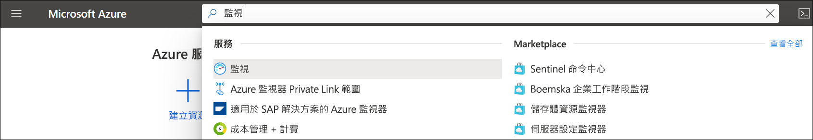
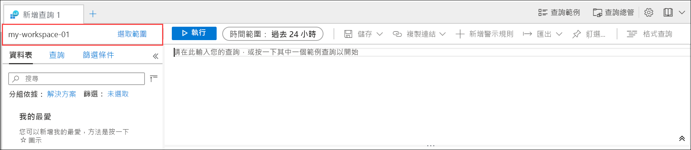
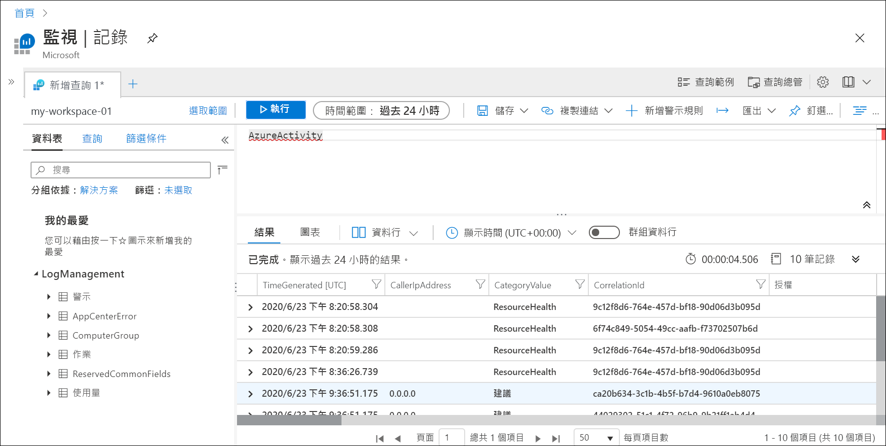
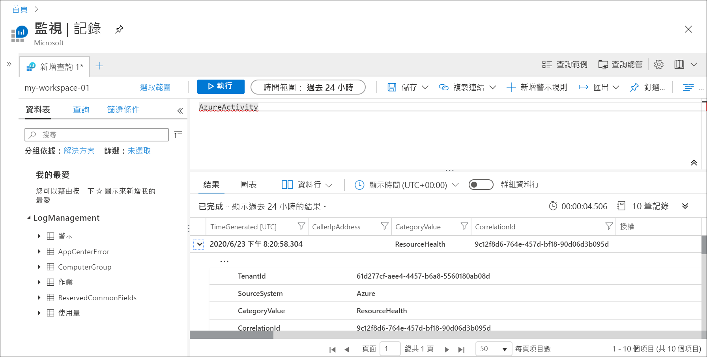
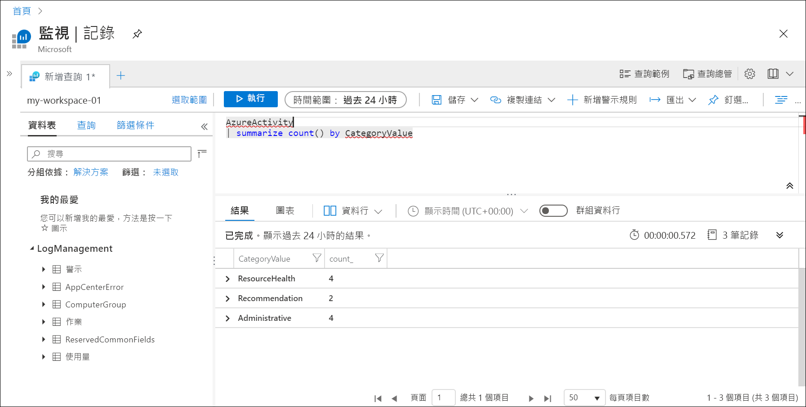

# <a name="quickstart-send-azure-activity-log-to-log-analytics-workspace-using-an-arm-template"></a>快速入門：使用 ARM 範本將 Azure 活動記錄傳送至 Log Analytics 工作區

活動記錄是 Azure 中的平台記錄，提供訂用帳戶層級事件的深入解析。 這包括修改資源或啟動虛擬機器時的資訊。 您可以在 Azure 入口網站中檢視活動記錄，或使用 PowerShell 和 CLI 來取出項目。 本快速入門說明如何使用 Azure Resource Manager 範本 (ARM 範本) 來建立 Log Analytics 工作區和診斷設定，以將活動記錄傳送至 Azure 監視器記錄，您可以在其中使用[記錄查詢](../log-query/log-query-overview.md)進行分析，以及啟用[記錄警示](../platform/alerts-log-query.md)和[活頁簿](../platform/workbooks-overview.md)等其他功能。

[!INCLUDE [About Azure Resource Manager](../../../includes/resource-manager-quickstart-introduction.md)]

## <a name="prerequisites"></a>必要條件

- 如果您沒有 Azure 訂用帳戶，請在開始前建立[免費帳戶](https://azure.microsoft.com/free/?WT.mc_id=A261C142F)。
- 若要從您的本機電腦執行命令，請安裝 Azure CLI 或 Azure PowerShell 模組。 如需詳細資訊，請參閱[安裝 Azure CLI](/cli/azure/install-azure-cli)和[安裝 Azure PowerShell](/powershell/azure/install-az-ps)。

## <a name="create-a-log-analytics-workspace"></a>建立 Log Analytics 工作區

### <a name="review-the-template"></a>檢閱範本

下列範本會建立空的 Log Analytics 工作區。 將此範本儲存為 CreateWorkspace.json。

```json
{
  "$schema": "https://schema.management.azure.com/schemas/2019-04-01/deploymentTemplate.json#",
  "contentVersion": "1.0.0.0",
  "parameters": {
    "workspaceName": {
      "type": "string",
      "metadata": {
        "description": "Name of the workspace."
      }
    },
    "sku": {
      "type": "string",
      "defaultValue": "pergb2018",
      "allowedValues": [
        "pergb2018",
        "Free",
        "Standalone",
        "PerNode",
        "Standard",
        "Premium"
      ],
      "metadata": {
        "description": "Pricing tier: PerGB2018 or legacy tiers (Free, Standalone, PerNode, Standard or Premium) which are not available to all customers."
      }
    },
    "location": {
      "type": "string",
      "allowedValues": [
        "australiacentral",
        "australiaeast",
        "australiasoutheast",
        "brazilsouth",
        "canadacentral",
        "centralindia",
        "centralus",
        "eastasia",
        "eastus",
        "eastus2",
        "francecentral",
        "japaneast",
        "koreacentral",
        "northcentralus",
        "northeurope",
        "southafricanorth",
        "southcentralus",
        "southeastasia",
        "switzerlandnorth",
        "switzerlandwest",
        "uksouth",
        "ukwest",
        "westcentralus",
        "westeurope",
        "westus",
        "westus2"
      ],
      "metadata": {
        "description": "Specifies the location for the workspace."
      }
    },
    "retentionInDays": {
      "type": "int",
      "defaultValue": 120,
      "metadata": {
        "description": "Number of days to retain data."
      }
    },
    "resourcePermissions": {
      "type": "bool",
      "defaultValue": true,
      "metadata": {
        "description": "true to use resource or workspace permissions. false to require workspace permissions."
      }
    }
  },
  "resources": [
    {
      "type": "Microsoft.OperationalInsights/workspaces",
      "apiVersion": "2020-08-01",
      "name": "[parameters('workspaceName')]",
      "location": "[parameters('location')]",
      "properties": {
        "sku": {
          "name": "[parameters('sku')]"
        },
        "retentionInDays": "[parameters('retentionInDays')]",
        "features": {
          "searchVersion": 1,
          "legacy": 0,
          "enableLogAccessUsingOnlyResourcePermissions": "[parameters('resourcePermissions')]"
        }
      }
    }
  ]
}
```

此範本會定義一項資源：

- [Microsoft.OperationalInsights/workspaces](/azure/templates/microsoft.operationalinsights/workspaces)

### <a name="deploy-the-template"></a>部署範本

使用[部署 ARM 範本](../../azure-resource-manager/templates/deploy-portal.md)來，例如使用 CLI 和 PowerShell 的下列範例。 以適用於您環境的適當值取代 **Resource Group** 、 **workspaceName** 和 **location** 的範例值。 工作區名稱在您的 Azure 訂用帳戶中必須是唯一的。

# <a name="cli"></a>[CLI](#tab/CLI)

```azurecli
az login
az deployment group create \
    --name CreateWorkspace \
    --resource-group my-resource-group \
    --template-file CreateWorkspace.json \
    --parameters workspaceName='my-workspace-01' location='eastus'

```

# <a name="powershell"></a>[PowerShell](#tab/PowerShell)

```powershell
Connect-AzAccount
Select-AzSubscription -SubscriptionName my-subscription
New-AzResourceGroupDeployment -Name AzureMonitorDeployment -ResourceGroupName my-resource-group -TemplateFile CreateWorkspace.json -workspaceName my-workspace-01 -location eastus
```

---

### <a name="validate-the-deployment"></a>驗證部署

使用下列其中一個命令驗證已建立的工作區。 以您在上方使用的值取代 **Resource Group** 和 **workspaceName** 的範例值。

# <a name="cli"></a>[CLI](#tab/CLI)

```azurecli
az monitor log-analytics workspace show --resource-group my-workspace-01 --workspace-name my-resource-group
```

# <a name="powershell"></a>[PowerShell](#tab/PowerShell)

```powershell
Get-AzOperationalInsightsWorkspace -Name my-workspace-01 -ResourceGroupName my-resource-group
```

---

## <a name="create-diagnostic-setting"></a>建立診斷設定

### <a name="review-the-template"></a>檢閱範本

下列範本會建立診斷設定，以將活動記錄傳送至 Log Analytics 工作區。 將此範本儲存為 CreateDiagnosticSetting.json。

```json
{
  "$schema": "https://schema.management.azure.com/schemas/2019-04-01/deploymentTemplate.json#",
  "contentVersion": "1.0.0.0",
  "parameters": {
    "settingName": {
        "type": "String"
    },
    "workspaceId": {
        "type": "String"
    }
  },
  "resources": [
    {
      "type": "Microsoft.Insights/diagnosticSettings",
      "apiVersion": "2017-05-01-preview",
      "name": "[parameters('settingName')]",
      "dependsOn": [],
      "properties": {
        "workspaceId": "[parameters('workspaceId')]",
        "logs": [
          {
          "category": "Administrative",
          "enabled": true
          },
          {
          "category": "Alert",
          "enabled": true
          },
          {
          "category": "Autoscale",
          "enabled": true
          },
          {
          "category": "Policy",
          "enabled": true
          },
          {
          "category": "Recommendation",
          "enabled": true
          },
          {
          "category": "ResourceHealth",
          "enabled": true
          },
          {
          "category": "Security",
          "enabled": true
          },
          {
          "category": "ServiceHealth",
          "enabled": true
          }
        ]
      }
    }
  ]
}
```

此範本會定義一項資源：

- [Microsoft.Insights/diagnosticSettings](/azure/templates/microsoft.insights/diagnosticsettings)

### <a name="deploy-the-template"></a>部署範本

使用[部署 ARM 範本](../../azure-resource-manager/templates/deploy-portal.md)來，例如使用 CLI 和 PowerShell 的下列範例。 以適用於您環境的適當值取代 **Resource Group** 、 **workspaceName** 和 **location** 的範例值。 工作區名稱在您的 Azure 訂用帳戶中必須是唯一的。

# <a name="cli"></a>[CLI](#tab/CLI)

```azurecli
az deployment sub create --name CreateDiagnosticSetting --location eastus --template-file CreateDiagnosticSetting.json --parameters settingName='Send Activity log to workspace' workspaceId='/subscriptions/00000000-0000-0000-0000-000000000000/resourcegroups/my-resource-group/providers/microsoft.operationalinsights/workspaces/my-workspace-01'

```

# <a name="powershell"></a>[PowerShell](#tab/PowerShell)

```powershell
New-AzSubscriptionDeployment -Name CreateDiagnosticSetting -location eastus -TemplateFile CreateDiagnosticSetting.json -settingName="Send Activity log to workspace" -workspaceId "/subscriptions/00000000-0000-0000-0000-000000000000/resourcegroups/my-resource-group/providers/microsoft.operationalinsights/workspaces/my-workspace-01"
```
---

### <a name="validate-the-deployment"></a>驗證部署

使用下列其中一個命令驗證已建立的診斷設定。 將訂用帳戶和設定名稱的範例值取代為您在上方使用的值。

> [!NOTE]
> 您目前無法使用 PowerShell 來取出訂用帳戶層級的診斷設定。

```azurecli
az monitor diagnostic-settings show --resource '/subscriptions/00000000-0000-0000-0000-000000000000' --name 'Send Activity log to workspace'
```

## <a name="generate-log-data"></a>產生記錄資料

只有新的活動記錄項目會傳送到 Log Analytics 工作區，因此請在您的訂用帳戶中執行將會進行記錄的一些動作，例如啟動或停止虛擬機器，或是建立或修改其他資源。 您可能需要等候幾分鐘的時間，讓系統建立診斷設定，以及將資料初始寫入工作區。 在此延遲之後，寫入活動記錄的所有事件都會在幾秒內傳送至工作區。

## <a name="retrieve-data-with-a-log-query"></a>使用記錄查詢來取出資料

使用 Azure 入口網站來使用 Log Analytics，以從工作區取出資料。 在 Azure 入口網站中，搜尋 [監視器] 然後加以選取。



在 [Azure 監視器] 功能表中選取 [記錄]。 關閉 [範例查詢] 頁面。 如果範圍未設定為您所建立的工作區，請按一下 [選取範圍] 並加以尋找。



在查詢視窗中，輸入 `AzureActivity`，然後按一下 [執行]。 這是一個簡單的查詢，會傳回 *AzureActivity* 資料表中的所有記錄，其中包含從活動記錄傳送的所有記錄。



展開其中一個記錄，以查看其詳細屬性。



嘗試更複雜的查詢，例如 `AzureActivity | summarize count() by CategoryValue`，此查詢會提供依類別摘要列出的事件計數。



## <a name="clean-up-resources"></a>清除資源

如果您打算繼續進行後續的快速入門和教學課程，您可以讓這些資源留在原處。 如果不再需要，請刪除資源群組，這會刪除警示規則和相關資源。 若要使用 Azure CLI 或 Azure PowerShell 刪除資源群組

# <a name="cli"></a>[CLI](#tab/CLI)

```azurecli
az group delete --name my-resource-group
```

# <a name="powershell"></a>[PowerShell](#tab/PowerShell)

```powershell
Remove-AzResourceGroup -Name my-resource-group
```

---

## <a name="next-steps"></a>後續步驟

在本快速入門中，您已將活動記錄設定為要傳送至 Log Analytics 工作區。 您現在可以設定要收集至工作區的其他資料，您可以使用 Azure 監視器中的[記錄查詢](../log-query/log-query-overview.md)以及利用例如[記錄警示](../platform/alerts-log-query.md)和[活頁簿](../platform/workbooks-overview.md)的功能，在工作區中一併分析資料。 接下來，您應該從 Azure 資源收集[資源記錄](../platform/resource-logs.md)，這會補充活動記錄中的資料，提供每個資源內所執行作業的深入解析。

> [!div class="nextstepaction"]
> [使用 Azure 監視器收集資源記錄並加以分析](tutorial-resource-logs.md)
