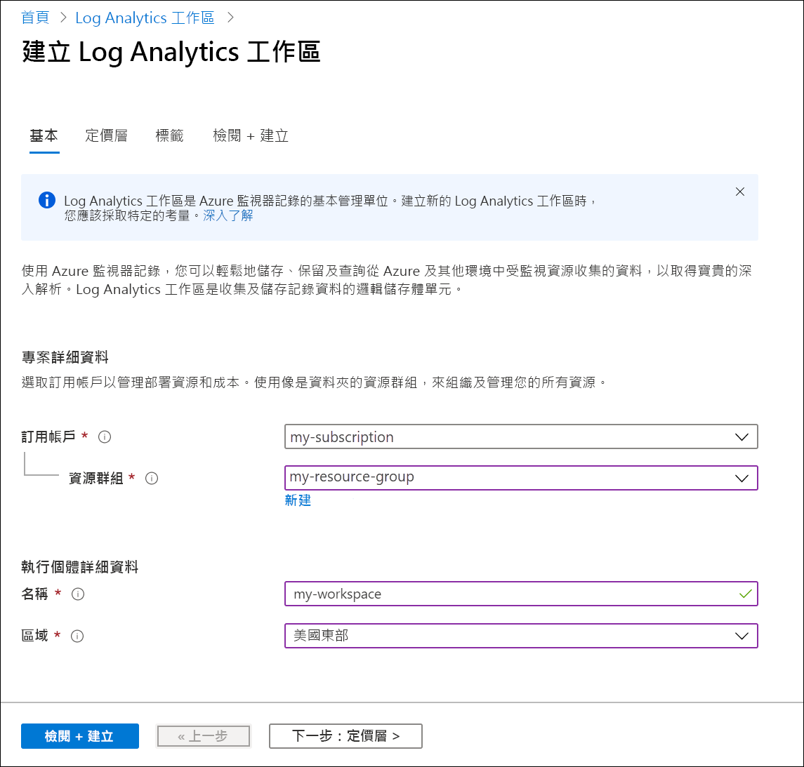
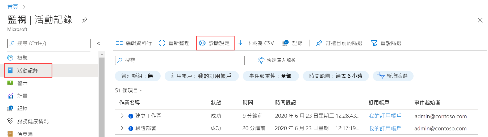
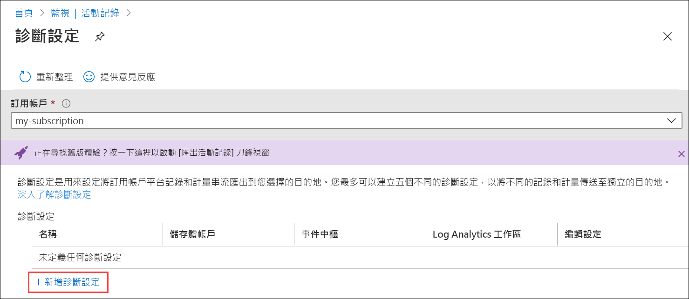
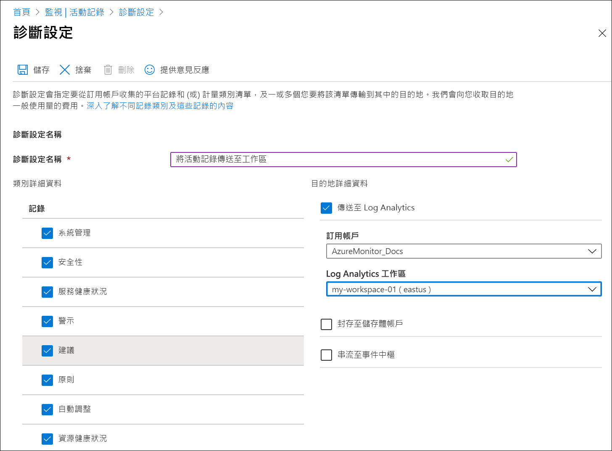

# 使用 Azure 入口網站將 Azure 活動記錄傳送至 Log Analytics 工作區
活動記錄是 Azure 中的平台記錄，提供訂用帳戶層級事件的深入解析。 這包括修改資源或啟動虛擬機器時的資訊。 您可以在 Azure 入口網站中檢視活動記錄，或使用 PowerShell 和 CLI 來取出項目。 本快速入門說明如何使用 Azure 入口網站來建立 Log Analytics 工作區和診斷設定，以將活動記錄傳送至 Azure 監視器記錄，您可以在其中使用[記錄查詢](../log-query/log-query-overview.md)進行分析，以及啟用[記錄警示](../platform/alerts-log-query.md)和[活頁簿](../platform/workbooks-overview.md)等其他功能。 

## 登入 Azure 入口網站
登入 Azure 入口網站：[https://portal.azure.com](https://portal.azure.com)。 

## 建立 Log Analytics 工作區
在 Azure 入口網站中，搜尋並選取 [Log Analytics 工作區]。 

  
按一下 [新增]，然後提供 [資源群組]、[工作區]、[名稱] 和 [位置] 的值。 工作區名稱在您的 Azure 訂用帳戶中必須是唯一的。

按一下 [檢閱 + 建立] 來檢閱設定，然後按一下 [建立] 來建立工作區。 這樣會選取 [隨用隨付] 的預設定價層，在您開始收集足夠的資料量之前，不會產生任何變更。 收集活動記錄不收取任何費用。

## 建立診斷設定
在 Azure 入口網站中，搜尋 [監視器] 然後加以選取。 

選取 [活動記錄]。 您應該會看到目前訂用帳戶的最近事件。 按一下 [診斷設定] 以檢視訂用帳戶的診斷設定。

按一下 [新增診斷設定] 以建立新的設定。 

輸入名稱，例如「將活動記錄傳送至工作區」。 選取每個類別。 選取 [傳送至 Log Analytics] 作為唯一的目的地，然後選取您建立的工作區。 按一下 [儲存] 以建立診斷設定，然後關閉頁面。

## 產生記錄資料
只有新的活動記錄項目會傳送到 Log Analytics 工作區，因此請在您的訂用帳戶中執行將會進行記錄的一些動作，例如啟動或停止虛擬機器，或是建立或修改其他資源。 您可能需要等候幾分鐘的時間，讓系統建立診斷設定，以及將資料初始寫入工作區。 在此延遲之後，寫入活動記錄的所有事件都會在幾秒內傳送至工作區。

## 使用記錄查詢來取出資料

在 [Azure 監視器] 功能表中選取 [記錄]。 關閉 [範例查詢] 頁面。 如果範圍未設定為您所建立的工作區，請按一下 [選取範圍] 並加以尋找。

在查詢視窗中，輸入 `AzureActivity`，然後按一下 [執行]。 這是一個簡單的查詢，會傳回 *AzureActivity* 資料表中的所有記錄，其中包含從活動記錄傳送的所有記錄。

展開其中一個記錄，以查看其詳細屬性。

嘗試更複雜的查詢，例如 `AzureActivity | summarize count() by CategoryValue`，此查詢會提供依類別摘要列出的事件計數。

## 後續步驟
在本快速入門中，您已將活動記錄設定為要傳送至 Log Analytics 工作區。 您現在可以設定要收集至工作區的其他資料，您可以使用 Azure 監視器中的[記錄查詢](../log-query/log-query-overview.md)以及利用例如[記錄警示](../platform/alerts-log-query.md)和[活頁簿](../platform/workbooks-overview.md)的功能，在工作區中一併分析資料。 接下來，您應該從 Azure 資源收集[資源記錄](../platform/resource-logs.md)，這會補充活動記錄中的資料，提供每個資源內所執行作業的深入解析。

> [!div class="nextstepaction"]
> [使用 Azure 監視器收集資源記錄並加以分析](tutorial-resource-logs.md)
